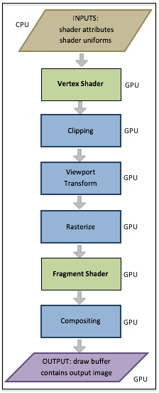

..  Copyright (C)  Wayne Brown
    Permission is granted to copy, distribute
    and/or modify this document under the terms of the GNU Free Documentation
    License, Version 1.3 or any later version published by the Free Software
    Foundation; with Invariant Sections being Forward, Prefaces, and
    Contributor List, no Front-Cover Texts, and no Back-Cover Texts.  A copy of
    the license is included in the section entitled "GNU Free Documentation
    License".

1.3 - The 3D Graphics Pipeline
::::::::::::::::::::::::::::::

**3D computer graphics** takes a *vector graphics* representation of objects
and creates a 2D raster image. But how? It is a non-trivial process that
requires multiple steps involving almost every major component of a computing
device. Let's first review the major components of a computing device and
then see how they are used to create computer graphic images.

Computational Device Hardware
-----------------------------

*Computer graphics* is created by modern computing devices
such as desktop computers, laptops, tablets, and cell phones.
These devices are complex systems with many components. All devices
that produce visual output to a screen will have the following types
of processing units.

1.  `CPU's`_ (central processing units) are the "brains" of a device.
    CPU's perform the general processing and run the operating system
    (OS) which controls the overall functioning of the device.
2.  `GPU's`_ (graphics processing units) are specially designed to render 3D
    graphics. However, in recent years they have also been used for other applications,
    such as speech recognition and neural network training. Any processing
    that requires large amounts of identical simultaneous computations can
    potentially be accelerated using a GPU.

Modern computing devices also contain many types of memory, each designed for
specific purposes.

1.  **RAM** (random access memory) stores program data and program instructions.
2.  **Graphics memory** stores vector data, raster images, and a screen's pixels.
    This memory has special properties that facilitates 3D graphics.

Here is a simplified diagram that shows the relationship between these components.

.. figure:: figures/hardware_overview.png
    :align: center

    Major hardware pieces in a computing device

To create computer graphics imagery, all of these hardware components are used
extensively.

Rendering using a "Graphics Pipeline"
-------------------------------------

The process of converting vector graphic representations of objects into a
raster image is performed by a well defined, step-by-step process called the
*graphics pipeline*. In the early days of computer graphics the *pipeline*
was not programmable. Data was fed into the pipeline and out came a raster
image on the other side. But today's GPU's allow for a programmer
to control certain parts of the pipeline using *shader programs*.
A *shader program* is a specialized set of instructions for
manipulating graphics data in the graphics pipeline.
*Shader programs* provide a programmer with amazing flexibility and
potential creativity, but at the cost of added complexity.

Step 1 in the pipeline is data setup. A webGL program must establish a link
between the *attribute* variables in a *vertex shader* program and the GPU
buffers that hold the data those variables use. Any other
data that the *shaders* need for a model rendering is also copied to the *shader
program*. These are called *uniform* variables because they don't change as
a single rendering is performed.

Step 2 is execution of a *vertex shader* program on each vertex of a
geometric primitive defined in model *world coordinates*.
Each vertex is transformed into *normalized device coordinates*.
This is typically done with a single
matrix transformation matrix, which is a combination
of transformations that move a model to the correct place in a scene,
then positions the model in front of a virtual camera, and then projects
the *world coordinates* into a *unit cube*.

Step 3 *clips* away all of the data that is outside the field-of-view of
the virtual camera.

Step 4 maps the model data from *normalized device coordinates* into
a viewport defined in pixels.

Step 5 *rasterizes* a geometric primitive by determining which
pixels in the raster image are inside it's boundaries.

Step 6 executes a *fragment shader* on each pixel that composes a
geometric primitive and outputs a color value for the pixel.

Step 7 combines (*composites*) the color of a pixel from a
*fragment shader* with the color of the pixel already assigned
to the output frame buffer.

Note that step 1 is performed by the CPU from instructions specified
in JavaScript code, while the remainder of the pipeline is performed
by the GPU from shader program instructions defined in GLSL
(OpenGL Shading Language). Step 1 uses data from RAM to setup a model
render, while the GPU uses its own memory for the rest of the steps.
Explaining the details of each of these *pipeline* steps is the purpose
of this textbook.

Glossary
--------

.. glossary::

  CPU
    a *central processing unit* that controls a computing device and performs general calculations

  GPU
    a *graphics processing unit* is a hardware device that computes calculations
    and performs tasks specifically for a graphics pipeline.

  graphics pipeline
    a series of steps that perform a rendering process.

  shader program
    a computer program that runs on a GPU that performs one or more steps of a graphics pipeline.

  vertex shader
    a computer program that runs on a GPU to position the geometry of models in a scene.

  fragment shader
    a computer program that runs on a GPU to assign a color to the pixels that compose a surface of a model.

Assessments
-----------

.. mchoice:: 1.3.1
    :random:
    :answer_a: a well defined, step by step rendering process.
    :answer_b: a cable (i.e., pipe) that carries graphical signals inside a computer.
    :answer_c: a specific type of vector data.
    :answer_d: a way to communicate raster data.
    :correct: a
    :feedback_a: Correct.
    :feedback_b: No.
    :feedback_c: No.
    :feedback_d: No.

    A *graphics pipeline* is ...

.. parsonsprob:: 1.3.2
    :noindent:

    Please correctly order the following steps to the graphics pipeline.
    -----
    Setup geometric and scene data for the pipeline.
    Execute a vertex shader on each vertex of a geometric model.
    Clip away everything that is not in the camera's field-of-view.
    Map the 3D object coordinates into pixel coordinates of a raster image.
    Determine which specific pixels represent a geometric primitive.
    Execute a fragment shader on each pixel that represents a geometric primitive.
    Combine pixel colors.
    Output a raster image.

.. index:: CPU, GPU, graphics pipeline, shader program, vertex shader, fragment shader

.. _GPU's: http://en.wikipedia.org/wiki/Graphics_processing_unit
.. _CPU's: http://en.wikipedia.org/wiki/Central_processing_unit

