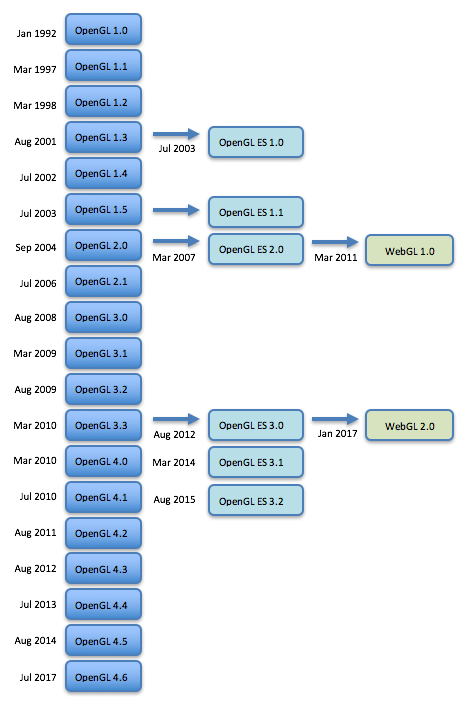

..  Copyright (C)  Wayne Brown
    Permission is granted to copy, distribute
    and/or modify this document under the terms of the GNU Free Documentation
    License, Version 1.3 or any later version published by the Free Software
    Foundation; with Invariant Sections being Forward, Prefaces, and
    Contributor List, no Front-Cover Texts, and no Back-Cover Texts.  A copy of
    the license is included in the section entitled "GNU Free Documentation
    License".

1.5 - A Brief History of Computer Graphics
::::::::::::::::::::::::::::::::::::::::::

The first computer graphics design system was developed by Evan Sutherland
as his PhD thesis at MIT in 1963. It was called `Sketchpad`_ and allowed a user
to sketch a mechanical part on a computer screen, place constraints on the
part, and have the computer calculate the exact design of the part. It was
revolutionary and "computer graphics" as a discipline took off from that time forward.

In the early days, if you wanted to create *computer graphics* you had to write
programs that directly talked to the graphics hardware. As new hardware designs
were created, the software had to be completely re-written to work with the
new hardware. Throughout the 1970's many "graphics libraries" were created
to solve this problem, but most of the libraries worked with individual
operating systems and could not be easily ported to new operating systems or new
hardware. In the 1980's the `ISO`_ (International Organization for Standardization)
attempted to
create a standard computer graphics library called `PHIGS`_. It was claimed
to be the best and final answer for creating computer graphics across all
computing platforms. However, it was a complete failure for one simple reason:
not only did PHIGS provide a library of functionality for drawing 3D graphics,
it specified exactly how you had to store and organize your graphics data.
System designers and programmers hated it.

GL and OpenGL
-------------

The premiere computer graphics company in the late 1980's and throughout the 1990's was
`Silicon Graphics, Inc`_. They were a hardware company, but
they included with their computers a proprietary computer graphics application
programmer interface (API) known as IRIS Graphics Language (IRIS GL). Programmers
of the day were searching for an alternative to PHIGS and in 1992 Silicon
Graphics release their graphics library (GL) as an "open" standard called
OpenGL. To quote `Wikipedia`_, "This meant that for the first time, fast,
efficient, cross-platform graphics programs could be written". To this day,
OpenGL remains the only real-time 3D graphics standard to be portable across
a variety of operating systems. OpenGL-ES even runs on many types of cell
phones. Its main competitor (`Direct3D`_ from Microsoft) runs only on Microsoft
Windows-based machines and some consoles."

OpenGL has changed drastically over the years. You can see the `version details here`_.
The major changes between versions are listed below for brevity.

* 1992: OpenGL 1.0 - A fixed function pipeline for creating computer graphics.
  A programmer fed vertex data into the pipeline and out came a 3D rendering (i.e., a 2D image).
* 2004: OpenGL 2.0 - The GPU became programmable. Programmers could write shader
  programs that were compiled into hardware. Versions 1.* and 2.* are not compatible.
* 2008: OpenGL 3.0 - Graphics data was moved from the CPU RAM to GPU memory for faster rendering.
* 2010: OpenGL 4.0 - Advanced shader language features and advanced texture mapping.
* 2017: OpenGL 4.6 - The most recent version.

OpenGL ES
---------

OpenGL is a hardware specification that requires fairly powerful
hardware to execute. The software drivers for the API are very large and complex.
As mobile, lower power devices starting appearing on the market, a 3D graphics
solution was desired for these devices. Thus OpenGL ES (for Embedded Systems) was
created. From the `OpenGL`_ web site, OpenGL ES "slims down the rather large OpenGL API
to the bare essentials, so that it can be implemented on devices with simpler,
cheaper hardware, and above all, low enough power requirements to run on
batteries. For example, it is available as standard on smartphones running both
Apple’s IOS and Google’s Android operating system." OpenGL ES has continually
evolved from version 1.0 in 2003 to the most recent version 3.2. Full details
can be found `here`_.

WebGL
-----

Software developers have continually looked for ways to " `write once, run anywhere`_ ".
This was the Java language slogan created by Sun Microsystems in the late 1990's.
If software
developers can write programs that run on multiple platforms, they have
the potential to make greater profits from their efforts. For some, the
web browser is the ideal target for "write once, run anywhere," especially
with the release of HTML version 5.0. The added features to HTML 5.0 make it
possible to write `web applications`_ that are sophisticated, powerful, and cross platform.

What is WebGL? From the `WebGL Wikipedia page`_, "WebGL (Web Graphics Library)
is a JavaScript API for rendering interactive 3D computer graphics and 2D
graphics within any compatible web browser without the use of plug-ins.
WebGL is integrated completely into all the web standards of the browser
allowing GPU accelerated usage of physics and image processing and effects
as part of the web page canvas. WebGL elements can be mixed with other
HTML elements and composited with other parts of the page or page background.
WebGL programs consist of control code written in JavaScript and shader code
that is executed on a computer's Graphics Processing Unit (GPU)."

WebGL 1.0 is OpenGL ES 2.0 implemented for any HTML 5.0 compliant web browser.
Because all web browsers support JavaScript, WebGL defines a JavaScript API
for real-time, 3D graphics rendering. And since basically all devices
today have a GPU, this means that you can write one program that will
execute on basically all computer devices in existence today -- and tomorrow --
thanks to the HTML 5.0 and WebGL standards.

WebGL 2.0 was finalized in Jan 2017 and is basically OpenGL ES 3.0 in
the browser. Support for WebGL 2.0 can be found at `caniuse.com`_.

Overview of OpenGL Versions
---------------------------

The following diagram shows the basic progression of OpenGL, OpenGL ES, and WebGL.

  OpenGL, OpenGL ES, and WebGL history and relationships

.. admonition:: Bottom Line

    If you understand how to program WebGL programs, you will understand basic
    computer graphics programming for most computing devices.

The Future
----------

GPU hardware continues to evolve and increase in functionality. There
are various efforts in progress to create new interfaces to GPU hardware
that takes advantage of the new features. Some examples are:

*   `Direct3D 12`_ from Microsoft
*   `Metal`_ from Apple
*   `Vulkan`_ from the Khronos Group
*   `WebGPU`_ from Apple for the browser

Glossary
--------

.. glossary::

  GL
    graphics language - a proprietary software system for creating 3D computer
    graphics that was created by Silicon Graphics Inc. in the 1980's

  OpenGL
    a device independent software system for creating 3D computer
    graphics that was released to the public by Silicon Graphics Inc. in 1992. It has
    gone through constant upgrades, enhancements, and re-designs.

  OpenGL ES
    OpenGL for Embedded Systems - a stripped down version of OpenGL for
    cheaper, low-power hardware

  WebGL
    a device independent software system for creating 3D computer
    graphics in a web browser. It is an implementation of OpenGL ES 2.0 in JavaScript.

Assessments
-----------

.. mchoice:: 1.5.1
    :random:
    :answer_a: It allows 3D, real-time graphics in a web browser.
    :answer_b: It works in most major browsers, making it "write once, run anywhere."
    :answer_c: It works on battery powered devices that have a GPU, including cell phones.
    :answer_d: It is fully integrated with web page standards, so you can use HTML inputs like buttons, checkboxes, sliders, etc. for user interfaces.
    :correct: a,b,c,d
    :feedback_a: Correct.
    :feedback_b: Correct.
    :feedback_c: Correct.
    :feedback_d: Correct.

    Which of the following are advantages of WebGL? (Select all that apply.)

.. mchoice:: 1.5.2
    :random:
    :answer_a: It specified a simpler API for less powerful GPU's.
    :answer_b: It requires less memory for devices like cell phones.
    :answer_c: It requires less power for devices that run off batteries.
    :answer_d: It facilitates high resolution screen.
    :correct: a,b,c
    :feedback_a: Correct.
    :feedback_b: Correct.
    :feedback_c: Correct.
    :feedback_d: No, OpenGL ES targets mobil devices which typically have smaller screens.

    Why was OpenGL ES created? (Select all that apply.)

.. mchoice:: 1.5.3
    :random:
    :answer_a: 2.0.
    :answer_b: 1.0
    :answer_c: 3.0
    :answer_d: 3.1
    :correct: a
    :feedback_a: Correct.
    :feedback_b: No, Please try again.
    :feedback_c: No, Please try again.
    :feedback_d: No, Please try again.

    WebGL 1.0 is based on which version of OpenGL ES?

.. mchoice:: 1.5.4
    :random:
    :answer_a: Because the hardware they interface with continues to enhance and improve.
    :answer_b: Its kind of like fashion in clothes - people's taste change over time.
    :answer_c: The designers of the API's keep leaving things out that they forgot about in earlier versions.
    :answer_d: Change is good -- embrace change!
    :correct: a
    :feedback_a: Correct.
    :feedback_b: No, people's change in taste don't typically cause hardware advancements.
    :feedback_c: No, it's not forgetfulness.
    :feedback_d: Change for change sake is not good when it means you have to re-write software over and over again!

    Why do computer graphic API's like OpenGL and WebGL keep changing?

.. index:: GL, OpenGL, OpenGL ES, WebGL

.. _Sketchpad: https://en.wikipedia.org/wiki/Sketchpad
.. _ISO: https://en.wikipedia.org/wiki/International_Organization_for_Standardization
.. _PHIGS: https://en.wikipedia.org/wiki/PHIGS
.. _Silicon Graphics, Inc: https://en.wikipedia.org/wiki/Silicon_Graphics
.. _Wikipedia: https://en.wikipedia.org/wiki/Silicon_Graphics
.. _version details here: https://www.opengl.org/wiki/History_of_OpenGL
.. _Direct3D: https://en.wikipedia.org/wiki/Direct3D
.. _Direct3D 12: https://en.wikipedia.org/wiki/Direct3D#Direct3D_12
.. _OpenGL: https://www.opengl.org/wiki/OpenGL_ES
.. _here: https://en.wikipedia.org/wiki/OpenGL_ES
.. _write once, run anywhere: https://en.wikipedia.org/wiki/Write_once,_run_anywhere
.. _web applications: https://en.wikipedia.org/wiki/Web_application
.. _WebGL Wikipedia page: https://en.wikipedia.org/wiki/WebGL
.. _caniuse.com: http://caniuse.com/#search=WebGL
.. _Metal: https://en.wikipedia.org/wiki/Metal_(API)
.. _Vulkan: https://en.wikipedia.org/wiki/Vulkan_(API)
.. _WebGPU: https://webkit.org/blog/7380/next-generation-3d-graphics-on-the-web/

