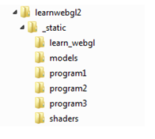

..  Copyright (C)  Wayne Brown
    Permission is granted to copy, distribute
    and/or modify this document under the terms of the GNU Free Documentation
    License, Version 1.3 or any later version published by the Free Software
    Foundation; with Invariant Sections being Forward, Prefaces, and
    Contributor List, no Front-Cover Texts, and no Back-Cover Texts.  A copy of
    the license is included in the section entitled "GNU Free Documentation
    License".

1.6 - File Organization For WebGL Programs
::::::::::::::::::::::::::::::::::::::::::

As we discussed previously, a typical WebGL program is composed of the following types of files:

* An HTML file which contains the web page description.
* One or more CSS files which describe the properties of the HTML elements on the web page.
* One or more JavaScript files which provide the processing logic for the WebGL program.
* One or more data files which describe the objects that will be rendered.
* One or more shader files which are the rendering programs for the graphics pipeline.

We need a file structure to help manage all of these files. But it is actually
more complex than just managing a single WebGL program. A web site will possibly
have multiple pages that
contain graphics, and each web page might contain multiple WebGL programs that
render into separate canvas elements. If all of your files are stored in a single
folder on your server, you will have a hard time managing those files
as you perform upgrades and enhancements over time.

A basic principle of all file structures is to group related files into a
separate folder. Therefore,
each WebGL program should have a separate folder for its unique files,
and files that are shared with multiple programs should be organized
into appropriate sub-folders.

File Organization Used for This Textbook
----------------------------------------

All of the examples in this textbook use the following file organization scheme,
which is shown in diagram format below.

The root folder of the textbook is called :code:`learnwebgl2`. It contains a sub-folder called
:code:`_static` which holds all of the WebGL program files. Files that are unique
to a particular program are stored in an appropriately named sub-folder, such as :code:`program1`,
:code:`program2`, etc. Files that are common to multiple programs are
stored in sub-folders by file type. The :code:`learn_webgl` sub-folder contains
commonly used Javascript files, the :code:`models` sub-folder contains scene model descriptions,
and the :code:`shaders` sub-folder contains shader programs.

A *file path* is a description of how to navigate a file hierarchy to
get to a specific file. A *file path* can be *absolute* or *relative*.
An *absolute path* starts at the server's root folder. A *relative path*
starts at the folder that contains the current web page. For a *relative path*,
the notation :code:`.` means the current folder, which is the folder from which the current
web page was loaded, and the notation :code:`..` means the parent of the current
folder. You can specify a path to a file using either absolute or relative paths.

When you see a file reference like this:

.. code:: JavaScript

    src="../learn_webgl/glmatrix4x4.js"

it is a reference to a file that is accessed by going to the parent of the
current folder, then to the :code:`learn_webgl` sub-folder, and then accessing
the file :code:`glmatrix4x4.js`. It is "best practice" to always include a file path
for resource files, even if it is a default path. Therefore all files loaded
from the current working folder are specified starting with :code:`./` .

.. admonition:: Note

    If a WebGL program is not working, the first thing you should check
    is whether all of the required files are being loaded properly.

Glossary
--------

.. glossary::

    folder hierarchy
        an organization of file folders, where each folder has a unique parent
        folder and possibly one or more sub-folders.

    current working folder
        the folder on the web server that contains the original HTML web page file.

    relative file path
        a series of folder references separated by forward slashes that starts from
        the *current working folder*.

    absolute file path
        a series of folder references starting from the
        root folder of the web site on the web server.

    :code:`.`
        a reference to the *current working folder*.

    :code:`..`
        a reference to the parent folder.

Self-Assessments
----------------

.. mchoice:: 1.6.1
    :random:
    :answer_a: ./example/path
    :answer_b: ../another/example
    :answer_c: path/to/file
    :answer_d: way/to/get/to/file
    :correct: a,b
    :feedback_a: Correct, it is starting from the current working folder
    :feedback_b: Correct, it first goes to the parent folder of the current working folder
    :feedback_c: No, this is an absolute path that starts at the web sites root folder on the server.
    :feedback_d: No, this is an absolute path that starts at the web sites root folder on the server.

    Which of the following file paths are relative? (Select all that apply.)

.. mchoice:: 1.6.2
    :random:
    :answer_a: _static/shaders
    :answer_b: ../shaders
    :answer_c: shaders
    :answer_d: ../../shaders
    :correct: a,b
    :feedback_a: Correct, this is an absolute path from the servers root folder
    :feedback_b: Correct, this is a relative path from the current working folder, program1.
    :feedback_c: No, there is no sub-folder called "shaders" from the root folder of the server.
    :feedback_d: No, this goes to the parent folder of the parent folder, which is learnwebgl2, which does not have a sub-folder called shaders

    Assume that you have a web page defined by a file :code:`ex1.html` in the folder :code:`program1` of this file hierarchy.

    .. figure:: figures/file_structure.png
        :align: left

    Which of the following paths get you to the :code:`shaders` sub-folder? (Select all that apply.)

.. index:: folder hierarchy, current working folder, relative file path, absolute file path, .., .

