..  Copyright (C)  Wayne Brown
    Permission is granted to copy, distribute
    and/or modify this document under the terms of the GNU Free Documentation
    License, Version 1.3 or any later version published by the Free Software
    Foundation; with Invariant Sections being Forward, Prefaces, and
    Contributor List, no Front-Cover Texts, and no Back-Cover Texts.  A copy of
    the license is included in the section entitled "GNU Free Documentation
    License".

.. role:: raw-html(raw)
   :format: html

3.3 - Modeling Location
:::::::::::::::::::::::

Location Is Relative
--------------------

Location is always in relationship to something else. Let me say that
again, "location is always relative!" For example, if you were asked
"Where is Colorado Springs?", a typical answer might be "Its
60 miles south of Denver." If you don't know where Denver is,
you still don't know where Colorado Springs is.

.. |LocGlobalOrigin| replace:: A "point of reference" is needed
    to describe the location of objects. This point is called
    the "global origin". The word "global" indicates that all
    objects in a scene are located relative to this unique location.

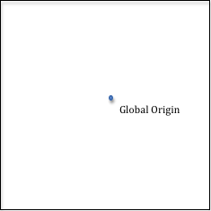

.. |LocLocalOrigin| replace:: In addition, every object
    will have a "local origin" from which locations
    **relative to that object** are
    referenced. For example, a room will have a *local origin* which is
    used to locate its walls and the furniture inside it; a house will
    have a *local origin* which is used to locate rooms inside the
    house; a neighborhood will have a *local origin* which is used to
    locate houses inside the neighborhood. And so on...

.. |LocLocalOrigin2| replace:: Each object
    in a scene is positioned by specifying the relationship
    between its *local origin* and the *global origin*. Note that
    locations are always a relationship between two points.

.. |LocLocalOriginImage| image:: figures/loc_local_origin.png

+---------------------------------------------+--------------------------+
| |LocGlobalOrigin|                           | |LocGlobalOriginImage|   |
+---------------------------------------------+--------------------------+
| |LocLocalOrigin|                            | |LocLocalOriginImage|    |
|                                             |                          |
| |LocLocalOrigin2|                           |                          |
+---------------------------------------------+--------------------------+

These ideas are so important, let's state them again:

* Locations are always relative!
* A **global origin** is a unique location in a scene from which all objects
  are located. A scene has exactly one, unique **global origin**.
* Each individual object in a scene has its own **local origin** from which the individual pieces of the object are located.
* Objects in a scene are positioned by specifying the relationship between their *local origin* and the scene's *global origin*.

Now we need to decide how a location is specified in relationship to an *origin*. A natural way might be distance.
The units used to measure distance matters, such as miles, meters, feet, inches, millimeters, etc.,
but if you use consistent units and always
measure things in the same units, units can be ignored. For the remainder of this discussion we will ignore
units of measurement -- but remember that when you describe locations, **always use the same units for all measurements**.

Describing Locations
--------------------

.. |Loc10Units| replace:: We could specify the location of an object by
    saying something like "it is 10 units from the origin."

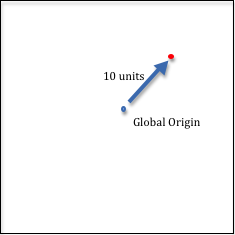

.. |LocProblem| replace:: But we immediately have a problem. There are an
    infinite number of points that are 10 units away from the origin.
    All of the points that are 10 units away from a point compose a circle!

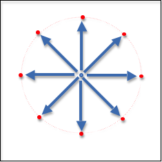

.. |PolarCoords| replace:: To specify a unique location we could specify
    which angle gets us to the desired location.
    However, angles, just like locations, are always relative to
    something. So we need a
    **line of reference** from which to measure an angle. Let's draw a
    horizontal line through the origin. Now we can specify an exact
    location using a distance from the origin and an angle from our
    reference line. Mathematicians call this description of a location
    "polar coordinates". If "r" represents the distance to the location, and
    "theta" represents the angle, then the pair (r,theta) describes a unique
    location relative to an origin and a line of reference. It would be
    nice if we could get rid of the angle and just deal with distances.

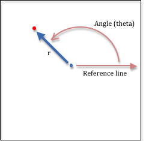

.. |WeirdCoords| replace:: One choice might be to use the
    distance to the object and a distance along the **line of reference**.
    Traditionally the **line of reference** is called the x-axis, so
    our location description is the pair of distances (r,x). However, this is
    not a unique description, as there are two points associated with
    these two distances.

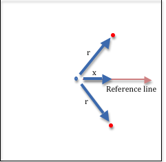

.. |BestCoords| replace:: So is there a better pair of distances that can be
    used to locate a point? If we create a second **line of reference** we
    could use a distance along each line.
    The second **line of reference** could be in any direction, but the
    mathematics is simpler if the line is through the origin and at a
    90-degree angle to the original **line of reference**. So now we have
    two distances to locate objects in 2-dimensional space. And the mathematics
    required to move locations is simple -- its simple addition.

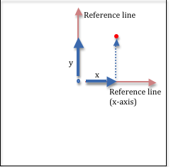

.. |Yaxis| replace:: Note that the 2nd line of reference, which is
    traditionally called the y-axis, can be placed in two possible places -- either going up, or
    going down. And it turns out that both orientations are used in computer
    graphics. When we describe virtual objects in 2-dimensional space we will use
    the "y is up" convention because it is the most traditional mathematical notation
    for 2-dimensional space. When we describe the location of pixels on a computer screen
    we will use the "y is down" convention because almost all screens
    locate pixels from the upper-left corner of the screen with the y-axis going
    down the left side of the screen. This is because historically computer
    screens were made identically to TV monitors and the picture on a TV screen
    is displayed by refreshing the screen's pixels starting at the upper-left
    corner and refreshing left-to-right and top-to-bottom.

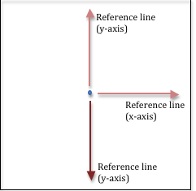

.. |NegDistance| replace:: Also note that when we changed location descriptions from a
    *(distance,angle)* representation to a *(distance,distance)* representation, we
    need to introduce the idea of negative distances. In the real world,
    distance is always positive. In our *(distance,distance)* representation,
    a negative distance means to travel along a line of reference, but in
    the opposite direction. Thus, (-2,4) represents the location as shown in
    the diagram to the right.

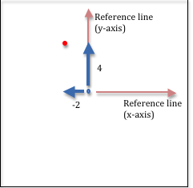

+---------------------------------------------+--------------------------+
| |Loc10Units|                                | |Loc10UnitsImage|        |
+---------------------------------------------+--------------------------+
| |LocProblem|                                | |LocProblemImage|        |
+---------------------------------------------+--------------------------+
| |PolarCoords|                               | |PolarCoordsImage|       |
+---------------------------------------------+--------------------------+
| |WeirdCoords|                               | |WierdCoordsImage|       |
+---------------------------------------------+--------------------------+
| |BestCoords|                                | |BestCoordsImage|        |
+---------------------------------------------+--------------------------+
| |Yaxis|                                     | |YaxisOrientation|       |
+---------------------------------------------+--------------------------+
| |NegDistance|                               | |NegDistanceImage|       |
+---------------------------------------------+--------------------------+

Before we move into 3-dimensional space, let's summarize our discussion of locations:

+ Locations is always relative!
+ Locations will be specified using two distances along 2 lines of reference.
+ The lines of reference emanate from the global origin and are at right angles to each other.
+ The lines of reference create a "coordinate system" which gives meaning to our location distances.
+ We call the lines of reference "axes" and the system is called a "Cartesian Coordinate System."
+ The coordinate (3,-6) defines a location that is 3 units along the x-axis and -6 units along the y-axis.

3-dimensional Locations
-----------------------

.. |3DPolar| replace:: A natural way to describe locations in 3-dimensional
    space is to use the mapping and geographic applications method, with a distance and two
    angles. The two angles are called longitude and latitude and they represent
    the angles from the prime meridian and the equator.
    (Remember, all locations are relative to something!) The
    distance is from sea level, which represents altitude. Altitude is always
    a distance along a line from the center of the earth, so our reference point
    for the altitude is really the center of the earth.
    Any location in the world can be uniquely described by a three-value
    representation (longitude, latitude, altitude). Again, while this
    representation is natural to map makers and air-line pilots, using the
    combination of two angles and one distance makes the mathematics to
    manipulate locations cumbersome.

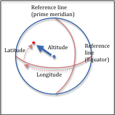

.. |3DCoordinates| replace:: 3-D locations can be more easily manipulated if they are
    represented as three distances along three **lines of reference** . So in 3-D
    space, we create a 3rd **line of reference** which goes through the
    origin and is at a 90-degree angle to the other two lines of reference.
    This is called the z-axis.
    Again, we have two choices for the direction of the line. The line can
    come "out of the paper" or go "into the paper". These two choices are
    referred to as "right-handed" or "left-handed" coordinate
    systems because they can be represented by a person's right or left hand.

.. |3DCoordinatesImage| image:: figures/3d_coordinates_image.png

.. |3DOrientation| replace:: Using your right hand (and assuming that the y-axis is pointing up),
    orient your thumb in the direction of the x-axis and your index finger in the
    direction of the y-axis. For a right-handed coordinate system your middle finger
    will be pointing in the direction of the z-axis.
    If your thumb is pointing to the right, the z-axis will be coming
    toward you.

.. |3DOrientation2| replace:: If you use your left
    hand and orient your thumb in the direction of the x-axis and your index
    finger in the direction of the y-axis,
    your middle finger will be pointing in the opposite direction, or
    away from you. This is a left-handed coordinate system.

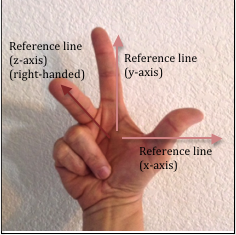
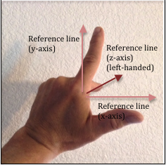

.. |3DPoints| replace:: There is debate on which 3D coordinate system
    should be used. Microsoft's Direct3D system
    uses a left-handed coordinate system, while WebGL and most
    engineers and mathematicians use a right-handed coordinate system. It's
    not really a debate, but simply a choice. The important thing
    is to be consistent and always use the same convention. For the remainder
    of these tutorials we will use a right-handed Cartesian coordinate system
    to specify locations. Locations will be specified using 3 distances
    along 3 *lines of reference* as shown to the right, with the
    z-axis always coming towards you, out of the screen.

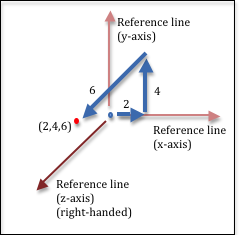

+---------------------------------------------+--------------------------+
| |3DPolar|                                   | |3DPolarImage|           |
+---------------------------------------------+--------------------------+
| |3DCoordinates|                             | |3DCoordinatesImage|     |
+---------------------------------------------+--------------------------+
| |3DOrientation|                             | |RightHandedImage|       |
+---------------------------------------------+--------------------------+
| |3DOrientation2|                            | |LeftHandedImage|        |
+---------------------------------------------+--------------------------+
| |3DPoints|                                  | |3DPointsImage|          |
+---------------------------------------------+--------------------------+

Manipulating Locations
----------------------

A point can be manipulated to change its location. This is the essence
of all computer graphics animations -- the changing of a point's location
over time. Typical manipulations include translation, rotation, and scaling.
We will discuss the details of location manipulation in chapter 6.

WebGL Points
------------

WebGL specifies a location in *homogeneous coordinates*, which is a 4-component
value - :code:`(x,y,z,w)`. The first three values, *x*, *y*, *z*, are distances along the
axes of a Cartesian coordinate system. The last value, *w*, is used for perspective
calculations and it will be discuss in detail later. For our purposes now,
*w* will always be set to 1.0.

A WebGL program requires a 4-component location, (x,y,z,w), for every point it renders.
However, if you are working with 2D data, you can store only the
(x,y) values and supply the default values for *z* and *w*
in your *vertex shader* when each point is actually used. For normal 3-dimensional models,
your program will store three floating
point values for each point. The *w* component will not be stored and will
always default to 1.0.
Floating point values require 4 bytes of memory. This means that each point
in a 3D model will require 12 bytes of memory. WebGL 1.0 requires that
all attributes of vertices be defined as floating point numbers.

WebGL supports the rendering of individual points in 3D space. If you want
to draw one or more points, you place the points into an array and then call
the :code:`drawArrays()` function. The points will appear as single pixels
in your rendering. When we study *vertex shaders* in chapter 5 you will
learn how to change the :code:`gl_PointSize` attribute of points to make
them appear larger than one pixel in a rendering.

A JavaScript Point Object
-------------------------

The representation and manipulation of locations (points) is fundamental
to any WebGL program.
This functionality should be implemented once and then used as needed.
The example WebGL program below allows you to inspect two JavaScript classes:
:code:`GlPoint3` and :code:`GlPoint4`. Please study the code and note the following about
these classes. (Hint: Hide the canvas.)

* The classes do not store a point. Instead they are a collection of point operations. They add
  two new "classes" to the global address space, :code:`GlPoint3` and :code:`GlPoint4`,
  and define various functions that perform standard operations on points.
  :raw-html:`   `
* Examine the :code:`self.create()` function to see that a point is stored
  as a :code:`Float32Array`, which is a special datatype introduced into
  JavaScript specially for WebGL programming. A
  :code:`Float32Array` is an array of floating point values that are stored
  in the same binary format as the GPU's floating point numbers. This makes the data
  coming from a WebGL program binary compatible with the GPU hardware.
  :raw-html:`   `
* Most of the member functions do not create new points; they operate on
  points that already exist.This is by design to minimize garbage collection.
  :raw-html:`   `
* The functions are implemented for speed with minimal or no error checking.

.. webglinteractive:: W1
  :htmlprogram: _static/02_object_examples/object_examples.html
  :viewlist: _static/learn_webgl/glpoint3.js, _static/learn_webgl/glpoint4.js
  :hideoutput:
  :width: 300
  :height: 300

Every WebGL program in this textbook uses the :code:`GlPoint3` and :code:`GlPoint4`
classes to create and manipulate locations.

Glossary
--------

.. glossary::

  global origin
    A location from which all other locations are referenced.

  local origin
    A location from which all locations **on an object** are referenced.

  axis
    A line used as a reference for measuring angles or for measuring distances
    in a specific direction.

  point
    A specific location in relation to an origin. There are multiple ways
    to specify the exact location, but for computer graphics it is typically
    done using the distance along two or three fixed *lines of reference* called *axes*.

  coordinate system
    A system for locating points in space. The system defines what the location
    values mean. For example, the coordinates (3,4) in the Cartesian Coordinate System
    means the location is found by starting at the global origin and traveling
    3 units in the direction of the x-axis and then 4 units in the direction of the y-axis.

  homogeneous coordinates
    A 4-component value, (x,y,z,w), that represents a location in 3-dimensional
    space relative to a global origin and coordinate system.

Self Assessment
---------------

.. mchoice:: 3.3.1
  :random:
  :answer_a: Polar Coordinates
  :answer_b: A distance and an angle
  :answer_c: Cartesian Coordinates
  :answer_d: Two distances
  :correct: a,b
  :feedback_a: Correct. Polar coordinates use a distance and an angle to specify location.
  :feedback_b: Correct. The distance is 3 miles and the angle is "north".
  :feedback_c: Incorrect. Cartesian coordinates use two distance values to represent a location, and the directions contained only a single distance.
  :feedback_d: Incorrect. The location specification included only one distance (3 miles).

  A friend asks you where the closest WalMart is and your answer is "Its 3 miles north on 2nd Street." This is an example
  of which type of location specification? (Select all that apply.)

.. mchoice:: 3.3.2
  :random:
  :answer_a: The global origin
  :answer_b: A point
  :answer_c: A local origin
  :answer_d: An axis
  :correct: a
  :feedback_a: Correct. Every location is relative to the global origin!
  :feedback_b: Incorrect. An object's location is always relative to some other point, but not to just any point. Which point is it relative to?
  :feedback_c: Incorrect. A local origin is used to position the parts of an object relative to itself.
  :feedback_d: Incorrect. A single axis is insufficient to locate an object. For 2D space, you need two axes. For 3D space you need three axes.

  The location of an object in a virtual scene is always relative to what?

.. mchoice:: 3.3.3
  :random:
  :answer_a: Units are always important, but they can be ignored if the same units are used for all distances.
  :answer_b: Virtual worlds are not real, so the units of measurement can be ignored.
  :answer_c: Units are always important, and graphics systems use meters for all measurements.
  :answer_d: Units are not important. You can use any combination of units that you want.
  :correct: a
  :feedback_a: Correct. Units are important, and if you use the same units for all measurements in a scene then everything will have the same relative scale.
  :feedback_b: Incorrect. Whether real or virtual, the units used for measure are always important.
  :feedback_c: Incorrect. Units are important, but graphics system aren't restricted to meters.
  :feedback_d: Incorrect. Units are always important and can't be ignored!

  Are the units of measurement (e.g., miles, inches, meters) for distance measurements important?

.. mchoice:: 3.3.4
  :random:
  :answer_a: If you use your right hand, your thumb, index and middle fingers naturally point in the direction of the x, y and z axes respectively.
  :answer_b: About 90% of the population is right-handed and therefore it is appropriate for most people.
  :answer_c: It is the "right" (or correct) coordinate system to use for 3D graphics.
  :correct: a
  :feedback_a: Correct. The orientation of the fingers on your right hand matches the orientation of a right-handed coordinate system.
  :feedback_b: Incorrect. Whether people are right or left handed is not relevant.
  :feedback_c: Incorrect. Whether to use a right-handed or left-handed coordinate system is a choice. Neither is better or worse.

  Where did the name "right-handed coordinate system" come from?

.. index:: global origin, local origin, axis, point, coordinate system, homogeneous coordinates
