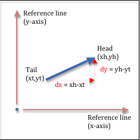
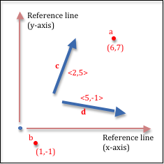
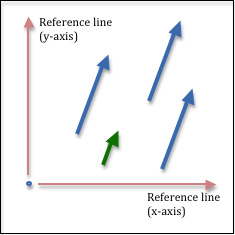
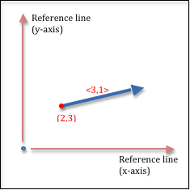
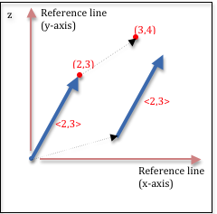

..  Copyright (C)  Wayne Brown
    Permission is granted to copy, distribute
    and/or modify this document under the terms of the GNU Free Documentation
    License, Version 1.3 or any later version published by the Free Software
    Foundation; with Invariant Sections being Forward, Prefaces, and
    Contributor List, no Front-Cover Texts, and no Back-Cover Texts.  A copy of
    the license is included in the section entitled "GNU Free Documentation
    License".

.. role:: raw-html(raw)
   :format: html

3.4 - Modeling Direction / Orientation
::::::::::::::::::::::::::::::::::::::

Location tells us where something is in relationship to a global origin and
a set of coordinate system axes.
The *orientation* of objects is equally important.
Is an object facing north or south, up or down, etc.? Direction can be
either **relative** or **absolute**.

* **Relative** directions are in relationship to an object's
  current location and orientation. For example, if a person is facing north,
  west is to their left and east is to their right. Directions such as
  *left/right*, *forward/backward*, and *up/down* are relative to an object's
  current orientation.
* **Absolute** directions are relative to a fixed frame of reference and always
  point in the same direction, regardless of their location. Directions like
  *north/south* and *east/west* are examples of absolute direction. (We will
  ignore the problematic locations of the north and south poles for this
  discussion!)

There are many ways to represent direction, including various combinations
of distances and angles, and we could go through a discussion
similar to the previous lesson on location to develop some of the various ways.
But let's just jump to the standard representation for direction - *vectors*. Vectors use
a similar notation to Cartesian coordinates - distances along **lines of reference**. In
fact, vectors and locations are often confused, so we need to spend some time
differentiating between them.

Vectors
-------

.. |VectorDefinition| replace:: A vector can be visually represented as a
  line with an arrow on one end. Vectors represent direction, so the arrow is
  important. The arrow points in the direction the vector represents. The
  end with no arrow is called the "tail"; the end with the arrow is
  called the "head." A vector is defined by the change along each line of reference
  to get from the tail to the head. Therefore a vector is defined by two numbers:
  "how much x changes" and "how much y changes". These values are often referred to as
  "delta x" (or dx) and "delta y" (or dy), as shown in the example to the right.
  If you use two points to define a vector, the "delta x" and "delta y" values
  are calculated by subtracting the tail coordinates from the head
  coordinates, i.e., (head - tail).

.. |VectorNotation| replace:: Since the standard representation for a vector
  is two distances, and Cartesian Coordinates for a position in 2-dimensional
  space is two distances, position and direction is sometimes confused.
  To keep these ideas separate, the remainder of this textbook will represent
  vectors by placing the distances inside angle brackets, such as <2,5>, or
  in general, as <dx,dy> for 2-dimensional space. For 3-dimensional space
  a vector is represented using 3 offsets: <dx,dy,dz>.
  If we use variable names to represent points or vectors, we will use single
  letters such as *a*, *b*, or *c* to represent the points, while we will use bolded
  letters such as **a**, **b**, or **c** to represent the vectors. The picture
  to the right shows some example points and vectors.

.. |VectorsNotUnique| replace:: A vector defined by a <dx,dy> representation has no position!
  Such a vector represents an **absolute direction** in relationship
  to its reference coordinate system.
  Let's say that again. A vector defined by a <dx,dy> representation has a direction,
  but it has no position.
  Two vectors with the same <dx,dy> values are
  identical, regardless of how you might draw them visually.
  In the picture to the right,
  the 3 blue vectors are all identical. The green vector represents the same
  direction as the blue vectors, but it has a different length. A vector actually
  represents 2 things: a direction and a distance (or length). Its **direction** is indicated
  by the arrow at its head.
  Its **distance** is its length from its tail to its head. If a vector has
  a length of exactly 1 unit, it is called a *unit vector*.
  If a set of vectors have identical <dx,dy> values after they are converted to unit
  vectors, they all have the same direction.
  We will typically convert vectors to unit vectors because it simplifies
  the mathematical calculations that manipulate them and because it makes the
  representation of a particular direction unique. When you convert a vector to unit length,
  you are "normalizing" the vector since all vectors that point in the same direction
  have the same unit vector. So a *normalized vector* is the unique
  representation of a particular **absolute** direction.

.. |VectorRelative| replace::   If you want to represent **relative** directions
    using a vector, you need a vector and a specific tail location. A pair of
    values, (point, vector), represents a **relative direction**. For example,
    the point (2,3) and the vector <3,1> represents a relative direction from
    the specific location (2,3).

+---------------------------------------------+--------------------------+
| |VectorDefinition|                          | |VectorImage|            |
+---------------------------------------------+--------------------------+
| |VectorNotation|                            | |VectorNotationImage|    |
+---------------------------------------------+--------------------------+
| |VectorsNotUnique|                          | |VectorsNotUniqueImage|  |
+---------------------------------------------+--------------------------+
| |VectorRelative|                            | |VectorRelativeImage|    |
+---------------------------------------------+--------------------------+

Vectors vs. Points
------------------

.. |VectorConfusion| replace:: Notice that if a point in space is used to
    represent a direction from the origin, the point and vector are defined
    using identical distance values. (Examine the (2,3) point and the <2,3>
    vector in the diagram to the right.)
    However, this does not mean the point and vector are identical.
    The point is a single, unique location in space, while the vector is a direction.
    The major difference between points and vectors is that a point has a location
    while a vector does not. If you move a point its location has changed. If you
    move a vector you have not changed the vector in any way! Points and vectors represent
    different things and respond to manipulation in different ways.

+---------------------------------------------+--------------------------+
| |VectorConfusion|                           | |VectorConfusionImage|   |
+---------------------------------------------+--------------------------+

Vector Summary
--------------

* Direction is always relative to something!
* A vector represents an **absolute direction** in relationship to a frame of reference.
* A vector represents a **relative direction** when combined with a starting point.
* Computer graphics typically represents 2-dimensional vectors using two distances, <dx,dy> and 3-dimensional vectors using three distances, <dx,dy,dz>
* A vector represents both direction and distance.
* Making a vector have a length of one unit "normalizes" it into a unique representation for that direction.
* Vectors can't be "moved" because they have no location!

WebGL Vectors
-------------

Vectors are used extensively for model representations and for describing
the motion of objects in animations. They are represented by
three component values, <dx, dy, dz>, using floating point numbers. This means
a single vector requires 12 bytes of memory.

Manipulating Vectors
--------------------

A vector can be manipulated to change its direction and its length.
The following manipulations make physical sense:

* Rotate - to change a vector's direction.
* Scale - to change a vector's length.
* Normalize - to keep a vector's direction unchanged, but make its length be 1 unit.
* Add two vectors. The result is a vector that represents a direction that is the sum of the originals.
* Subtract two vectors. The result is a vector that represents a direction that is the difference of the originals.
* Given a point, add a vector to it. The result is a new point that is in a new location.
* Given a point, subtract a vector from it. The result is a new point is in a new location.
* Given two vectors, calculate their *dot-product*, which calculates the angle
  between the two vectors.
* Given two vectors, calculate their *cross-product*, which calculates a 3rd vector
  that is perpendicular to both of the original two vectors.

Note that it does not make physical sense to multiply or divide two vectors together.

A JavaScript Vector Object
--------------------------

Vector representation and manipulation are fundamental elements of any WebGL
program. This functionality should be implemented once and then used as needed.
The example WebGL program below allows you to inspect a JavaScript class called
:code:`GlVector3`. Please study the code and note the following about
the :code:`GlVector3` class. (Hint: Hide the canvas.)

* An object of type :code:`GlVector3` does not store a vector. It is a collection
  of vector operations. It adds
  one new "class" to the global address space, :code:`GlVector3`, and defines
  13 functions that perform standard vector operations.
  :raw-html:`   `
* Examine the :code:`self.create()` function to see that a vector is stored
  as a :code:`Float32Array`.
  :raw-html:`   `
* Most of the member functions do not create new vectors; they operate on
  vectors that already exist.This is by design to minimize garbage collection.
  :raw-html:`   `
* The functions are implemented for speed with minimal or no error checking.
  :raw-html:`   `

.. webglinteractive:: W1
  :htmlprogram: _static/02_object_examples/object_examples.html
  :viewlist: _static/learn_webgl/glvector3.js
  :hideoutput:
  :width: 300
  :height: 300

Every WebGL program in this textbook uses the :code:`GlVector3` class to
create and manipulate vectors.

Glossary
--------

.. glossary::

   vector
      a direction in relationship to a frame of reference.

   absolute direction
      a direction that is the same regardless of your current position or orientation (e.g., north or south).

   relative direction
      a direction that changes if your current position or orientation changes (e.g., left or right).

   vector magnitude
      the length of a vector

   normalize
      modify a vector to make its length one unit, but keep its direction unchanged.

.. index:: direction, vector, absolute direction, relative direction, normalize

Self Assessment
---------------

.. mchoice:: 3.4.1
  :random:
  :answer_a: <2,-1>
  :answer_b: (2,-1)
  :answer_c: <-2,1>
  :answer_d: (-2,1)
  :correct: a
  :feedback_a: Correct. The direction is 2 units down the x axis and then -1 units down the y axis.
  :feedback_b: Incorrect. This is a location, not a direction.
  :feedback_c: Incorrect. The offset between the starting and ending points are correct, but in the opposite direction.
  :feedback_d: Incorrect. This is a location, not a direction.

  You want to represent a direction that starts at location (2,3) and goes in the direction of location (4,2). Which of the following represents such a direction?

.. mchoice:: 3.4.2
  :random:
  :answer_a: (3,4) is a location. <3,4> is a direction.
  :answer_b: (3,4) is a direction, while <3,4> is a location.
  :answer_c: They represent the same thing.
  :answer_d: (3,4) goes in positive direction, <3,4> goes in the negative direction.
  :correct: a
  :feedback_a: Correct. Locations and directions are very different and behave very differently when manipulated.
  :feedback_b: Incorrect. The notation is backwards. (3,4) is a location. <3,4> is a direction.
  :feedback_c: Incorrect. They are not the same thing. Locations and directions behave very differently when manipulated.
  :feedback_d: Incorrect. This answer makes not sense! What does positive direction even mean?

   What is the difference between (3,4) and <3,4>?

.. mchoice:: 3.4.3
  :random:
  :answer_a: <1,2>
  :answer_b: <3,6>
  :answer_c: <2,5>
  :answer_d: <2,1>
  :correct: a,b
  :feedback_a: Correct. There is another vector in this same direction.
  :feedback_b: Correct. There is another vector in this same direction.
  :feedback_c: Incorrect. This vector has a unique direction among the 4 vectors.
  :feedback_d: Incorrect. This vector has a unique direction among the 4 vectors.

   Which of the following vectors represent the same direction? (Hint: draw a visual picture of the vectors.) (Select all that apply.)

.. mchoice:: 3.4.4
  :random:
  :answer_a: an absolute direction.
  :answer_b: a relative direction.
  :correct: a
  :feedback_a: Correct. A vector defined by &#60;dx,dy&#62; is an absolute direction. It does not define a reference point from which to start.
  :feedback_b: Incorrect. A relative direction must define a starting point and the &#60;dx,dy&#62; vector definition only gives a direction.

  A vector defined by 2 distances, <dx,dy>, is ...

