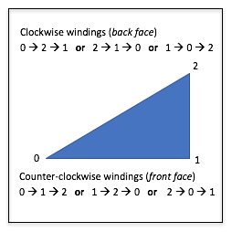
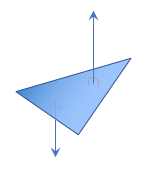
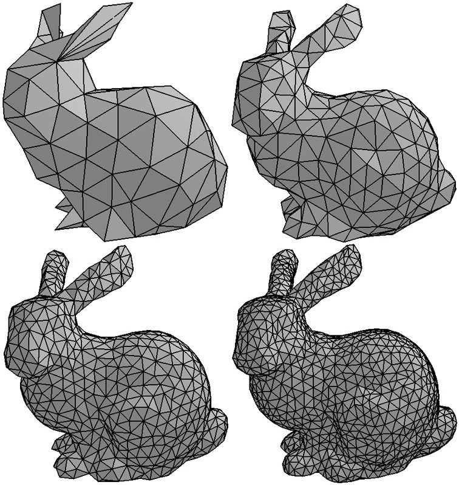
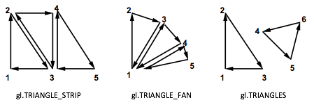

..  Copyright (C)  Wayne Brown
    Permission is granted to copy, distribute
    and/or modify this document under the terms of the GNU Free Documentation
    License, Version 1.3 or any later version published by the Free Software
    Foundation; with Invariant Sections being Forward, Prefaces, and
    Contributor List, no Front-Cover Texts, and no Back-Cover Texts.  A copy of
    the license is included in the section entitled "GNU Free Documentation
    License".

3.5 - Modeling Volumes
::::::::::::::::::::::

We have discussed location and direction. Now we need to discuss how to represent
3-dimensional shapes and the area they occupy in space. An object might be
a cube, a sphere, a plane, or a complex blob.
Objects take on an infinite variety of forms.
It is certainly possible to describe each object in
a unique way, but that would require a unique rendering algorithm for each object.
What we would like is a uniform way to describe any type of object regardless of
the complexity of its form. You may be surprised,
but almost all rendering algorithms only know how to render triangles!

Why only triangles?

* A triangle is the simplest geometric shape that defines an enclosed area.
  Triangles have an inside area and an outside area.
* A triangle is always planar -- it always defines a flat surface.
* A triangle divides 3-dimensional space into three distinct regions. All
  points in 3-dimensional space lie 1) in the plane defined by the triangle,
  2) on one side of the plane or 3) on the other side of the plane. Think of
  a triangle as defining a piece of flat paper. By
  convention we can say one side of a triangle is the *front side* and the
  other side the *back side*. By combining triangles we can create shapes
  that have an *inside* and an *outside*.
* A triangle is always *convex*; it is impossible for a triangle to be *concave*.
  Rendering concave polygons is harder than rendering convex polygons.

These properties make the rendering of a triangle simple and fast.

Defining Triangles
------------------

A triangle is defined using a combination of location and direction values.

Any 3 points (locations) in space define a triangle -- as long as the 3 points
do not lie on top of each other or along a straight line. You might think
that 3 points on top of each other or along a straight line would be rare, but
as you manipulate 3D objects these conditions can happen often.
Therefore, as you develop computer graphics software
you must continually test for such cases. Three points
that do not define a valid triangle are called a "degenerate case". Degenerate cases
are problematic because they do not define an enclosed area or divide 3D space into
3 regions. But perhaps more importantly, degenerate cases cause the mathematics
that manipulates the triangles to fail. To summarize,

+ A triangle is defined by three points (locations).
+ Degenerate cases:

  + The three points are not distinct. (Two or three of them are identical.)
  + The three points lie along a straight line.

The three points of a triangle define three *edges* or *boundary line segments*.
The three points are the locations where the boundary line segments intersect.
The intersection point of two curves, lines or edges is called a **vertex**.
Modeling software refers to the points that define a triangle as *vertices*.

The surface of a triangle that is enclosed within its boundary edges is called
a triangle *face*. (Notice that "face" is the suffix for sur"face".)
A triangle has two faces: a *front face* and a *back face*. A viewer can only see
one face at a time. The front face
is visible to a viewer if the viewer is on the *front side* of the triangle.
Similarly, the back face is only visible if the viewer is on the back side
of the triangle. This is important because
in a scene with a single light source only one side of the triangle will get
light. In addition, only one side of a triangle can be facing the scene's camera.
For triangles that are part of an object that fully encloses a 3D space,
the orientation of the face can be used to determine if the face
is visible to the camera.

  Winding Order for a triangle.

The order of a triangle's vertices are used to determine which side of a
triangle is the front side. If you are looking at a
triangle and the order of the vertices is counter-clockwise, then,
by convention, you are
looking at the front of the triangle. The order of a triangle's vertices
is called its *winding order*. There are two possible windings, as shown in
the image to the left. If a triangle is not being rendered as you expect, it
could be due to the triangle's winding order.

  Normal vectors of a triangle.

A triangle has two vectors associated with it that
are at right angles to every point on the triangle's faces. One vector points
away from the front face; the other vector points away from the back face.
These vectors can be seen in the image to the right. You can calculate
these vectors by taking the vector cross-product of any two edges of the
triangle. Which edges you use and the order you perform the cross-product determines
which vector you calculate. If a triangle's vertices have a counter-clockwise
winding order, and we take the cross product of edge 1 (between vertices 0 and 1)
and edge 2 (between vertices 1 and 2) you will get the normal vector
that is pointing away from the front face.

Remember that vectors have no location, just direction. Therefore a single
vector can represent the direction of the front face for all points on
the surface of the triangle.

Please note the following about the direction/orientation
of a triangle:

* The vector that is pointing away from the front side of the triangle and is
  at a right-angle to every point in the surface of the triangle is called the
  *normal vector*. It is often just called the *normal*.
* The *normal vector* can be calculated "on the fly," as needed, (assuming a triangle's winding
  order is correct), or it can be calculated once and stored with the triangle's
  definition. This is the classic computer science problem of resource
  allocation. If the normal is calculated as needed, the CPU (or GPU) has
  to do more work every time the triangle is rendered. If the normal is stored
  with the triangle definition, then more memory is required to store each
  triangle.
* If a normal vector is pre-calculated and stored with a model, it is
  always *normalized* to unit length. This minimizes
  the mathematical calculations needed during repeated rendering.
* There is never a need to calculate or store both the front and back facing
  normal vectors since they point in exactly opposite directions. If the
  front facing normal vector is :code:`<3,-2,5>`, then the back facing normal vector
  is :code:`<-3,2,-5>`.

Defining 3D Objects
-------------------

  Example triangular meshes (`1`_)

The 3-dimensional form of an object can be approximated with a set of
triangles called a `triangle mesh`_.
The accuracy of an object's form is dependent on the number of triangles
used to model it. The example triangular meshes on the right show how an
object's form can be more closely approximated as
you increase the number of triangles. But there is always trade-offs:

* If you use a minimal number of triangles, the object's form is a rough
  approximation, but rendering is very fast and you don't use very much memory.
* If you use many triangles, the object's form is more accurate, but rendering
  takes more time and the RAM and GPU memory requirements are larger.

Face Culling
------------

A triangle mesh that defines a solid object will have only some of its triangles
visible from a particular point of view. If the density of the triangles
is uniform over the entire surface of the object, then, on average, only
half of a model's triangles will be visible at any given time. There is
a simple test to determine if a triangle is visible. Calculate the angle
between a vector that is pointing in the virtual camera's direction of view, and
a triangle's normal vector. If the angle is greater than 90 degrees, then
the triangle's front face is oriented away from the camera and will not
be visible because it will be hidden by other triangles in the model that are facing
towards the camera. The angle between two vectors can be calculated by
taking their dot-product. This simple test is called `face culling`_
and can potentially speed up rendering by a factor of two.

Please note that *face culling* can only be done on models of solid objects.
If a model does not completely enclose the interior of a model, some
back faces may need to be rendered. For example, a box with its top
open may have some back-faces of triangles visible when looking into the box.

WebGL Triangle Rendering Modes
------------------------------

In WebGL you always define a set of triangles using an array of vertices.
There are three drawing modes that determine how the vertices are interpreted:

* :code:`gl.TRIANGLE_STRIP` - After the initial three vertices, each additional vertex
  defines one more triangle. Defining *n* triangles requires (*n* + 2)
  vertices.
* :code:`g.TRIANGLE_FAN` - All triangles share the first vertex. After the first
  two vertices, each new vertex creates one triangle. Defining *n*
  triangles requires (*n* + 2) vertices.
* :code:`gl.TRIANGLES` - The array of vertices contains three vertices for
  each triangle. Defining *n* triangles requires *3n* vertices.

  WebGL triangle drawing modes. (`2`_)

Dividing a triangle mesh into the most efficient groups of :code:`TRIANGLES`,
:code:`TRIANGLE_STRIP`, and :code:`TRIANGLE_FAN` sets is a very difficult
problem. You can save considerable amounts of memory by using
:code:`TRIANGLE_STRIP`, and :code:`TRIANGLE_FAN` modes, but they are actually
rarely used. Let's consider a very simple example. A cube is defined by
8 vertices and 12 triangles (6 sides with 2 triangles per side). There are
many ways the cube could be rendered, such as

* Use :code:`TRIANGLES` mode for all triangles. This requires an array of 36
  vertices (12 triangles * 3 vertices/triangle).
* Use 2 arrays and :code:`TRIANGLE_FAN` mode. One fan would start with the lower-left corner;
  the other fan would start with the upper-right corner. Each fan would draw
  6 triangles. This requires two arrays of 8 vertices each, for a total
  of 16 vertices.
* Use :code:`TRIANGLE_STRIP` mode to draw the front, right, back and left sides.
  Then use 2 :code:`TRIANGLE_FAN` modes: one for the top 2 faces and one for the
  bottom 2 faces. This requires an array of 10 vertices for the :code:`TRIANGLE_STRIP`
  and 2 arrays for the top and bottom, each holding 4 vertices. This is a
  total of 18 vertices.
* Etc. (Many other combinations are possible.)

The optimization of triangle groups to minimize memory requirements is
beyond the scope of this textbook. We will restrict ourselves to using
:code:`TRIANGLES` mode for all our renderings -- at the cost of using more
RAM and GPU memory.

Glossary
--------

.. glossary::

  triangle
    A polygon defined by 3 straight boundary edges.

  vertex
    The intersection point of two curves, lines or edges. Three vertices define a triangle.

  normal vector
    A vector that is perpendicular (90 degree angle) to every point on the surface of a triangle.
    Of the two possible such vectors, the normal vector is the one that points away from the
    front face.

  front face
    By convention, the side of a triangle that its normal vector points away from.

  back face
    By convention, the side of a triangle that is opposite its front face.

  triangular mesh
    A group of triangles that approximate the form of a 3D object.

  gl.TRIANGLE_STRIP
    A WebGL drawing mode that draws triangles where each new vertex uses the previous two vertices
    in an array to form a new triangle.

  gl.TRIANGLE_FAN
    A WebGL drawing mode that draws triangles that all share the first vertex in an array.

  gl.TRIANGLES
    A WebGL drawing mode that draws a separate triangle for every 3 vertices in an array.

Self Assessment
---------------

.. mchoice:: 3.5.1
  :random:
  :answer_a: Triangles
  :answer_b: Squares
  :answer_c: Rectangles
  :answer_d: Hexagons
  :correct: a
  :feedback_a: Correct.
  :feedback_b: Incorrect. Squares require 4 vertices, and can be non-planar.
  :feedback_c: Incorrect. Rectangles require 4 vertices, and can be non-planar.
  :feedback_d: Incorrect. Hexagons require 6 vertices, can be concave, and can be non-planar.

  What type of polygons are used to render approximations to 3D models? (Select all that apply.)

.. mchoice:: 3.5.2
  :random:
  :answer_a: A triangle defined by 3 points where 2 or more of them are equal to each other.
  :answer_b: A triangle defined by 3 points where the 3 points lay along a straight line.
  :answer_c: A triangle defined by 3 unique points that do not lay along a straight line.
  :answer_d: A triangle defined by 3 points where the area inside its boundaries is positive.
  :correct: a,b
  :feedback_a: Correct. If 2 of the points are equal, you have a straight line. If all 3 points are equal, you have a single point.
  :feedback_b: Correct. The 3 points define a straight line, not a triangle.
  :feedback_c: Incorrect. This is a valid triangle definition.
  :feedback_d: Incorrect. This is a valid triangle definition.

  What is a degenerate triangle? (Select all that apply.)

.. mchoice:: 3.5.3
  :random:
  :answer_a: Front
  :answer_b: Back
  :correct: a
  :feedback_a: Correct.
  :feedback_b: Incorrect.

  If a virtual camera is looking at a triangle, and the vertices that define it are in a
  counter-clockwise rotation, then the camera is seeing which side of the triangle?

.. mchoice:: 3.5.4
  :random:
  :answer_a: The approximation of the 3D object can be more accurate.
  :answer_b: The rendering will be slower -- because is has to draw more triangles.
  :answer_c: More memory will be required to store the 3D representation.
  :answer_d: The approximation of the 3D object will be less accurate.
  :correct: a,b,c
  :feedback_a: Correct. Assuming the added triangles add details to the object's form.
  :feedback_b: Correct.
  :feedback_c: Correct.
  :feedback_d: Incorrect. Though it would be possible to decrease accuracy if the added triangles were ill-placed.

  What are the implications of adding more triangles to a triangular mesh? (Select all that apply.)

.. mchoice:: 3.5.5
  :random:
  :answer_a: gl.TRIANGLES
  :answer_b: gl.TRIANGLE_FAN
  :answer_c: gl.TRIANGLE_STRIP
  :correct: a
  :feedback_a: Correct. It requires 3 vertices for each triangle.
  :feedback_b: Incorrect. It requires only (n+2) vertices to define n triangles.
  :feedback_c: Incorrect. It requires only (n+2) vertices to define n triangles.

  Which WebGL rendering mode requires the most number of vertices to define triangles?

.. index:: triangle, vertex, normal vector, front face, back face, triangle mesh, gl.TRIANGLE_STRIP, gl.TRIANGLE_FAN, gl.TRIANGLES

.. _triangle mesh: https://en.wikipedia.org/wiki/Triangle_mesh
.. _1: https://www.quora.com/What-is-a-mesh-in-OpenGL
.. _2: https://www.khronos.org/registry/OpenGL/specs/es/3.0/es_spec_3.0.pdf#nameddest=section-2.9.3
.. _normal: https://en.wikipedia.org/wiki/Normal_(geometry)
.. _Source2: https://www.opengl.org/wiki/Face_Culling
.. _face culling: https://www.opengl.org/wiki/Face_Culling
