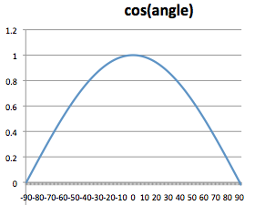
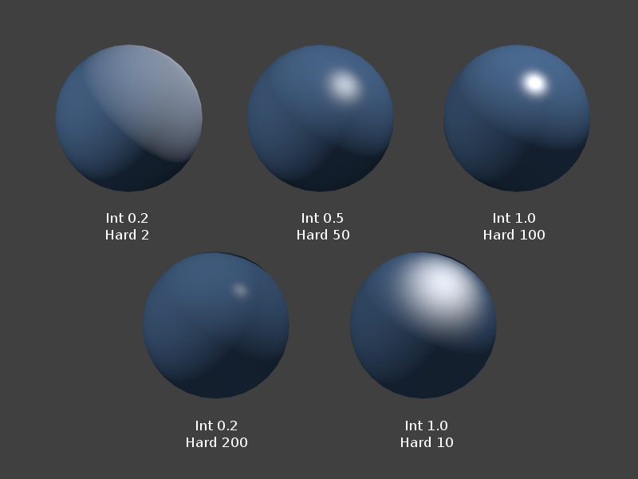
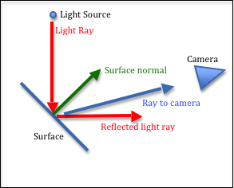

..  Copyright (C)  Wayne Brown
    Permission is granted to copy, distribute
    and/or modify this document under the terms of the GNU Free Documentation
    License, Version 1.3 or any later version published by the Free Software
    Foundation; with Invariant Sections being Forward, Prefaces, and
    Contributor List, no Front-Cover Texts, and no Back-Cover Texts.  A copy of
    the license is included in the section entitled "GNU Free Documentation
    License".

.. role:: raw-html(raw)
   :format: html

3.6 - Modeling Light Sources
::::::::::::::::::::::::::::

To model how an object looks in the real world you have to model how light
interacts with the surfaces of the object. One or more of the following
four things happens when light strikes an object:

* `reflection`_ :raw-html:` `
  Light reflects off the surface in various directions. The direction
  of the reflected light is determined by the surface properties of the face.
  :raw-html:`   `

* `transparency`_ and `refraction`_ :raw-html:` `
  Light travels through the object and continues out the opposite side,
  but at a different trajectory.
  :raw-html:`   `

* `absorption`_ :raw-html:` `
  Light is absorbed by the object and is converted to energy, which
  makes the the object become warmer over time.
  :raw-html:`   `

* `subsurface scattering`_ :raw-html:` `
  Light enters the object, bounces around inside the object, and then
  leaves the object at a different location than it hit.
  :raw-html:`   `

Modeling all of these lighting effects is complex and beyond the scope of
this textbook. We will discuss *reflection* and *transparency*
because realistic images can be produced while still allowing for real-time animations.
When you model refraction, absorption, and subsurface scattering, you
typically can't generate real-time graphics.

Light Sources
-------------

In the real world light comes from `light sources`_. The sun is the most obvious
light source. Other light sources include lamps, spot lights, fire and explosions.
The characteristics of light changes based on its source. We need to model some
of these basic properties of light if we hope to render realistic images.
We will model the following properties of a light source:

* Position - where is the light coming from? There are two scenarios:

  * Directional - The light source is so far away that all light rays are
    basically traveling in the same direction. The sun is a directional light
    source.
  * Positional - The light source is inside the scene. The angle that
    light strikes an object changes based on their relative position. Note
    that the angle the light strikes individual vertices of an individual
    triangle will be different.

* Color - for example, a red spot light.
* Point vs Spotlight - does the light travel in all directions, or is the light
  restricted to a specific direction, such as flashlight.

We model a light's color using a RGB value. A red light's color would be
:code:`(1.0, 0.0, 0.0)` while
a white light's color would be :code:`(1.0, 1.0, 1.0)`.

Ambient Reflected Light
.......................

Sometimes you don't know the source of the light in a scene.
For example, consider being in a dark room. You can see things, but
you don't necessarily know where the light in the room is coming from. It might
be coming from the moon through a window, or from a light in another room under
a doorway, or the faint glow of a night light. Light that is not
coming directly from a light source, but is just bouncing around in a scene,
is called *ambient* light.

Ambient light is "background" light. It bounces everywhere in all directions
and has no specific location of origin.
Ambient light illuminates every face of a model. Therefore, both the faces
that get direct light, and the faces hidden from direct light are illuminated
with the same amount of ambient light.

An ambient light of :code:`(0.1, 0.1, 0.1)` would model a dark room, while an ambient light
of :code:`(0.4, 0.4, 0.4)` would model a well lit room. An ambient light of
:code:`(0.2, 0.0, 0.0)` would simulate a low intensity red light permeating a scene.
The exact values you use will typically be based more on experimental results than
on actual physical properties of a scene.

Diffuse Reflected Light
.......................

The amount of light that is reflected off of the surface of an object is
related to the orientation of the surface to the light source. If light
hits the surface "straight on", most of the light will be reflected. If light
just "grazes off" the side of an object, then very little light is reflected.
This is illustrated in the diagram.

.. figure:: figures/diffuse_light.png
  :align: left

  Diffuse light reflection.

We assume that the surface of a face is not perfectly smooth and that the light
scatters equally in all directions when it reflects off the surface. For
diffuse light the question is how much reflection occurs, not the direction
of the reflection. In Physics, `Lambert's cosine law`_ gives us the amount of
reflection.

If we take the cosine of the angle between the surface normal vector
and the light ray, this gives us the amount of reflected light. When the angle
is zero, cos(0) is 1.0 and all the light is reflected. When the angle is
90 degrees, cos(90) is 0.0 and no light is reflected. If the cos() is negative,
the face is orientated away from the light source and no light is reflected.
The amount of reflected light is not a linear relationship, as you can see in the
plot of the cosine function in the image.

If you multiply the color of a surface by the cosine of the angle between
the surface normal and light ray, you will scale the color towards black.
This is exactly the results we want. As less and less light reflects off
of a surface, the surface color becomes darker.

Specular Reflected Light
........................

  Examples of specular highlight (white areas on the blue balls)

If an object is smooth, some of the light reflected off of the surface of
an object is reflected directly into the viewer's eye (or the camera's lens).
This creates a "specular highlight" that is the color of the light source,
not the color of the object, because you are actually seeing the light-source's
light. Each of the white areas on the blue balls in the image to the right
is a *specular highlight*.

The location of a specular highlight is determined by the angle between
a ray from the camera to the point on the surface, and the exact reflection of the
light ray. The surface normal is used to calculate the reflected light ray.
Please study the diagram below.

  Specular highlight (Angle between *reflected-ray* and *ray-to-camera*.)

WebGL Implementation
--------------------

All lighting effects in WebGL are performed by calculations in a *fragment shader*.
To implement the three lighting effect described above, you would
do the following:

* Get the amount of ambient light from a light source model.
* Calculate the angle between the surface normal vector and the light direction.
* Multiply the cosine of the angle times the surface's diffuse color.
* Calculate the angle between the light reflection and the camera direction.
* Multiply the cosine of the angle times the light model's specular color.
* Add the ambient, diffuse, and specular colors. This is the color of the pixel for
  this fragment of the triangle's surface.

We will cover the details of implementing a lighting model in chapter 10.
In chapter 11 we will discuss how to integrate lighting models with surface
models to create realistic renderings. Chapter 12 will discuss transparency.

Glossary
--------

.. glossary::

  light model
    A mathematical description of a light source.

  ambient light
    Light in a scene that has no discernible source. All faces of all models
    are illuminated with ambient light.

  diffuse light
    Light that directly strikes an object and then reflects in all directions.
    The amount of reflection is determined by the angle between the light
    ray and the surface normal vector.

  specular light
    Light that reflects off of a smooth surface directly into the lens of a camera.
    The color of the light, not the color of the surface, is rendered.

Self Assessment
---------------

.. mchoice:: 3.6.1
  :random:
  :answer_a: Reflected light.
  :answer_b: Refracted light.
  :answer_c: Absorbed light.
  :answer_d: Subsurface scattering of light.
  :correct: a
  :feedback_a: Correct. You see an object because light has reflected off of it and into your eyes.
  :feedback_b: Incorrect. Refracted light has passed through a transparent object, not an opaque object.
  :feedback_c: Incorrect. Absorbed light can't be seen. Its energy has warmed up the object.
  :feedback_d: Incorrect. Opaque objects have no subsurface scattering.

  For an opaque object, you see the object because of what type of light?

.. dragndrop:: 3.6.2
  :match_1: Ambient light|||Background light in a scene from no discernible light source.
  :match_2: Diffuse light|||Reflected light, where the amount is based on the angle between the surface and the light source.
  :match_3: Specular light|||Light that reflects off a surface straight into your eye.

  Match each type of light with its correct definition.

.. mchoice:: 3.6.3
  :random:
  :answer_a: The light is so far away from an object that all light rays strike the object from the same direction.
  :answer_b: The direction of the light that strikes the object is constantly changing.
  :answer_c: The light has a direction and only things in that direction are visible.
  :answer_d: The light source has many directions in which it illuminates objects.
  :correct: a
  :feedback_a: Correct. A good example is the sun.
  :feedback_b: Incorrect.
  :feedback_c: Incorrect.
  :feedback_d: Incorrect.

  A *directional light source* has what property?

.. mchoice:: 3.6.4
  :random:
  :answer_a: The light is close enough to an object that light rays strike the object at different angles.
  :answer_b: The light has a location/position.
  :answer_c: It is a light source that is constantly changing positions.
  :answer_d: The position of the light source is constant.
  :correct: a
  :feedback_a: Correct. A good example is a lamp in a room.
  :feedback_b: Incorrect. A positional light source does have a position, but the issue is how close it is to the object it is illuminating.
  :feedback_c: Incorrect. For one rendering of a scene, a positional light source has a single position.
  :feedback_d: Incorrect. An animation often moves positional lights in a scene between frames.

  Which is the best description of a *positional light source*?

.. index:: light model, ambient light, diffuse light, specular light

.. _reflection: https://en.wikipedia.org/wiki/Reflection_(physics)
.. _transparency: https://en.wikipedia.org/wiki/Transparency_and_translucency
.. _refraction: https://en.wikipedia.org/wiki/Refraction
.. _subsurface scattering: https://en.wikipedia.org/wiki/Subsurface_scattering
.. _absorption: https://en.wikipedia.org/wiki/Absorption_(electromagnetic_radiation)
.. _light sources: https://en.wikipedia.org/wiki/List_of_light_sources
.. _Lambert's cosine law: https://en.wikipedia.org/wiki/Lambert%27s_cosine_law
