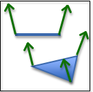
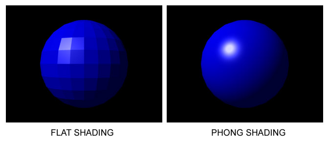
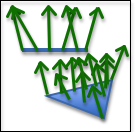
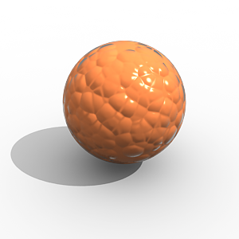

..  Copyright (C)  Wayne Brown
    Permission is granted to copy, distribute
    and/or modify this document under the terms of the GNU Free Documentation
    License, Version 1.3 or any later version published by the Free Software
    Foundation; with Invariant Sections being Forward, Prefaces, and
    Contributor List, no Front-Cover Texts, and no Back-Cover Texts.  A copy of
    the license is included in the section entitled "GNU Free Documentation
    License".

.. role:: raw-html(raw)
   :format: html

3.7 - Modeling Surfaces
:::::::::::::::::::::::

A triangular mesh captures the 3D volume of an object, but we also want to model the
surface properties of an object. For example:

* What color is the surface? Is the color solid or multi-colored?
* How does the surface reflect light? Is it shinny or dull?
* Is the surface smooth, rough or bumpy?
* Is the surface flat or curved?
* Is the surface transparent which allows some light to pass through it?
  If so, does the light refract (change its direction of travel)?

Let's discuss how some of these surface properties are modeled.

Flat Surfaces?
--------------

One Normal **Per Face**
.......................

.. figure:: figures/one_normal_per_face.png
  :align: right

  One normal **per face**.

In the lesson on modeling volumes we discussed "normal vectors," which point in the
direction that is 90 degrees to every point on the front face of a triangle.
If we model a surface using a single normal vector, we assume that the
triangle is perfectly flat. This is referred as "flat shading" because
every pixel on the face will have the same color.

If a normal vector for a triangle is not specified, it can be calculated by taking the
cross-product of two of the triangle's edges, assuming the correct *winding order*
for the vertices.

One Normal Vector **Per Vertex**
................................

  One normal **per vertex**

If you specify a different normal vector for each vertex of a triangle,
you can calculate a different color for each vertex. Then the colors
for each pixel across the face can be interpolated from the colors at the vertices.
If the vertex normal vectors are set appropriately, the face
can appear curved (instead of flat). (This
technique is named after its inventor and is called `Gouraud shading`_)

You will get more accurate coloring across a face if you interpolate the
normal vectors at the vertices across the face and then recalculate the
fragment color using the interpolated normal vector. This method requires more
computation, but gives smoother color gradients. This is called `Phong shading`_.

Both techniques are referred to as "smooth shading".

  Flat vs. Smooth Shading. (`1`_)

One Normal Vector **Per Pixel**
...............................

  One normal **per pixel**

You can control the color of individual pixels on the surface of a triangle
by specifying a unique normal vector for each pixel. This is done by creating
an image, where each "pixel" in the image is not treated as a RGB value,
but rather as a :code:`<dx,dy,dz>` normal vector. This is called a `bump map`_. Here is
an example rendering using bump maps.

  A "bump mapped" object. (`2`_)

As we store more and more data about the properties of a surface we can get
greater and greater realistic results.

Many of the techniques used to model surface properties have the word "map" in them,
such as "bump map", so let's backtrack and discuss the general concept of a "mapping."

What is a Mapping?
------------------

In mathematics, a *mapping* is a function that converts a set of inputs
into an output value. There are two basic ways this can be done:

* Perform calculations on the inputs to produce the output value. This
  is called "procedural mapping."
* Lookup the output value from a list of possible values. This is called
  a "table lookup."

For computer graphics, the input to a *mapping* is typically a location
on a surface, and the output is a color, a normal vector, or any other
property that is changing across the surface of a triangle. Let's
take a look at a specific example called *texture mapping* which
takes a location on a surface and outputs a specific color for that location.

Procedural Texture Mapping
--------------------------

A *procedural texture map* is a function that converts input values into
a color using a calculation. The results of the calculation can be used
to **select a color**, or the calculated values can be used to **create a color**.
There is no limit to the number of possible patterns that can be calculated.
The following example function produces a black and white checkerboard pattern
that is 10 pixels wide.

.. Code-block:: JavaScript

  function checkerboard(x,y) {
    if ( floor(x/10) + floor(y/10) mod 2 == 1) {
      color = [0, 0, 0, 1]; // black
    } else {
      color = [1, 1, 1, 1]; // white
    }
    return color;
  }

The input values can be anything you want to base the coloring on.
A *1D texture map* takes a single input value and returns a color.
A *2D texture map* takes two input values and returns a color.
A *3D texture map* takes three input values and returns a color.

Image Texture Mapping
---------------------

"Table lookup" texture mapping is typically done using an image. An image
is a 2D array of color values. Given a row and column value, it is trivial
to return the color of the pixel at a particular location in the image.
In pseudo code, such a texture map would look like this:

.. Code-block:: JavaScript

  function getColor(image, x, y) {
    return image[x][y]; // the color of the indicated pixel
  }

Images are a convenient way to specify a set of color values for the face
of a triangle. However, images are always rectangles and WebGL only renders triangles.
We need a way to specify which pixels inside an image contain the colors for
a triangle's face.

.. figure:: figures/texture_coordinate_example.jpg
  :width: 360
  :height: 270
  :align: right

  An image being used as a texture map. (`3`_)

"Texture coordinates" specify which location in an image
corresponds
to a triangle's vertices. To make *texture coordinates* work for any image,
the locations are specified in percentages. For example, 0.0 is the left
edge of an image, 1.0 is the right edge, and 0.5 is the middle. The image
to the left shows an example.
Vertex B is *mapped* to a specific location in the image
with texture coordinates (0.31, 0.74) because the color in the image we want
to be displayed at vertex B is 31% from the left edge and 74% from
the bottom edge. Once the three, 3D vertices are mapped to corresponding
locations in the image, the interior locations can easily be calculated.

Note that if the proportions of a 3D triangle are not proportional to the area
on the image, the 'picture' displayed on the 3D triangle
will be distorted. Assigning texture coordinates that do not distort an
image is difficult to do manually. Tools like `Blender`_ greatly assist
in creating appropriate texture coordinates.

Surface Properties
------------------

In addition to *texture mapping,* many other techniques have been developed
to model the surface properties of an object. Here are few:

* **bump maps** - maps a location on a triangle to a variation in the surface normal.
  The variation values are typically stored in an "image" where each "pixel" value
  is an offset to the primary surface normal vector.
  :raw-html:`   `
* **normal maps** - maps a location on a triangle to a surface normal. The surface normals
  are often stored in an "image" where each "pixel" is **not** a :code:`RGB` value, but
  rather a :code:`<dx, dy, dz>` vector.
  :raw-html:`   `
* **displacement maps** - maps a location on a triangle to a variation in surface height.
  The height values can be stored in a "monochrome image" where each "pixel" value is
  interpreted as a height value instead of a color value.
  :raw-html:`   `

These techniques are all called "maps" because they associate a location on a triangle
with some property of the surface at that location. Again note that these
techniques can be "procedural" (which calculates the property), or use a "table lookup"
(which pulls the property from a predefined array of values).

WebGL Implementation
--------------------

The techniques we have discussed will be implemented in WebGL shader programs
that execute the graphics pipeline.
One normal vector per face and one normal vector per vertex are implemented
in *vertex shaders*. Phong shading, texture mapping, and other "mapping" techniques
are implemented in *fragment shaders* because they calculate the color of
individual pixels. Image based texture mapping is performed by:

* Downloading an appropriate image from the server.
* Creating a GPU texture object and saving the image to the GPU's memory.
* Using a table lookup function in your *fragment shader* to get a color
  out of the image for a specific pixel.

Exact implementation details for texture mapping will be given in Chapter 10.

Summary
-------

Very realistic renderings can be produced by using these surface property
modeling techniques. To produce life-like renderings it is common to use
some combination of many or all of these techniques.

Surface properties are only part of the modeling we need to produce realistic images.
How the surface reflects light is the other critical part. The next lesson
explains how to model light sources.

Glossary
--------

.. glossary::

  material properties
    A mathematical description of a "material" that forms the surface of a triangle.

  flat shading
    A single color is calculated for the face of a triangle.

  Gouraud shading
    A different color is calculated for each vertex of a triangle. The color of
    interior pixels are interpolated from the colors at its vertices.

  Phong shading
    Interpolate normal vectors across the face of a triangle and use these
    normal vectors to calculate a unique color for each pixel.

  smooth shading
    Use either Gouraud shading or Phong shading to vary the colors over a triangle's face.

  mapping
    A function that converts a set of inputs into an output value.

  bump map
    Use a unique normal vector at each pixel to calculate a color. The
    normal vectors are designed to give the impression of bumps on the surface.

  texture map
    Map a location on the surface of a triangle to a color.

  procedural texture map
    A texture map implemented by calculations in GLSL code.

  image texture map
    A texture map implemented using an image and "table lookups" using texture coordinates.

  texture coordinates
    A location in a table of color values. The location is a percentage of the
    table's size.

Self Assessment
---------------

.. mchoice:: 3.7.1
  :random:
  :answer_a: The properties of the surface.
  :answer_b: Properties of the light sources that are reflecting light off of the surface.
  :answer_c: The rendering mode used to draw the triangle (gl.TRIANGLES, gl.TRIANGLE_STRIP, etc.)
  :answer_d: How many triangles are in the entire model's triangular mesh.
  :correct: a,b
  :feedback_a: Correct.
  :feedback_b: Correct.
  :feedback_c: Incorrect. How vertices are defined to specify a triangle has no impact on the triangle's surface.
  :feedback_d: Incorrect. Triangles are rendered one at a time, so the number of triangles does not matter.

  To accurately render the **surface** of a triangle, what to you need to know? (Select all that apply.)

.. dragndrop:: 3.7.2
  :match_1: One normal vector|||Flat shading; one color for the entire face.
  :match_2: Three normal vectors, one per vertex|||Smooth shading; color varies across the face.
  :match_3: Multiple normal vectors across the face (i.e., bump map)|||Colors vary across the face to simulate roughness.

  Regarding surface normals, match the number of normal vectors with the assignment of face colors.

.. mchoice:: 3.7.3
  :random:
  :answer_a: function that converts input values into an output value.
  :answer_b: drawing that shows geographic landmarks.
  :answer_c: set of directions for driving from point A to point B.
  :answer_d: computer graphics concept that converts vectors to polygonal meshes.
  :correct: a
  :feedback_a: Correct.
  :feedback_b: Incorrect. This is a physical "map", not a "mapping."
  :feedback_c: Incorrect.
  :feedback_d: Incorrect.

  A "mapping" is a

.. mchoice:: 3.7.4
  :random:
  :answer_a: percentage values.
  :answer_b: distances in mm.
  :answer_c: a relative distance from the global origin.
  :answer_d: distances in inches.
  :correct: a
  :feedback_a: Correct.
  :feedback_b: Incorrect.
  :feedback_c: Incorrect.
  :feedback_d: Incorrect.

  Texture coordinates specify a location in a texture map (i.e., an image) using

.. dragndrop:: 3.7.5
  :match_1: procedural|||Calculate the output value based on the inputs.
  :match_2: table lookup|||Use the input values to select the output value from a list of pre-defined values.

  Match the type of "mapping" with its correct definition.

.. index:: material properties, surface properties, flat shading, Gouraud shading, Phong shading, smooth shading, bump map, mapping, texture map, procedural texture map, image texture map, texture coordinates

.. _1: https://en.wikipedia.org/wiki/Shading
.. _2: http://docs.chaosgroup.com/display/VRAY3MAYA/Displacement+Control
.. _3: http://stackoverflow.com/questions/2274383/how-do-i-draw-a-texture-mapped-triangle-in-matlab
.. _Gouraud shading: https://en.wikipedia.org/wiki/Gouraud_shading
.. _Phong shading: https://en.wikipedia.org/wiki/Phong_shading
.. _bump map: https://en.wikipedia.org/wiki/Bump_mapping
.. _Blender: https://www.blender.org/
