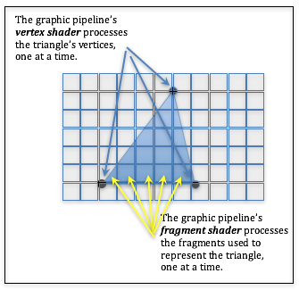
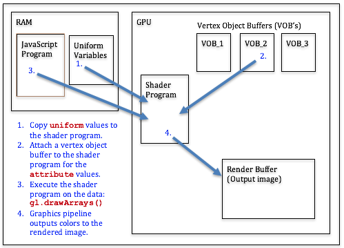

..  Copyright (C)  Wayne Brown
    Permission is granted to copy, distribute
    and/or modify this document under the terms of the GNU Free Documentation
    License, Version 1.3 or any later version published by the Free Software
    Foundation; with Invariant Sections being Forward, Prefaces, and
    Contributor List, no Front-Cover Texts, and no Back-Cover Texts.  A copy of
    the license is included in the section entitled "GNU Free Documentation
    License".

5.1 - Introduction to Rendering
:::::::::::::::::::::::::::::::

The Big Picture
---------------

In the previous chapters you have learned the programming languages and
environments needed to create WEBGL 3D graphics (HTML, CSS, & JavaScript),
you have learned the basics of modeling virtual worlds, and you have
learned how to create triangular mesh models using Blender. Now the real
fun begins! You are ready to learn how to render your models in a scene
using WebGL.

First, you should understand the basic nature of WegGL. WebGL is an API
(application programmer interface) to a
GPU (graphics processing unit). A GPU is a hardware device that is optimized
for rendering real-time 3D graphics. You will be writing *shader programs*
that are compiled into hardware instructions that execute at lightning
speed. The WebGL API is not optimized for programmers; it is optimized for
fast hardware rendering. WebGL commands literally "flip switches" in the
hardware to connect circuitry. Don't expect high-level commands. The WebGL API
is a very low-level set of commands that control hardware level functionality.

When programming WebGL programming you need to separate pre-processing operations,
which typically happen only once, with processing that must happen for each
individual rendering of an animation frame. As you study the following descriptions
of the rendering process, ask yourself **when** and **why** each task is performed.

Pre-processing: WebGL Setup
---------------------------

At a high level of abstraction, the pre-processing steps needed for rendering are as follows:

#. Get the HTML *canvas* element you will be rendering into.
#. Get a WebGL *context* for the canvas element, which is typically called :code:`gl`.
#. Set the desired state for the :code:`gl` context (e.g, the background color).
#. Compile and link a *vertex shader* and a *fragment shader* into
   a *rendering program*. (More than one rendering program can be created.)
#. For each model in your scene:

   #. Convert your OBJ or PLY model data into appropriate :code:`Float32Array` objects for rendering.
   #. Create one or more *buffer objects* in the GPU's memory.
   #. Copy the :code:`Float32Array` objects (i.e, the model data) into the *buffer object(s)*.

#. Get references to the variables in your *shader rendering programs* so you can
   set their values at render time.

An example of these pre-processing steps can be studied in the following WebGL program
(specially lines 123-164).

.. webglinteractive:: W1
  :htmlprogram: _static/03_simple_pyramid/simple_pyramid.html
  :editlist: _static/03_simple_pyramid/simple_pyramid_scene.js
  :hideoutput:
  :width: 300
  :height: 300

A Brief Introduction to Shader Programs
---------------------------------------

Before we discuss the specific steps for rendering models, we need to discuss some
basic ideas behind *shader programs*. There are two stages in the `graphics pipeline`_
that you must program yourself. You write programs in GLSL (GL Shader
Language), compile them to machine instructions, link them into a "program",
download the program to the GPU, and then activate the program when you render
a scene. The result of a rendering is a 2D array of pixels stored in a *frame buffer*.
Many pieces of data are stored and manipulated for each pixel. The group
of data associated with a single pixel is called a :code:`fragment`. When you
see the word :code:`fragment`, think "pixel and its associated rendering data."

Please recognize that in a *perspective* world view, the number of :code:`fragments` that are
created to render an individual triangle will constantly change based on the
distance between the virtual camera and the triangle.  A rendered triangle
might require hundreds, or even thousands, of :code:`fragments` because the virtual
camera is very close to the triangle. Or, if the virtual
camera is far removed from a triangle, the triangle might be rendered
with only one or two :code:`fragments`.

Your two *shader programs* have a very limited scope of functionality:

* A *vertex shader* transforms each vertex of a model to its correct **location** for the current scene.
* A *fragment shader* **assigns a color** to each fragment (pixel) that composes a point, line, or triangle.

That sounds simple enough, and it can be very simple. You can create shader
programs that perform their required functionality in a single line of code.
Or you can do amazing manipulations using very complex algorithms. The beauty
of shader programs is that you have total control over the graphics process.

Note that *vertex* and *fragment* shaders share variables. A vertex shader
will often setup values for the fragment shader to use. This will become
clearer as we study shader programs in more detail over the following lessons.

Shader programs use three types of data. Data that is the same for an entire
model, data that changes for each vertex, and
data that changes for each :code:`fragment` of a point, line, or triangle.
These three types of data are:

+-------------------+------------------------------------------------------------------------+
+ :code:`uniform`   + A data value that is the same for an entire execution of the graphics  +
+                   + pipeline. For example, if you are going to assign the same color to    +
+                   + every processed vertex, then that color could be a :code:`uniform`     +
+                   + variable. When you think of a :code:`uniform` value, think of a fixed, +
+                   + unvarying, unchanging value.                                           +
+-------------------+------------------------------------------------------------------------+
+ :code:`attribute` + A data value that changes for every **vertex** as the graphics         +
+                   + pipeline is processing vertices. A typical :code:`attribute` value is  +
+                   + the (x,y,z) location of a vertex. When you think of an                 +
+                   + :code:`attribute` value, always include vertex with the term, as in    +
+                   + :code:`vertex attribute`.                                              +
+-------------------+------------------------------------------------------------------------+
+ :code:`varying`   + A data value that changes for every **fragment** as the graphics       +
+                   + pipeline is processing :code:`fragments`. For example, a               +
+                   + :code:`varying` variable allows every pixel that composes a point,     +
+                   + line or triangle to be assigned a different color. When you think of   +
+                   + a :code:`varying` value, always include :code:`fragment` with the      +
+                   + term, as in :code:`varying fragment`.                                  +
+-------------------+------------------------------------------------------------------------+

Rendering Steps
---------------

Each time you render your scene, WebGL has automatically initialized its context by:

* Setting every pixel in the *frame buffer* to the color you set using :code:`gl.clearColor(r,g,b,a)`, and
* Clearing the *depth buffer* (if *hidden surface removal* has been enabled).

Your JavaScript program must perform the following steps:

#. For each model in your scene:

   #. Select your shader program.
   #. Pass the values of your :code:`uniform` variables to your shader program.
   #. Attach each *shader* :code:`attribute` variable to an appropriate *buffer object*.
   #. Call the WebGL :code:`gl.drawArrays()` function.

The following diagram will help you visualize the steps needed to render an individual model.

  Steps for rendering a model.

The remaining lessons in this chapter explain the details of these rendering steps.

Rendering Speed Considerations
------------------------------

All rendering is done within a *context*. The same can be said for anything
that you do as a person. You might study in the library, or study while
watching a football game. The context you are in affects your studying! And
people *context switch* all the time, either consciously or unconsciously.
If you are thinking deeply about something, it might take you a few seconds to
recognize that someone is talking to you. All *context switching* takes time.
If you are constantly *context switching* you will not be very productive.

All modern-day computers are constantly *context switching* between running
processes. The GPU is no different. You are always rendering within a *context*.
The fewer times that you switch contexts, the faster your rendering. So
when you setup a rendering process, one of your main goals should be to
minimize the amount of *context switching*. All of the following actions
cause a GPU to *context switch*:

* Selecting a shader program.
* Setting the value of a :code:`uniform` variable in a shader program.
* Attaching an :code:`attribute` variable to a *buffer object*.
* Any action that changes the state of the :code:`gl` JavaScript object.

Any communication between your JavaScript program and the GPU slows down
rendering. To get maximum rendering speeds you need to minimize JavaScript
function calls to the WebGL API. For example, you can have a separate *buffer object*
for every model, or you can store several models in a single *buffer object*.
The number of possible memory configurations is very large. You will have to constantly
make trade-offs between the desire for fast rendering, the amount of memory you use
for your graphics data, and the complexity of your code.

Let's say it again, any communication between your JavaScript program and the GPU slows down
rendering. In the ideal case you will copy all of your model data to the GPU
only once. Then, when you render, the GPU already has most of the data it needs.
In cases where model data must be manipulated by your JavaScript code before
each rendering, the transfer of the data from RAM to the GPU's memory
will be a major time constraint. In such cases you will want to separate your
model data into its various data types and only transfer the data that is
changing. For example, if your model data included vertices, colors, and normal
vectors, and only your color data is being manipulated by your JavaScript
program, then you would put the vertex and normal vector data into a GPU
*buffer object* and your color data into a separate *buffer object*.
When you render the model, your JavaScript code will change the color values,
copy them to a GPU *buffer object*, and then call :code:`gl.drawArrays()`.
Minimizing the amount of data that is copied to the GPU on each render
will speed up rendering.

In general, you should get your graphics to render correctly before trying to
optimize it for faster rendering. You will be surprised at how fast the
GPU is and in many situations no optimization will be needed.
For these tutorials, we will write JavaScript code and organize model
data such that it emphasizes clarity -- not rendering optimization.

Code and Data Dependencies
--------------------------

WebGL programs render models using three major components:

* A **shader program** that manipulates vertex locations and assigns colors to pixels.
  *Shader programs* execute on the GPU.
* **Vertex object buffers** that store model vertex attribute data on the GPU.
* **JavaScript code** that sets up and initiates rendering. The JavaScript code
  is executed by the CPU.

These three components are intertwined to the extent that a simple change
in one component will typically require a change in all of the other components. This is
regrettable because it makes incremental code development difficult. In
any case ...

.. admonition:: Caution

  If you modify a shader program, a *buffer object*, or a JavaScript
  rendering function, make sure the other related components are compatible with your changes.

Glossary
--------

.. glossary::

  shader program
    a computer program written in GLSL (GL Shader Language) that runs on the GPU. It preforms
    the programmable parts of the graphics pipeline.

  vertex shader
    a computer program written in GLSL that positions the geometry of models in a scene.

  fragment shader
    a computer program written in GLSL that assigns a color to the :code:`fragments` (pixels) that compose a point, line or triangle.

  pixel
    a single color value in a raster image.

  :code:`fragment`
    a group of data values used to calculate the color for an individual pixel.

  :code:`gl`
    the typical name of the JavaScript object that holds a WebGL context for a canvas. All WebGL
    functionality is accessed through this object.

  :code:`uniform`
    a value that stays constant while rendering an array of vertices.

  :code:`attribute`
    a value that changes for every vertex during an execution of the graphics pipeline.

  :code:`varying`
    a value that changes for every :code:`fragment` of a point, line, or triangle.

  context switching
    a change in the environment (or context) in which a process is executing.
    Excessive context switching greatly slows down execution speeds.

Self-Assessments
----------------

.. mchoice:: 5.1.1
  :random:
  :answer_a: Once.
  :answer_b: Twice.
  :answer_c: Each time you render to the HTML canvas element.
  :answer_d: Each time you render a different model to a scene.
  :correct: a
  :feedback_a: Correct. There is only one WebGL context for a HTML canvas element and you just need to retrieve it once.
  :feedback_b: Incorrect. Why twice?
  :feedback_c: Incorrect.
  :feedback_d: Incorrect.

  How many times do you have to get a WebGL context for the HTML canvas element you are rendering to?

.. parsonsprob:: 5.1.2
  :noindent:
  :adaptive:

  Please correctly order the following **pre-processing steps** needed for rendering.
  -----
  Get the HTML *canvas* element you will be rendering into.
  =====
  Get a WebGL *context* for the canvas element.
  =====
  Compile and link your *vertex shader* and your *fragment shader* programs
  into a *rendering program*.
  =====
  For each model in your scene:

    #. Convert your OBJ model data into appropriate arrays of data for rendering.
    #. Create one or more *buffer objects* in the GPU's memory.
    #. Copy your model data into the *buffer object(s)*.
  =====
  Get references to the variables in your *shader rendering programs* so you can
  set their values at render time.
  =====

.. mchoice:: 5.1.3
  :random:
  :answer_a: A collection of data related to a single pixel.
  :answer_b: All of the pixels that are assigned a color for a specific triangle.
  :answer_c: A small part of the output rendering buffer.
  :answer_d: One triangle of a triangular mesh.
  :correct: a
  :feedback_a: Correct. A fragment is all of the data stored for an individual pixel.
  :feedback_b: Incorrect. All of the pixels that are assigned a color for a specific triangle are a group of fragments.
  :feedback_c: Incorrect.
  :feedback_d: Incorrect.

  A WebGL :code:`fragment` is ...

.. dragndrop:: 5.1.4
  :feedback: Please try again!
  :match_1: uniform ||| A value that is the same for an entire execution of the graphics pipeline.
  :match_2: attribute ||| A value that changes for every vertex as the graphics pipeline is processing vertices.
  :match_3: varying ||| A value that changes for every fragment as the graphics pipeline is processing fragments.

  Match each type of shader program variable with its correct definition.

.. dragndrop:: 5.1.5
  :feedback: What does a fragment shader process?
  :match_1: Vertex shader ||| Transforms each vertex of a model to its correct location for the current scene.
  :match_2: Fragment shader ||| Assigns a color to each fragment (pixel) that composes a geometric primitive (point, line, or triangle).

  Match each type of shader program with its correct definition.

.. index:: shading program, vertex shader, fragment shader, pixel, fragment, gl, uniform, attribute, varying, context switching

.. _graphics pipeline: ../01_the_big_picture/3_3d_graphics_pipeline.html

