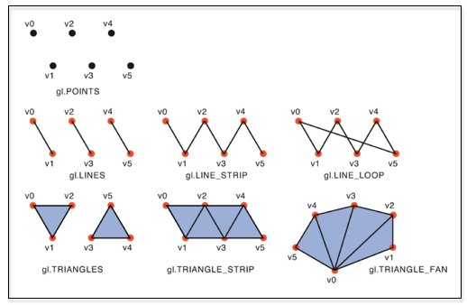
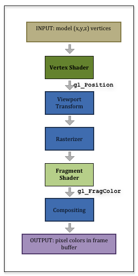

..  Copyright (C)  Wayne Brown
    Permission is granted to copy, distribute
    and/or modify this document under the terms of the GNU Free Documentation
    License, Version 1.3 or any later version published by the Free Software
    Foundation; with Invariant Sections being Forward, Prefaces, and
    Contributor List, no Front-Cover Texts, and no Back-Cover Texts.  A copy of
    the license is included in the section entitled "GNU Free Documentation
    License".

5.2 - A Primer on Shaders
:::::::::::::::::::::::::

The Big Picture
---------------

Chapter 12 of this textbook will cover the GL Shader Language (GLSL) in detail.
However, to perform basic rendering your need to understand a few basic GLSL
language details.

Shader programs work on individual vertices and individual fragments, one vertex
and one fragment at a time. You don't have control over calling the shader
programs. They are called automatically by the graphics pipeline.

Before a shader can be used, you have to get a model's data into a GPU
*vertex object buffer*, which is just a contiguous block of memory that the
GPU can directly access without using the computer's system bus. A *vertex object buffer*
must be organized as an array, where data can be accessed using an *index*
to get sequential values out of the array. A model's data is ideally
copied to a *vertex object buffer* only once as a pre-processing step. The number
of *vertex object buffers* you create will be dependant on how you organize the
data of your models. We will start with simple examples that store vertex attribute
data for a single model in a single *vertex object buffer*.

To render a model, your Javascript code will tell a shader program which
*vertex object buffer* to use for its data source. When your JavaScript
program calls :code:`gl.drawArrays(mode, first, count)`, the graphics
pipeline will retreive vertices starting at the :code:`array[first]` vertex
and render :code:`count` vertices from the array. If you made the function call
:code:`gl.drawArrays(mode, 5, 10)`, it would render the vertices in
array locations :code:`[5]` to :code:`[14]`. (Array indexes are always
zero subscripted.)

  Drawing modes (`1`_)

The :code:`mode` parameter to the :code:`gl.drawArrays` function will
determine how the vertices are used to
render elements. The possible drawing modes are shown in the diagram to the right.

A *vertex shader* will perform identical calculations on each
vertex it retrieves from the *vertex object buffer*. Each execution of the vertex shader
is a unique run-time instance. You can't
set a variable in one execution and expect the variable to have that value
in the next run-time instance.

The purpose of a *vertex shader* is to assign a special variable called :code:`gl_Position`
a vector of 4 values, (x,y,z,w). This value is passed on to the next stage of the pipeline.
(Wow this is strange! This might not make
much sense until you see more concrete examples. But keep reading!)

The output, :code:`gl_Position`, of a vertex shader is passed to the "Viewport
Transformation" stage. This converts the
vertex's position to a pixel location in the rendered image. This pixel location (and its
associated rendering data) is passed to the next stage - the "Rasterizer".
This stage determines the pixels that an object covers. This varies based
on whether the vertex is part of a point, a line, or a triangle. The "rasterizer"
makes a list of all the pixels that need to colored to represent the object
and then passes each pixel and its associated rendering data to your *fragment shader*.
Remember that a pixel and its associated rendering data is called a *fragment*.

The purpose of a *fragment shader* is to assign an RGBA color value to a special variable
called :code:`gl_FragColor`. This color is passed on to the "Composting" stage
of the graphics pipeline and the color value is used to update the raster image
that is being created.

Let's summarize! Your *vertex shader* will position the vertices
of a model. Then your *fragment shader* will assign a color to all of the pixels
that are "covered" by the graphics primitve (point, line, or triangle).
It's that simple, or that complex, depending on your perspective.
Please pause and study the diagram of the graphics pipeline to the right.

Fragments
---------

Just to make things clear:

* A *vertex shader* must set the value of one variable: :code:`gl_Position`
* A *fragment shader* must set the value of one variable: :code:`gl_FragColor`

But what is passed between stages in the pipeline is more than just these values.
*Vertex shaders* and *fragment shaders* share variables on a vertex
basis. So a *vertex shader* will typically associate a color and other information
with the :code:`gl_Position` value. This information is passed on the next stage
of the graphics pipeline.

Shader Language Variables
-------------------------

GLSL is a strongly typed language. All variables must be declared before they
are used. Variable declarations have three parts: "Storage Qualifier," "data type,"
and "variable name."

The "Storage Qualifier" determines how a value changes during a call to :code:`gl.drawArrays()`,

+-------------------+--------------------------------------------------------------------------------------------+
+ :code:`uniform`   + A data value that is the same for an entire execution of :code:`gl.drawArrays()`.          +
+-------------------+--------------------------------------------------------------------------------------------+
+ :code:`attribute` + A data value that changes for every vertex of an execution of :code:`gl.drawArrays()`.     +
+-------------------+--------------------------------------------------------------------------------------------+
+ :code:`varying`   + A data value that changes for every *fragment* of an execution of :code:`gl.drawArrays()`. +
+-------------------+--------------------------------------------------------------------------------------------+

The "data type" determines the type of data a variable holds. There are many data types. For now,
we will restrict ourselves to the following:

+---------------+----------------------------------------------------------+
+ :code:`int`   + A signed integer.                                        +
+---------------+----------------------------------------------------------+
+ :code:`float` + A fractional number; approximately 7 digits of accuracy. +
+---------------+----------------------------------------------------------+
+ :code:`vec3`  + A vector of 3 floating point numbers.                    +
+---------------+----------------------------------------------------------+
+ :code:`vec4`  + A vector of 4 floating point numbers.                    +
+---------------+----------------------------------------------------------+
+ :code:`mat4`  + A 4x4 matrix of floating point numbers. (16 values)      +
+---------------+----------------------------------------------------------+

Variable names start with a letter or underscore (_) and contain only letters, digits, and the
underscore character. Variable names are case sensitive. A common convention,
is to start :code:`uniform` variables with a :code:`u_`, :code:`attribute` variables with
a :code:`a_`, and :code:`varying` variables with a :code:`v_`, but these prefixes have no special
meaning to GLSL.

Execution of a shader program always starts with the :code:`main()` function.
You can implement as many sub-functions as your shader logic needs.

Variables declared outside of the :code:`main()` function have global scope.
If a variable by the same name is declared as global in both a *vertex shader*
and a *fragment shader* it is the same variable.
Any variables declared inside a function have local scope and local lifetime.

Note that JavaScript and GLSL are very different languages and you will have
to keep their syntax and semantics separated.

All of these issues will make much more sense as we work through examples.
If example shaders have extra verbiage that we have not discussed yet, just
ignore it for now. The "extra stuff" will be explained in Chapter 12.

The Simplest Shaders Possible
-----------------------------

Below is perhaps the simplest, functional shader programs possible. The
vertex and fragment shader programs must be stored separately
because they are compiled separately and then linked into a single *shader program*.
The syntax is closely aligned with the C programming language for
function definitions, assignment statements, if statements, and loops. What is
very different from the C language is the build-in data types, the casting
of values into different data types, and the built-in vector and matrix operators.

Below is a very simple *vertex shader*, which transforms each vertex by a 4x4
transformation matrix, :code:`u_Transform`.

.. Code-block:: C

  // Vertex Shader
  uniform   mat4 u_Transform;
  uniform   vec4 u_Color;

  attribute vec3 a_Vertex;

  void main() {
    // Transform the location of the vertex
    gl_Position = u_Transform * vec4(a_Vertex, 1.0);
  }

Below is a very simple *fragment shader*, which sets every pixel to the same color.

.. Code-block:: C

  // Fragment shader
  uniform vec4 u_Color;

  void main() {
    gl_FragColor = u_Color;
  }

Glossary
--------

.. glossary::

  GL Shader Language (GLSL)
    a computer programming language that can be compiled into GPU commands.

  vertex shader
    a computer program written in GLSL that positions the geometry of models in a scene.

  fragment shader
    a computer program written in GLSL that assigns a color to the pixels that compose a point, line or triangle.

  pixel
    a single color value in a raster image.

  fragment
    a group of data values used to calculate the color for an individual pixel.

  :code:`gl`
    the typical name of the JavaScript object that holds a WebGL context for a canvas. All WebGL
    functionality is accessed through this object.

  storage qualifier
    defines how a value is used in the GPU. For a single rendering execution created
    by calling :code:`gl.drawArrays()`, :code:`uniform` values remain constant,
    :code:`attibute` values change for every vertex, and :code:`varying` values
    change for every pixel.

  data type
    defines how the bits stored in memory are interpreted and what operations
    are valid on the bits.

  variable
    a memory location that stores a value and that can be referenced using an identifier.
    It is called a "variable" because its contents can change while a program is executing.

Self-Assessments
----------------

.. mchoice:: 5.2.1
  :random:
  :answer_a: Points.
  :answer_b: Lines.
  :answer_c: Triangles.
  :answer_d: Polygons.
  :correct: a,b,c
  :feedback_a: Correct.
  :feedback_b: Correct.
  :feedback_c: Correct.
  :feedback_d: Incorrect. Arbitrary polygons with more than 3 edges can not be rendered.

  :code:`gl.drawArrays()` can render which types of graphics primitives? (Select all that apply.)

.. mchoice:: 5.2.2
  :random:
  :answer_a: Three.
  :answer_b: Six.
  :answer_c: Ten.
  :answer_d: Sixteen.
  :correct: a
  :feedback_a: Correct. It uses 6 vertices to draw 3 lines.
  :feedback_b: Incorrect.
  :feedback_c: Incorrect.
  :feedback_d: Incorrect.

  :code:`gl.drawArrays(gl.LINES, 10, 6)` would render how many lines?

.. mchoice:: 5.2.3
  :random:
  :answer_a: Two.
  :answer_b: Six.
  :answer_c: One hundred.
  :answer_d: One hundred and six.
  :correct: a
  :feedback_a: Correct. It uses 6 vertices to draw 2 triangles.
  :feedback_b: Incorrect.
  :feedback_c: Incorrect.
  :feedback_d: Incorrect.

  :code:`gl.drawArrays(gl.TRIANGLES, 100, 6)` would render how many triangles?

.. mchoice:: 5.2.4
  :random:
  :answer_a: gl_Position.
  :answer_b: gl_FragColor.
  :answer_c: gl_Location.
  :answer_d: gl_Vertex_shader.
  :correct: a
  :feedback_a: Correct. This is the location of the vertex in the scene.
  :feedback_b: Incorrect.
  :feedback_c: Incorrect.
  :feedback_d: Incorrect.

  A vertex shader must always set an appropriate value to what special GLSL variable?

.. mchoice:: 5.2.5
  :random:
  :answer_a: gl_FragColor.
  :answer_b: gl_Position.
  :answer_c: gl_Location.
  :answer_d: gl_Fragment_shader
  :correct: a
  :feedback_a: Correct. This is the color of the fragment.
  :feedback_b: Incorrect.
  :feedback_c: Incorrect.
  :feedback_d: Incorrect.

  A fragment shader must always set an appropriate value to what special GLSL variable?

.. mchoice:: 5.2.6
  :random:
  :answer_a: u_Transform.
  :answer_b: u_Color.
  :answer_c: a_Vertex.
  :answer_d: v_Temp.
  :correct: a,b
  :feedback_a: Correct.
  :feedback_b: Correct.
  :feedback_c: Incorrect. This is an attribute variable that changes for each vertex.
  :feedback_d: Incorrect. THere is no variable in the programs called v_Temp.

  Referring to the "Simplest Shaders Possible" examples above, which GLSL variables
  have the same value for an entire execution of :code:`gl.drawArrays()`? (Select all that apply.)

.. index:: GL Shader Language, GLSL, vertex shader, fragment shader, pixel, fragment,
  gl, storage qualifier, data type, variable

.. _1: http://www.informit.com/articles/article.aspx?p=2111395&seqNum=2
