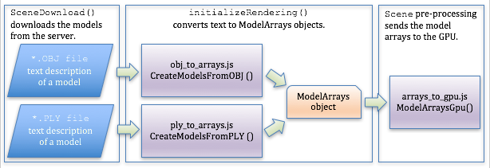

..  Copyright (C)  Wayne Brown
  Permission is granted to copy, distribute
  and/or modify this document under the terms of the GNU Free Documentation
  License, Version 1.3 or any later version published by the Free Software
  Foundation; with Invariant Sections being Forward, Prefaces, and
  Contributor List, no Front-Cover Texts, and no Back-Cover Texts.  A copy of
  the license is included in the section entitled "GNU Free Documentation
  License".

5.10 - Converting OBJ Model Data to Buffer Objects
::::::::::::::::::::::::::::::::::::::::::::::::::

Speed vs. Memory
----------------

Building complex models for WebGL programs is typically done using modeling tools
such as Blender. However, getting a model from Blender into a WebGL application
is non-trivial. You can use the JavaScript class described below to convert
an OBJ model file into WebGL arrays suitable for GPU *buffer objects*.

You have two fundamental choices when you organize the data of a model for
rendering.

.. |br| raw:: html

    

#. Optimize for speed.

   * How:

     * Minimize the number of WebGL Javascript commands issued
       to render a model.
     * Minimize context switching as you render a scene.
     * Render an entire model (or multiple models) using one call
       to :code:`gl.drawArrays()`.

   * Implications:

     * Everything is rendered using :code:`gl.TRIANGLE` mode.
     * All data a *shader program* needs is in *buffer objects* organized by vertices.
     * A single shader program is used to render an entire model (or scene).
     * Model data will be duplicated for individual vertices resulting in
       very large *buffer objects*. |br|

#. Minimize memory usage.

   * How:

     * Use :code:`gl.TRIANGLE_FAN` and/or :code:`gl.TRIANGLE_STRIP` as often
       as possible to render collections of triangles.
     * Use :code:`uniform` variables in your *vertex shader* programs for
       values that are constant for multiple triangles.

   * Implications:

     * Many calls to WebGL Javascript commands.
     * Many calls to :code:`gl.drawArrays()`.
     * Many context switches.
     * Rendering will be slower.

It is impossible to organize model data to get fast rendering and efficient
memory usage at the same time. You have to make trade-offs based on the
application you are creating.

:code:`function createModelsFromOBJ()`
--------------------------------------

The JavaScript file :code:`obj_to_arrays.js` contains functions that will
convert a model defined in an
:code:`*.obj` data file into a set of 1D arrays suitable for *buffer objects*.
The function :code:`CreateModelsFromOBJ`, (see function prototype below), receives
the text description of one or more models, along with a set of material
property definitions, and returns an array of :code:`ModelArrays` objects.

.. Code-Block:: JavaScript

  /**------------------------------------------------------------------------
   * Given an OBJ text model description, convert the data into 1D arrays
   * that can be rendered in WebGL.
   * @param model_description {string} The entire text from an OBJ file.
   * @param materials_dictionary {object} of {ModelMaterial} objects.
   * @param out {ConsoleMessages} Displays output messages.
   * @return {object} An array of {ModelArrays} objects accessible by name or index.
   */
  function CreateModelsFromOBJ(model_description, materials_dictionary, out) {

The arrays in an :code:`ModelArrays` object are optimizes for fast rendering, **not**
for efficient memory usage. The buffers are organized by :code:`gl.drawArrays()`
rendering modes.

* A :code:`ModelArrays` object contains 3 sub-objects:

  * :code:`PointsData` object, which can be rendered using :code:`gl.POINTS` mode.

    * :code:`vertices` 1D array: :code:`[x1,y1,z1, x2,y2,z2, ...]`
    * :code:`colors` 1D array:  :code:`[r1,g1,b1,a1, r2,g2,b2,a2 ...]`
    * :code:`ModelMaterial` object for all points.

  * :code:`LinesData` object, which can be rendered using :code:`gl.LINES` mode.

    * :code:`vertices` 1D array: :code:`[x1,y1,z1, x2,y2,z2, ...]`
    * :code:`colors` 1D array:  :code:`[r1,g1,b1,a1, r2,g2,b2,a2 ...]`
    * :code:`textures` 1D array:  :code:`[t1, t2, t3, ...]`
    * :code:`ModelMaterial` object for all lines.

  * :code:`TriangleData` object, which can be rendered using :code:`gl.TRIANGLES` mode.

    * :code:`vertices` 1D array: :code:`[x1,y1,z1, x2,y2,z2, ...]`
    * :code:`colors` 1D array:  :code:`[r1,g1,b1,a1, r2,g2,b2,a2 ...]`
    * :code:`flat_normals` vector 1D array: :code:`[dx1,dy1,dz1, dx2,dy2,dz2, ...]`
    * :code:`smooth_normals` vector 1D array: :code:`[dx1,dy1,dz1, dx2,dy2,dz2, ...]`
    * :code:`textures` 1D array:  :code:`[s1,t1, s2,t2, ...]`
    * :code:`ModelMaterial` object for all triangles.

Note the following about arrays in a :code:`ModelArrays` object:

* If the OBJ file contains normal vectors, the vectors from the file are used.
* If the OBJ file contains no normal vector information:

  * If a face is marked as "smooth" by a ':code:`s on`' line in the data file,
    then the normal vector for a vertex is calculated as an average of the
    normal vectors of the triangle faces that uses that vertex.
  * If a face is marked as "flat" by a ':code:`s off`' line in the data file,
    then the normal vector for a vertex is the face's normal vector.

* If the file contains no texture coordinates, the texture coordinates array
  will be empty.
* The color of a vertex is the :code:`Kd` value of the active material
  property, which comes from a \*.mtl file. The
  :code:`Kd` value is the
  diffuse color of the material's properties.
  It is assumed for this textbook that **all** of the elements in a
  model will use the **same** ambient, specular, specular highlight, and other
  material properties. If you use these properties in your *shader
  programs* they can be set as :code:`uniform` values in your shaders. If
  any of the material properties change from vertex to vertex, and you
  want to use them as :code:`attributes` in your shader program, you would
  need to modify the :code:`CreateModelsFromOBJ` code to create an
  appropriate 1D array for the values.

The object returned by the :code:`CreateModelsFromOBJ` function
contains one or more models. The models can be accessed "by name" or by
array indexes. To access the models as an array:

.. Code-Block:: JavaScript

  // Create ModelArrays objects from the obj data
  models = createModelsFromOBJ(obj_text, obj_materials, out);

  // Access the models by array index
  for (j = 0; j < models.number_models; j += 1) {
    one_model = models[j];

    // Do something with one_model
  }

If you know the exact name of your models, you can access them using those
names. The "name" of a model comes from the name you assigned
a set of geometry in Blender. The object return by the :code:`CreateModelsFromOBJ` function
has properties using those names. Suppose you named your models "Bear", "Monkey",
and "Goat". You can access the individual models using those names like this:

.. Code-Block:: JavaScript

  // Create ModelArrays objects from the obj data
  models = createModelsFromOBJ(obj_text, obj_materials, out);

  models.Bear
  models.Monkey
  models.Goat

:code:`function createModelsFromPLY()`
--------------------------------------

The JavaScript file :code:`ply_to_arrays.js` contains functions that will
convert a model defined in a
:code:`*.ply` data file into a set of 1D arrays suitable for *buffer objects*.
The function :code:`CreateModelsFromPLY` receives
the text description of a model and returns an array containing one
:code:`ModelArrays` object.

.. Code-Block:: JavaScript

  /** -------------------------------------------------------------------------
   * Given an PLY text model description, convert the data into 1D arrays
   * that can be rendered in WebGL.
   * @param filename {string} The model filename, without its file extension.
   * @param model_description {string} Contains the PLY model data as text.
   * @param out {ConsoleMessages} Displays output messages.
   * @return {array} An array of 1 ModelArrays object accessible by name or index.
   */
  function CreateModelFromPLY(filename, model_description, out) {

Model Data into GPU
-------------------

Both functions, :code:`CreateModelsFromOBJ` and `CreateModelsFromPLY`, return data that is
in :code:`Float32Arrays` ready to be copied to GPU *object buffers*. A function,
:code:`ModelArraysGPU`, in the javascript file :code:`model_arrays_gpu.js`, creates
*object buffers* on the GPU and copies the arrays from a model into the buffers.
This copies **all the data** from the OBJ and PLY files into object buffers, which
may waste memory on data you don't need. In any case, in this code, you have examples of how
to get model data that started as text into GPU *object buffers*.

  Processing Model Data

To render a model, what you need to implement is the shader programs and the
Javascript code that sets :code:`uniform` variables, links :code:`attribute`
variables to *object buffers*, and calls :code:`gl.drawArrays()`.

OBJ Model Data Demo
-------------------

The code in :code:`obj_to_arrays.js` can be studied in the following WebGL program.
You don't need to fully understand the code, but you should get an overall idea of
what the code is accomplishing which is:

* The text from an :code:`.obj` file which contains the description of one or more
  models is sent to the :code:`CreateModelsFromOBJ` function.
* The function returns an array of :code:`ModelArrays` objects. Each
  :code:`ModelArrays` object contains a set of 1D arrays containing the model data
  organized by vertices. These arrays are ready to be put into GPU *buffer objects*
  and then linked to *shader program* variables for rendering.

The graphics for the WebGL program below uses concepts we have not studied yet,
but it demonstrates how the same data can be used to render vastly different graphics.
The data is critical to the rendering process, but the "magic" happens in the
shader programs.

.. webglinteractive:: W1
  :htmlprogram: _static/05_shaders_examples/shader_examples.html
  :editlist: _static/05_shaders_examples/shader_examples_scene.js
  :hideoutput:
  :width: 300
  :height: 300

Conclusion
----------

This concludes the lessons on rendering. We will discuss *shader programs*
again in chapters 9, 10, & 11 because all surface materials and lighting
effects are done in *shader programs*.

.. index:: OBJ to arrays, CreateModelsFromOBJ, CreateModelsFromPLY, ModelArraysGPU

