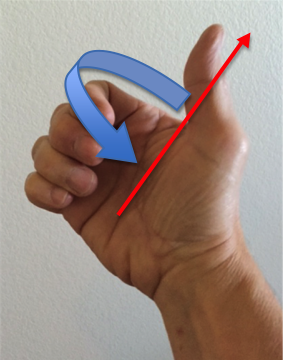

..  Copyright (C)  Wayne Brown
  Permission is granted to copy, distribute
  and/or modify this document under the terms of the GNU Free Documentation
  License, Version 1.3 or any later version published by the Free Software
  Foundation; with Invariant Sections being Forward, Prefaces, and
  Contributor List, no Front-Cover Texts, and no Back-Cover Texts.  A copy of
  the license is included in the section entitled "GNU Free Documentation
  License".

6.4 - Rotating
::::::::::::::

Rotating a model changes a model's orientation. In addition, if the model
is away from the origin, the model's location changes.
Mathematically, a rotation requires that all three components be involved
in the calculation of each component's transformed value. The component values are
inner-connected for rotation. For example, for translation and scaling,
the value of *y* does not affect the values of *x* or *z*. This is not
true for rotation. The value of y can affect the rotated value of *x* and/or *z*.
Each component of a rotated vertex is a combination of some fraction
of the original vertex's components. If we use *f1*, *f2*, *f3*, *f4*,
*f5*, *f6*, *f7*, *f8* and *f9* to represent
a set of fractions, then rotation is calculated as:

.. code:: JavaScript

  x' = x*f1 + y*f2 + z*f3;
  y' = x*f4 + y*f5 + z*f6;
  z' = x*f7 + y*f8 + z*f9;

The fractions *f1*, *f2*, *f3*, *f4*, *f5*, *f6*, *f7*, *f8* and *f9* must
be specifically chosen to produce circular motion.

It is very important to understand that you are always rotating about
something. That is, you always have a point and a line of reference about
which you are creating a circular motion. A circle always has a center
point. In addition, a circle always lies in a flat plane. A flat plane
can be defined by a normal vector to the surface of the plane.
Therefore, a rotation always has an axis of rotation, which is the normal
vector to the plane that contains the circle.
Since all translation and
scaling are relative to a coordinate system, it makes sense that
all rotations are relative to that same coordinate system. The following
mathematics is developed assuming that rotations are always about the
origin. We can develop the general equations for rotation by starting
with simple cases and then work toward more complex cases.

Angles have a direction. For example, you can rotate 45 degrees or -45
degrees. So which way is positive rotation and which way is negative? To
be consistent with a right-handed coordinate system we
use the "right hand rule" for determining direction of rotation. Using your
right hand, extend your thumb away from your other fingers. Your thumb
represents the axis of rotation. The curl of your fingers represents
positive rotation, as shown in the image. (If you used a left-handed
coordinate system you would do the same thing -- except with your left hand.)

Angles always are relative to something. Angles must have a line of
reference that defines an angle of zero. The axes of the coordinate system
are natural reference lines. Therefore,

* zero degrees about the Z axis is defined as the X axis.
* zero degrees about the X axis is defined as the Y axis.
* zero degrees about the Y axis is defines as the Z axis.

Using these conventions, notice that a 90 degree rotation about any of the
coordinate axes will take one of the axes to the location of another axis.

* 90 degrees rotation about Z maps X to Y
* 90 degrees rotation about X maps Y to Z
* 90 degrees rotation about Y maps Z to X

These are all just conventions that we agree upon, but the conventions form
a very nice, consistent, and uniform system for rotations.

Special Cases and Effects
-------------------------

Let's look at three specific cases -- rotation about each of the coordinate
system axes. Then we will use those special cases to develop rotation about
any axis. Please study and experiment with the following examples. Click
and drag your mouse cursor inside a canvas to get various views of the
3D world.

#. Rotation about the Z axis.

   First, notice that when you rotate a model about the z axis, the z
   component of every vertex remains unchanged; only the x and
   y components change. Also notice that when you rotate
   90 degrees about the z axis, the x axis becomes the y axis. So at 90
   degrees, the x component becomes the y component and the y component
   becomes the -x component. Because the rotation forms a circle, the
   *sine* and *cosine* of the angle of rotation provides us with the fractions
   we need in our combination of values.
   `The calculations can easily be shown to be`_:

   .. code:: JavaScript

     x' = x * cos(angle) + y * -sin(angle);
     y' = x * sin(angle) + y *  cos(angle);
     z' = z;

   .. webgldemo:: W1
     :htmlprogram: _static/06_example06/rotate_about_z.html

#. Rotation about the X axis.

   This case is similar to the rotation about the z axis, but now the x
   component of every vertex remains unchanged; only the y and
   z components need to be changed. Again, because the rotation forms
   a circle, the *sine* and *cosine* of the angle of rotation provides us with
   the fractions we need:

   .. code:: JavaScript

     x' = x;
     y' = y * cos(angle) + z * -sin(angle);
     z' = y * sin(angle) + z *  cos(angle);

   .. webgldemo:: W2
      :htmlprogram: _static/06_example07/rotate_about_x.html

#. Rotation about the Y axis.

   Hopefully you see the pattern! A rotation about the Y axis does not
   change the y components of the vertices, but the x and z components
   change according to the angle of rotation.

   .. code:: JavaScript

     x' = x *  cos(angle) + z * sin(angle);
     y' = y;
     z' = x * -sin(angle) + z * cos(angle);

   .. webgldemo:: W3
      :htmlprogram: _static/06_example08/rotate_about_y.html

#. Un-doing rotations.

   A rotation can be "un-done" by rotating about the same axis but in
   the negative direction. For example, if you rotate a model 34 degrees
   about the X axis, then to put the model back where it was, rotate
   -34 degrees about the X axis.

Rotation about any axis
-----------------------

We can use the three rotations above to calculate the rotation about
any arbitrary axis. Given an axis of rotation, <ux, uy, uz>, the logic
goes like this:

* Rotate about Z to place <ux, uy, uz> in the Z-X plane. Let's call this new vector <ux', uy', uz'>.
* Then rotate about Y to place <ux', uy', uz'> along the Z axis.
* Then rotate about Z the desired angle.
* Then undo the rotation about Y that places <ux', uy', uz'> back to its original location.
* Then undo the rotation about Z that places <ux, uy, uz> back in its original location.

This series of rotations will appear to a user as circular rotation
about the axis <ux, uy, uz>. Pretty cool!

Combining the 5 rotations into a single set of equations is straightforward
but tedious. Giving you the exact equations without the development behind
them would be more confusing than helpful. So we will skip the rotation
equations for now. More details can be found on this Wikipedia page on `rotations`_.

.. webgldemo:: W4
  :htmlprogram: _static/06_example09/rotate_about_axis.html

Glossary
--------

.. glossary::

  rotate
    Change the orientation of a model. If the model is not centered at the origin,
    rotation also changes location.

Self Assessment
---------------

.. mchoice:: 6.4.1
  :random:
  :answer_a: orientation
  :answer_b: location
  :answer_c: size
  :answer_d: color
  :correct: a,b
  :feedback_a: Correct. Rotation fundamentally changes a model's orientation.
  :feedback_b: Correct. Rotation that is not centered at the origin will move the location of a model.
  :feedback_c: Incorrect.
  :feedback_d: Incorrect.

  Rotating a model that is not centered at the origin modifies which properties of the model? (Select all that apply.)

.. mchoice:: 6.4.2
  :random:
  :answer_a: x component
  :answer_b: y component
  :answer_c: z component
  :answer_d: w component
  :correct: a
  :feedback_a: Correct. Only the Y and Z components change.
  :feedback_b: Incorrect.
  :feedback_c: Incorrect.
  :feedback_d: Incorrect.

  Rotating a model about the X axis leaves which model vertex components unchanged?

.. mchoice:: 6.4.3
  :random:
  :answer_a: in the direction of the global -X axis.
  :answer_b: in the direction of the global +X axis.
  :answer_c: in the direction of the global -Y axis.
  :answer_d: in the direction of the global +Z axis.
  :correct: a
  :feedback_a: Correct. Put your thumb along the Y axis and your fingers curl toward the X axis. Going -90 degrees goes in the opposite direction of the X axis.
  :feedback_b: Incorrect.
  :feedback_c: Incorrect.
  :feedback_d: Incorrect.

  By convention, we use the "right-hand-rule" for determining which direction is positive rotation.
  Therefore, rotating -90 degrees about the Y axis moves the Z axis where?

.. index:: rotate, rotation, axis of rotation.

.. _rotations: https://en.wikipedia.org/wiki/Rotation_matrix
.. _The calculations can easily be shown to be: ../appendices/rotation_equations.html

