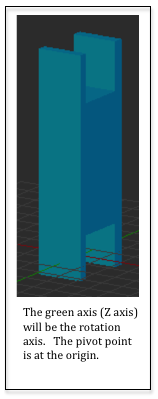

..  Copyright (C)  Wayne Brown
  Permission is granted to copy, distribute
  and/or modify this document under the terms of the GNU Free Documentation
  License, Version 1.3 or any later version published by the Free Software
  Foundation; with Invariant Sections being Forward, Prefaces, and
  Contributor List, no Front-Cover Texts, and no Back-Cover Texts.  A copy of
  the license is included in the section entitled "GNU Free Documentation
  License".

.. role:: raw-html(raw)
  :format: html

6.8 - Chaining Transformations - Adding a Forearm
:::::::::::::::::::::::::::::::::::::::::::::::::

  Forearm Model :raw-html:`&nbsp;&nbsp;`

The previous lesson demonstrated the initialization and use of
matrix transforms. This lesson will demonstrate how to chain transforms
together to produce complex motion.

A Robot Arm - The forearm
-------------------------

The previous demo rendered an object that represents the base of a robot
arm. Let's add a "forearm" linkage to the base. The forearm will pivot
about the red pin in the base. For the forearm to pivot, its axis of
rotation needs to be at the origin, so we design the model in Blender and
place the position where the red pin will go through the forearm at the
origin.
This will be true of all the models you create. You design them so that
they can be easily scaled and rotated about their *local origin*. Then the
models can be moved to their desired location in a scene.

For the forearm, we want it to pivot about the red pin in the base. Since
rotation is always about an axis, the rotation needs to come first. Then
the arm can be moved to the location of the pin. Using a right-to-left
ordering of the transformations, we have:

.. matrixeq:: Eq1

  [M1: modelTransform] = [M2: translateToPin]*[M3: rotateForearm]

But wait. The base is spinning. So we can't simply move the forearm to the
base. The same rotation that is happening to the base needs to happen to
the forearm. So we apply the base rotation to the forearm as well, but **after**
it has been rotated and translated. So our modelTransform looks like this:

.. matrixeq:: Eq2

  [M4: modelTransform] = [M1: baseRotation]*[M2: translateToPin]*[M3: rotateForearm]

WebGL Program Example
---------------------

The WebGL program below is a modified version of the code from the previous
lesson. It adds a forearm model to the robot arm. We need two new
transform matrices to manipulate the forearm. One transform will rotate
the arm about the base's pin. The rotation will possibly change on each new
frame, so this matrix will be created in the initialization code but
assigned its value in the frame rendering function. The translation matrix
can be create and assigned its value once, since the distance to the pivot
pin is constant and never changes. Study the example code and then
review the code description below. If you want to experiment, the
:code:`robot_forearm_scene.js` code is modifiable.

.. webglinteractive:: W1
  :htmlprogram: _static/06_robot2/robot_forearm.html
  :editlist: _static/06_robot2/robot_forearm_scene.js
  :hideoutput:
  :width: 300
  :height: 300

.. tabbed:: program_descriptions

  .. tab:: Initialization

    Concerning the pre-processing actions that happen once when the constructor code
    is executed:

    +-----------+--------------------------------------------------------------------------+
    + Lines     + Description                                                              +
    +===========+==========================================================================+
    + 63-64     + Two new transforms are created to manipulate the forearm.                +
    +-----------+--------------------------------------------------------------------------+
    + 156       + The translation for the forearm is set to a constant 2 units along Y.    +
    +-----------+--------------------------------------------------------------------------+
    + 69        + A public class variable, :code:`self.forearm_angle`, is created to store +
    +           + the angle of the forearm. It is made public so the HTML slider event     +
    +           + handler can change its value.                                            +
    +-----------+--------------------------------------------------------------------------+
    + 152-153   + *Buffer objects* in the GPU are created and the model data is copied     +
    +           + to the GPU for the forearm model.                                        +
    +-----------+--------------------------------------------------------------------------+

  .. tab:: Rendering a Single Frame

    Each time the scene needs to rendered, the :code:`render` function in lines
    75-100 is called. This function is identical to the previous demo version with the
    following exceptions:

    +----------+--------------------------------------------------------------------------+
    + Lines    + Description                                                              +
    +==========+==========================================================================+
    + 92       + The rotation matrix for the forearm is set because the rotation of the   +
    +          + forearm can change on each frame.                                        +
    +----------+--------------------------------------------------------------------------+
    + 95-96    + The transform for the forearm is calculated. Notice that the base        +
    +          + rotation is included. Also notice the ordering of the transforms from    +
    +          + right to left. The order of the transforms is critical.                  +
    +----------+--------------------------------------------------------------------------+
    + 99       + The forearm model is rendered using the calculated transform.            +
    +----------+--------------------------------------------------------------------------+

Glossary
--------

.. glossary::

  chaining transformations
    A series of transformations that create complex motion.

Self Assessment
---------------

.. mchoice:: 6.8.1
  :random:
  :answer_a: So the event object can access and modify it.
  :answer_b: Because all variables in a class should be public by default.
  :answer_c: So the forearm can be rotated by the render function.
  :answer_d: Because public variables make debugging easier.
  :correct: a
  :feedback_a: Correct. The event handler in the event object modifies the angle based on changes to the slider bar.
  :feedback_b: Incorrect. Limiting public variables makes debugging easier.
  :feedback_c: Incorrect. All variables, both public and private, are accessible to the render function.
  :feedback_d: Incorrect. Limiting public variables makes debugging easier.

  Why was the angle for rotating the forearm made a public class variable?

.. mchoice:: 6.8.2
  :random:
  :answer_a: A transformation matrix for vertices should always include a projection, camera, and model transforms.
  :answer_b: It wasn't really necessary, but done for consistency.
  :answer_c: So the code would not be confusing.
  :correct: a
  :feedback_a: Correct. Always include all three transformations for a vertex shader program transform.
  :feedback_b: Incorrect.
  :feedback_c: Incorrect. The transformations are required.

  Why was the :code:`projection` and :code:`camera` transformations included for both the base and the forearm transformations?

.. mchoice:: 6.8.3
  :random:
  :answer_a: The forearm does not rotate with the base about the Y axis.
  :answer_b: It works fine!
  :answer_c: The forearm does not rotate with the base about the Z axis.
  :answer_d: The forearm rotates in the opposite direction.
  :correct: a
  :feedback_a: Correct.
  :feedback_b: Incorrect.
  :feedback_c: Incorrect.
  :feedback_d: Incorrect.

  If the base rotation matrix was not included in the transformation for the forearm rendering,
  what would be the visual result? (Hint: Modify the code to see!)

.. index:: chaining transformations