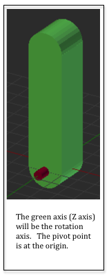

..  Copyright (C)  Wayne Brown
  Permission is granted to copy, distribute
  and/or modify this document under the terms of the GNU Free Documentation
  License, Version 1.3 or any later version published by the Free Software
  Foundation; with Invariant Sections being Forward, Prefaces, and
  Contributor List, no Front-Cover Texts, and no Back-Cover Texts.  A copy of
  the license is included in the section entitled "GNU Free Documentation
  License".

.. role:: raw-html(raw)
  :format: html

6.9 - Chaining Transformations - Adding an Upper Arm
::::::::::::::::::::::::::::::::::::::::::::::::::::

  Robot Upper-arm Model

The previous lesson demonstrated a robot arm with one linkage.
This lesson will demonstrate how to chain transforms
together to add a second linkage.

A Robot Arm - The Upper Arm
---------------------------

The upper arm of our robot is created in Blender and its *local origin*
is set at (0,0,0) so that it can be easily rotated. It's axis of rotation
is the Z axis. Examine the image of the upper arm to the right.

The upper arm will pivot about the end of the forearm. But rotation is about
the origin. We need to rotate the upper arm about the origin, and then
move it to the end of the forearm. But the forearm is rotating, as well
as the base. So how do we get the upper arm to the right place? We use
the transforms that are positioning the forearm! Here's the transforms
we need to apply to the upper arm, in this order:

#. Rotate it to a desired angle about its red pin.
#. Translate it to the end of the forearm.
#. Rotate it based on the forearm's angle.
#. Translate it to the base's red pin.
#. Rotate it according to the base's rotation angle.

The transformation for the upper arm needs to be the following:

.. matrixeq:: Eq2

  [M6: modelTransform] = [M1: baseRotation]*[M2: translateToPin]*[M3: rotateForearm]*[M4: translateToForearmEnd]*[M5: rotateUpperarm]

Hopefully you are seeing a pattern here!

Scene Rendering Initialization
------------------------------

The demo program below is a modified version of the code from the previous
lesson. It adds an "upper arm" model to the robot arm. We need two new
transform matrices to manipulate the upper arm. One transform will rotate
the arm about it's pivot pin. The rotation will possibly change on each new
frame, so this matrix will be created in the initialization code but
assigned its value in the frame rendering function. The translation matrix
can be create and assigned its value once, since the distance to the end
of the forearm is a constant and never changes. Study the example code and then
review the code description below. If you want to experiment, the demo
code is modifiable.

.. webglinteractive:: W1
  :htmlprogram: _static/06_robot3/robot_upperarm.html
  :editlist: _static/06_robot3/robot_upperarm_scene.js
  :hideoutput:
  :width: 300
  :height: 300

.. tabbed:: program_descriptions

  .. tab:: Initialization

    Concerning the pre-processing actions that happen once when the constructor code
    is executed:

    +-----------+--------------------------------------------------------------------------+
    + Line(s)   + Description                                                              +
    +===========+==========================================================================+
    + 67-68     + Two new transforms are created to manipulate the upper arm.              +
    +-----------+--------------------------------------------------------------------------+
    + 175       + The translation for the upper arm is set to a constant 8 units along Y.  +
    +-----------+--------------------------------------------------------------------------+
    + 74        + A public class variable, :code:`self.upperarm_angle`, is created to      +
    +           + store the angle of the upper arm. It is                                  +
    +           + made public so the HTML slider event handler can change its value.       +
    +-----------+--------------------------------------------------------------------------+
    + 170-171   + *Buffer objects* in the GPU are created and the model data is copied     +
    +           + to the GPU for the upper arm model.                                      +
    +-----------+--------------------------------------------------------------------------+

  .. tab:: Rendering a single frame

    Each time the scene needs to be rendered, the :code:`render` function in lines
    80-115 is called. This function is identical to the previous demo version with the
    following exceptions:

    +-----------+--------------------------------------------------------------------------+
    + Line(s)   + Description                                                              +
    +===========+==========================================================================+
    + 107       + The rotation matrix for the upper arm is set because the rotation of the +
    +           + forearm can change on each frame.                                        +
    +-----------+--------------------------------------------------------------------------+
    + 110-111   + The transform for the upper arm is calculated. Notice that the base      +
    +           + rotation and the forearm transforms are included. Also notice the        +
    +           + ordering of the transforms from right to left. The order of the          +
    +           + transforms is critical.                                                  +
    +-----------+--------------------------------------------------------------------------+
    + 114       + The upper arm model is rendered using the calculated transform.          +
    +-----------+--------------------------------------------------------------------------+

Self Assessment
---------------

.. mchoice:: 6.9.1
  :random:
  :answer_a: Doing the matrix multiplications in JavaScript means they are done only once per model.
  :answer_b: If the matrices were multiplied in a vertex shader, the multiplications would be done for every vertex!
  :answer_c: This is a good idea and should be done.
  :answer_d: Because you couldn't get all the matrices into the shader program.
  :correct: a,b
  :feedback_a: Correct.
  :feedback_b: Correct. If your model had 1000 vertices, you would be performing 7000 matrix multiplications.
  :feedback_c: Incorrect.
  :feedback_d: Incorrect. You could have 7 uniform variables, one for each matrix, but copying data from the CPU RAM into the GPU can slow rendering down.

  The transformation matrix that transforms the upper arm is calculated using seven matrices.
  You could pass all seven matrices to a *vertex shader* and let the GPU calculate the combined
  transformation matrix. Besides, the GPU is very fast at computations! Why is this a bad idea?
  (Select all that apply.)

.. mchoice:: 6.9.2
  :random:
  :answer_a: Two
  :answer_b: Three
  :answer_c: One
  :answer_d: Five
  :correct: a
  :feedback_a: Correct. One transformation for the rotate of the linkage, and one to translate it to the end of the 2nd linkage.
  :feedback_b: Incorrect.
  :feedback_c: Incorrect.
  :feedback_d: Incorrect.

  You want to modify the example WebGL program to add a 3\ :sup:`rd` linkage to the robot
  that has one degree of rotation from the end of the 2\ :sup:`nd` linkage. How many new
  transformation matrices do you need to create?

