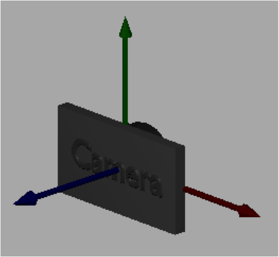

..  Copyright (C)  Wayne Brown
  Permission is granted to copy, distribute
  and/or modify this document under the terms of the GNU Free Documentation
  License, Version 1.3 or any later version published by the Free Software
  Foundation; with Invariant Sections being Forward, Prefaces, and
  Contributor List, no Front-Cover Texts, and no Back-Cover Texts.  A copy of
  the license is included in the section entitled "GNU Free Documentation
  License".

.. role:: raw-html(raw)
  :format: html

7.1 - Introduction to Cameras
:::::::::::::::::::::::::::::

  Camera Coordinate System :raw-html:`&nbsp;&nbsp;&nbsp;&nbsp;&nbsp;&nbsp;&nbsp;&nbsp;&nbsp;&nbsp;&nbsp;&nbsp;`

We would like to move around a virtual scene and view it from
various vantage points, just as you would using a
real world camera. In the real world a scene remains stationary while a
person takes pictures by moving to various vantage points.
But it turns out that in a virtual world it is more mathematically
efficient to keep the camera stationary and move the scene in front of the
camera. And it turns out that we can move the entire scene in front of the
camera quite easily.

Our virtual camera will be located at the global origin and
oriented to look down the -Z axis, with the Y axis pointing up and the
X axis pointing to the camera's right. The camera will always be in this
position and orientation. Our discussion of cameras focuses on
how to get a desired view of a scene in front of a stationary camera.

Camera Motion vs. Scene Motion
------------------------------

A person uses the relationship between the foreground and background to
unconsciously determine whether they are moving or the objects around them are
moving. Pretend that your eye is the camera and that you are traveling in a
car. Objects close to you, like a building along the road, move quickly through
your field of view and the landscape in the distance also moves, but more
slowly. The fact that both the close objects and the distant objects are
moving is your visual cue that the camera (which is you) is moving.
If you stop your car and watch the other cars go by, what changes is that
the background becomes completely stationary. The difference in movement
between the foreground and the background allows your mind to
discern whether you are moving or stationary.
For this reason when we move a scene
in front of a camera it is important that everything in the scene, including
the background, be moved.

Animations are created by changing the location and orientation of objects
in a scene over time, or by changing the location and orientation of the
camera that is viewing the scene, or by moving both the objects and the camera.
If you hold the objects stationary and move the camera, the motion required
is opposite of that required if you hold the camera stationary and move the objects.
For example, consider an object that you want to move from left to right in front of
a camera. If the camera is in the default position and orientation looking
down the -Z axis, the object needs to be translated alone the X axis from say
-5 to +5. However, that same motion could be produced by moving the camera
from right to left, say from +5 to -5. If there is nothing in the background,
it would be impossible to know whether the camera or the object was moving,
or if both were moving. Therefore, be aware that the motion of objects and the motion of a camera
are opposites for visually identical motions. So when you move objects
around in a scene, you think in terms of the object's coordinate system. But
when you move the camera, you need to think in terms of the camera's
coordinate system.

A Camera Definition
-------------------

To define a camera we need a position and an orientation. We typically call the position
of the camera the "eye" position and we define its location using
a global point :code:`(eye_x, eye_y, eye_z)`. The orientation of a camera is best defined
by three orthogonal axes that define a local, right-handed coordinate system. To keep
these axes separate from the global x, y and z coordinate axes, let's use
the names *u*, *v*, and *n*. (The names are arbitrary and you will find different
notations for the camera axes as you search the web.) If a camera is
located at the origin looking down the -Z axis, then *u* would align with
the x axis, *v* would align with the y axis, and *n* would align with the z axis.
This is summarized in the following notation, where the symbol "\ :code:`-->`\ " means "maps to".

.. code:: JavaScript

   u --> x
   v --> y
   n --> z

We can specify a camera using the 12 values shown below, which define one
global point and three vectors.

.. Code-block:: JavaScript

   eye = (eye_x, eye_y, eye_z)  // the location of the camera
   u = <ux, uy, uz>             // vector pointing to the right of the camera
   v = <vx, vy, vz>             // vector pointing up from the camera
   n = <nx, ny, nz>             // vector pointing backwards; <-n> is forward

The values must define each camera axis such that it has a 90-degree angle
to the other two axes and the axes form a right-handed coordinate system.
Mathematically, the following must be true for a valid, right-handed camera
coordinate system. To simplify the math, we always store the axes as unit
vectors. Remember that the order of vectors in a *cross product* matters. If
you were to switch the order of the vectors below, you would not get the
correct results.

.. Code-block:: JavaScript

   dot_product(u,v) === 0    // cos(90) == 0
   dot_product(v,n) === 0    // cos(90) == 0
   dot_product(n,u) === 0    // cos(90) == 0
   cross_product(u,v) === n
   cross_product(v,n) === u
   cross_product(n,u) === v

Specifying a Virtual Camera
---------------------------

It is difficult for programmers to define a camera orientation using three
normalized vectors that designate a right-handed coordinate system.
Therefore, we typically define a camera in more natural terms and
let the computer calculate the camera coordinate system. A straightforward
description of a camera can be achieved using two points and a single vector
like this:

\1. Specify the **location** of the camera.

* This actually gives us two values -- the *eye* location and a reference
  point to form the camera's coordinate system axes.

\2. Specify a **location** the camera is looking at.

* This value can be any point that is in front of the camera along it's
  line-of-sight. It's exact location along the line-of-sight
  does not matter. This point defines the direction of the *<-n>* axis.
  Since we normalize the coordinate system axes to unit length, the
  direction of this vector is the only thing we care about.
* It is your responsibility as the programmer to make sure that this point
  and the eye location form a vector. If the two points are at the same
  location, the *<-n>* axis will not be a valid vector and it is impossible
  to define the camera's coordinate system.

\3. Specify a **vector** in the general direction of "up" for the camera.

* This vector does not have to be precise. The typical
  value is <0,1,0>, which is pointing in the Y axis direction.
* The *cross product* of this vector and the negation of the line-of-sight
  vector will produce the *u* axis of the camera's coordinate system.
* If the "up" vector is exactly along the camera's line of sight, the *cross
  product* calculation will fail and the camera coordinate system will not
  be valid. It is your responsibility as the programmer to make sure the line-of-sight
  vector and the "up vector" do not point in the same direction.
* The last axis of the camera's coordinate system, *v*, which points
  directly "up" from the camera is calculated by taking the *cross product*
  of the *n* and *u* vectors.

Based on these ideas, the Javascript :code:`GlMatrix4x4` class contains
the following function:

.. Code-Block:: JavaScript

  /** -----------------------------------------------------------------
   * Set a camera matrix.
   * @param M {Float32Array} The matrix to contain the camera transformation.
   * @param eye_x {number} The x component of the eye point.
   * @param eye_y {number} The y component of the eye point.
   * @param eye_z {number} The z component of the eye point.
   * @param center_x {number} The x component of a point being looked at.
   * @param center_y {number} The y component of a point being looked at.
   * @param center_z {number} The z component of a point being looked at.
   * @param up_dx {number} The x component of a vector in the up direction.
   * @param up_dy {number} The y component of a vector in the up direction.
   * @param up_dz {number} The z component of a vector in the up direction.
   */
  self.lookAt = function (M, eye_x, eye_y, eye_z,
                             center_x, center_y, center_z,
                             up_dx, up_dy, up_dz) {

The following demonstration allows you to change these parameters and
immediately see the results. Experiment with the parameters until you are
comfortable with how they change the camera view.

Please note the following:

* The **eye** location is at the center of the camera.
* The **center** location starts at the origin, which is also the
  center of the widget. The **center** location is visible when it is
  not inside the widget. Note how the camera is always pointed at this location.
* The **<up vector>** is drawn as a black line segment.
* Mouse drags will allow you to get different views of the left canvas window.
* The scenes are rendered in perspective mode so you can sense depth.

.. webgldemo:: W1
  :htmlprogram: _static/07_camera_lookat/camera_lookat.html

Camera Errors
-------------

An invalid camera definition will produce unpredictable rendering output.
We have already discussed the conditions that will create errors in a camera,
but it is very important that you include tests in your code to avoid these
potential errors. A camera calculated using the :code:`lookat()` function
will be **invalid** if:

* The "eye" and "center" point are the same location.
* The "up vector" has the same direction as the line-of-sight (which is a vector
  between the "eye" and the "center" point). For this case, the "same direction"
  includes both positive and negative directions. Stated mathematically,
  if the *sine* of the angle
  between the "up vector" and the line-of-sight vector is zero, which
  happens if the angle between the vectors is 0 or 180, the camera definition will fail.

Glossary
--------

.. glossary::

  virtual camera
    Defines a position and orientation from which to view a scene.

  camera coordinate system
    Three orthogonal axes that form a right-handed coordinate system. Each
    axis is defined as a vector in global coordinates.

  eye
    The 3D location of a camera defined in global coordinates.

  camera center point
    The 3D location that a camera is pointed towards. This point will always
    be rendered exactly in the center of the output image.

  camera up vector
    A 3D vector that points in the general direction of "up" from the camera.
    The exact direction of "up" for the camera is calculated from the *u* and *n* vectors.

Self Assessment
---------------

.. mchoice:: 7.1.1
  :random:
  :answer_a: The background is stationary.
  :answer_b: The background is moving.
  :answer_c: The relative position and orientation of the models is changing.
  :answer_d: It is impossible to know if the camera is stationary.
  :correct: a
  :feedback_a: Correct. Since the background is not moving, the camera is stationary.
  :feedback_b: Incorrect. If the camera is stationary, the background does not move.
  :feedback_c: Incorrect. This can be caused by camera movement or by model movement.
  :feedback_d: Incorrect. If the camera is stationary, the background does not move.

  Motion in a scene can be created by moving the models, moving the camera, or both.
  How can you recognize when a scene's camera is stationary and the models are moving?

.. mchoice:: 7.1.2
  :random:
  :answer_a: A location and three orthogonal vectors.
  :answer_b: Four locations.
  :answer_c: Four vectors.
  :answer_d: Three orthogonal vectors.
  :correct: a
  :feedback_a: Correct. It specifies where the camera is and its orientation.
  :feedback_b: Incorrect. Perhaps a camera definition could be derived from the four points, but not defined by the values themselves.
  :feedback_c: Incorrect. Perhaps a camera definition could be derived from the four vectors, but not defined by the values themselves.
  :feedback_d: Incorrect. This could define the camera's orientation, but we need a location as well.

  What is needed to mathematically define a virtual camera?

.. mchoice:: 7.1.3
  :random:
  :answer_a: Two locations and one vector.
  :answer_b: Three locations.
  :answer_c: Three vectors.
  :answer_d: Two orthogonal vectors and two points.
  :correct: a
  :feedback_a: Correct. It specifies where the camera is and its orientation.
  :feedback_b: Incorrect. Perhaps a camera definition could be derived from the three points, but not from the values themselves.
  :feedback_c: Incorrect. Perhaps a camera definition could be derived from the three vectors, but not from the values themselves.
  :feedback_d: Incorrect. Perhaps a camera definition could be derived from the vectors and points, but not from the values themselves.

  What does the :code:`lookat` function need to know to derive a virtual camera definition?

.. mchoice:: 7.1.4
  :random:
  :answer_a: The eye and center point are at the same location.
  :answer_b: The up vector is parallel to the line-of-sight vector.
  :answer_c: The eye is at the origin.
  :answer_d: The up vector is parallel with the Z axis.
  :correct: a,b
  :feedback_a: Correct. If the eye and center point are the same, the line-of-sight vector they are meant to define can't be calculated.
  :feedback_b: Correct. If the up vector and the line-of-sight vector have the same direction, their cross-product will calculate an invalid vector.
  :feedback_c: Incorrect. The eye location can be anywhere, as long as the eye and center locations define a valid line-of-sight vector.
  :feedback_d: Incorrect. The up vector can be in any direction, as long as it is not the same as the line-of-sight.

  Which of the following will define an invalid camera? (Select all that apply.)

.. index:: virtual camera, camera coordinate system, eye, camera center point, camera up vector
