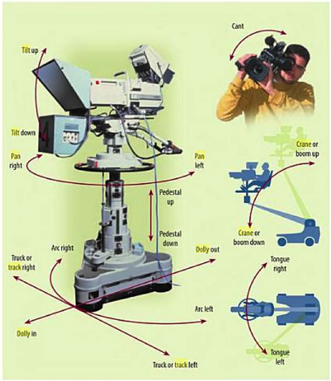

..  Copyright (C)  Wayne Brown
   Permission is granted to copy, distribute
   and/or modify this document under the terms of the GNU Free Documentation
   License, Version 1.3 or any later version published by the Free Software
   Foundation; with Invariant Sections being Forward, Prefaces, and
   Contributor List, no Front-Cover Texts, and no Back-Cover Texts.  A copy of
   the license is included in the section entitled "GNU Free Documentation
   License".

7.3 - Camera Movement
:::::::::::::::::::::

3D computer graphics animations almost always involve the movement of
a virtual camera. This lesson discusses camera motion. First, let's
distinguish between a "camera shot" and a "camera movement".

A camera shot is how a scene appears in a single frame of an animation.
Common "camera shots" (`1`_) are:

* **full shot** - shows the entire object or human figure and is usually
  intended to place it in some relation to its surroundings.
* **medium shot** - shows only a part of an object or human figure.
* **close-up** - shows a specific part of an object or human figure, such as a person's head.
* **over the shoulder** - focuses on an object while looking "over the shoulder" of a closer object.
* etc.

Composing shots that hold a viewer's interest is a critical part of animation design
and is fundamental to the art of film making.

But what we want to discuss is *camera movement*. If you abruptly move a
camera from one view to a totally different view it is called a "cut". A
"cut" is straightforward. You simply define a new camera position and
orientation. What is harder is smooth, continuous motion from a camera's
current location and orientation to a new location and/or orientation. This
type of camera movement is critical to all animations.

Common Camera Movements
-----------------------

The following diagram from the *Television Production Handbook*, page 141,
shows the common names assigned to various camera movements.
In the real world a camera can't jump to a new location; it has to move from
its current location. Therefore camera motion is described relative to
the camera's current location and coordinate system. Study the diagram and
then the descriptions of various camera motions.

* **Tilt** rotates a camera’s view up or down. You can **tilt up**
  or **tilt down**. This rotates about a camera's :code:`u` axis.
* **Pan** rotates the camera’s view horizontally about the camera's
  eye location. You can **pan left** or **pan right**. This rotates about
  a camera's :code:`v` axis.
* **Cant** tilts a camera sideways while maintaining its location
  and viewing direction. You can **cant left** and **cant right**. This is a
  rotation about a camera's :code:`n` axis.
* **Truck** moves a camera’s location laterally (left or right)
  while the camera’s direction of view is unchanged.
  You can **truck left** or **truck right**. This is a translation along
  a camera's :code:`u` axis.
* **Pedestal** elevates or lowers a camera on its stand. You can
  **pedestal up** and **pedestal down**. This is a translation along a camera's
  :code:`v` axis.
* **Dolly** moves a camera closer to, or further from, the location
  it is looking at. You can **dolly in** and **dolly out**. This is a translation
  along a camera's :code:`n` axis.
* **Arc** moves a camera in a circular path while maintaining
  the object it is looking at in the center of its view. You can **arc left**
  and **arc right**. This is a rotation about a vector in the direction of
  a camera's :code:`v` axis with the center of rotation at a camera's **center point**.

If you have a more sophisticated base for your camera, you can:

* **Tongue** rotates a camera right or left on the end of a fixed
  boom. This is a rotation about a camera's :code:`v` axis, where the :code:`v` axis is
  centered at the base of the boom.
* **Crane** rotates a camera up or down on the end of a fixed
  boom. This is a rotation about a camera's :code:`u` axis, where the axis is
  centered at the base of the boom.

Let's summarize these camera movements based on which part of the camera
definition they manipulate.

+--------------+-----------+-----------+-----------+-----------+-----------+
+ Movement     +    eye    +  center   +   <u>     +   <v>     +    <n>    +
+==============+===========+===========+===========+===========+===========+
+ **Tilt**     + pivot     +           + rotate    +           +           +
+--------------+-----------+-----------+-----------+-----------+-----------+
+ **Pan**      + pivot     +           +           + rotate    +           +
+--------------+-----------+-----------+-----------+-----------+-----------+
+ **Cant**     + pivot     +           +           +           + rotate    +
+--------------+-----------+-----------+-----------+-----------+-----------+
+ **Truck**    +           +           + translate +           +           +
+--------------+-----------+-----------+-----------+-----------+-----------+
+ **Pedestal** +           +           +           + translate +           +
+--------------+-----------+-----------+-----------+-----------+-----------+
+ **Dolly**    +           +           +           +           + translate +
+--------------+-----------+-----------+-----------+-----------+-----------+
+ **Arc**      +           + pivot     +           + rotate    +           +
+--------------+-----------+-----------+-----------+-----------+-----------+

The above movements can be combined to create complex
camera motions. For example, you could **pan** and **tilt** at the same time.
(There are 232 possible motions if you consider all possible combinations
of the seven basic movements.)

The camera motion names allow people in the industry to communicate clearly
about how a camera might be moved. Note that all of these camera movements
are relative to the camera itself; it is not required that a camera be
mounted on a camera stand. Even if your camera is mounted on a drone,
these camera motions are valid and relevant.

Camera Motions using :code:`lookat`
-----------------------------------

If we used the :code:`lookat` function described in the previous two lessons to
build a camera transform, what values must change for each camera movement?
The :code:`lookat` function required 3 elements: an eye
location, a center location, and an "up" vector.

+--------------+--------------+-----------------------+----------------------+
+ Movement     + eye changes? + center point changes? + "up" vector changes? +
+==============+==============+=======================+======================+
+ **Tilt**     + no           + yes                   + no (but maybe)       +
+--------------+--------------+-----------------------+----------------------+
+ **Pan**      + no           + yes                   + no                   +
+--------------+--------------+-----------------------+----------------------+
+ **Cant**     + no           + no                    + yes                  +
+--------------+--------------+-----------------------+----------------------+
+ **Truck**    + yes          + yes                   + no                   +
+--------------+--------------+-----------------------+----------------------+
+ **Pedestal** + yes          + yes                   + no                   +
+--------------+--------------+-----------------------+----------------------+
+ **Dolly**    + yes          + no (but maybe)        + no                   +
+--------------+--------------+-----------------------+----------------------+
+ **Arc**      + yes          + no (but maybe)        + no                   +
+--------------+--------------+-----------------------+----------------------+

Therefore, you can move a camera by re-calculating the appropriate parameters
to :code:`lookat` and then call the function again. While this is true, you have
to remember that you are working in 3-dimensional space and that each
camera motion is relative to the camera's current orientation. For example,
if a camera's :code:`u` axis is currently <0,-1,0>, which is pointing down along the
-Y axis, if you **truck right** for this camera you will be moving along the
-Y axis. **Camera motion is always relative to the current camera!**

Before we write code to move a camera we need a way to calculate locations
along a path of motion. That's our next lesson.

Glossary
--------

.. glossary::

  camera shot
    Describes what is visible in a single frame of an animation.

  camera movement
    Describes how a camera moves from its current location and orientation
    to a new location and/or orientation during a sequence of frames.

Self Assessment
---------------

.. mchoice:: 7.3.1
  :random:
  :answer_a: dolly
  :answer_b: truck
  :answer_c: tilt
  :answer_d: cant
  :correct: a
  :feedback_a: Correct. It would be a "dolly-in".
  :feedback_b: Incorrect. This would have moved the camera to its right or left.
  :feedback_c: Incorrect. This would have rotated the camera up or down.
  :feedback_d: Incorrect. This would have twisted the orientation of the camera.

  Suppose you have a camera that is facing a model in a scene and you want to move
  the camera closer to the model. This would be a ______________ camera movement.

.. mchoice:: 7.3.2
  :random:
  :answer_a: the eye location
  :answer_b: the center location
  :answer_c: the up vector
  :correct: a
  :feedback_a: Correct. You need to change the location of the camera.
  :feedback_b: Incorrect. Assuming the center point was already at the center of the model you are trying to circle around.
  :feedback_c: Incorrect. Typically you would not modify the orientation of the camera as you are "circling" -- but you could.

  If you wanted to move a camera in a circular arc around a model, keeping the model
  in the center of view, which parameters of the :code:`lookat` function would
  you need to modify?

.. mchoice:: 7.3.3
  :random:
  :answer_a: (3, 4, 7)
  :answer_b: (5, 4, 5)
  :answer_c: (3, 6, 5)
  :answer_d: (3, 4, 3)
  :correct: a
  :feedback_a: Correct. The camera would move to its right, which is along the <0,0,1> axis, so you add 2 units to the z coordinate.
  :feedback_b: Incorrect. You need to move along the camera's "to the right" axis.
  :feedback_c: Incorrect. You need to move along the camera's "to the right" axis.
  :feedback_d: Incorrect. You need to move along the camera's "to the right" axis.

  You have a camera that is located at :code:`(3, 4, 5)` and whose orientation is
  defined by the vectors: :code:`u = <0,0,1>`, :code:`v = <0,1,0>`, and :code:`n = <1,0,0>`.
  (The camera is looking down a vector parallel to the -X axis.) If you "truck right"
  two units, what would be the location of the camera?

.. index:: camera shot, camera movement, pan, tilt, pedestal, dolly, truck, arc, cant, tongue, crane

.. _1: https://en.wikipedia.org/wiki/Shot_(filmmaking)