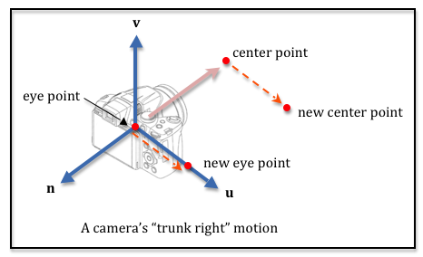

..  Copyright (C)  Wayne Brown
  Permission is granted to copy, distribute
  and/or modify this document under the terms of the GNU Free Documentation
  License, Version 1.3 or any later version published by the Free Software
  Foundation; with Invariant Sections being Forward, Prefaces, and
  Contributor List, no Front-Cover Texts, and no Back-Cover Texts.  A copy of
  the license is included in the section entitled "GNU Free Documentation
  License".

7.4 - Moving a Camera (e.g. truck)
::::::::::::::::::::::::::::::::::

In the previous lesson we discussed how a camera moves. Some movements
require translation, some movements require rotation, and some movements require
both. This lesson focuses on **translating** a camera. Remember that
almost all camera motion is relative to the camera's frame of reference.

Truck Motion
------------

To **truck** a camera means you move a camera’s location laterally (left or right)
while the camera’s direction of view remains unchanged. You can **truck left**
or **truck right**. This is a translation along a camera's :code:`u` axis.

There are two basic ways to implement a **truck** camera motion:

* Modify the parameters of a call to the :code:`lookat` function and then
  call :code:`lookat` to create a camera transformation matrix, or
* Directly modify the definition of a camera's position and coordinate axes.

Let's solve the problem both ways.

Use :code:`lookat` Parameters
-----------------------------

The function :code:`LookAt` requires two points and one vector to set a camera
transformation matrix. Specifically, it needs 1) the location of the camera,
2) the location of a point along it's line-of-sight, and 3) what direction is upwards.
A **truck** movement will obviously change the **eye** location of the camera.
But the orientation of the camera must not change, so the **center** point needs to move
as well. Both points need to move along a path defined by the camera's :code:`u`
local coordinate system axis. The diagram illustrates a **truck** movement.

A **truck** function should allow for the distance of the truck motion
to be specified as a parameter. If the distance is positive,
the function should "truck right", which will move
the camera in the direction of the :code:`+u` axis. If the distance is
negative, the function should "truck left" , which will move
the camera in the direction of the :code:`-u` axis.  The function must change the
location of both the **eye** and the **center** points. The basic steps are:

* Calculate the camera's *u* axis.
* Using a unit vector in the *u* axis direction, scale the vector by the
  move distance and then add this vector to both the **eye** and the
  **center** points.

The demo code below defines a :code:`LookAtCamera` class that contains an
**eye point**, a **center point**, and an **up vector**,
along with a function called :code:`truck` that will change them for a
"truck" camera motion. Please do the following:

* Manipulate the controls in the demo to move the virtual camera to various
  locations and orientations and then hit the "truck" button(s) repeatedly to
  "truck" the camera. Notice how the motion is relative to the camera's
  frame of reference.
* Study the code in the :code:`LookAtCamera` class. (The demo code is
  editable if you want to experiment with the code.)

.. webglinteractive:: W1
  :htmlprogram: _static/07_camera_truck/camera_truck.html
  :editlist: _static/07_camera_truck/lookat_camera.js
  :hideoutput:
  :width: 200
  :height: 200
  :width2: 120
  :height2: 120

.. tabbed:: program_descriptions

  .. tab:: The LookAtCamera class

    The :code:`constructor` of the class creates the values needed to store a camera's
    representation. It also creates instances
    of the :code:`GlMatrix4x4`, :code:`GlPoint3`, and
    :code:`GlVector3` classes so they are available for the
    processing in the :code:`truck` function. You only need to create these objects
    once and then re-use them as needed.

    The :code:`eye`, :code:`center`, and :code:`up_vector` are created as public variables
    so they can be manipulated by the event handlers. If you wanted to use better
    software engineering design, you could make these private variables of the class
    and only allow their manipulation through "getter" and "setter" functions.

  .. tab:: The truck function

    The :code:`truck` function uses the
    functionality in the :code:`GlPoint3` and :code:`GlVector3`
    classes to simplify the addition, subtraction, and scaling of points and
    vectors. Open these code files in your browser's debugger if you are confused
    about what they are doing.

    The code comments are critical to understanding
    the code. Make sure you read the comments and compare them to the above diagram
    of a "truck" motion.

Modify A Camera's Definition
----------------------------

Let's manipulate a camera using its basic definition: a location and three
coordinate axes. We define a class called :code:`AxesCamera` that stores
the following data about a camera:

.. Code-Block:: JavaScript

  // Camera definition at the default camera location and orientation.
  self.eye = P.create(0, 0, 0);  // (x,y,z), origin
  self.u   = V.create(1, 0, 0);  // <dx,dy,dz>, +X axis
  self.v   = V.create(0, 1, 0);  // <dx,dy,dz>, +Y axis
  self.n   = V.create(0, 0, 1);  // <dx,dy,dz>, +Z axis

Notice that the **eye** value stores a camera's location, while the three
vectors store a camera's orientation. If we don't change the three vectors,
the camera's orientation will be unchanged. Therefore, to perform a
**trucking** camera movement we only need to modify the **eye** value.
A new version of our :code:`truck` function looks like this:

.. Code-Block:: JavaScript

  function Truck(distance) {
    // Scale the u axis to the desired distance to move
    V.scale(u_scaled, self.u, distance);

    // Add the direction vector to the eye position.
    P.addVector(self.eye, self.eye, u_scaled);

    // Set the camera transformation. Since the only change is in location,
    // change only the values in the 4th column.
    self.transform[12] = -V.dotProduct(self.u, self.eye);
    self.transform[13] = -V.dotProduct(self.v, self.eye);
    self.transform[14] = -V.dotProduct(self.n, self.eye);
  }

You can experiment with this version of the code using the following demo.

.. webglinteractive:: W2
  :htmlprogram: _static/07_camera_truck2/camera_truck2.html
  :editlist: _static/07_camera_truck2/axes_camera.js
  :hideoutput:
  :width: 200
  :height: 200
  :width2: 120
  :height2: 120

Again note that camera motion is relative to the camera's current orientation.

Summary
-------

A camera movement that involves translation of a camera's position follows
a direction specified by one of the camera's coordinate axes. If a camera
is **trucked**, it follows the :code:`u` axis. If a camera is **pedestaled**,
it follows the :code:`v` axis. And, if a camera is **dollied**, it follows the
:code:`n` axis.

Manipulating the actual camera definition (a point and 3 axes) requires
less computation but more mathematical understanding of the camera matrix
transform.

Glossary
--------

.. glossary::

  truck a camera
    Move a camera to **its** left or right, keeping its orientation unchanged.

  pedestal a camera
    Move a camera "up" or "down" from its current location, keeping its
    orientation unchanged. ("Up" and "down" are in quotes because they are
    relative directions based on a camera's orientation.)

  dolly a camera
    Move a camera into or out-from its current line-of-sight, keeping its
    orientation unchanged.

Self Assessment
---------------

.. mchoice:: 7.4.1
  :random:
  :answer_a: eye and center points
  :answer_b: eye and up vector
  :answer_c: center point and up vector
  :answer_d: up vector only
  :correct: a
  :feedback_a: Correct. The two points that define the camera's line-of-sight.
  :feedback_b: Incorrect. A truck movement does not change the camera's orientation.
  :feedback_c: Incorrect. A truck movement does not change the camera's orientation.
  :feedback_d: Incorrect. A truck movement does not change the camera's orientation.

  To perform a **truck** camera movement, which parameters of the :code:`lookAt`
  function must be changed?

.. mchoice:: 7.4.2
  :random:
  :answer_a: u axis
  :answer_b: v axis
  :answer_c: n axis
  :correct: a
  :feedback_a: Correct. You are moving "left" or "right" from the camera's current orientation.
  :feedback_b: Incorrect. Moving along the v axis would be a pedestal motion.
  :feedback_c: Incorrect. Moving along the n axis would be a dolly motion.

  To perform a **truck** camera movement, which camera axis must you follow?

.. mchoice:: 7.4.3
  :random:
  :answer_a: the eye location
  :answer_b: all three local coordinate system camera axes
  :answer_c: the u axis of the camera's local coordinate system
  :answer_d: the n axis of the camera's local coordinate system
  :correct: a
  :feedback_a: Correct. The camera's orientation does not change, only its location.
  :feedback_b: Incorrect. The camera's orientation does not change.
  :feedback_c: Incorrect. The camera's orientation does not change.
  :feedback_d: Incorrect. The camera's orientation does not change.

  If you perform a **truck** camera movement by manipulating the single point and
  the three axes that define the camera, which values must change?

.. index:: truck, pedestal, dolly
