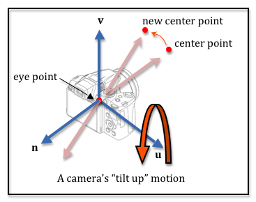

..  Copyright (C)  Wayne Brown
  Permission is granted to copy, distribute
  and/or modify this document under the terms of the GNU Free Documentation
  License, Version 1.3 or any later version published by the Free Software
  Foundation; with Invariant Sections being Forward, Prefaces, and
  Contributor List, no Front-Cover Texts, and no Back-Cover Texts.  A copy of
  the license is included in the section entitled "GNU Free Documentation
  License".

7.5 - Rotating a Camera (e.g., tilt)
::::::::::::::::::::::::::::::::::::

This lesson discusses how to **rotate** a camera's orientation. Remember that
almost all camera motion is relative to the camera's current frame of reference.

Tilt Motion
-----------

To **tilt** a camera means you rotate a camera’s orientation around its
*u* axis. You can **tilt up** (positive rotation) or **tilt down**
(negative rotation).

As in the previous lesson, there are two basic ways to implement a **tilt**
camera motion:

* Modify the parameters of a call to the :code:`lookat` function and then
  call :code:`lookat` to create a camera transformation matrix, or
* Directly modify the definition of a camera's position and coordinate axes.

Let's solve the problem both ways.

Use :code:`lookAt` to Tilt
--------------------------

In the previous lesson you studied a class called :code:`LookAtCamera` which
defines a camera using two points and one vector: 1) the location of the camera,
2) the location of a point along it's line-of-sight, and 3) a direction that is
upwards. To "tilt" a camera, we add a new function to the :code:`LookAtCamera`
class called :code:`tilt`.

A **tilt** movement must change the **center point**.
We need to rotate the location of the **center point** about the camera's
:code:`u` axis, which will change the line-of-sight of the camera. Remember that
the camera will be invalid if the line-of-sight and the :code:`up-vector` are pointing
in the same direction. Therefore, if the angle between the line-of-sight vector and
the :code:`up-vector` gets small, we need to rotate the :code:`up-vector` to keep it
away from the line-of-sight vector. The diagram illustrates a **tilt** movement.

The **tilt** function receives an angle, in degrees, which is the amount of rotation.
If the angle is positive, the function will "tilt up".
If the angle is negative, the function will "tilt down".  The basic steps are:

* Calculate the camera's :code:`u` axis.
* Move the camera to the origin. This moves the **eye** point to the origin and it
  moves the **center point** to some location relative to the origin. You
  translate by :code:`(-eye_x, -eye_y, -eye_z)`. This is required because all rotation
  is about the origin.
* Rotate the **center point** about the *u* axis by the angle of tilt.
* Move the camera back to its original location. You translate the
  **center point** by :code:`(eye_x, eye_y, eye_z)`.
* Use the :code:`lookAt` function to recalculate the camera's transformation
  matrix.

Note that all of the above operations need to be performed by 4-by-4
transformation matrices because you are not necessarily working in a plane
that is parallel to the global axes.

Use the following demo to experiment with **tilting** a camera. Notice that **tilting**
is always relative to the camera's frame of reference. The code is editable if you
want to experiment.

.. webglinteractive:: W1
  :htmlprogram: _static/07_camera_tilt/camera_tilt.html
  :editlist: _static/07_camera_tilt/lookat_camera.js
  :width: 200
  :height: 200
  :width2: 120
  :height2: 120
  :hideoutput:

You must study the above code carefully to understand camera movement. Please
don't skip the comment statements as you study the code.

Modify A Camera's Definition
----------------------------

Let's implement the "tilt" motion of a camera using the camera's basic definition:
a location and three coordinate axes. Using the :code:`AxesCamera` class
we introduced in the previous lesson, we can use the :code:`rotateAboutU` function
to implement a tilt motion because that is precisely what a tilt is.
To **tilt** a camera we simply need to rotate the :code:`v` and :code:`n` coordinate
axes about the :code:`u` axis. The **eye** location of the camera does not
change.

Please study the :code:`rotateAboutU` function in the following demo program.
This demo code is editable.

.. webglinteractive:: W2
  :htmlprogram: _static/07_camera_tilt2/camera_tilt2.html
  :editlist: _static/07_camera_tilt2/axes_camera.js
  :hideoutput:
  :width: 200
  :height: 200
  :width2: 120
  :height2: 120

Summary
-------

A camera movement that involves **rotation** will rotate about one
of the current axes of the camera's coordinate system.
If a camera **tilts**, the rotation is about the :code:`u` axis. If
a camera **pans**, the rotation is about the :code:`v` axis. If a
camera **cants**, the rotation is about the :code:`n` axis.
Camera motion is almost always relative to a  camera's current frame of reference.

As in the previous lesson, manipulating the actual camera definition
(a point and 3 axes) requires less computation but more mathematical
understanding of the camera matrix transform.

Glossary
--------

.. glossary::

  tilt camera
    Rotate a camera upwards or downwards, keeping its location unchanged.

  pan camera
    Rotate a camera left or right, keeping its location unchanged.

  cant camera
    Rotate a camera about its line-of-sight, keeping its location unchanged.

Self Assessment
---------------

.. mchoice:: 7.5.1
  :random:
  :answer_a: center point
  :answer_b: eye and up vector
  :answer_c: center point and up vector
  :answer_d: up vector only
  :correct: a
  :feedback_a: Correct. Changing the center point moves the camera's line-of-sight but leaves the position of the camera unchanged.
  :feedback_b: Incorrect. The up-vector does not control the camera's exact orientation.
  :feedback_c: Incorrect. The up-vector does not control the camera's exact orientation, but the center point does.
  :feedback_d: Incorrect. The up-vector does not control the camera's exact orientation.

  To perform a **tilt** camera movement, which parameters of the :code:`lookAt`
  function must be changed?

.. mchoice:: 7.5.2
  :random:
  :answer_a: u axis
  :answer_b: v axis
  :answer_c: n axis
  :correct: a
  :feedback_a: Correct. You are rotating "up" or "down" from the camera's current orientation.
  :feedback_b: Incorrect. Rotating about the v axis would be a pan motion.
  :feedback_c: Incorrect. Rotating along the n axis would be a cant motion.

  To perform a **tilt** camera movement, which camera axis must you rotate about?

.. mchoice:: 7.5.3
  :random:
  :answer_a: sine and cosine are only defined in a plane, but a tilt is relative to a camera's current orientation.
  :answer_b: well, actually you could use normal trig calculations.
  :answer_c: sine and cosine only work in the x-y plane.
  :answer_d: matrix transforms minimize the calculations required.
  :correct: a
  :feedback_a: Correct. The tilt rotation is about an arbitrary axis, not the x, y or z axis.
  :feedback_b: Incorrect. Actually, you can't!
  :feedback_c: Incorrect. Sine and cosine only work in a plane, but are not restricted to the x-y plane.
  :feedback_d: Incorrect. Matrix multiplies are computationally expensive.

  A **tilt** camera movement is a rotation. Why can't we use simple trig functions
  like *sine* and *cosine* to calculate the required modifications to the camera definition?
  Why do we have to use matrix transforms?

.. index:: tilt, pan, cant
