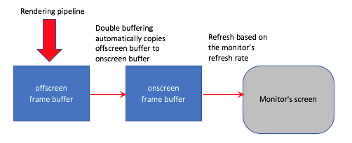

..  Copyright (C)  Wayne Brown
  Permission is granted to copy, distribute
  and/or modify this document under the terms of the GNU Free Documentation
  License, Version 1.3 or any later version published by the Free Software
  Foundation; with Invariant Sections being Forward, Prefaces, and
  Contributor List, no Front-Cover Texts, and no Back-Cover Texts.  A copy of
  the license is included in the section entitled "GNU Free Documentation
  License".

8.1 - Introduction to Animations
::::::::::::::::::::::::::::::::

Hopefully the previous two chapters have taught you how to transform models
and cameras to create a rendering of a virtual scene. Now we need to discuss
how to make models and cameras change over time to create **animations**.

An animation is a series of renderings over a time period. An animation has
a **frame rate** which determines the number of renderings
per second. The human eye has a characteristic called
`persistence of vision`_ which allows a person to see smooth motion of objects
over time -- assuming an animation's *frame rate* is of a sufficient speed.
The required *frame rate* varies based on the lighting conditions of the environment
where the animation is viewed. In a dark environment, such as a movie
theatre, 24 frames per second is typically sufficient to perceive smooth motion.
In environments with more light, such as your home's family room, TV's need
30 frames per second to produce smooth motion. Video with higher frame rates,
called `HFR`_, have recently been produced, such as Peter Jackson's *The Hobbit* film series.

To display an animation each frame is illuminated for a short period of time.
If the time between
frames is not sufficiently small, some people will see a `flicker`_ of light
between frames. To reduce "flicker," the typical TV image is refreshed
60 times per second. In a movie theatre, "flicker" is reduced by displaying
each image of a film twice, which means the display frame-rate of the
movie is 48 frames per second, even though there are only 24 unique images
per second.

Key Frames
----------

The fundamental concept used to create animations is called `key framing`_.
To use **key framing** you assign a starting and ending position, orientation,
and/or size to a camera or a model for a specific range of frames.
Then the computer calculates the intermediate position, orientation,
and/or size for the intermediate frames. The easiest way to interpolate
values between the starting and ending values based on a frame number is
"parametric equations" -- which we will discuss in detail in the next lesson.

.. admonition:: In Summary

  An animation is produced by rendering a series of images at a specific
  frame rate, where the objects and/or the camera has changing over time.

Let's discuss how a computer actually creates a series of scene renderings
that a viewer perceives as a smooth motion animation.

Double Buffering
----------------

If rendering software were to write changes directly to a visible canvas
on the screen, a viewer would be able to see incremental changes in the image
which would distract from the animation. Therefore, WebGL automatically
implements *double buffering*, which always renders graphics into
an **offscreen frame buffer**. What is visible on the screen
is a "second" onscreen frame buffer -- thus the term "double" buffering. Rendering is done
"offscreen" so that the changing of individual pixels is never visible
to a user. The entire offscreen frame buffer can be copied to the onscreen frame
buffer very quickly -- in less than one screen refresh cycle. Therefore, a user
never sees the actual rendering of a frame, only the final results of a rendering.

.. admonition:: Side note:

  OpenGL, from which WebGL is derived, does not perform *double buffering*
  automatically. In OpenGL a programmer must enable and manage *double buffering*
  using calls to the application's window manager software (typically `GLUT`_ or `FreeGLUT`_).

Updating the Screen
-------------------

The screen of your computer monitor is composed of pixels which are small
dots of phosphor that give off light when they are energized. The phosphor
illuminates for a very short period of time
and must be re-energized many times per second to produce a continuous image.
A monitor's `refresh rate`_ is the number of times it re-energized the screen's
pixels per second. The typical *refresh rate* is 60 times per second, but some newer
monitors update at higher frequencies.

When WebGL recognizes that a new rendering has been completed in its offscreen
frame buffer, it copies the contents of the offscreen buffer to the screen's
visible frame buffer. It only performs this copy when the video memory is not
busy with a screen refresh. Therefore, if a screen is being updated 60
times per second, there are 60 possible time spans between screen refreshes
when the visible buffer can be updated. If your WebGL program
can render a new image in less than 1/60\ :sup:`th` of a second, then
your program can be based on a 60 frames/second *frame rate*.
If your rendering process takes longer than 1/60\ :sup:`th` of a second,
then your program will only be able to update the screen every other
refresh cycle, which would give you 30 frames per second. If your render
processing takes more that 2/60\ :sup:`th` of a second, then your program
will only be able to update the screen every 3\ :sup:`rd` refresh cycle.
Hopefully you see a pattern. A WebGL program is typically designed
to animate at a particular frame rate and that frame rate needs to be
a multiple of the monitor's refresh rate. For a 60 Hz screen, the possible
frame rates are 60, 30, 20, 15, 10, 6, 5, 4, 3, 2, and 1.

The :code:`requestAnimationFrame` Function
------------------------------------------

You can create WebGL animations using JavaScript timer events, but timer events
were not designed for animations. For example, what if an animation is
running in a browser tab and the tab gets covered up by another tab or
another application window. A JavaScript timer event will continue to fire
and perform lots of computations for a rendering that can't be seen! Therefore
JavaScript introduced a function specifically for animations called
:code:`requestAnimationFrame(myFunction)`. This function requests that a specific
function be called before the next onscreen buffer refresh, with the
caveat that nothing is done if the WebGL canvas is not visible.

The typical animation function performs the following tasks:

* Calculate the amount of elapsed time since the last frame rendering.
* If it is time to render a new frame:

  * Change appropriate scene variables
  * Render the scene

* Call :code:`requestAnimationFrame` to continue rendering at a future time.

Here is an example animation function.

.. Code-Block:: JavaScript
  :linenos:
  :emphasize-lines: 1-3,28

  let previous_time = 0;
  let frame_rate = 30;  // frames per second
  let milliseconds_between_frames = Math.round( (1 / frame_rate) * 1000 );

  /**----------------------------------------------------------------------
   * Animate a scene.
   */
  self.animate = function () {

    let now, elapsed_time;

    if (scene.animate_active) {

      now = Date.now();
      elapsed_time = now - previous_time;

      if (elapsed_time >= milliseconds_between_frames) {
        // Remember when this scene was rendered.
        previous_time = now;

        // Change the scene
        self.t += dt;

        // Update the screen
        scene.render();
      }

      window.requestAnimationFrame(self.animate);
    }
  };

Please make the following observations about this code:

* The :code:`requestAnimationFrame` sets the callback to the same function it
  is in.
* The :code:`previous_time` variable is declared outside this function so it
  can retain its value from one function call to the next.
* There must be some mechanism for stopping an animation. This code uses
  a value from the scene object called :code:`animate_active`. The animation
  can be stopped by a separate event handler setting this variable to :code:`false`.
* Accurate timing requires that you track time from the **start** of the rendering
  of one frame to the **start** of the next frame. Notice that :code:`Date.now()`
  is called only once and saved in a local variable.
  That local variable is used to update the :code:`previous_time`
  value if a rendering is performed. Only call :code:`Date.now()` once.
* The variable :code:`milliseconds_between_frames` is calculated from
  the *frame rate*. It must be an integer value -- thus the :code:`Math.round()` function
  call. The JavaScript function :code:`Date.now()` returns integer
  time values in millisecond.
* The browser will call :code:`requestAnimationFrame` once per computer
  monitor refresh. For a computer's monitor whose refresh rate is 60 times
  per second, the calls will be 16 or 17 milliseconds apart. The timing
  is not exact due to round-off errors in millisecond precision.

Here is a visual diagram of the concepts we have discussed:

WebGL Example Program
---------------------

Experiment with the following program. You can change the starting and
ending values for the path, along with the starting and ending animation
frame by editing lines 74-76 of :code:`animate_scene.js`.
The :code:`_animate()` function is in lines 171-193 of :code:`animate_events.js`.
You can change the frame rate in line 50 of :code:`animate_events.js`.

.. webglinteractive:: W1
  :htmlprogram: _static/08_animation/animate.html
  :editlist: _static/08_animation/animate_events.js, _static/08_animation/animate_scene.js
  :hideoutput:
  :width: 300
  :height: 300

Glossary
--------

.. glossary::

  frame
    One image, of a series of images, that makes up an animation or video.

  frame rate
    The number of frames per second in an animation.

  refresh rate
    The number of times per second a computer monitor refreshes the color of each
    pixel on its screen. The color values come from a "frame buffer" in video memory.

  Hz
    Hertz; cycles per second; a unit of measurement used to specify *refresh rates*.

  persistence of vision
    A characteristic of the human visual system (eye and brain) that perceives
    smooth motion of an object from a video or animation.

  double buffering
    The use of two frame buffers: one *offscreen frame buffer* to render into,
    and another *onscreen frame buffer* that holds what is visible to the user.

  offscreen frame buffer
    A rectangular, 2D array of pixel values that holds a rendering.

  onscreen frame buffer
    A rectangular, 2D array of pixel values that holds an image. A computer
    monitor is refreshed from its *onscreen frame buffer*.

  key framing
    Calculate the properties of an object (or camera) at intermediate frames
    based on values set at a starting and ending frame.

Self Assessment
---------------

.. mchoice:: 8.1.1
  :random:
  :answer_a: persistence of vision
  :answer_b: flicker
  :answer_c: frame rate
  :answer_d: key framing
  :correct: a
  :feedback_a: Correct.
  :feedback_b: Incorrect. Flicker is due to the rapid decrease in intensity of screen phosphors.
  :feedback_c: Incorrect. Frame rate is the number of discrete images that are displayed per second for an animation.
  :feedback_d: Incorrect. A key frame is a frame where the properties of an object have been specified by an animator.

  What property of the human visual system (eye and brain) allows a human
  to perceive smooth motion from a series of discrete images displayed in rapid succession?

.. mchoice:: 8.1.2
  :random:
  :answer_a: frames per second
  :answer_b: time per frame
  :answer_c: distance moved per frame
  :answer_d: frames per minute
  :correct: a
  :feedback_a: Correct.
  :feedback_b: Incorrect.
  :feedback_c: Incorrect.
  :feedback_d: Incorrect.

  The *frame rate* of an animation is specified in what units?

.. mchoice:: 8.1.3
  :random:
  :answer_a: Prevent the user from seeing partial changes to an animation frame.
  :answer_b: Allow a rendered image to be post-processed.
  :answer_c: Keep GPU rendering processes separate from JavaScript commands.
  :answer_d: Prevent the corruption of a rendering from JavaScript commands.
  :correct: a
  :feedback_a: Correct. Only after an entire rendering has been completed does it become visible to a user.
  :feedback_b: Incorrect.
  :feedback_c: Incorrect.
  :feedback_d: Incorrect.

  Double buffering is implemented to do what?

.. mchoice:: 8.1.4
  :random:
  :answer_a: 30
  :answer_b: 15
  :answer_c: 12
  :answer_d: 20
  :correct: a,b
  :feedback_a: Correct. This would render a new image for each refresh cycle of the monitor.
  :feedback_b: Correct. This would render a new image for every other refresh cycle of the monitor.
  :feedback_c: Incorrect. 12 is not evenly divisible into 30, so there is no way to update the frames on a uniform time interval.
  :feedback_d: Incorrect. 20 is not evenly divisible into 30, so there is no way to update the frames on a uniform time interval.

  If a WebGL program is executing on a system whose monitor is being
  refreshed 30 times per second, which of the following are valid
  *refresh rates* for an animation? (Select all that apply.)

.. mchoice:: 8.1.5
  :random:
  :answer_a: When the canvas being rendered into is not visible on the screen.
  :answer_b: When you program's "animation is active" flag is set to false.
  :answer_c: When an event handler calls it.
  :answer_d: When an animation's frame counter is set to its maximum value.
  :correct: a
  :feedback_a: Correct. This prevents wasted computation on a rendering that is not visible.
  :feedback_b: Incorrect.
  :feedback_c: Incorrect.
  :feedback_d: Incorrect.

  The :code:`requestAnimationFrame()` function does nothing under
  what special circumstances?

.. index:: frame, frame rate, refresh rate, Hz, persistence of vision, double buffering, key framing, onscreen frame buffer, onscreen frame buffer

.. _persistence of vision: https://en.wikipedia.org/wiki/Persistence_of_vision
.. _flicker: https://en.wikipedia.org/wiki/Flicker_(screen)
.. _HFR: https://en.wikipedia.org/wiki/High_frame_rate
.. _key framing: https://en.wikipedia.org/wiki/Key_frame
.. _refresh rate: https://en.wikipedia.org/wiki/Refresh_rate
.. _GLUT: https://www.opengl.org/resources/libraries/glut/
.. _FreeGlut: https://en.wikipedia.org/wiki/FreeGLUT