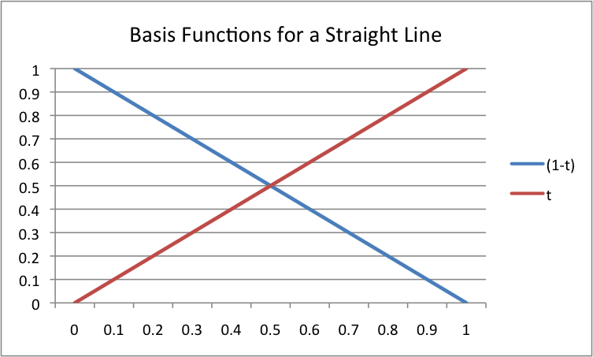

..  Copyright (C)  Wayne Brown
  Permission is granted to copy, distribute
  and/or modify this document under the terms of the GNU Free Documentation
  License, Version 1.3 or any later version published by the Free Software
  Foundation; with Invariant Sections being Forward, Prefaces, and
  Contributor List, no Front-Cover Texts, and no Back-Cover Texts.  A copy of
  the license is included in the section entitled "GNU Free Documentation
  License".

8.3 - Basis Functions
:::::::::::::::::::::

A parametric equation allows us to calculate intermediate values between
two distinct values using a single parameter :code:`t`. In the previous lesson
you studied an example for calculating points along a straight path between
two points, :code:`p1` and :code:`p2`.

.. Code-Block:: JavaScript

  p = (1-t)*p1 + t*p2;  // where t varies from 0.0 to 1.0

Mathematically this is a "weighted sum," where each point on the path between
:code:`p1` and :code:`p2` is the sum of two percentages. This is a very simple
and elegant idea that can be extended in a variety of interesting ways.

Basis Functions
---------------

The functions that produce the fractions used for a parametric
equation are called *basis functions* . Let's plot the *basis functions*
for the simple example above. The basis functions are :code:`(1-t)` and :code:`(t)`.
A plot of these two functions for values of :code:`t` between 0.0 and 1.0 gives
the straight lines in the diagram to the right. Please notice the following about these
*basis functions*:

* Every value for the basis functions is a fraction. They represent percentages.
* The *basis functions* sum to one for all values of :code:`t`. That is,
  :code:`(1-t) + t === 1.0`. If this property is true for a set of *basis functions*,
  then all of the intermediate points on a path lie inside the convex hull of
  the points that define the path.

Here is the "big idea":

.. admonition:: Parametric Equations

  Given discrete values at *key frames*, intermediate values can be calculated
  using a weighted sum of the discrete values.
  *Basis functions* calculate the appropriate weighting factors.

Glossary
--------

.. glossary::

  basis functions
    A set of functions that calculate the percentage of contribution a discrete value
    contributes to an intermediate value.

Self Assessment
---------------

.. mchoice:: 8.3.1
  :random:
  :answer_a: (t)
  :answer_b: (1-t)
  :answer_c: p1
  :answer_d: p2
  :correct: a,b
  :feedback_a: Correct.
  :feedback_b: Correct.
  :feedback_c: Incorrect. p1 is a constant that defines the starting value.
  :feedback_d: Incorrect. p2 is a constant that defines the ending value.

  Given the parametric equation described in this lesson,

  .. Code-Block:: JavaScript

    p = (1-t)*p1 + t*p2;  // where t varies from 0.0 to 1.0

  what are its *basis functions*? (Select all that apply.)

.. index:: basis functions
