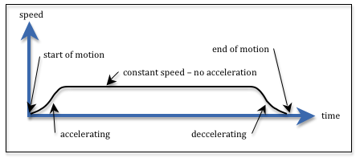
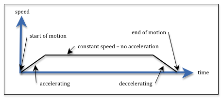
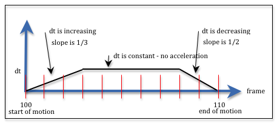

..  Copyright (C)  Wayne Brown
  Permission is granted to copy, distribute
  and/or modify this document under the terms of the GNU Free Documentation
  License, Version 1.3 or any later version published by the Free Software
  Foundation; with Invariant Sections being Forward, Prefaces, and
  Contributor List, no Front-Cover Texts, and no Back-Cover Texts.  A copy of
  the license is included in the section entitled "GNU Free Documentation
  License".

8.4 - Speed and Acceleration
::::::::::::::::::::::::::::

Let's assume you are using a parametric equation to change the position
of an object over a series of frames for an animation. The
value of the parametric parameter :code:`t` needs to vary from 0.0 to 1.0
over the frames that contain the movement. What is the relationship between
:code:`t` and the object's speed of movement?

.. admonition:: PLEASE NOTE:

  This lesson will help you understand the key concepts of speed and acceleration.
  However, the implementation methods in this lesson would never be used.
  They are included to motivate a better understanding of parametric equations.

Speed and Acceleration
----------------------

Speed is defined as distance divided by time. For cars we use
miles/hour; for a person running, perhaps meters/second. Distance, time,
and speed are interrelated using these basic formulas:

.. Code-Block:: JavaScript

  speed = distance / time;
  distance = speed * time;
  time = distance / speed;

Since physical objects can't be stationary one moment and traveling
at 60 miles per hour the next, we should take into account *acceleration* and *deceleration*.
Acceleration is the change in speed over time. An accelerating object
is increasing in speed. A decelerating object is decreasing
in speed. Any object that
starts to move must accelerate to a given speed, travel
at that speed for a certain amount of time, and then decelerate until the
object is stationary. This is visualized in the diagram to the right.

We often make simplifying assumptions about motion when we create virtual
worlds. Let's consider three scenarios:

* Ignore acceleration entirely. (For simple animations this is sometimes acceptable.)
* Model acceleration as a simple linear change in speed.
* Model acceleration accurately, starting from zero acceleration -- to
  increasing acceleration -- to decreasing acceleration -- to zero acceleration when
  a constant speed has been reached.

Let's examine each of these scenarios separately.

Designing Motion
----------------

Given that :code:`speed = distance / time`, the design of an animation
requires that you specify two of the three values. Therefore, you have
three design scenarios:

#. You decide the distance to travel and the time of travel. (:code:`speed` is calculated)
#. You decide the speed of movement and the time of travel. (:code:`distance` is calculated)
#. You decide the distance of travel and the speed. (:code:`time` is calculated)

Option 1 is perhaps the most common, so our remaining discussion will
assume that an animator will set starting and ending locations to specify
a distance and the number of frames to specify time.

For an animation you can measure *time* in *seconds* or in *frames*.
Distance can be measured using any units
that are consistent with your virtual scene. Remember that
WebGL is unit-less -- but you must use consistent units for all measurements.

Ignore Acceleration
-------------------

For simple motion it is sometimes acceptable to ignore acceleration and
immediately start moving at a constant speed. For the parametric
parameter :code:`t`, if the differences between t\ :sub:`i` and t\ :sub:`i+1`
are equal, the change in values will be a constant, which means the object will be
moving at a constant speed. To calculate
the "change in t" (i.e, :code:`dt`) for such a motion, simply calculate the number of discrete
positions an object will have during the motion. Then divide this into 1.0,
since :code:`t` varies between 0.0 and 1.0. Note that given :code:`n` frames, there
are :code:`n-1` transitions between frames.

.. Code-Block:: JavaScript

  number_frames = ending_frame - starting_frame + 1;
  dt = 1.0 / (number_frames-1);

Let's walk through a specific example. In frame 100 an object is stationary
and has a location of :code:`p1 = (10, 12,-4)`. You want the object to move to location
:code:`p2 = (20, 8, 5)` by frame 110. In frames 101 through 109 the object will be in
a location calculated by the parametric equation. Using the above equations,
the value for :code:`dt` is 0.1 and the values for :code:`t` for each frame will be:

.. cssclass:: table-bordered

  +--------------+-------+-------+-------+-------+-------+-------+-------+-------+-------+-------+-------+
  | frame number | 100   | 101   + 102   +   103 +   104 +   105 +   106 +   107 +   108 +   109 +   110 +
  +==============+=======+=======+=======+=======+=======+=======+=======+=======+=======+=======+=======+
  + dt =         +       + 0.100 + 0.100 + 0.100 + 0.100 + 0.100 + 0.100 + 0.100 + 0.100 + 0.100 + 0.100 +
  +--------------+-------+-------+-------+-------+-------+-------+-------+-------+-------+-------+-------+
  | t =          | 0.000 + 0.100 + 0.200 + 0.300 + 0.400 + 0.500 + 0.600 + 0.700 + 0.800 + 0.900 + 1.000 +
  +--------------+-------+-------+-------+-------+-------+-------+-------+-------+-------+-------+-------+
  |              | start | constant speed                                                        | end   |
  +--------------+-------+-------+-------+-------+-------+-------+-------+-------+-------+-------+-------+

The selection of the starting and ending frames determines the *time* for the
animation. You can convert the number of frames into seconds by dividing by
the frame rate. For example:

.. Code-Block:: JavaScript

  seconds = (number_frames-1) / (30 frames / 1 sec);

The selection of the starting and ending points determines the distance of
the motion. You could calculate the exact distance using the distance formula:

.. Code-Block:: JavaScript

  distance = Math.sqrt( (p2x-p1x)*(p2x-p1x) + (p2y-p1y)*(p2y-p1y) + (p2z-p1z)*(p2z-p1z));

If we needed the exact speed of the motion we could calculate it:

.. Code-Block:: JavaScript

  speed = distance / seconds;

The example WebGL program from lesson 8.1 demonstrated constant speed with
no acceleration and is repeated here if you would like to experiment.

.. webglinteractive:: W1
  :htmlprogram: _static/08_animation/animate.html
  :editlist: _static/08_animation/path.js, _static/08_animation/animate_scene.js
  :hideoutput:
  :width: 300
  :height: 300

Linear Acceleration
-------------------

For more realistic motion you need to include the acceleration
of an object as it starts to move and the deceleration as it slows down to stop.
This adds complexity to your animation design and to your calculations.

To simplify our calculations as much as possible we model the acceleration and deceleration
as linear functions, as shown in the diagram to the right. There are many scenarios we could
consider, but let's look at a straightforward scenario where an animator
decides the time it takes to accelerate and to decelerate. The equations
will be developed using the simple example we used above:

* In frame 100 an object is stationary and has a location of :code:`p1 = (10, 12,-4)`;
* You want the object to move to location :code:`p2 = (20, 8, 5)` by frame 110;
* Acceleration takes 3 frames at the beginning of the motion; and
* Deceleration takes 2 frames at the end of the motion.

The table below shows the
scenario with the values we need to calculate. Please note that we need to calculate
the "change in *t*" between frames in order to calculate the the actual values of *t*.
We will end up with 11 values for *t*, but 10 "change in *t*" values.

.. cssclass:: table-bordered

  +--------------+-------+-------+-------+-------+-------+-------+-------+-------+-------+-------+-------+
  + frame number + 100   + 101   + 102   +   103 +   104 +   105 +   106 +   107 +   108 +   109 +   110 +
  +==============+=======+=======+=======+=======+=======+=======+=======+=======+=======+=======+=======+
  + dt =         +       + ?     + ?     + ?     + dt    + dt    + dt    + dt    + dt    + ?     + ?     +
  +--------------+-------+-------+-------+-------+-------+-------+-------+-------+-------+-------+-------+
  + t =          + 0.000 + ?     + ?     + ?     + ?     + ?     + ?     + ?     + ?     + ?     + 1.00  +
  +--------------+-------+-------+-------+-------+-------+-------+-------+-------+-------+-------+-------+
  +              + accelerating                  + constant speed                        + decelerating  +
  +--------------+-------+-------+-------+-------+-------+-------+-------+-------+-------+-------+-------+

Let's call the "change in *t*" :code:`dt`. If :code:`dt` is constant,
then we have constant speed. If :code:`dt` is increasing we have acceleration;
if :code:`dt`  is decreasing we have deceleration.
We use the slope of the acceleration and deceleration
lines to approximate the :code:`dt` value at the  start and end of the motion.
We don't know the value for :code:`dt` but we do know that the sum of all the
values must be 1.0. For the specific example in the diagram, we can write the
equation below. In the diagram the frames are marked with vertical red lines.
Notice that we take the value for :code:`dt` in the middle of each frame.

.. Code-Block:: JavaScript

  // Adding the dt values for acceleration, constant speed, and deceleration
  1.0 = 1/6*dt + 3/6*dt + 5/6*dt + dt + dt + dt + dt + dt + 3/4*dt + 1/4*dt;

Therefore :code:`7.5*dt === 1.0` and :code:`dt` must be 1/7.5, or 0.133.
Substituting this value for :code:`dt` back into each term gives us the
specific "change in *t*" for each frame. These values are show in the following
table.

.. cssclass:: table-bordered

  +--------------+-------+-------+-------+-------+-------+-------+-------+-------+-------+-------+-------+
  + frame number + 100   + 101   + 102   +   103 +   104 +   105 +   106 +   107 +   108 +   109 +   110 +
  +==============+=======+=======+=======+=======+=======+=======+=======+=======+=======+=======+=======+
  + dt =         + 0.000 + 0.022 + 0.067 + 0.111 + 0.133 + 0.133 + 0.133 + 0.133 + 0.133 + 0.100 + 0.033 +
  +--------------+-------+-------+-------+-------+-------+-------+-------+-------+-------+-------+-------+
  + t =          + 0.000 + 0.022 + 0.088 + 0.200 + 0.333 + 0.467 + 0.600 + 0.733 + 0.866 + 0.966 + 1.000 +
  +--------------+-------+-------+-------+-------+-------+-------+-------+-------+-------+-------+-------+
  +              + accelerating                  + constant speed                        + decelerating  +
  +--------------+-------+-------+-------+-------+-------+-------+-------+-------+-------+-------+-------+

Let's make some observations about the calculated values:

* For this problem the :code:`dt` value is 0.133, while for the original
  "constant speed" problem above the :code:`dt` value was 0.1. It makes sense
  that the speed during constant motion must be greater to make up for the
  time lost during acceleration and deceleration.
* The :code:`dt` values are increasing during acceleration and decreasing
  during deceleration. Hopefully this makes sense from a physical perspective.
* The sum of the :code:`dt` values for acceleration and deceleration can be
  written as the sum of odd integers times the slope of the line. In this
  example, the acceleration terms are :code:`(1/6)*(1 + 3 + 5)` and the
  deceleration terms are :code:`(1/4)*(3 + 1)`. The sum of :code:`n` odd integers
  is known to be n\ :sup:`2`.

With a little work we can generalize this algorithm for any set of inputs.
The function :code:`calculateAnimation` in the demo code below will calculate
and return an array of *t* values based on a starting frame, an ending frame,
the number of frames to accelerate, and the number of frames to decelerate.
Please study the code carefully. Then experiment with this WebGL program.

.. webglinteractive:: W2
  :htmlprogram: _static/08_acceleration/acceleration.html
  :editlist: _static/08_acceleration/path2.js, _static/08_acceleration/acceleration_scene.js
  :hideoutput:
  :width: 300
  :height: 300

After you have experimented with the WebGL program above, consider its following
deficiencies:

* The calculations are straightforward, but not elegant.
* There are limited visual clues about where acceleration stops and
  deceleration starts. Specifying the number of frames for these stages of
  motion does not facilitate an animator's "visual design" of the motion.
* The motion is defined by varying the "change in time" for each frame during
  the acceleration and deceleration phases. **This is very problematic**, especially
  if multiple objects are moving at the same time, but at different rates. There
  is no easy way to sync the actual time each object is moving.
* The linear acceleration and deceleration is not visually consistent with
  what a person expects from the motion.

Non-Linear Acceleration
-----------------------

To extend the techniques just described to non-linear acceleration is mathematically
too complex to pursue in this textbook.

Conclusion
----------

Varying the "change in time" between frames to accomplish acceleration and deceleration
is **not a good idea**. We need a better way to control "changes over time" that
keeps the **time steps between frames constant and consistent**. There is a better way!
We can use more complex *basis functions* for our parametric equations --
which we will discuss next.

Glossary
--------

.. glossary::

  speed
    The rate of change in an object's location and/or orientation, measured
    in terms of distance per change in time.

  acceleration
    The change in speed over a time interval. (Acceleration is often assumed to be a positive increase in speed.)

  deceleration
    A decrease in speed over a time interval.

Self Assessment
---------------

.. mchoice:: 8.4.1
  :random:
  :answer_a: distance of travel
  :answer_b: speed of travel
  :answer_c: time of travel
  :answer_d: acceleration
  :correct: a
  :feedback_a: Correct. distance = speed * time
  :feedback_b: Incorrect. The object's speed was given to you.
  :feedback_c: Incorrect. The object's time of travel was given to you.
  :feedback_d: Incorrect. Acceleration can't be determined from the information provided.

  An object travels at 20 inches per second for 30 seconds. What related value
  can be calculated from this information?

.. mchoice:: 8.4.2
  :random:
  :answer_a: constant speed between the two points.
  :answer_b: linear acceleration, followed by constant speed, followed by linear deceleration.
  :answer_c: linear acceleration all the way to the second point.
  :answer_d: linear deceleration starting from an instantaneous speed.
  :correct: a
  :feedback_a: Correct.
  :feedback_b: Incorrect.
  :feedback_c: Incorrect.
  :feedback_d: Incorrect.

  If you use this parametric equation to describe the motion between two points,

  .. Code-Block:: JavaScript

    p = (1-t)*p1 + t*p2;  // where t varies from 0.0 to 1.0

  and the values for t change by a constant value between all frames, the equation
  calculates locations that produces ...

.. mchoice:: 8.4.3
  :random:
  :answer_a: ceiling(n/2)^2
  :answer_b: n^2
  :answer_c: (n+1)^2
  :answer_d: n!
  :correct: a
  :feedback_a: Correct. Given m odd, positive integers starting at 1, their sum is m^2. Ceiling(n/2) calculates the number of integers.
  :feedback_b: Incorrect. n is the last odd value, but not the number of odd values.
  :feedback_c: Incorrect.
  :feedback_d: Incorrect.

  What is the sum of (1 + 3 + 5 + 7 + ... + n)?

.. mchoice:: 8.4.4
  :random:
  :answer_a: Yes, because for a frame-ratae of "n frame/sec", time changes by 1/n between each frame.
  :answer_b: No, the "change in t" between frames can vary without side effects.
  :answer_c: Yes, because we need simple calculations to make the rendering fast.
  :answer_d: No, because the value of "t" does not represent anything "real world".
  :correct: a
  :feedback_a: Correct. "t" represents time and time always changes consistently.
  :feedback_b: Incorrect. "t" represents time and if it changes arbitrarily, syncing the motion of multiple objects becomes impossible.
  :feedback_c: Incorrect. Fast rendering comes from the GPU.
  :feedback_d: Incorrect. "t" represents time, which is very real!

  A parametric equation calculates intermediate values as :code:`t` changes
  from 0.0 to 1.0. Should the change in values of :code:`t` be the same between
  every frame?

.. index:: speed, acceleration
