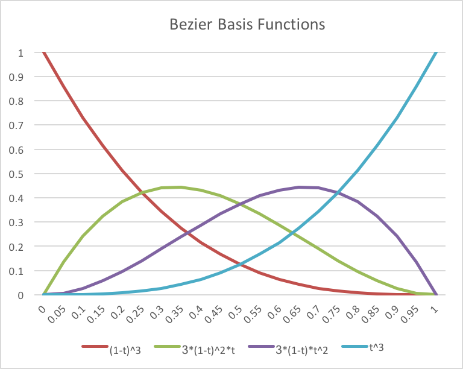

..  Copyright (C)  Wayne Brown
  Permission is granted to copy, distribute
  and/or modify this document under the terms of the GNU Free Documentation
  License, Version 1.3 or any later version published by the Free Software
  Foundation; with Invariant Sections being Forward, Prefaces, and
  Contributor List, no Front-Cover Texts, and no Back-Cover Texts.  A copy of
  the license is included in the section entitled "GNU Free Documentation
  License".

.. role:: raw-html(raw)
  :format: html

8.5 - Bezier Parametric Equations
:::::::::::::::::::::::::::::::::

Parametric equations have been designed that allow an animator to design
the motion of objects using the placement of discrete *control points*.
There are three properties we want the points to control: the location of an object,
its speed of motion, and its acceleration. An animator typically wants to
specify a specific desired location and doing this with a
:code:`(x,y,z)` value is intuitive. However, the precise of speed and
acceleration rarely need to be exact, but rather simply produce
pleasing visual effects.

This lesson explains how to use *cubic bezier parametric equations* to
design the motion of objects in an animation. (Actually the parametric
equations can be used to vary any property of an object over time, but
we will discuss the equations in terms of an object's location and orientation.)

Speed and Acceleration
----------------------

First, let's review the definition of speed and acceleration in terms of calculus derivatives.

Speed is the change in location over a time interval, such as 30 miles per hour (or
30 mph). Calculus derivatives provide tools for measuring the "rate of change" of variables.

.. admonition:: Speed defined using derivatives:

  speed = :raw-html:`&Delta;` distance / :raw-html:`&Delta;` time

  or

  speed = d(distance) / dt

If you are rusty with your calculus derivatives, please `review these basic derivative rules`_.

Let's take the derivative of the parametric equation we used for basic motion,
where :code:`p1` and :code:`p2` are constants.

.. Code-Block:: C

  p = (1-t)*p1 + t*p2;  // where t varies from 0.0 to 1.0

  speed = d(p)/dt = d((1-t)*p1)/dt + d(t*p2)/dt = -p1 + p2 = p2 - p1

Interesting! The derivative of the equation produces the subtraction of two points,
which is how we calculate a vector. This means that the motion defined by this
equation over time is equal to a constant vector -- which translates to a
constant speed between the two points -- because we are assuming that the
"change in time" between each frame is constant and defined by the *frame-rate*.

Acceleration is the change in speed over a time interval. The derivative
of the speed equation above is zero because :code:`p1` and :code:`p2` are constants.

.. Code-Block:: C

  acceleration = d(speed)/dt = d(p2 - p1)/dt = 0

Again this shows that the parametric equation calculates a constant speed over the
interval -- because there is no acceleration.

But what if we want more realistic motion that includes acceleration and
deceleration instead of instantaneous movement.

Bezier Parametric Equations
---------------------------

Let's define our path of motion using four points instead of two points. Let the four
points be defined as follows:

* **p0** - the starting point of the path.
* **p1**, **p2** - intermediate points that influence the direction, speed and acceleration of the motion.
* **p3** - the ending point of the path.

To create a "weighted sum" of these points we define four *basis functions* as follows:

p = (1-t)\ :sup:`3` * **p0** + 3*(1-t)\ :sup:`2`\*t* **p1** + 3*(1-t)\*t\ :sup:`2`\* **p2** + t\ :sup:`3`\* **p3**;

The *basis functions* calculate the percentage of contribution of each point
and are plotted in the diagram to the right. The speed and acceleration
at each location along the path is defined by the equation's derivatives:

.. Code-Block:: C

  speed = d(p)/dt = 3*[(1-t)^2(p1-p0) + 2(1-t)(t)(p2-p1) + (t^2)(p3-p2)]
  acceleration = d(speed)/dt = 6*[(-1+t)(p1-p0) + (1-2t)(p2-p1) + t(p3-p2)]

Notice that both the speed and the acceleration are functions of the three
vectors defined by the four controls points. The speed and acceleration are
the magnitude of these vectors and the direction of the vectors determines the
direction of motion. (Remember that an animator is typically concerned with
visual appearance and not exact speed or acceleration values.) To get
a feeling for how the **intermediate control points** affect speed and acceleration,
the following chart shows various scenarios as the location of the points are changed.
You can visually see these results in the WebGL program below as you modify
the scale factor for the :code:`<p1-p0>` vector. Please verify that the visual motion
of the model matches the speed and acceleration indicated in the charts.

+-------------------+--------------------------------------+-----------------------------------------+
| | :code:`<p1-p0>` | | Control Points and Vectors         | | Speed and Acceleration Graph          |
| | Scale Factor    | | General Description of Motion      |                                         |
+===================+======================================+=========================================+
| 0.0               | | :code:`p0 == p1`                   | .. image:: figures/bezier_0.png         |
|                   | | :code:`p2 == p3`                   |   :width: 320                           |
|                   |                                      |   :height: 220                          |
|                   | The speed starts and ends at zero.   |                                         |
|                   | The speed is maximum at the          |                                         |
|                   | mid-point of the path.               |                                         |
+-------------------+--------------------------------------+-----------------------------------------+
| 0.1               | | :code:`<p1-p0> = 0.1*<p3-p0>`      | .. image:: figures/bezier_0.1.png       |
|                   | | :code:`<p3-p2> = 0.1*<p3-p0>`      |   :width: 320                           |
|                   |                                      |   :height: 220                          |
|                   | Increasing the vector                |                                         |
|                   | :code:`<p1-p0>` decreases the        |                                         |
|                   | overall speed and acceleration.      |                                         |
+-------------------+--------------------------------------+-----------------------------------------+
| 0.33333           | | :code:`<p1-p0> = (1/3)*<p3-p0>`    | .. image:: figures/bezier_0.33.png      |
|                   | | :code:`<p3-p2> = (1/3)*<p3-p0>`    |   :width: 320                           |
|                   |                                      |   :height: 220                          |
|                   | Spacing the control points equally   |                                         |
|                   | along the path makes the             |                                         |
|                   | acceleration go to zero and you have |                                         |
|                   | constant speed over the path.        |                                         |
+-------------------+--------------------------------------+-----------------------------------------+
| 0.5               | | :code:`p1 == p2`                   | .. image:: figures/bezier_0.5.png       |
|                   | | :code:`<p2-p1> == 0`               |   :width: 320                           |
|                   | | :code:`<p1-p0> == <p3-p2>`         |   :height: 220                          |
|                   |                                      |                                         |
|                   | Placing both intermediate points     |                                         |
|                   | at the center of the path            |                                         |
|                   | inverts the speed such that the      |                                         |
|                   | minimum speed is at the path's       |                                         |
|                   | mid-point.                           |                                         |
+-------------------+--------------------------------------+-----------------------------------------+
| 1.0               | | :code:`p1 == p3`                   | .. image:: figures/bezier_1.0.png       |
|                   | | :code:`p2 == p0`                   |   :width: 320                           |
|                   | | :code:`<p2-p1> == -<p3-p0>`        |   :height: 220                          |
|                   |                                      |                                         |
|                   | Placing the intermediate points      |                                         |
|                   | at the opposite end-points of the    |                                         |
|                   | path inverts the speed such that the |                                         |
|                   | speed goes to zero at the path's     |                                         |
|                   | mid-point.                           |                                         |
+-------------------+--------------------------------------+-----------------------------------------+

Please experiment with the following WebGL program and verify that the visual results
of the animations match the speed and acceleration charts shown above.

.. webglinteractive:: W1
  :htmlprogram: _static/08_bezier/bezier.html
  :editlist: _static/08_bezier/bezier_path.js, _static/08_bezier/bezier_scene.js
  :hideoutput:
  :width: 300
  :height: 300

.. admonition:: Conclusion

  An animator can control the location, speed and acceleration of motion of an object
  over a path defined by using four control points, :code:`p0`, :code:`p1`,
  :code:`p2`, and :code:`p3`. Points :code:`p0` and :code:`p3` define the
  overall length of the path. The placement of the intermediate points,
  :code:`p1` and :code:`p2` control the speed and acceleration.

Glossary
--------

.. glossary::

  speed
    The change in an object's location relative to changes in time.

  acceleration
    The change in speed over a time interval.

  derivative
    A mathematical operation that determines the "rate of change" in an equation.

  Bezier parametric equation
    A function of one variable, :code:`t`, that calculates changes along a "path".

Self Assessment
---------------

.. mchoice:: 8.5.1
  :random:
  :answer_a: p0
  :answer_b: p1
  :answer_c: p2
  :answer_d: p3
  :correct: a,d
  :feedback_a: Correct. p0 is the starting location.
  :feedback_b: Incorrect.
  :feedback_c: Incorrect.
  :feedback_d: Correct. p3 is the ending location.

  Which control points of a Bezier parametric equation define
  the physical limits of motion? (Select all that apply.)

.. mchoice:: 8.5.2
  :random:
  :answer_a: p0
  :answer_b: p1
  :answer_c: p2
  :answer_d: p3
  :correct: b,c
  :feedback_a: Incorrect. p0 is the starting location.
  :feedback_b: Correct.
  :feedback_c: Correct.
  :feedback_d: Incorrect. p3 is the ending location.

  Which control points of a Bezier parametric equation control the
  speed and acceleration of motion? (Select all that apply.)

.. mchoice:: 8.5.3
  :random:
  :answer_a: at p0 and p3.
  :answer_b: equally spaced along the path.
  :answer_c: equal to each other and at the path's midpoint.
  :answer_d: (1/4) the distance of the total motion.
  :correct: a
  :feedback_a: Correct.
  :feedback_b: Incorrect. This produces constant speed, but does not start with a speed of zero.
  :feedback_c: Incorrect. The speed is not zero when the motion starts.
  :feedback_d: Incorrect. The speed is not zero when the motion starts.

  You want an object to move starting with a speed of zero and
  ending with a speed of zero. Where should the intermediate points
  be located?

.. index:: speed, acceleration, derivative, Bezier parametric equation

.. _review these basic derivative rules: ../appendices/derivatives.html

