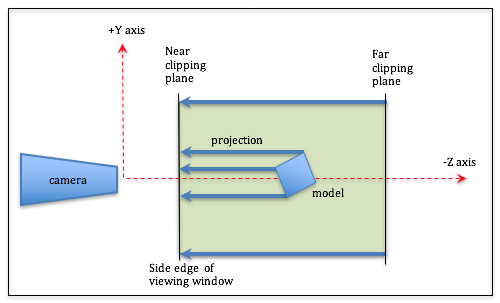
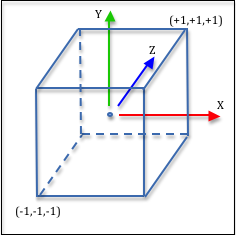

..  Copyright (C)  Wayne Brown
  Permission is granted to copy, distribute
  and/or modify this document under the terms of the GNU Free Documentation
  License, Version 1.3 or any later version published by the Free Software
  Foundation; with Invariant Sections being Forward, Prefaces, and
  Contributor List, no Front-Cover Texts, and no Back-Cover Texts.  A copy of
  the license is included in the section entitled "GNU Free Documentation
  License".

9.2 - Orthographic Projections
::::::::::::::::::::::::::::::

*Orthographic* projections are used in the engineering fields to create
accurate renderings of models. They maintain parallel lines but provide
no sense of depth. All vertices are projected straight onto a *viewing window*.
The distance from the virtual camera to an object has no affect on the
size of the rendered object. (In
real life objects that are further from the camera appear smaller.)

This lesson describes how to create an *orthographic projection* and
the mathematics behind its 4-by-4 transformation matrix.

The :code:`createOrthographic()` function
-----------------------------------------

The function :code:`createOrthographic()` in the :code:`GlMatrix4x4.js`
file creates an *orthographic projection* transformation matrix. The
function requires 6 parameters as shown in its function prototype below.

.. Code-block:: JavaScript

  /** -----------------------------------------------------------------
   * Create an orthographic projection matrix.
   * @param left   {Number} Farthest left on the x-axis
   * @param right  {Number} Farthest right on the x-axis
   * @param bottom {Number} Farthest down on the y-axis
   * @param top    {Number} Farthest up on the y-axis
   * @param near   {Number} Distance to the near clipping plane along the -Z axis
   * @param far    {Number} Distance to the far clipping plane along the -Z axis
   * @return {Float32Array} The orthographic transformation matrix
   */
  self.createOrthographic = function (left, right, bottom, top, near, far)

The six parameters form a *rectangular cuboid* that defines the visible
area of a rendering. Experiment with the
example below which allows you to change the parameters to
a :code:`createOrthographic` function call and see
the resulting rendering in the second canvas window to the right. You can
click and drag in the left canvas to modify your view of the virtual world.

Remember that the camera transform has already moved the world in front
of a stationary camera which is at the origin looking down the -Z axis,
as shown in the WebGL program below.

.. webgldemo:: W1
  :htmlprogram: _static/09_create_ortho/create_ortho.html
  :width: 300
  :height: 300
  :width2: 200
  :height2: 200

As you experiment with the orthographic parameters, please verify that
you understand the following ideas:

* Geometric primitives (points, lines, or triangles) outside the viewing
  volume are clipped from view. (Geometric primitives can be partially visible
  if they intersect one of the *viewing volume* boundaries.)
* There are three renderings of the same model but each is located a different
  distance from the camera. Notice that all of the models are rendered
  the same size.
* Notice that parallel lines in the models are parallel in the rendering.
* If the aspect ratio of the projection's width and height is different than
  the aspect ratio of the canvas' width and height, the rendering is distorted.
  It is the programmer's job to make sure the aspect ratios are consistent.
* Values for :code:`left` and :code:`right` are positions along the x-axis.
* Values for :code:`bottom` and :code:`top` are positions along the y-axis.
* Values for :code:`near` and :code:`far` are **distances** from the origin along the -Z axis.
* If :code:`near` is negative, models behind the camera are rendered! (Strange but true!)
* If the value of :code:`left` is greater than the value of :code:`right`, the world is
  mirrored about the Y-Z plane. If the value of :code:`bottom` is greater than the
  value of :code:`top`, the world is mirror about the X-Z plane. If the value of
  :code:`near` is greater than the value of :code:`far`, the world is mirror
  about the X-Y plane.
* The *viewing window* is the front side of the *viewing volume*. It is
  defined in the lower-left corner by the point :code:`(left, bottom, near)` and
  in the upper-right corner by the point :code:`(right, top, near)`.

The Orthographic Projection Matrix
----------------------------------

As we discussed in the previous lesson, a projection matrix must transform
the vertices in a scene into the *clipping volume*, which is a 2 unit wide
cube as shown in the image to the right. This is easily done with three
transformations:

#. Translate the volume defined by the :code:`createOrthographic` parameters
   so that it is centered at the origin, then
#. Scale the volume to be a 2 unit wide cube using an appropriate scale factor
   for each axis, and then
#. Flip the z axis to match the clipping space's coordinate system.

Let's discuss the details of each step.

Center the Viewing Volume at the Origin
***************************************

Let's use a parametric equation to calculate the mid-point between two values.
The mid-point is calculated when :code:`t` is equal to 0.5. Therefore, the mid-point
between :code:`left` and :code`right` can be calculated like this:

.. Code-Block:: JavaScript

  mid_x = (1-0.5)*left + (0.5)*right;  // t = 0.5

This reduces to the simple addition of :code:`left` and :code:`right` divided by 2.

.. Code-Block:: JavaScript

  mid_x = (left + right) / 2;  // t = 0.5

The center of the *viewing volume* can be calculated using three such equations.
The values of :code:`near` and :code:`far` are **distances** along the -Z axis.
Negating them converts them into Z-axis locations.

.. Code-Block:: JavaScript

  mid_x = (left + right) / 2;
  mid_y = (bottom + up) / 2;
  mid_z = (-near + -far) / 2;

Therefore, we can translate the *viewing volume* to make it centered about the
global origin using this transformation matrix:

.. matrixeq:: Eq1

   [M2: centerAboutOrigin] = [M1: 1, 0, 0, -mid_x; 0, 1, 0, -mid_y; 0, 0, 1, -mid_z; 0, 0, 0, 1]

Scale the Viewing Volume
************************

Scaling requires a simple ratio. If the current width of the *viewing volume*
is 10 units wide, scaling the values to 2 units wide requires a scale
factor of 2/10, or 1/5. Our scale factors must be:

.. Code-Block:: JavaScript

  scale_x = 2.0 / (right - left);
  scale_y = 2.0 / (up - bottom);
  scale_z = 2.0 / (far - near);

Our scaling transform looks like this:

.. matrixeq:: Eq2

   [M2: scaleViewingVolume] = [M1: scale_x, 0, 0, 0; 0, scale_y, 0, 0; 0, 0, scale_z, 0; 0, 0, 0, 1]

Switch Coordinate Systems
*************************

The only difference between a right-handed and left-handed *coordinate system*
is the direction of the z-axis. Vertices can be switched between the two
systems by multiplication of the :code:`z` component by -1. Therefore, this
transformation inverts the the coordinate system:

.. matrixeq:: Eq3

   [M2: convertToLeftHanded] = [M1: 1, 0, 0, 0; 0, 1, 0, 0; 0, 0, -1, 0; 0, 0, 0, 1]

The Orthographic Projection Transform
*************************************

Conceptually an orthographic transformation is composed of these three
sequential transformations applied from right to left:

.. matrixeq:: Eq4

   [M1: 1, 0, 0, 0; 0, 1, 0, 0; 0, 0, -1, 0; 0, 0, 0, 1]*[M2: scale_x, 0, 0, 0; 0, scale_y, 0, 0; 0, 0, scale_z, 0; 0, 0, 0, 1]*
   [M3: 1, 0, 0, -mid_x; 0, 1, 0, -mid_y; 0, 0, 1, -mid_z; 0, 0, 0, 1]
   *[M6: x;y;z;1]  = [M7: x';y';z';w']

Click on the multiplication sign in the above equation to see the results.
If you simplify the terms, you get this transformation:

.. matrixeq:: Eq5

   [M1: 2/(right-left), 0, 0, -(right+left)/(right-left);
        0, 2/(top-bottom), 0, -(top+bottom)/(top-bottom);
        0, 0, -2/(far-near), -(far+near)/(far-near); 0, 0, 0, 1]

Summary
-------

If you want to understand complex transformations, break them down into their
elementary steps.

An orthographic projection does not modify the relative relationships between
vertices and therefore an object's size does not change
as it moves closer to (or farther away from) the camera.

An orthographic projection prepares vertices for clipping, which is the next
stage of the graphics pipeline.

Glossary
--------

.. glossary::

  orthographic projection
    Transform the vertices of a 3D model into *normalized device coordinates*
    in preparation for clipping. A rendering maintains parallel lines and all
    models retain their size.

.. index:: projection, orthographic projection

.. admonition:: Side Note: Transformation derivations are typically not unique.

  The above derivation of an orthographic transformation is not unique.
  For example, here is another way to think about getting the orthographic
  *viewing volume* into the *clipping volume*. Remember that :code:`near` and
  :code:`far` are distances and their values must be negated to
  convert them to positions along the -Z axis.

  #. Translate the :code:`(bottom,left,-far)` corner to the origin.
  #. Scale the viewing volume to a 2x2x2 cube.
  #. Translate the result by (-1,-1,-1).
  #. Flip the z axis to match the clipping space's coordinate system.

  A series of transforms to perform these operations is:

  .. matrixeq:: Eq6

     [M0: 1, 0, 0, 0; 0, 1, 0, 0; 0, 0, -1, 0; 0, 0, 0, 1]*
     [M1: 1, 0, 0, -1; 0, 1, 0, -1; 0, 0, 1, -1; 0, 0, 0, 1]*
     [M2: 2/(right-left), 0, 0, 0;
          0, 2/(top-bottom), 0, 0;
          0, 0, 2/(-far-(-near)), 0; 0, 0, 0, 1]*
     [M3: 1, 0, 0, -left; 0, 1, 0, -bottom; 0, 0, 1, -(-far); 0, 0, 0, 1]
     *[M6: x;y;z;1] = [M7: x';y';z';w']

  If you simplify the terms in the result and compare each term to our
  previous results you will verify that we get the same answer. This
  is a good example of the fact that there is often multiple ways to
  accomplish a desired result.

