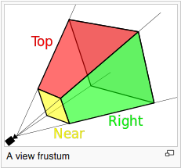
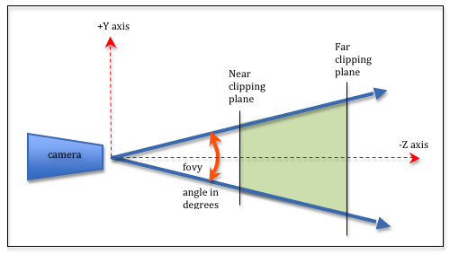

..  Copyright (C)  Wayne Brown
  Permission is granted to copy, distribute
  and/or modify this document under the terms of the GNU Free Documentation
  License, Version 1.3 or any later version published by the Free Software
  Foundation; with Invariant Sections being Forward, Prefaces, and
  Contributor List, no Front-Cover Texts, and no Back-Cover Texts.  A copy of
  the license is included in the section entitled "GNU Free Documentation
  License".

9.3 - Perspective Projections
:::::::::::::::::::::::::::::

*Perspective projections* render a virtual scene to make it appear
like a view from a real-world camera. Objects further from the camera appear to
be smaller and all lines appear to project toward `vanishing points`_ which
skew parallel lines. *Perspective projections* are almost always used
in gaming, movie special effects, and scientific visualizations.

This lesson describes how to create a *perspective projection*. The following
lesson explains its mathematics.

The Viewing Volume of a Perspective Projection
----------------------------------------------

  (`Source 1`_)

A *perspective projection* defines a 3D volume that projects out from the
location of the camera along four boundary rays. The rays form a `viewing frustum`_
as shown in the image to the right. The *frustum* includes a front and
back clipping plane that is parallel to the X-Y plane. Any models inside
this viewing frustum will be rendered. Any models outside this
viewing frustum will be *clipped* away.

There are two standard ways to define a viewing frustum.

* The :code:`createPerspective()` function simulates the lens of a camera
  that is always at the global origin looking down the -Z axis.
* The :code:`createFrustum()` function defines a 2D viewing window that is
  parallel to the X-Y plane. The camera can be located anywhere in the X-Y plane,
  but is always looking down a ray that is parallel to the -Z axis. A common use
  of this function is to render two different views of a scene, one for a user's
  left eye and another for a user's right eye. If the two renderings are offset
  correctly, and displayed to a user's individual eyes, the user can see a
  3D scene! This is how `virtual reality`_ (VR) is created.

Please study these two methods for creating perspective projections.

The :code:`createPerspective()` function
----------------------------------------

The function :code:`createPerspective()` in the :code:`Learn_webgl_matrix.js`
module creates a perspective projection transformation matrix. The
function requires 4 parameters as shown in its function prototype below.

.. Code-block:: JavaScript

  /** -----------------------------------------------------------------
   * Create a perspective projection matrix using a field-of-view and an aspect ratio.
   * @param fovy   {Number} The angle between the upper and lower sides of the viewing frustum.
   * @param aspect {Number} The aspect ratio of the view window. (width/height).
   * @param near   {Number} Distance to the near clipping plane along the -Z axis.
   * @param far    {Number} Distance to the far clipping plane along the -Z axis.
   * @return {Float32Array} The perspective transformation matrix.
   */
  self.createPerspective = function (fovy, aspect, near, far)

The four parameters define a *frustum*. The :code:`fovy` parameter stands
for the "field of view y-axis" and is the vertical angle of the camera's lens.
Common values for :code:`fovy` range from 30 to 60 degrees. The :code:`aspect`
ratio parameter
is the :code:`width` divided by the :code:`height` of the canvas window.
The :code:`near` and :code:`far` parameters are **distances** from the camera,
with the restriction that :code:`near` is always less than :code:`far` and both
distances must always be positive. The distance between
:code:`near` and :code:`far` should be kept as small as possible to reduce precision
issues since the frustum is being mapped into a clipping volume
that is 2 units deep. Typical values for :code:`near` and :code:`far` might be
0.1 to 100.0. In general, make :code:`near` be as far away from the camera as
possible and make :code:`far` be as close to the camera as possible.

Experiment with the parameters using the following WebGL program.

.. webgldemo:: W1
  :htmlprogram: _static/09_create_perspective/create_perspective.html
  :width: 300
  :height: 300
  :width2: 200
  :height2: 200

As you experiment with the perspective parameters, please verify that
you understand the following ideas:

* As the angle for the camera's lens, :code:`fovy`, gets smaller, the
  objects in the scene get larger. This is consistent with how light
  travels through the optics of a camera.
* If the :code:`aspect` ratio changes but the canvas remains unchanged,
  the rendering will be distorted. It is the programmer's job to insure
  the aspect ratio of the perspective matches the aspect ratio of the
  canvas.
* The value of :code:`near` has no impact on the rendered view. It does
  affect what is clipped from the scene. The same is true for the value of
  :code:`far`.
* The :code:`near` and :code:`far` parameters are always positive and
  :code:`near` should always be less than :code:`far`. The :code:`near`
  and :code:`far` parameters are both distances; they are not -Z axis locations.

The :code:`createFrustum()` function
------------------------------------

The function :code:`createFrustum()` in the :code:`GlMatrix4x4.js`
module creates a *perspective projection* transformation matrix. The
function requires 6 parameters as shown in its function prototype below.

.. Code-block:: JavaScript

  /** -----------------------------------------------------------------
   * Create a perspective projection matrix based on the limits of a frustum.
   * @param left   {Number} Farthest left on the x-axis
   * @param right  {Number} Farthest right on the x-axis
   * @param bottom {Number} Farthest down on the y-axis
   * @param top    {Number} Farthest up on the y-axis
   * @param near   {Number} Distance to the near clipping plane along the -Z axis
   * @param far    {Number} Distance to the far clipping plane along the -Z axis
   * @return {Float32Array} A perspective transformation matrix
   */
  self.createFrustum = function (left, right, bottom, top, near, far)

The 3D points :code:`(left, bottom, near)` and :code:`(right, top, near)` define the lower-left
and upper-right corners of the *viewing window*. If you calculate the center
of the *viewing window* and cast this point back to the X-Y plane, this point
is the apex of the frustum. Casting rays from the apex through the
four points of the *viewing window* forms the *frustum*. (The location of the
apex is displayed in the demo below as a small black dot.) Remember that the
camera is at the origin looking down the -Z axis. (The camera is not rendered
so that you can see the apex location of the frustum.)

Experiment with the parameters using the following demo.

.. webgldemo:: W2
  :htmlprogram: _static/09_create_frustum/create_frustum.html
  :width: 300
  :height: 300
  :width2: 200
  :height2: 200

As you experiment with the *frustum* parameters, please verify that
you understand the following ideas:

* :code:`createFrustum` allows you to create a frustum that is "off center"
  from the -Z axis, but its field of view is always parallel to the -Z axis.
* It is the programmer's job to insure that the canvas dimensions have
  an aspect ratio (width/height) that is consistent with the aspect ratio
  of the *viewing window* (right-left)/(top-bottom). If the aspect ratios are
  different, the rendering is distorted.
* Changing the value of :code:`near` has a profound affect on the frustum
  because this is the distance from the camera to the *viewing window* and the
  entire frustum is defined by the corners of the *viewing window*. Changing
  the :code:`near` value changes the camera lens' field-of-view (.i.e., :code:`fovy`).
* Changing the value of :code:`far` only affects clipping.
* If the values of :code:`left` and :code:`right` are not symmetrical about the
  origin, the apex of the frustum moves horizontally away from the origin.
* If the values of :code:`top` and :code:`bottom` are not symmetrical about the
  origin, the apex of the frustum moves vertically away from the origin.

:code:`createPerspective()` vs. :code:`createFrustum()`
-------------------------------------------------------

How are :code:`createPerspective()` and :code:`createFrustum()` similar?

* Both create a perspective transformation matrix that maps a *frustum*
  shaped virtual world into *normalized device coordinates*.

How are they different?

* They require different parameters to define the frustum *viewing volume*.
* For :code:`createPerspective()`, the camera is always at the origin,
  while for :code:`createFrustum` the camera can be offset
  from the global origin along the X or Y axis.
* For :code:`createPerspective()`, the field-of-view is controlled by an
  angle, :code:`fovy`, while for :code:`createFrustum` the field-of-view
  is controlled by the :code:`near` parameter, which defines how far
  the *viewing window* is from the camera.

To demonstrate the equivalence of the functions, the following two examples show how
you could use one function to implement the other one.

.. Code-Block:: JavaScript

  function createPerspectiveUsingFrustum (fovy, aspect, near, far) {

    let top, bottom, left, right;

    top = near * Math.tan(toRadians(fovy)/2);
    bottom = -top;
    right = top * aspect;
    left = -right;

    return createFrustum(left, right, bottom, top, near, far);
  }

  function createFrustumUsingPerspective (left, right, bottom, top, near, far) {
    let fovy, aspect;

    fovy = 2 * toDegrees(Math.atan2(top, near));
    if (-left === right && -bottom === top ) {
      // The camera is at the origin
      aspect = right / top; // width / height

      return createPerspective(fovy, aspect, near, far);
    } else {
      // The camera is not at the origin, so createPerspective will not work.
      return ERROR;
    }
  }

Stereo Vision
-------------

*Virtual reality* and *augmented reality* applications render two different
scenes for a user, one for the left eye and one for the right eye.
If each eye of a user only sees their respective image, the user's brain
perceives a real 3D scene. There are two standard ways to get a user's eyes
to see the correct image: 1) VR goggles have a screen in front of each eye,
or 2) polarized glasses filter a single image into two separate images.

Experiment with the following WebGL program which
renders two images of the same scene, but with the camera for each scene offset
from the origin.

.. webgldemo:: W3
  :htmlprogram: _static/09_create_stereo/create_stereo.html
  :width: 300
  :height: 300

Please notice that if the two images were in a headset where each eye only
saw its projection, each eye sees a different rendering of the objects,
but your brain sees a single 3D version of each object (assuming
the distance between the projections is approximately the same
distance between your eyes). Amazing!!!!

Glossary
--------

.. glossary::

  projection
    Transform the vertices of a 3D model into 2D points on a 2D *viewing window*.
    And prepare the 3D data for the next stages of the graphics pipeline.

  perspective projection
    The location of every 3D vertex is projected straight to the location
    of the camera. This produces a rendering in the same way a human's eyes
    receives light from the real world.

  frustum
    The portion of a pyramid that lies between two parallel cutting planes.

  virtual reality
    A person is shown a separate image to each eye and
    perceives a 3D scene, not a 2D image.

.. index:: projection, perspective projection, frustum, virtual reality

.. _viewing frustum: https://en.wikipedia.org/wiki/Viewing_frustum
.. _Source 1: https://en.wikipedia.org/wiki/Viewing_frustum
.. _virtual reality: https://en.wikipedia.org/wiki/Virtual_reality
.. _vanishing points: https://en.wikipedia.org/wiki/Vanishing_point

