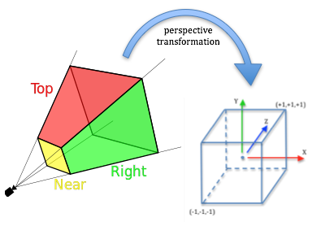
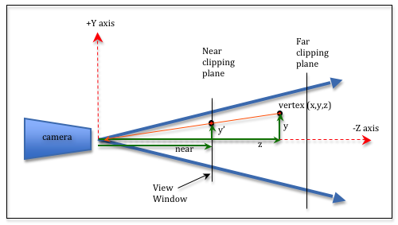
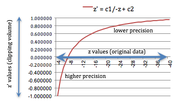

..  Copyright (C)  Wayne Brown
  Permission is granted to copy, distribute
  and/or modify this document under the terms of the GNU Free Documentation
  License, Version 1.3 or any later version published by the Free Software
  Foundation; with Invariant Sections being Forward, Prefaces, and
  Contributor List, no Front-Cover Texts, and no Back-Cover Texts.  A copy of
  the license is included in the section entitled "GNU Free Documentation
  License".

.. role:: raw-html(raw)
  :format: html

9.4 - Math for Perspective Projections
::::::::::::::::::::::::::::::::::::::

This lesson describes the mathematics behind a 4-by-4 perspective
transformation matrix.

But first, let's list the tasks the graphics pipeline does automatically
**after** the projection matrix has transformed a scene's vertices. After a
*vertex shader* has processed a vertex, the vertex passes through the following
**graphic pipeline stages** in the order listed:

#. **Clipping** - geometric primitives are clipped against the *viewing volume*. Since
   the "perspective division* has not been performed yet, clipping is performed
   on an :code:`(x,y,z)` vertex that is outside the limits of :code:`-w <= x <= w`,
   :code:`-w <= y <= w`, and :code:`-w <= z <= w`. Note that every vertex
   has a unique :code:`w` value (i.e., :code:`-z`).
#. **Perspective divide** - "clipping space" vertices, :code:`(x,y,z,w)`, are transformed into
   *normalized device coordinates*, :code:`(x/w, y/w, z/w)`.
#. **Viewport transform** - *normalized device coordinates* are converted into pixel
   locations in the output image.
#. **Rasterization** - determines which pixels in the output image are covered by
   a geometric primitive.
#. The active *fragment shader* is executed on each pixel.

What is important for our discussion of a *perspective projection* is that clipping
is performed before "perspective division" is performed.

The Perspective Projection Matrix
---------------------------------

A *perspective projection* transformation matrix must transform the vertices
of a scene that are within a frustum into the *clipping volume*, which is a 2
unit wide cube shown in the image to the right.
Doing this for a *perspective projection* is more challenging
than an *orthographic projection*. We need to perform the following
steps:

#. Translate the apex of the frustum to the origin.
#. Setup the vertices for the "perspective calculation."
#. Normalize the depth values, :code:`z`, into the range (-1,+1).
#. Scale the 2D, :code:`(x,y)`, vertex values in the *viewing window* (i.e.,
   the near clipping plane) to a 2-by-2 unit square: :code:`(-1,-1)` to :code:`(+1,+1)`.

Let's discuss these tasks one at a time:

Translate the Frustum Apex to the Origin
****************************************

A perspective frustum can be offset from the global origin along the X or Y axes.
We need to place the apex of the frustum at the global origin for the perspective
calculations to be as simple as possible. The apex is located in the center of
the *viewing window* in the XY plane.
Therefore we calculate the center point of the *viewing window* and translate
it to the origin. The :code:`z` value is always zero, so there is no translation for :code:`z`.

.. Code-Block:: JavaScript

  mid_x = (left + right) * 0.5;
  mid_y = (bottom + top) * 0.5;

.. matrixeq:: Eq1

  [M1: 1, 0, 0, -mid_x; 0, 1, 0, -mid_y; 0, 0, 1, 0; 0, 0, 0, 1]*[M2: x;y;z;1] = [M3: x';y';z';w']

or

.. matrixeq:: Eq2

   [M1: 1, 0, 0, -(left+right)/2; 0, 1, 0, -(bottom+top)/2; 0, 0, 1, 0; 0, 0, 0, 1]*[M2: x;y;z;1] = [M3: x';y';z';w']

Setup for the "Perspective Calculations"
****************************************

We need to project every vertex in our scene to its correct location in the
2D *viewing window*. The 2D *viewing window* is the :code:`near` plane
of the frustum. Study the following diagram.

  Perspective Calculations Project a Vertex to the *Viewing Window*

Notice that the vertex :code:`(x,y,z)`
is projected to the *viewing window* by casting a ray from the vertex to
the camera (shown as an orange ray). The rendering location for the vertex is :code:`(x',y',near)`.
From the diagram you can see that the :code:`y` and :code:`y'` values are related by proportional
right-triangles. These two triangles must have the same ratio of side lengths.
Therefore, :code:`y'/near` must be equal to :code:`y/z`. Solving for :code:`y'` gives
:code:`(y/z)*near` (or :code:`(y*near)/z`). Note
that :code:`near` is a constant for a particular scene, while :code:`y` and :code:`z` are different
for each vertex in a scene. Using the same logic, :code:`x' = (x*near)/z`.

To summarize, we can calculate the location of a 3D vertex in a 2D
*viewing window* with a multiplication and a division like this:

.. Code-Block:: JavaScript

  x' = (x*near)/z
  y' = (y*near)/z

To be precise, since all of the *z* values for vertices in front of the camera
are negative, and the value of *z* is being treated as a distance,
we need to negate the value of *z*.

.. Code-Block:: JavaScript

  x' = (x*near)/(-z)
  y' = (y*near)/(-z)

But we have a problem. A 4-by-4 transformation matrix calculates a linear combination
of terms, where each term contains a single vertex component. That is, we can do
calculations like :code:`a*x + b*y + c*z + d`, but not
calculations like :code:`a*x/z + b*y/z + c*z*x + d`. But we have a solution
using homogeneous coordinates. Remember that a vertex defined as :code:`(x,y,z,w)`
defines a value in 4D space at the 3D location :code:`(x/w, y/w, z/w)`. Normally
the :code:`w` component is equal to 1 and :code:`(x,y,z,1)` is :code:`(x,y,z)`.
But to implement perspective division we can set the :code:`w` value to our divisor,
:code:`-z`. This breaks the above calculations
into two parts. A matrix transform will perform the multiplication in the numerator,
while a post-processing step, after the matrix multiplication,
will perform the division.

To perform the multiplication in the perspective calculation, we use this
matrix transformation:

.. matrixeq:: Eq3

  [M1: *near, 0, 0, 0; 0, *near, 0, 0; 0, 0, *1, 0; 0, 0, 0, 1]*[M2: x;y;z;w] = [M3: x';y';z';w']

To get the divisor, :code:`-z`, into the :code:`w` value, we use this transform:

.. matrixeq:: Eq4
  :comment: (click the multiplication sign or the equal sign to verify)

  [M1: 1, 0, 0, 0; 0, 1, 0, 0; 0, 0, 1, 0; 0, 0, *-1, *0]*[M2: x;y;z;w] = [M3: x';y';z';w']

Using these two matrix transforms we can prepare the data for a
"perspective divide" operation that will be performed later in the graphics pipeline.

Mapping Depth Values, :code:`z`, to :code:`(-1,+1)`
***************************************************

The :code:`z` values in the frustum, which range from :code:`-near` to :code:`-far`,
must be mapped to the clipping volume in a range :code:`(-1,+1)`. We know from our
previous discussion that the homogeneous component, :code:`w`, is going to
be :code:`-z`. We need a mapping equation
that contains a division by :code:`-z`. A non-linear mapping function,
:code:`z' = (c1*z + c2) / -z` does what we need, with a side benefit that
more numerical precision is given to distances closer to the camera. [1]_
The required constants :code:`c1` and :code:`c2` are based on the specific
range :code:`(-near,-far)`.

Calculating the constants :code:`c1` and :code:`c2`:
....................................................

When :code:`z = -near`, the mapping equation must evaluate to :code:`-1`.
When :code:`z = -far`, the mapping equation must evaluate to :code:`+1`. This gives us
two equations to solve for :code:`c1` and :code:`c2`.

.. Code-Block:: JavaScript

  -1 = (c1*(-near) + c2) / -(-near)
  +1 = (c1*(-far) + c2) / -(-far)

Using a little algebra, we get

.. Code-Block:: JavaScript

  c1 = (far + near) / (near - far)
  c2 = 2*far*near / (near - far)

Putting the :code:`z` mapping equation into a 4x4 transformation matrix:
........................................................................

To put :code:`z' = (c1*z + c2) / -z` into a 4x4 transformation matrix, the numerator
goes into the matrix, while the denominator goes into the homogeneous coordinate :code:`w`,
like this:

.. matrixeq:: Eq5
  :comment: (click the multiplication sign or the equal sign to verify)

  [M1: 1, 0, 0, 0; 0, 1, 0, 0; 0, 0, *c1, *c2; 0, 0, *-1, *0]*[M2: x;y;z;1]  = [M3: x';y';z';w']

  Non-linear mapping of :code:`z` values

Note that :code:`w` must be equal to 1.0 when this transform happens to get
the correct mapping equation.

Let's consider an example of the :code:`z` mapping. Suppose :code:`near = 4.0` and
:code:`far = 40`. To the right is a plot of :code:`z` values and
their corresponding mapping to the range (-1,+1). Notice that the :code:`z` values
between -4 and -7.4 use up to half of the clipping volume values (-1.0, 0.0)!
That is definitely non-linear!

Scale to the *Viewing Window*: :code:`(-1,-1)` to :code:`(+1,+1)`
*****************************************************************

Subsequent stages in the graphics pipeline require that the 2D *viewing window*
be normalized to values between :code:`(-1,-1)` to :code:`(+1,+1)`. This is easily
done with a scale factor based on a simple ratio: :code:`2/currentSize`.
The equations and the resulting matrix transformation are:

.. Code-Block:: JavaScript

  scale_x = 2.0 / (right - left);
  scale_y = 2.0 / (top - bottom);

.. matrixeq:: Eq6

  [M1: 2/(right-left), 0, 0, 0; 0, 2/(top-bottom), 0, 0; 0, 0, 1, 0; 0, 0, 0, 1]*[M2: x;y;z;w] = [M3: x';y';z';w']

Building the Prospective Projection Transform
---------------------------------------------

Let's put all of the above concepts together into a single perspective transformation
matrix. The order of the transforms matters and we only want to put :code:`-z` into
the homogeneous coordinate, :code:`w`, once.

#. Translate the apex of the frustum to the origin. (Yellow matrix)
#. Setup the "perspective calculation." (Light gray matrix)
#. Scale the depth values, :code:`z`, into a normalized range :code:`(-1,+1)`
   and put :code:`-z` into the homogeneous coordinate, :code:`w`. (Purple matrix)
#. Scale the 2D values, :code:`(x',y')`, in the *viewing window* to a 2-by-2 unit square:
   :code:`(-1,-1)` to :code:`(+1,+1)`. (Cyan matrix)

.. matrixeq:: Eq7

  [M1,lightcyan: *2/(right-left), 0, 0, 0; 0, *2/(top-bottom), 0, 0; 0, 0, 1, 0; 0, 0, 0, 1]*
  [M2,#DF85E8: 1, 0, 0, 0; 0, 1, 0, 0; 0, 0, *c1, *c2; 0, 0, *-1, *0]*
  [M3,lightgrey: *near, 0, 0, 0; 0, *near, 0, 0; 0, 0, 1, 0; 0, 0, 0, 1]*
  [M4,#FDFF9D: 1, 0, 0, *-(left+right)/2; 0, 1, 0, *-(bottom+top)/2; 0, 0, 1, 0; 0, 0, 0, 1]
  *[M5: x;y;z;1]  = [M6: x';y';z';w']

If you click on the multiplication signs in the above equation from right-to-left
you can see the progression of changes to a (x,y,z,w) vertex at
each step of the transformation.

If you simplify the matrix terms and make the following substitutions:

.. Code-Block:: JavaScript

  width = (right - left)
  height = (top - bottom)
  depth = (far - near)
  c1 = -(far + near) / depth
  c2 = -2*far*near / depth

the perspective transformation matrix becomes:

.. matrixeq:: Eq8

   [M1: 2*near/width, 0, 0, -near*(right+left)/width;
        0, 2*near/height, 0, -near*(top+bottom)/height;
        0, 0, -(far+near)/depth, -2*far*near/depth; 0, 0, -1, 0]

Summary
-------

You will probably never implement code to create a *perspective projection*.
The functions :code:`createFrustum()` and :code:`createPerspective()` in :code:`GlMatrix4x4.js`
implement the calculations described in this lesson. So why is this lesson's discussion important?

#. There is great value in understanding the fundamentals. This lesson
   explained that a *perspective projection* is not "magical," but rather
   simply a concatenation of basic transformations.
   :raw-html:`  `

#. You hopefully have a better understanding of homogeneous coordinates.
   :raw-html:`  `

#. The better you are at understanding, creating, and manipulating 4x4
   transformation matrices, the more tools you will have at your disposal
   to create new and creative computer graphics.
   :raw-html:`  `

#. If you want to understand complex transformations, it is very helpful if
   you can break them down into their elementary parts.
   :raw-html:`  `

Glossary
--------

.. glossary::

  viewing window
    A rectangular 2D region on which a 3D world is projected.

  perspective projection
    Project all vertices of a scene along vectors to the camera's location.
    Where the vector hits the 2D *viewing window* becomes it's rendered location.

  mapping
    A function that converts a set of inputs into an output value.

  linear mapping
    A mapping that converts a location in one range of values to a different
    range while maintaining the same relative relationship between the locations.

  non-linear mapping
    A mapping that converts a location in one range to a different range
    where the location of points in the new range do not have the same relative relationship between them.

----------------------------------------------------------------------------------------

.. [1] In the early days of computer graphics memory was expensive and used sparingly.
   The precision of values was sometimes limited to a few decimal places. Today the
   precision of the values is typically not an issue.

.. index:: viewing window, projection, perspective projection, mapping, linear mapping, non-linear mapping
