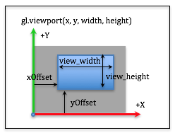
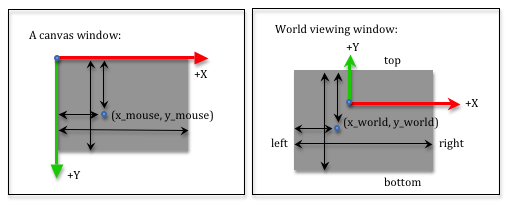

..  Copyright (C)  Wayne Brown
  Permission is granted to copy, distribute
  and/or modify this document under the terms of the GNU Free Documentation
  License, Version 1.3 or any later version published by the Free Software
  Foundation; with Invariant Sections being Forward, Prefaces, and
  Contributor List, no Front-Cover Texts, and no Back-Cover Texts.  A copy of
  the license is included in the section entitled "GNU Free Documentation
  License".

.. role:: raw-html(raw)
  :format: html

9.5 - Viewports
:::::::::::::::

A *projection transformation* has prepared your models for *clipping*,
which discards any primitive elements (points, lines or triangles)
that are outside the camera's field-of-view. Clipping is performed automatically
by the graphics pipeline after your *vertex shader* has been executed on every vertex
in a scene. The graphics pipeline has also automatically performed the
"perspective division" on all vertices in the scene. Now, its time to create an image!

This lesson describes how a scene's geometric data is mapped to a 2D image.

The Viewport Transformation
---------------------------

.. figure:: figures/image_coordinate_system.png
  :alt: Image Coordinate System
  :width: 251
  :height: 191
  :align: right

Your geometric data is defined by :code:`(x,y,z)` values that are inside a
2\ *x*\ 2\ *x*\ 2 *clipping volume* centered at the origin. Its time for
the pipeline to start creating a 2D image. The image will be mapped
into a HTML *canvas element*, so the image is created to be the same size (in pixels)
as the canvas element . A WebGL image uses a coordinate system that has
an origin in the lower-left corner,
with the +X axis going to the right and the +Y axis going up, as shown in
the image to the right. The vertex data from the *clipping volume* needs
to be mapped into image locations. This is done with two simple transformations:

#. Scale the :code:`(-1,-1)` to :code:`(+1,+1)` *viewing window* to the image's width and height.
#. Translate the lower-left corner at :code:`(-width/2,-height/2)` to the image's origin, :code:`(0,0)`.

In matrix format, this transformation is

.. matrixeq:: Eq1

   [M1: translate]*[M2: scale]*[M3: x;y;z;1]  = [M4: xImage;yImage;zDepth;1]

.. matrixeq:: Eq2

   [M1: 1, 0, 0, *width/2; 0, 1, 0, *height/2; 0, 0, 1, 0; 0, 0, 0, 1]*
   [M2: *width/2, 0, 0, 0; 0, *height/2, 0, 0; 0, 0, 1, 0; 0, 0, 0, 1]
   *[M3: x;y;z;1]  = [M4: xImage;yImage;zDepth;1]

Notice that we are only transforming the *x* and *y* coordinated of each
vertex because we are creating a 2D image. The *z* component
is carried along with the vertex, but its value remains unchanged.

You don't implement the viewport transformation. It is done
internally by the graphics pipeline. The default behaviour is
to cover the entire canvas with the rendering. However, you can
modify the *viewport* with this command:

.. Code-Block:: JavaScript

  gl.viewport(x_offset, y_offset, view_width, view_height);

  Viewport Parameters

The :code:`x_offset` and :code:`y_offset` parameters specify the offset from the
lower left corner and the :code:`view_width` and :code:`view_height` parameters
specify the size of the rendered image, in pixels. When taking into account that
the viewport may not cover the entire canvas,
the viewport transformation is:

.. matrixeq:: Eq3

   [M1: offset]*[M2: translate_to_window]*[M3: scale]*[M4: x;y;z;1]  = [M5: xImage;yImage;zDepth;1]

.. matrixeq:: Eq4

   [M1: 1, 0, 0, *x_offset; 0, 1, 0, *y_offset; 0, 0, 1, 0; 0, 0, 0, 1]*
   [M2: 1, 0, 0, *view_width/2; 0, 1, 0, *view_width/2; 0, 0, 1, 0; 0, 0, 0, 1]*
   [M3: *view_width/2, 0, 0, 0; 0, *view_width/2, 0, 0; 0, 0, 1, 0; 0, 0, 0, 1]
   *[M4: x;y;z;1]  = [M5: xImage;yImage;zDepth;1]

The following WebGL program allows you to experiment with the viewport command.

.. webgldemo:: W1
  :htmlprogram: _static/09_viewport1/viewport1.html
  :width: 300
  :height: 300

As you experiment with the viewport parameters, please verify that
you understand the following ideas:

* The viewport parameters determine the location and size of the rendered image
  inside the canvas element. The default is to cover the entire canvas: :code:`gl.viewport(0,0,canvas_width, canvas_height);`.
* The :code:`offsets` can be negative and the :code:`width` and :code:`height`
  can be larger than the size of the target canvas. In these cases, part
  of the rendered image will not be visible.
* If the :code:`width` and :code:`height` create a viewport that has a
  different aspect ratio than the original canvas window, the rendering is distorted.
* The :code:`viewport` command does not perform clipping! Clipping was performed
  in a previous stage of the graphics pipeline. The :code:`viewport` determines the size
  of the output image and the location of the image inside the target canvas element.
* If your desire is multiple distinct renderings inside a single canvas, you need
  to use a concept called "scissoring," which is described in the next lesson.

Mouse Events into World Locations
---------------------------------

Sometimes you need to convert the location of a mouse cursor into
a location in your 3D virtual scene. Since you are viewing a 3D world,
a mouse location actually identifies an infinite number of points that lie
on a ray from the camera through the mouse's location into the 3D world.
You can convert a mouse location into a *viewing window* location using
simple proportions. Study the two diagrams below.

The screen coordinates used by a mouse have the +Y axis going down the screen,
but this does not matter if you use the same distances for your proportions.
In both diagrams we measure distances from the left side and the top side.
We use the variables :code:`left`, :code:`right`, :code:`bottom` and :code:`top`
that were used to define our projection matrices to describe the world
*viewing window*. Let's use :code:`canvas_width` and :code:`canvas_height` to describe
the size of the canvas window. The relative distances in both windows must be
equal. Therefore:

.. Code-Block:: JavaScript

  x_mouse / canvas_width  === (x_world - left) / (right - left)
  y_mouse / canvas_height === (top - y_world)  / (top - bottom)

If you know a mouse location, :code:`(x_mouse, y_mouse)`, you can solve the
above equations to calculate the equivalent location in the virtual world
on the *viewing window*. That is:

.. Code-Block:: JavaScript

  x_world = (x_mouse / canvas_width) * (right - left) + left;
  y_world = top - (y_mouse / canvas_height) * (top - bottom);

If you want to convert a 3D location in the *viewing window* to a mouse location,
the calculations are:

.. Code-Block:: JavaScript

  x_mouse = ((x_world - left) / (right - left)) * canvas_width;
  y_mouse = ((top - y_world)  / (top - bottom)) * canvas_height;

The following WebGL program allows you to experiment with mouse
coordinates converted to world coordinates.

.. webgldemo:: W2
  :htmlprogram: _static/09_mouse_location/mouse_location.html
  :width: 300
  :height: 300

As you experiment with the mouse tracking demo, please verify that
you understand the following ideas:

* The mouse location is a 2D position within a canvas element. We can
  project that location into a 3D world, either to a single point
  on the *viewing window* or as a ray that is cast into the 3D world.
  The ray is defined by two points: the location of the camera and
  the location of the 3D point.

Glossary
--------

.. glossary::

  viewport
    The portion of an HTML canvas you want to render into. The default
    viewport is the entire canvas.

.. index:: viewport, viewport transformation

