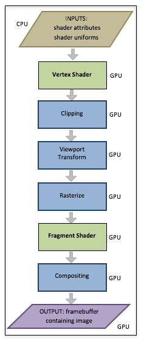

..  Copyright (C)  Wayne Brown
  Permission is granted to copy, distribute
  and/or modify this document under the terms of the GNU Free Documentation
  License, Version 1.3 or any later version published by the Free Software
  Foundation; with Invariant Sections being Forward, Prefaces, and
  Contributor List, no Front-Cover Texts, and no Back-Cover Texts.  A copy of
  the license is included in the section entitled "GNU Free Documentation
  License".

.. role:: raw-html(raw)
  :format: html

9.7 - Summary
:::::::::::::

This lesson puts transformations (chapters 6),
cameras (chapter 7) and projections (chapter 9)
into perspective (no pun intended)!

A Review of the Graphics Pipeline
---------------------------------

  The Graphics Pipeline

To understand computer graphics you must understand the *graphics pipeline*.
Let's review the *graphics pipeline* again.

You have a set of models that define a virtual scene. The models contain
two basic types of data:

#. **Geometric data** composed of vertices, :code:`(x,y,z)`, and normal vectors,
   :code:`<dx,dy,dz>`, and
#. **Material properties data** such as colors, texture coordinates,
   shininess coefficients, etc..

This data is passed through the graphics pipeline to create
a 2D image of the scene. The first stage of the pipeline deals with the
geometry data in a *vertex shader*, while a *fragment shader* deals with
the material properties data.

In the first stage (a *vertex shader program*):

#. The geometric data is transformed using a 4-by-4 transformation matrix to
   place the geometry of the model in its desired location, orientation, and size.
   This is referred to as the "model transform."

#. The geometric data is transformed using a 4-by-4 transformation matrix
   to place the scene in front of a virtual camera. This is referred to as the
   "camera transform" (or the "view transform").

#. The geometric data is projected onto a 2x2x2 *clipping volume*, the
   front face of which defines a 2D *viewing window*. This is referred
   to as the "projection transform."

All of these transformations happen in a *vertex shader program*. You
create the required transformation matrices in a JavaScript program and
a *vertex shader* program executing on a GPU performs the actual geometric
data transformations. Most WebGL programs combine all of these transformations
into a single 4-by-4 transformation matrix. The ordering of the transformation
matrices from right to left is critical because the *model transformation* must
happen first, then the *camera transformation* and finally the
*projection transformation*. In matrix format, your JavaScript program creates:

.. matrixeq:: Eq1

  [M4: VertexTransform] = [M1: ProjectionMatrix]*[M2: CameraMatrix]*[M3: ModelMatrix]

This single transformation transforms a scene's geometry data into a *clipping volume* --
a 2x2x2 cube centered at the origin. All geometry outside this cube is
*clipped* away. Then the pipeline begins to create a 2D
image by mapped the vertices into a 2D array of pixels. This is referred to as the
"viewport transform."

The geometry data is now positioned in the correct place inside a 2D image.
However, all of these transformations have only been done
on the vertices of the points, lines and triangles.
All of the pixels that compose a primitive object have not been determined.
That is the next step in the pipeline and it is called the "rasterize" stage.

Rasterize
---------

To *rasterize* means to convert vector based descriptions of a geometric
object into a set of pixels. For example, if we know the pixel locations
of three vertices that define a triangle, to *rasterize* the triangle means
we determine which pixels lie inside the boundaries formed by the triangle's
vertices and edges. The *rasterize* stage of the pipeline is done automatically.

For each pixel that is used to compose a primitive object, a "fragment" is
created. A fragment knows its pixel location and other information that might
be needed to assign the pixel a color value. Each "fragment" that is created is
passed through a *fragment shader* executing on the GPU. A *fragment
shader* program performs calculations that
assign an appropriate color to its pixel.

The next two chapters explain how a *fragment shader* calculates the
color of a pixel.

Glossary
--------

.. glossary::

  rasterize
    Convert a vector based description of a geometric object into a set of pixels.

  fragment
    A group of values related to an individual pixel in an image.

  fragment shader
    A computer program, written in GLSL, that calculates a color for a pixel
    using information contained in a fragment.

.. index:: rasterize, fragment, graphics pipeline

