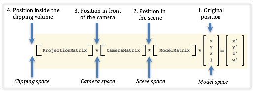

.. Copyright (C)  Wayne Brown
  Permission is granted to copy, distribute
  and/or modify this document under the terms of the GNU Free Documentation
  License, Version 1.3 or any later version published by the Free Software
  Foundation; with Invariant Sections being Forward, Prefaces, and
  Contributor List, no Front-Cover Texts, and no Back-Cover Texts.  A copy of
  the license is included in the section entitled "GNU Free Documentation
  License".

.. role:: raw-html(raw)
  :format: html

10.1 - Introduction to Lighting
:::::::::::::::::::::::::::::::

Your eyes "see" an object because light has reflected
from the object into your eye. Without light, nothing is visible. This lesson
introduces the basic properties of reflected light and how we can simulate
light in a virtual scene.

This is a major shift in this textbook. Up to this time we have been
discussing the manipulation of the geometry of virtual models and how
to compose a scene. All of this work has been accomplished by transformation
matrices that do their work in a *vertex shader* program. Now we need to
discuss how to create the visual appearance of model surfaces. The majority
of this work will be done in a *fragment shader program*.

Please Review Light Properties
------------------------------

Please re-read lesson `3.6 - Modeling Light Sources`_.

.. admonition:: Pause

  Did you re-read lesson 3.6. If not, please read it now. It's important!

Modeling a Light Source
-----------------------

There are many different sources of light. Four commonly used models to
describe light sources are:

* **Point** light source: :raw-html:` `
  The light is inside the scene at a specific location and
  it shines light equally in all directions (e.g., a table lamp).
  **Point** light sources are modeled using a single location, :code:`(x,y,z,1)`.
  :raw-html:`   `

* **Sun** light source:  :raw-html:` `
  The light is outside the scene and far enough away that
  all rays of light have the same direction.
  An example is the sun in an outdoor scene. **Sun** light sources are
  modeled as a single vector, :code:`<dx, dy, dz, 0>`, which defines the direction
  of the light rays.
  :raw-html:`   `

* **Spotlight** light source:  :raw-html:` `
  The light is focused and forms a cone-shaped envelop as it
  projects out from the light source. An example is a spotlight in a theatre.
  **Spotlights** are modeled as a location, :code:`(x,y,z,1)`, a direction, :code:`<dx.dy,dz,0>`,
  a cone angle, and an exponent that defines the density of light inside
  the spotlight cone.
  :raw-html:`   `

* **Area** light source:  :raw-html:` `
  The light source comes from a rectangular area and
  projects light from one side of the rectangle. An example is a
  florescent light fixture in a ceiling panel. **Area** light sources
  are modeled using a location, :code:`(x,y,z,1)`, a geometric model,
  such as a rectangle, (4 vertices), and a direction, :code:`<dx.dy,dz,0>`.
  :raw-html:`   `

All of these models have one common attribute: the direction of light rays
from a light source. In the following lessons we will discuss how the direction of
light is used to calculate the color of individual pixels on a surface.

Color of Light
--------------

Light from a table lamp or the sun it typically a shade of white. However,
some sources of light are not white, such as a red stop
light or a blue neon sign. When we
model a light source, we specify its color using an RGB color
value. If a light source gives off white light, we model its color
as :code:`(1.0, 1.0, 1.0)`. If the light source gives off red light, we model its
color as :code:`(1.0, 0.0, 0.0)`. Each color component is a percentage: :code:`0.0`
means no color; :code:`1.0` means 100% color. Note that white light, :code:`(1,1,1)`,
is composed of 100% red, 100% blue, and 100% green light.

If a white light shines on an object, and you see the object as red, then the
red component of the reflected light has reached your eyes. Note that the green
and blue components of the
light were absorbed by the object's surface. A red object absorbs all
wavelengths of light except the red wavelengths. This means that if a blue light
reflects from a red surface, you see black! All of the blue light
was absorbed by the surface and there was no red light to reflect. Our lighting
models will implement this basic characteristic of light.

Calculating Light Reflection
----------------------------

To calculate light reflections, which will be done in a *shader program* executed by
a GPU, a *shader program* must know the position and orientation
of three things:

* **the object being rendered**, whose geometry is stored in a GPU *vertex object buffer*,
* **the camera**, whose definition is in a transformation matrix, and
* **the light sources**, whose definition will be passed to a *shader program* as :code:`uniforms`
  because a light source does not change for a specific rendering.

All example WebGL programs in this textbook, **up to this point**, have used a
single transformation matrix to position, orient, and scale objects in a scene.
However, now that we want to do lighting calculations, we need to re-think the
use of a single transformation matrix. Consider the three
fundamental transformations done on the vertices of a model, which are shown
in the diagram below.

  Possible "spaces" for lighting calculations

If we break a transformation into its distinct parts, we have four possible
geometric *spaces* in which to perform lighting calculations:

#. **The original position**: (*model space*) :raw-html:` `
   This is the original definition of the object. It
   does not represent the object's position or orientation for a particular
   scene. Therefore these values **can't** be used for lighting calculations.
   :raw-html:`   `

#. **Position in the scene**: (*scene space*) :raw-html:` `
   This is the position and orientation of an object
   after being transformed by the *model transform*. This places
   the object's location and orientation relative to the other objects in
   the scene. Assuming that we know the location and orientation of the light
   sources and the camera, we could perform accurate light reflection calculations
   using these values.
   :raw-html:`   `

#. **Position in front of the camera**: (*camera space*)  :raw-html:` `
   This is the position and orientation
   of an object after being moved in front of a stationary camera located
   at the global origin. This retains
   the relative location and orientation of objects in a scene. Assuming that
   we know the location and orientation of the light sources, we can perform
   light reflection calculations using these values. Notice that for these
   geometric values, the camera is located at the origin with its local coordinate
   system aligned to the global coordinate system. This has the advantage
   that we don't have to send the camera's location and orientation to the
   *shader programs* because we know exactly where the camera is.
   :raw-html:`   `

#. **Position inside the clipping volume**: (*clipping space*) :raw-html:` `
   The geometric values have been
   transformed by the *projection transform* and are ready for *clipping*.
   The meaning of the :code:`x` and :code:`y`
   values have been de-coupled from the :code:`z` values of each geometric vertex.
   The vertices no longer have their same relative relationship with other
   3D positions in the scene.
   (Remember, a perspective transform does a non-linear mapping of the *z*
   values into the *clipping volume*.) Therefore, these values **can't** be
   used for lighting calculations.
   :raw-html:`   `

Therefore, we have two possible "3D spaces" in which to perform
lighting calculations. The "camera space" has a clear advantage because
the camera is in a known location and orientation and we don't have to
transfer its position and orientation to the GPU *shader programs*. In addition,
the camera is located at the global origin which simplifies some
of the light reflection calculations.

To perform lighting calculations in *shader programs* we will create
two distinct transformation matrices in our JavaScript program and
pass both of them to the *shader programs*. This transformation matrix:

.. matrixeq:: Eq1

  [M1: ProjectionMatrix]*[M2: CameraMatrix]*[M3: ModelMatrix]*[M4: x;y;z;w] = [M5: x';y';z';w']

will perform all of the transformations required for the graphics pipeline,
while the following transformation matrix will produce locations and
orientations for lighting calculations.

.. matrixeq:: Eq1

  [M2: CameraMatrix]*[M3: ModelMatrix]*[M4: x;y;z;w] = [M5: x';y';z';w']

Obviously you should avoid unnecessary calculations, which means
the camera and model transformations should not be multiplied twice, so
your Javascript code should look something like this:

.. Code-Block:: Javascript

  // Create the lighting transformation.
  matrix.multiply(camera_space, camera, model);

  // Create the pipeline transformation.
  matrix.multiply(clip_space, projection, camera_space);

Lighting Algorithm
..................

To simulate light in a scene, the following steps need to be performed:

#. In your JavaScript program:

   #. Create a *camera space* transformation matrix. (*CameraMatrix* times *ModelMatrix*)
   #. Multiply the light model's data times the *camera space*
      transformation matrix to put the light source into
      its correct position and orientation in *camera space*.
   #. Transfer the light model's data to the GPU's *shader programs*
   #. Create an second transformation matrix that includes the desired
      *projection matrix*. (We will call this the :code:`clip_space` transformation matrix.)
   #. Transfer the :code:`camera_space` and the :code:`clip_space`
      transformation matrices to the GPU's *shader programs*.

#. In your GPU *shader program*:

   #. Assume the camera is at the global origin looking down the -Z axis.
   #. Use the light source data and the model data to calculate light reflection.
   #. Assign a color to a pixel based on the light reflection.

Lesson Organization
-------------------

The following lessons on lighting describe how to implement *point light sources*
and follow this general outline:

* Introduce a "lighting model."
* Explain the math needed to calculate the "lighting model."
* Describe the key features of a WebGL program that implements the "lighting model".
  **It is very important that you experiment with the WebGL program to understand
  the visual effects of the "lighting model"**.
* Explain the details of the *shader programs* that implement the "lighting model."

If you understand how to implement lighting for *point light sources*, you should
be able to extend these ideas to other types of lights, such as *sun*, *spotlights*,
and *area lights*.

The details can be overwhelming, so please take your time and master each
*lighting model* before moving on to the next, more complex *lighting model*.

Glossary
--------

.. glossary::

  light source
    Where light in a scene comes from.

  light model
    A set of data and algorithms that simulates a light source and how it
    interacts with objects in a scene.

  model space
    A geometric definition of a model using its local coordinate system.
    Models are defined in relationship to the global origin, which
    simplifies their transformation into a scene.

  scene space
    A geometric definition of a model after it has been positioned
    and oriented in a scene.

  camera space
    A geometric definition of a model after it has been positioned
    and oriented in a scene and moved in front of a camera.

  clipping space
    A geometric definition of a model after it has been transformed
    into *normalize device coordinates*, also known as the *clipping volume*.

Self Assessment
---------------

.. mchoice:: 10.1.1
  :random:

  What is a "light model"?

  - A set of data and algorithms that simulates a light source and how it interacts with objects in a scene.

    + Correct.

  - A geometric representation of a lamp.

    - Incorrect. You might create such an object for a scene, but lighting models are only concerned with the light from its bulb.

  - A model that does not weigh much.

    - Incorrect. That's silly!

  - An equation that explains light ray reflections from a surface.

    - Incorrect. But this might be a part of a light model.

.. mchoice:: 10.1.2
  :random:

  Why does a "point light source" not need a "direction" for modeling light (like
  the other lighting models)?

  - A point light source shines light in all directions.

    + Correct.

  - A point light source has an implied direction due to its location.

    - Incorrect.

  - A point light source is not inside the scene, and therefore its direction of light does not matter.

    - Incorrect.

  - A point light source can't send light in specific directions.

    - Incorrect. It actually sends light in all directions.

.. mchoice:: 10.1.3
  :random:

  Which types of light sources require a direction for the light? (Select all that apply.)

  - Point light source

    - Incorrect. Point light sources shine light in all directions.

  - Sun light source

    + Correct. All light rays from the sun have the same direction because the sun is so far away from the scene.

  - Spotlight light source

    + Correct. The direction the spotlight is pointed is critical.

  - Area light source

    + Correct. Area light sources only shine light to one side of the defined area.

.. mchoice:: 10.1.4
  :random:

  If a flashlight emits red light and you shine it on a green object, what color will your eye see?

  - black

    + Correct. All of the red light is absorbed by the green object and there is no green light to reflect.

  - red

    - Incorrect. Nope!

  - green

    - Incorrect. You might think a green object is always green, but the light illuminating it matters!

  - blue

    - Incorrect. Say what?

.. mchoice:: 10.1.5
  :random:

  In what geometric space will lighting calculations be perform in this textbook?

  - camera space

    + Correct. The camera is at the origin looking down the -Z axis, so we don't have to
      transfer the camera data to the *fragment shader* and some to the lighting calculations
      are simplified because the camera is at :code:`(0,0,0,1)`.

  - model space

    - Incorrect. The relationships between the models, camera, and lights has not been
      established for the scene.

  - scene space

    - Incorrect. Lighting calculations can be done in scene space, but the location and orientation
      of the camera must be copied to the *fragment shader* and some of the lighting calculations
      are more complex.

  - clipping space

    - Incorrect. The relationships between the models, camera, and lights is wrong because of
      the conversion to *normalized device coordinates*.

.. mchoice:: 10.1.6
  :random:

  How many transformation matrices will a *vertex shader* need when rendering a model?

  - Two, one to put geometry into camera space, and another to put geometry into clipping space.

    + Correct.

  - Only the :inline_matrixeq:`[projection]*[camera]*[model]` transform.

    - Incorrect. This puts geometry into clipping space and we need geometry in camera space to calculate lighting.

  - Three: the projection, camera, and model transformations.

    - Incorrect. If you pass these matrices as separate transformations, the *vertex shader*
      will have to multiply them together every time it processes a vertex, which will cause
      duplication of work and greatly slow down rendering.

  - Only one, the projection matrix.

    - Incorrect. The project matrix, by itself, is not very useful.

.. index:: light source, light model, point light source, sun light source, spotlight light source, area light source, model space, scene space, camera space, clipping space

.. _3.6 - Modeling Light Sources: ../03_model_data/06_modeling_lights.html

