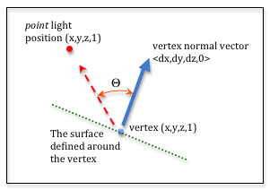
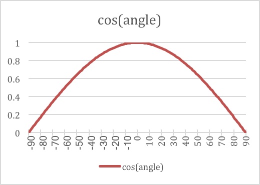

.. Copyright (C)  Wayne Brown
  Permission is granted to copy, distribute
  and/or modify this document under the terms of the GNU Free Documentation
  License, Version 1.3 or any later version published by the Free Software
  Foundation; with Invariant Sections being Forward, Prefaces, and
  Contributor List, no Front-Cover Texts, and no Back-Cover Texts.  A copy of
  the license is included in the section entitled "GNU Free Documentation
  License".

.. role:: raw-html(raw)
  :format: html

10.2 - Diffuse Lighting
:::::::::::::::::::::::

This lesson discusses how to implement `diffuse reflection`_ of light.

A Simple Diffuse Lighting Model
-------------------------------

.. figure:: ../03_model_data/figures/diffuse_light.png
  :align: right

  Diffuse light reflection.

Light that directly strikes an object and then reflects in all directions is
called "diffuse" light. The amount of light reflection is determined by the
angle between the light ray and the surface normal vector. In Physics,
`Lambert's cosine law`_ provides an equation for calculating the intensity
of diffuse light.

The Math for Diffuse Reflection
-------------------------------

  Diffuse reflection calculation.

To perform diffuse lighting calculations each vertex that defines a triangle
must have an associated normal vector. The normal vector defines a direction
that is projecting out from the front side of the triangle. The normal vector
defines how light will reflect off of a surface defined at the vertex. The
normal vector may be 90 degrees to the surface of the triangle, or it might be
at some other angle to simulate a curved surface.

The diagram to the right labels the data needed to calculate diffuse
reflection. We need to calculate the angle between the vertex's normal vector
and a vector pointing at the light source from the vertex. This angle
is labeled :raw-html:`&Theta;` in the diagram.

The dot product of two vectors is defined as the sum of the products of their
associated terms. 3D vectors are normally stored as arrays, where :code:`(v[0], v[1], v[2])`
is the :code:`<dx, dy, dz>` values of the vector. Therefore, the dot product of
vectors v0 and v1 is:

.. Code-block:: JavaScript

  function dotProduct (v0, v1) {
    return v0[0]*v1[0]  +  v0[1]*v1[1]  +  v0[2]*v1[2];
  };

It can be shown that the cosine of the angle between two vectors is equal to
the dot product of two vectors divided by the lengths of the two vectors.
In code format, this means that:

.. Code-block:: JavaScript

  cos(angle_between_v0_and_v1) = dotProduct(v0, v1) / (length(v0) * length(v1))

If both v0 and v1 are normal vectors that have a length of 1, the dot product
gives the cosine of the angle without any division.

Examine the plot of a cosine curve to the right. Notice that when the angle
is zero, the cosine of zero is 1.0. As the angle increases, the cosine of the angle
curves to zero. When the angle is 90 degrees, the cosine of 90 is 0.0.
This is *lambert's cosine law*. The cosine values are treated as percentages of color.
When the angle is zero, cos(0) is 1.0, and you get 100% color. When the angle
is 90 degrees, cos(90) is zero and you
get 0% color. When the angle becomes greater than 90 or less than -90 the cosine
goes negative. This is an indication that the front side of the triangle
is pointing away from the light source. You can't have a negative percentage
of light, so we clamp the cosine of the angle to values between 0.0 and 1.0.

A WebGL Program for Diffuse Lighting
------------------------------------

Experiment with the following WebGL program.

* How does moving the light source position change the colors of the model surfaces?
* How does moving the camera change the colors of the model surfaces?

.. webgldemo:: W1
  :htmlprogram: _static/10_diffuse_light/diffuse_light.html
  :width: 300
  :height: 300

As you experiment with the WebGL program, please make sure you
observe the following characteristics of *diffuse reflection*.

* Moving the camera has no impact on diffuse reflection. The only elements
  involved in the *diffuse reflection* calculations are the object's
  vertices and the location of the *point light source*.

* If you move the light source close to a particular face, every pixel
  on the face potentially has a different color. The program is
  calculating the diffuse reflection in the *fragment shader* pixel by pixel.

* Notice that faces that should be in the shadow of another object
  still have *diffuse reflection*. Our simple *light model* does not account
  for light being blocked by other objects in the scene.

* This lighting model does not account for the distance from the light to
  a surface. In the real world, the further an object is from a light source,
  the less light it receives. We will investigate this in later lessons.

Diffuse Reflection in Shader Programs
-------------------------------------

Please study the following *shader programs* using the comments below as
your guide.

Vertex Shader
*************

.. Code-Block:: JavaScript
  :linenos:

  // Vertex Shader
  precision mediump int;
  precision mediump float;

  // Scene transformations
  uniform mat4 u_To_clipping_space; // Projection, camera, model transform
  uniform mat4 u_To_camera_space;   // Camera, model transform

  // Light model
  uniform vec3 u_Light_position;

  // Original model data
  attribute vec3 a_Vertex;
  attribute vec3 a_Color;
  attribute vec3 a_Normal;

  // Values initialized for the fragment shader (interpolated values)
  varying vec3 v_Vertex;
  varying vec4 v_Color;
  varying vec3 v_Normal;

  void main() {

    // Perform the model and view transformations on the vertex and pass
    // this location to the fragment shader.
    v_Vertex = vec3( u_To_camera_space * vec4(a_Vertex, 1.0) );

    // Perform the model and view transformations on the vertex's normal
    // vector and pass this normal vector to the fragment shader.
    v_Normal = vec3( u_To_camera_space * vec4(a_Normal, 0.0) );

    // Pass the vertex's color to the fragment shader.
    v_Color = vec4(a_Color, 1.0);

    // Transform the location of the vertex for the graphics pipeline
    gl_Position = u_To_clipping_space * vec4(a_Vertex, 1.0);
  }

+------------+--------------------------------------------------------------------------+
+ Line(s)    + Description                                                              +
+============+==========================================================================+
+ 6, 36      + :code:`u_To_clipping_space` is a single transformation matrix that       +
+            + contains the model, camera, and projection transforms. It is used        +
+            + once in line 36 to calculate the output value, :code:`gl_Position`, of   +
+            + the *vertex shader*. A location always has with a homogeneous            +
+            + coordinate of 1.0.                                                       +
+------------+--------------------------------------------------------------------------+
+ 7, 26, 30  + :code:`u_To_camera_space` is a single transformation matrix that         +
+            + contains the model and camera transforms. It is used twice (lines 26     +
+            + and 30) to transforms the vertex's location and normal vector into       +
+            + *camera space*.                                                          +
+------------+--------------------------------------------------------------------------+
+ 10         + :code:`u_Light_position` is a single location, :code:`(x,y,z)`, that     +
+            + contains of the point light source in *camera space*. This is used in    +
+            + the *fragment shader*.                                                   +
+------------+--------------------------------------------------------------------------+
+ 26, 30, 33 + All *fragment shader* calculations will be done in *camera space*,       +
+            + so the vertex data is transformed by the *model* and *camera*            +
+            + transformations, but not the *projection* transformation.                +
+            +                                                                          +
+            + The location :code:`(x,y,z,1)`, normal vector :code:`<dx,dy,dz,0>`,      +
+            + and color :code:`(red,green,blue,1)` of this vertex that will be         +
+            + interpolated across the face of the geometric primitive. Therefore, we   +
+            + put this data into *varying variables*.                                  +
+            +                                                                          +
+            + There are several conversions between 3-component and 4-component        +
+            + "vectors". A 4-component value is required to perform matrix             +
+            + multiplication between a 4x4 matrix and a vertex or vector. Notice       +
+            + that a vertex always gets a 4\ :sup:`th` component of 1.0, while a       +
+            + vector always gets a 4\ :sup:`th` component value of 0. This is          +
+            + because vertices can be translated, while vectors have no position       +
+            + and can't be translated.                                                 +
+------------+--------------------------------------------------------------------------+

Fragment Shader
***************

.. Code-Block:: JavaScript
  :linenos:

  // Fragment shader program
  precision mediump int;
  precision mediump float;

  // Light model
  uniform vec3 u_Light_position;

  // Data coming from the vertex shader
  varying vec3 v_Vertex;
  varying vec4 v_Color;
  varying vec3 v_Normal;

  void main() {

    vec3 to_light;
    vec3 fragment_normal;
    float cos_angle;

    // Calculate a vector from the fragment location to the light source
    to_light = u_Light_position - v_Vertex;
    to_light = normalize( to_light );

    // The fragment's normal vector is being interpolated across the
    // geometric primitive which can make it un-normalized. So normalize it.
    fragment_normal = normalize( v_Normal);

    // Calculate the cosine of the angle between the vertex's normal
    // vector and the vector going to the light.
    cos_angle = dot(fragment_normal, to_light);
    cos_angle = clamp(cos_angle, 0.0, 1.0);

    // Scale the color of this fragment based on its angle to the light.
    // Don't scale the alpha value, which would change the transparency
    // of the fragment
    gl_FragColor = vec4(vec3(v_Color) * cos_angle, v_Color.a);
  }

The angle between the face's normal vector and a vector from this fragment
to the light source determines the intensity of the reflected light. This
is calculated as follows:

+------------+--------------------------------------------------------------------------+
+ Line(s)    + Description                                                              +
+============+==========================================================================+
+ 20, 21     + Calculates a vector from the fragment to the light source,               +
+            + :code:`to_light`. To avoid division in the angle calculation, the vector +
+            + is normalized to a length of 1. *Shader programs* implement vector and   +
+            + matrix math, so when you subtract two :code:`vec3` variables it is       +
+            + creating a :code:`vec3` result.                                          +
+------------+--------------------------------------------------------------------------+
+ 25         + Normalizes the fragment's "face normal" because its value is             +
+            + interpolated from the values calculated at the vertices of the           +
+            + geometric primitive.                                                     +
+------------+--------------------------------------------------------------------------+
+ 29         + Calculates the dot production of the two vectors. No division is         +
+            + required because both vectors have a length of 1.                        +
+------------+--------------------------------------------------------------------------+
+ 30         + Makes sure the cosine of the angle between the two vectors is between    +
+            + 0.0 and 1.0. Values greater than 1.0 will only occur if the length of    +
+            + the vectors is not 1, which should never happen for valid data. Values   +
+            + less than 0.0 happen when the angle between the two vectors is greater   +
+            + than 90 degrees.                                                         +
+------------+--------------------------------------------------------------------------+
+ 35         + Calculates the color of the fragment as a percentage of its original     +
+            + color. The color value is a (red, green, blue, alpha) value. We want     +
+            + to reduce the amount of color but not change the alpha value. That is    +
+            + why the color is converted into a :code:`vec3`, scaled by the            +
+            + percentage, and then converted back to a :code:`vec4` with the original  +
+            + alpha value unchanged.                                                   +
+------------+--------------------------------------------------------------------------+

Summary
-------

The example WebGL program described in this lesson is based on a "point light source". If you
had a different type of light source, such as a *sun light source*, the *shader programs*
would have to change accordingly, but the fundamental math would be the same.

The technique of interpolating a normal vector across the face of a geometric primitive
to calculate diffuse reflection was first created by Bui Tuong Phong and therefore
is known as `Phong shading`_.

Glossary
--------

.. glossary::

  diffuse reflection
    The amount of reflected light off of a surface is a percentage based on
    the angle that the light strikes the surface.

  Lambert's cosine law
    The relationship between the angle a light ray hits the surface of a
    face and the amount of color that is reflected can be calculated using
    a cosine function.

  dot product
    A mathematical operation on vectors that calculates the angle between two vectors.

Self Assessment
---------------

.. mchoice:: 10.2.1
  :random:

  When diffuse light reflects from a surface it strikes, it reflects in ...

  - all directions.

    + Correct.

  - an equal and opposite angle from the angle it hits the surface.

    - Incorrect. This is called specular reflection.

  - a direction towards the camera in the scene.

    - Incorrect. How does a surface even know where the camera is?

  - two directions, based on the angle of reflection.

    - Incorrect. That silly! What two directions?

.. mchoice:: 10.2.2
  :random:

  The maximum amount of diffuse light is reflected when ...

  - the light strikes the surface at the same angle as the surface's normal vector.

    + Correct. 90 degrees to the surface

  - the light strikes the edge of a surface.

    - Incorrect.

  - light strikes the surface at a very sharp angle, such as 5 degrees.

    - Incorrect. This is when diffuse light reflection is the weakest.

  - the light's color is red.

    - Incorrect. The color of a light source does not affect the amount of reflection.

.. mchoice:: 10.2.3
  :random:

  The dot product of two vectors is calculated using which of the following formulas?

  - :code:`v0[0]*v1[0]  +  v0[1]*v1[1]  +  v0[2]*v1[2]`

    + Correct. Multiply the corresponding terms and add.

  - :code:`v0[0]+v1[0]  *  v0[1]+v1[1]  *  v0[2]+v1[2]`

    - Incorrect.

  - :code:`v0[0]*v1[0]  *  v0[1]*v1[1]  *  v0[2]*v1[2]`

    - Incorrect.

  - :code:`v0[0] - v1[0]  +  v0[1] - v1[1]  +  v0[2] - v1[2]`

    - Incorrect.

.. mchoice:: 10.2.4
  :random:

  The dot product of two vectors is equivalent to what property between the two vectors?

  - The cosine of the angle between them (assuming both vectors have unit length).

    + Correct.

  - The cosine of the angle between them.

    - Incorrect. It is only the cosine of the angle if the the vectors have been normalized.

  - Their combined length.

    - Incorrect.

  - Their average direction.

    - Incorrect.

.. mchoice:: 10.2.5
  :random:

  What is *lambert’s cosine law*?

  - The intensify of diffuse light reflection is proportional to the cosine of the angle between
    the surface's normal vector and a light ray.

    + Correct.

  - The cosine of an angle is always between -1.0 and 1.0.

    - Incorrect. The fact is true, but it is not *lambert’s cosine law*.

  - *Lambert’s cosine law* says that diffuse light reflection is calculated by a dot product.

    - Incorrect.

  - *Lambert’s cosine law* says that light bends around objects to illuminate all objects in a scene.

    - Incorrect.

.. mchoice:: 10.2.6
  :random:

  In the equation to calculate the fragment's color,
  :code:`gl_FragColor = vec4(vec3(v_Color) * cos_angle, v_Color.a);`
  why are the casting of vectors required? (Select all that apply.)

  - The value assigned to :code:`gl_FragColor` is required to be a 4 component vectors that
    contains :code:`(red, green, blue, alpha)` values.

    + Correct.

  - The diffuse light calculations affect the color of the fragment, but not it's transparency.

    + Correct.

  - Casting is always required when assigning a value to a variable.

    - Incorrect. NO!!!

  - Scaling a vector always requires a cast.

    - Incorrect. Any vector can be scaled without a cast, with the result
      being a new vector of the same size as the original.

.. index:: diffuse reflection, Lambert's cosine law, dot product

.. _diffuse reflection: https://en.wikipedia.org/wiki/Diffuse_reflection
.. _Lambert's cosine law: https://en.wikipedia.org/wiki/Lambert%27s_cosine_law
.. _Phong shading: https://en.wikipedia.org/wiki/Phong_shading