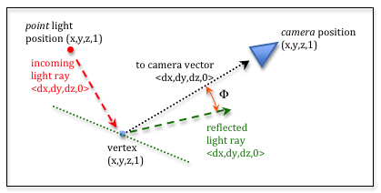
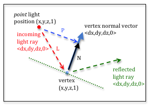
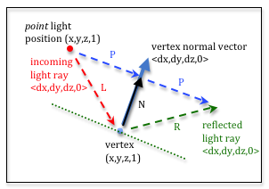

.. Copyright (C)  Wayne Brown
  Permission is granted to copy, distribute
  and/or modify this document under the terms of the GNU Free Documentation
  License, Version 1.3 or any later version published by the Free Software
  Foundation; with Invariant Sections being Forward, Prefaces, and
  Contributor List, no Front-Cover Texts, and no Back-Cover Texts.  A copy of
  the license is included in the section entitled "GNU Free Documentation
  License".

.. role:: raw-html(raw)
  :format: html

10.4 - Specular Lighting
::::::::::::::::::::::::

This lesson describes how to implement `specular reflection`_ of light.

A Specular Lighting Model
-------------------------

+------------------------------------------------------------------------------------+-----------------------------------------------------+
| A light ray that reflects from a surface at an equal but opposite angle to         | .. figure:: figures/specular_vector.png             |
| its incoming angle is called a "specular reflection." We assume that               |                                                     |
| the amount of light reflection is equal to the intensity of the incoming light.    |   Specular light reflection.                        |
| That is, we assume that the magnitude of the reflection vector is equal to the     |                                                     |
| magnitude of the incoming light vector. The reflection ray is indicated by         |                                                     |
| the green vector in the diagram to the right. Please study the diagram carefully.  |                                                     |
+------------------------------------------------------------------------------------+-----------------------------------------------------+
| If a specular reflection light ray goes straight into a camera, it is as if        | .. figure:: figures/specular_scattering.png         |
| the camera is seeing the light source directly, even though it has reflected from  |                                                     |
| an object. The camera is seeing the light of the light source, not                 |   Specular light scattering.                        |
| the color of the object. If you have a white light source, the specular            |                                                     |
| reflection will be white. If you have a red light source, the specular             |                                                     |
| reflection will be red.                                                            |                                                     |
|                                                                                    |                                                     |
| We assume there is a small amount of light scattering around the reflection        |                                                     |
| vector, but typically not much. The scattering                                     |                                                     |
| is centered around the reflection vector, as shown in the diagram to the right.    |                                                     |
+------------------------------------------------------------------------------------+-----------------------------------------------------+

  Specular light intensity.

If we calculate a vector from a fragment to the camera, and then calculate
the angle between it and the reflection vector, we can use the angle to estimate
the amount of specular reflection the camera
receives. If the angle is zero the camera is receiving the entire reflection light
ray. If the angle is very small, then some percentage of the reflection ray is going
into the camera due to scattering around the reflection ray. If the angle is large, then no light from
the reflection is entering the camera. If the angle is between small and large,
we need a way to calculate some percentage of reflected light that is entering
the camera. We used a cosine function to calculate diffuse light percentages, but
the cosine function is too broad for the a focused specular reflection. However,
if we raise the cosine function to a power, the curve collapses around the Y axis.
Experiment with various exponents in the plot of the cos(angle)\ :sup:`exp`
function below. By using various exponents for this equation, we can simulate various amounts of
light scattering around the specular reflection vector. If the exponent is large, such
as 100, then the cos(angle)\ :sup:`exp` function shrinks around the Y axis and only very small
angles will return a significant percentage value. If the exponent is small, such as 1.0,
a broad amount of light around the reflection ray will be simulated.

.. raw:: html

    

    <canvas id="myCanvas" width="300" height="150" style="border:1px solid blue;"></canvas> 
    cos(angle)1.0 
    0.1 <input type="range" id="exponent" min="0.1" max="128.0" value="1.0" step="0.1" style="width:300px" oninput="myDraw(this);"> 128
    

    

The Math for Specular Reflection
--------------------------------

To calculate specular reflection, we need two vectors:

* A vector from the fragment location to the camera.
* A reflected light vector

The angle between these two vectors determines the amount of specular
reflection.

To calculate a vector from the fragment position to the camera, subtract the
head of the vector (the camera) from the tail (the fragment location).
As we previously discussed, we are performing these calculations in
"camera space" and the camera is located at the global origin, :code:`(0,0,0)`.
Therefore, a vector to the camera is:

.. Code-Block:: JavaScript

  to_camera[0] = 0 - fragment_position[0]
  to_camera[1] = 0 - fragment_position[1]
  to_camera[2] = 0 - fragment_position[2]

We can calculate this vector by simply multiplying the fragment location by -1.

Calculating the Reflection Vector
*********************************

  Calculating the reflection vector

To calculate the reflection vector, we need to set up several intermediate
vectors. Please study the diagram to the right before proceeding with this
discussion. The position of the light source can be projected onto the vertex's
normal vector. This is the :code:`P` vector in the diagram. It can be shown that
a vector in the direction of the normal vector that has a length to the
projected point can be calculated by taking the dot product of :code:`-L` and a
normalized vertex normal vector. The dot product calculates the angle between
the two vectors, but only when the vectors have unit length. Notice that the
normal vector is normalized, but the :code:`-L` vector is not. This provides the
correct length for the :code:`N` vector to the projected point. To summarize, to calculate
:code:`N` we:

  Calculating the reflection vector

#. Normalize the vertex's normal vector to make it one unit in length. Let's call it :code:`n`.
#. Calculate the dot product of :code:`-L` and :code:`n`. Let's call this value :code:`s`.
#. Scale :code:`n` by :code:`s` to create the vector :code:`N`, which is in the direction of the
   vertex's normal vector and has a length to the projected point of the light source.
#. From simple vector addition, :code:`L + N === P`.

Now we know the vector :code:`P`. Observe that from simple vector addition,
the reflection vector :code:`R` is equal to :code:`N + P`. We can substitute
the calculations for :code:`N` and :code:`P` into this equation like this:

.. Code-Block:: JavaScript

  R = N + P
  R = n*dot_product(n,-L) + (L + N)
  R = n*dot_product(n,-L) + (L + n*dot_product(n,-L))
  R = 2*n*dot_product(n,-L) + L

If the direction of :code:`L` is flipped and the same logic is followed, the
reflection vector can be calculated using this formula:

.. Code-Block:: JavaScript

  R = 2*n*dot_product(n,L) - L   // When L goes from the vertex to the light source

The Percentage of a Reflection Ray a Camera Receives
****************************************************

We have a vector from the vertex to the camera and we have a reflection vector.
The angle between these two vectors indicates how much of the reflection ray goes into the
camera. The cosine of this angle, which is a percentage between 0.0 and 1.0
is raised to some power to simulate a focused bean of light around the
reflection ray. The exponent is typically called the "shininess" exponent.
The larger the exponent, the more shiny an object appears. Shiny objects
have small, focused specular reflection. Dull objects have large, spread out
specular reflection.

A WebGL Program for Specular Reflection
---------------------------------------

Experiment with the following WebGL program. Move both the light source and
the camera to see the interaction between them. In your mind visually
project the light source onto the object and its reflection into the camera.
Does the specular reflection make sense?
Please experiment with the program until it does.

.. webgldemo:: W1
  :htmlprogram: _static/10_specular_light/specular_light.html
  :width: 300
  :height: 300

As you experiment with the demonstration program, please make sure you
observe the following characteristics of specular reflection.

* The relative position of the object, the light source, and the camera
  impacts specular reflection.
  :raw-html:`  `

* The program is calculating the specular reflection in the *fragment shader*
  pixel by pixel.
  :raw-html:`  `

* This example is only calculating specular reflection. When a fragment
  has no specular reflection, the fragment is set to the color of the
  surface. This makes the rendering unrealistic, but we will fix this
  when we combine diffuse and specular lighting.
  :raw-html:`  `

* Our simple light model does not account for light being blocked by other
  objects in the scene. If an object is in a shadow caused by other objects,
  you can still see specular reflection. This is wrong, but acceptable in
  some rendering circumstances.
  :raw-html:`  `

* The color of the specular reflection is the color of the light from the light source.
  At the locations where the light from the light source is reflected directly
  into the camera's lens, the camera sees the light and not the color
  of the object.

Specular Reflection in Shader Programs
--------------------------------------

Please study the following *shader programs*. Then compare the programs
to the comments below.

Vertex Shader
*************

.. Code-Block:: JavaScript
  :linenos:
  :emphasize-lines: 12

  // Vertex Shader
  precision mediump int;
  precision mediump float;

  // Scene transformations
  uniform mat4 u_To_clipping_space; // Projection, camera, model transform
  uniform mat4 u_To_camera_space;   // Camera, model transform

  // Light model
  uniform vec3  u_Light_position;
  uniform vec3  u_Light_color;
  uniform float u_Shininess;

  // Original model data
  attribute vec3 a_Vertex;
  attribute vec3 a_Color;
  attribute vec3 a_Normal;

  // Data (to be interpolated) that is passed on to the fragment shader
  varying vec3 v_Vertex;
  varying vec4 v_Color;
  varying vec3 v_Normal;

  void main() {

    // Perform the model-camera transformations on the vertex and pass this
    // location to the fragment shader.
    v_Vertex = vec3( u_To_camera_space * vec4(a_Vertex, 1.0) );

    // Perform the model-camera transformations on the vertex's normal vector
    // and pass this normal vector to the fragment shader.
    v_Normal = vec3( u_To_camera_space * vec4(a_Normal, 0.0) );

    // Pass the vertex's color to the fragment shader.
    v_Color = vec4(a_Color, 1.0);

    // Transform the location of the vertex for the graphics pipeline.
    gl_Position = u_To_clipping_space * vec4(a_Vertex, 1.0);
  }

+------------+--------------------------------------------------------------------------+
| Line(s)    | Description                                                              |
+============+==========================================================================+
| 12         | This is the same vertex shader program used for color lighting in the    |
|            | previous lesson, with the addition of a new :code:`uniform` variable:    |
|            | :code:`u_Shininess`.                                                     |
+------------+--------------------------------------------------------------------------+
| 28, 32     | All calculations in the *fragment shader* will be done in *camera space* |
|            | so the vertex data is transformed by the *model* and *camera*            |
|            | transformations, but not the *projection* transformation.                |
+------------+--------------------------------------------------------------------------+

Fragment Shader
***************

The fragment shader calculates a reflection vector and then determines if
any reflected light should be used to color the pixel.

.. Code-Block:: JavaScript
  :linenos:

  // Fragment shader program
  precision mediump int;
  precision mediump float;

  // Light model
  uniform vec3  u_Light_position;
  uniform vec3  u_Light_color;
  uniform float u_Shininess;

  // Data coming from the vertex shader
  varying vec3 v_Vertex;
  varying vec4 v_Color;
  varying vec3 v_Normal;

  void main() {

    vec3 to_light;
    vec3 fragment_normal;
    vec3 reflection;
    vec3 to_camera;
    float cos_angle;
    vec3 specular_color;
    vec3 object_color;
    vec3 color;

    // Calculate a vector from the fragment location to the light source
    to_light = u_Light_position - v_Vertex;
    to_light = normalize( to_light );

    // The vertex's normal vector is being interpolated across the primitive
    // which can make it un-normalized. So normalize it.
    fragment_normal = normalize( v_Normal );

    // Calculate the reflection vector
    reflection = 2.0 * dot(fragment_normal,to_light) * fragment_normal
               - to_light;
    reflection = normalize( reflection );

    // Calculate a vector from the fragment location to the camera.
    // The camera is at the origin, so just negate the fragment location
    to_camera = -1.0 * v_Vertex;
    to_camera = normalize( to_camera );

    // Calculate the cosine of the angle between the reflection vector
    // and the vector going to the camera.
    cos_angle = dot(reflection, to_camera);
    cos_angle = clamp(cos_angle, 0.0, 1.0);
    cos_angle = pow(cos_angle, u_Shininess);

    // If this fragment gets a specular reflection, use the light's color,
    // otherwise use the objects's color
    specular_color = u_Light_color * cos_angle;
    object_color = vec3(v_Color) * (1.0 - cos_angle);
    color = specular_color + object_color;

    gl_FragColor = vec4(color, v_Color.a);
  }

+------------+--------------------------------------------------------------------------+
| Line(s)    | Description                                                              |
+============+==========================================================================+
| 27, 28     | Calculate a vector from the fragment location to the light source. The   |
|            | vector is normalize to make it unit length.                              |
+------------+--------------------------------------------------------------------------+
| 32         | The fragment normal is being interpolated from the normal vectors at     |
|            | the vertices and therefore its length can change. Normalize the          |
|            | vector's length to one unit.                                             |
+------------+--------------------------------------------------------------------------+
| 35-37      | Calculate the reflection vector and normalize it.                        |
+------------+--------------------------------------------------------------------------+
| 41-42      | Calculate a vector from the fragment location to the camera. Since the   |
|            | camera is at :code:`(0,0,0)`, the vector is equivalent to the fragment's |
|            | location, but flipped direction.                                         |
+------------+--------------------------------------------------------------------------+
| 46-48      | Calculate the cosine of the angle between the reflection vector          |
|            | and the vector going to the camera. Make sure if the value is negative   |
|            | that it is clamped to 0.0. Then raise the value to the                   |
|            | :code:`u_Shininess` power.                                               |
+------------+--------------------------------------------------------------------------+
| 52-54      | The *specular color* is a percentage of the light's color. If there      |
|            | is some percentage of the color that is not specular, use the color      |
|            | of the surface.                                                          |
+------------+--------------------------------------------------------------------------+
| 56         | Set the output, :code:`gl_FragColor`, to the calculated color.           |
+------------+--------------------------------------------------------------------------+

Type of Light Source
--------------------

The WebGL program in this lesson is based on a *point light source*. If you
have a different type of light source, such as a *sun light source*, the shader programs
would have to be changed because the definition of your light source would
change, but the fundamental math would be the same.

Glossary
--------

.. glossary::

  specular reflection
    Light from a light source reflects from the surface of an object
    directly into a camera.

  shininess
    The size of the specular highlight on an object. If an object is very
    smooth, the specular highlight will be small. For dull or rough objects,
    the size will be larger.

Self Assessment
---------------

.. mchoice:: 10.4.1
  :random:

  Specular light is ...

  - a refection of a light source that travels straight into the camera.

    + Correct.

  - any light ray that reflects off of a surface.

    - Incorrect.

  - a light ray that reflects off of a surface at the same angle it struck the surface.

    - Incorrect. This is a reflection ray, but only if it strikes the camera is it specular light.

  - always white.

    - Incorrect. Specular light is always the color of its light source and it can be any color.

.. mchoice:: 10.4.2
  :random:

  Specular reflection is calculated based on the angle between what two vectors? (Select two.)

  - a vector from the fragment to the light source.

    - Incorrect. This is the light hitting the surface. We want the light reflected off the surface.

  - a vector from the fragment to the camera.

    + Correct.

  - a vector that represents the reflection of the light source off a surface.

    + Correct.

  - the normal vector of the surface.

    - Incorrect.

.. mchoice:: 10.4.3
  :random:

  A vector from a fragment (in camera space) to the location of the camera can be
  calculated in the *fragment shader* using the statement: :code:`to_camera = -1.0 * v_Vertex;`.
  (See line 41.) Why?

  - The camera is at :code:`(0,0,0,1)` so :code:`camera_location - v_Vertex` simplifies to :code:`-1.0 * v_Vertex`.

    + Correct.

  - A vector to a location in space is simply the location treated as a vector.

    - Incorrect. This statement is true, but we want a vector from the fragment to the camera, which is in the opposite direction.

  - A location and a direction are basically the same thing.

    - Incorrect. NO! Locations and directions are very different.

  - Calculating a vector between two locations requires the subtract of the locations: "head minus tail."
    Therefore, getting a vector by multiplying by :code:`-1` is just a weird coincidence.

    - Incorrect.

.. mchoice:: 10.4.4
  :random:

  A reflection vector can be calculated using this equation: :code:`R = 2*n*dot_product(n,-L) + L`.
  What does :code:`n` represent?

  - The normal vector to the surface (normalized to unit length).

    + Correct.

  - The surface's normal vector.

    - Incorrect. It has the direction of the normal vector, but it must be normalized.

  - A "new" vector in the direction of the camera.

    - Incorrect.

  - A vector from the the light source to the fragment.

    - Incorrect. This is :code:`L` in the equation.

.. mchoice:: 10.4.5
  :random:

  A reflection vector can be calculated using this equation: :code:`R = 2*n*dot_product(n,-L) + L`,
  or this equation: :code:`R = 2*n*dot_product(n,L) - L`. When should each equation be used?

  - first equation: :code:`L` goes from the light source to the fragment. :raw-html:` `
    second equation: :code:`L` goes from the fragment to the light source. :raw-html:` `

    + Correct.

  - first equation: :code:`L` goes from the fragment to the light source. :raw-html:` `
    second equation: :code:`L` goes from the light source to the fragment. :raw-html:` `

    - Incorrect.

.. index:: specular reflection, shininess

.. _specular reflection: https://en.wikipedia.org/wiki/Specular_reflection
