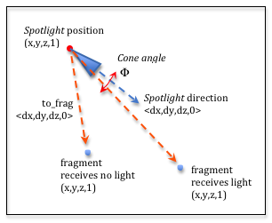
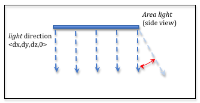

.. Copyright (C)  Wayne Brown
  Permission is granted to copy, distribute
  and/or modify this document under the terms of the GNU Free Documentation
  License, Version 1.3 or any later version published by the Free Software
  Foundation; with Invariant Sections being Forward, Prefaces, and
  Contributor List, no Front-Cover Texts, and no Back-Cover Texts.  A copy of
  the license is included in the section entitled "GNU Free Documentation
  License".

.. role:: raw-html(raw)
  :format: html

10.9 - Modeling Other Types of Light Sources
::::::::::::::::::::::::::::::::::::::::::::

In lesson 10.1 we discussed various types of light sources. Let's repeat
the list here for review.

* **Point** light source: :raw-html:` `
  The light is inside the scene at a specific location and
  it shines light equally in all directions (e.g., a table lamp).
  **Point** light sources are modeled using a single location, :code:`(x,y,z,1)`.
  :raw-html:`   `

* **Sun** light source:  :raw-html:` `
  The light is outside the scene and far enough away that
  all rays of light have the same direction.
  An example is the sun in an outdoor scene. **Sun** light sources are
  modeled as a single vector, :code:`<dx, dy, dz, 0>`, which defines the direction
  of the light rays.
  :raw-html:`   `

* **Spotlight** light source:  :raw-html:` `
  The light is focused and forms a cone-shaped envelop as it
  projects out from the light source. An example is a spotlight in a theatre.
  **Spotlights** are modeled as a location, :code:`(x,y,z,1)`, a direction, :code:`<dx.dy,dz,0>`,
  a cone angle, and an exponent that defines the density of light inside
  the spotlight cone.
  :raw-html:`   `

* **Area** light source:  :raw-html:` `
  The light source comes from a rectangular area and
  projects light from one side of the rectangle. An example is a
  florescent light fixture in a ceiling panel. **Area** light sources
  are modeled as a location :code:`(x,y,z,1)`, a geometric model,
  such as a rectangle, (4 vertices), and a direction, :code:`<dx.dy,dz,0>`.
  :raw-html:`   `

All of the lighting calculations we have discussed in lessons 10.2 through 10.8 used
a *point light source*. This lesson discusses the modifications needed to
implement other types of light sources.

Sun Light Source
----------------

The location of a *sun light source* is far away from a scene. If you calculated a vector
from a vertex in the scene to the light source position you would get the same vector
every time (assuming limited precision floating point math). Therefore, the
location of the *sun light source* is modeled as a single vector that points
towards the sun. Your JavaScript program should normalize the vector which
eliminates the need for the *fragment shader* to normalize it. Your JavaScript code must also transform
the sun light direction to "camera space" since lighting calculations are
being done in "camera space." The light direction vector is copied to a
*shader program* as a :code:`uniform` variable before rendering begins.

Using the sun's light direction as a "vector to the light source", all
calculations for ambient, diffuse, and specular light remain unchanged.

A *sun light source* is so far away from a scene that it is basically the
same distance away from all vertices in the scene. Therefore you would
typically not implement light attenuation.

Spotlight Light Source
----------------------

  Spotlight light source.

A spotlight light source has a position in the scene, but its light is
restricted to a particular direction. To determine if light from a
spotlight is reaching a fragment you can perform the following calculations:

* Calculate a vector from the spotlight location to the fragment. (Let's call this
  vector :code:`to_frag`.)
* Calculate the angle between the :code:`to_frag` vector and the direction
  vector of the spotlight.
* If the angle is less than or equal to the spotlight's cone
  angle, then the fragment is receiving light from the spotlight. If the angle
  is bigger than the spotlight's cone angle, the fragment is not receiving any
  light from the spotlight.

Once you have determined that a fragment is receiving light, you can calculate
the diffuse and specular light as we previously discussed. If the fragment
is not receiving light from the spotlight, the only coloring the fragment
receives is from ambient light.

Be careful with the direction of the vectors you calculate and make sure they
are consistent with each other. For example, if you calculate a vector from
a fragment to the spotlight, this vector will be going in the opposite direction
from the spotlight direction and you will calculate the wrong angle.

The intensity of the light within the spot light is not typically uniform.
The intensity is greatest at the center of the cone and least at the edges.
You can use a cosine function raised to a power as we did for specular reflection
to model the varying intensity of light inside the cone.

Area Light Source
-----------------

  Area light source.

An *area light source* models the typical lighting in the ceiling of an office.
Light comes from a rectangular area and projects down into a room. The major
difference between this type of light source and a *point light source* is that
the location of the light is not unique. There are multiple ways that you can
model an area light. Here is one way:

* Determine if the fragment is on the side of the area light that is receiving
  light. If it is not, use only ambient light. Otherwise, continue.
* Project a fragment's location onto the plane that contains the area light
  rectangle.
* Determine if the projected point is inside the rectangle.
* If the projected point is inside the rectangle, use this location as the
  location of the light source.
* If the projected point is outside the rectangle, use the closest point
  on the border of the rectangle as the light source.

Once you have a light source location, and you can perform the diffuse
and specular calculations.

You can model the light as projecting in a single direction, or as spreading
out from the boundaries based on a specified angle. You can make the calculations
as simple or as complex as you want. Typically the more complex the model, the
better the visual effects.

Multiple Light Sources in a Scene
---------------------------------

A typical scene has multiple light sources. For such cases you perform
the calculations we have previously described for each light source and
then simply add the resulting colors. Light is additive!

If you have light sources that are being turned on and off at various times
during a scene animation, you have two basic choices:

* Include a :code:`uniform` boolean variable in your *shader program* that enables
  or disable the lighting calculations for a particular light source.
* Define multiple *shader programs* and use the appropriate *shader program*
  for each lighting situation.

Using :code:`if statements` in shader programs slows down their execution
speed. If rendering speed is an issue, you should use a separate *shader program*
for each possible lighting situation.
If rendering speed is not an issue, you can use a single *shader program*
with boolean flags to control lighting calculations.

Glossary
--------

.. glossary::

  point light source
    A light source that is inside a scene. The light source projects light
    in all directions.

  sun light source
    A light source that is external to a scene. All light rays from the
    light source have the same direction.

  spotlight light source
    A light source that is inside a scene, but its light rays are restricted
    to a single direction within a cone-shaped envelope.

  area light source
    A light source that projects light from a rectangular area in a single direction.

Self Assessment
---------------

.. mchoice:: 10.9.1
  :random:

  To model a *sun* light source, what needs to be passed to a *fragment shader*? (Select all that apply.)

  - The direction of incoming light.

    + Correct. A vector that contains the direction the light is coming from.

  - The color of the sun's light.

    + Correct.

  - The location of the sun.

    - Incorrect. Knowing the location of the sun in a virtual scene is problematic.

  - The volume of the sun.

    - Incorrect. The sun is so far away, we typically model it as a single point,
      even though in real life the size of the sun is very large.

.. mchoice:: 10.9.2
  :random:

  Does a *spotlight* light source perform diffuse and specular lighting calculations?

  - Yes, but only if the cone of light strikes the surface.

    + Correct. The calculations are identical to a *point* light source, but only if
      the fragment receives light from the *spotlight*.

  - No, it only does *spotlight* calculations.

    - Incorrect.

  - Yes, for all fragments in the scene.

    - Incorrect. The calculations are identical to a *point* light source, but only if
      the fragment receives light from the *spotlight*.

  - Sometimes, if the fragment is close to the *spotlight*.

    - Incorrect. The distance to the *spotlight* is not the issue. The issue is
      whether any light from the *spotlight* strikes the fragment.

.. mchoice:: 10.9.3
  :random:

   Does an *area* light source have to be modeled as a rectangle?

  - No, the shape of an area light source can be any geometric object.

    + Correct. The shape can be as complex as you want to make it. That is one
      of the advantages of *fragment shaders*.

  - Yes, it must be a rectangle.

    - Incorrect. It's your light model. You can make it as complex as you want!

.. index:: point light source, sun light source, spotlight light source, area light source

.. _light attenuation: https://en.wikipedia.org/wiki/Attenuation
