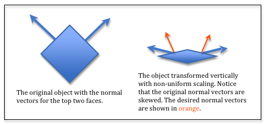
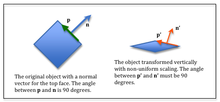

.. Copyright (C)  Wayne Brown
  Permission is granted to copy, distribute
  and/or modify this document under the terms of the GNU Free Documentation
  License, Version 1.3 or any later version published by the Free Software
  Foundation; with Invariant Sections being Forward, Prefaces, and
  Contributor List, no Front-Cover Texts, and no Back-Cover Texts.  A copy of
  the license is included in the section entitled "GNU Free Documentation
  License".

.. role:: raw-html(raw)
  :format: html

11.1 - Introduction to Surface Properties
:::::::::::::::::::::::::::::::::::::::::

Your eyes "see" an object because light has reflected
from the object into your eye. The properties of a surface affect how
light reflects from a surface. This chapter discusses how to model
the properties of surfaces.

Overview of Lessons
-------------------

In the previous chapter you learned how to model light and its reflection
from surfaces. Isn't it amazing how much better the renderings looked
when the color of the pixels was based on reflected light!
However, all of the previous WebGL programs used a single color to
represent a surface's appearance. This causes the surfaces to appear
too uniform and "pure." Real-world objects have
more variation over their surfaces. If the surface properties of a model's
triangular mesh are modeled accurately we can approach `photo-realism`_ in CGI renderings.
(To get exact "photo-realism" you typically need advanced algorithms such as
`ray tracing`_ and a `radiosity`_ lighting model which are beyond the scope of
this textbook.)

Surface properties are complex and we can't cover them all here. However,
we will cover the basics:

+--------------------------+----------------------------------------------------------+
| Surface Property         | Description                                              |
+==========================+==========================================================+
| **Color**                | The color of a surface is actually not a single color,   |
|                          | but a set of colors because a surface reacts             |
|                          | differently to ambient, diffuse and specular light       |
|                          | reflection.                                              |
+--------------------------+----------------------------------------------------------+
| **Flat** vs. **Curved**  | WebGL only renders triangles, but we can modify the      |
|                          | normal vectors at a triangle's vertices to simulate      |
|                          | curved surfaces.                                         |
+--------------------------+----------------------------------------------------------+
| **Texture**              | A surface can have multiple colors. A good example is a  |
|                          | piece of clothing.                                       |
+--------------------------+----------------------------------------------------------+
| **Smooth** vs. **Bumpy** | A surface can be smooth or bumpy                         |
|                          | across its surface.                                      |
+--------------------------+----------------------------------------------------------+
| **Shiny** vs. **Dull**   | A surface might be irregular at a microscope level       |
|                          | and appear "dull" because it reflects light in all       |
|                          | directions, even for specular reflection. Or it might    |
|                          | be very smooth at a microscope level and specular        |
|                          | reflection has minimal scattering.                       |
+--------------------------+----------------------------------------------------------+

These properties can be simulated using data, using algorithms, or a combination
of the two. We will discuss all three techniques.

Managing the Data
-----------------

Surface properties for a model can be uniform across all surfaces **OR**
the surface properties can vary for each triangle of a triangular mesh.
If the surface properties are uniform, the data will be passed to a
*shader program* using :code:`uniform` variables. If the surface properties
are different for each triangle, the data must be stored "per vertex" in
a GPU *object buffer* and accessed using an :code:`attribute` variable.

Surface Property Transformations
--------------------------------

As in the previous chapter, surface calculations will be performed in
"camera space" because:

#. The GPU *shader program* knows the camera's location and orientation
   **without** updating any :code:`uniform` variables. (The camera is
   at the global origin and aligned with the global axes.)
#. Some calculations are simplified with the camera being at the origin.

Therefore, any surface properties that are related to the location or
orientation of a model must be transformed into "camera space." This is
straightforward in most cases, but problematic if your transformation includes
non-uniform scaling. Note that a camera transformation never includes scaling --
only rotation and translation. So the problem arises if your model
transformations includes non-uniform scaling.

.. admonition:: Reminder

  Uniform scaling occurs when the scale factors for each axis are identical, such
  as :code:`matrix.scale(transform, 3,3,3)`. Non-uniform scaling occurs
  when the scale factors are not identical, such as :code:`matrix.scale(transform, 3,1,3)`.

No Scaling or Uniform Scaling
*****************************

If your *model transformation* includes translation, rotation, and/or uniform
scaling, you can use your *camera-model* transformation to convert a model's
normal vectors into "camera space". Vectors have no location,
only magnitude and direction. Therefore, a vector's
homogeneous coordinate must be zero so it can't be translated.
The vector :code:`<dx,dy,dz>` becomes :code:`<dx,dy,dz,0>` before being
multiplied by the *camera-model* transformation. (As a general rule, never use a
*projection-camera-model* transformation on model normal vectors.)

  Non-uniform scaling.

Non-uniform scaling
*******************

Consider the diagram to the right. If you transform a model using
non-uniform scaling, the normal vectors become skewed and no longer
point in the correct direction. This simple example shows that the
*model* transformation used on the vertices of a model will
produce invalid normal vectors in *scene space*.

  Non-uniform scaling.

Let's derive a transformation that will transform the normal vectors
correctly -- assuming non-uniform scaling has been applied to a model.
In the diagram to the right, assume that the vector, :code:`p`, lies
in the plane defined by the top face. The angle between :code:`p`
and the face's normal vector, :code:`n`, must be 90 degrees. Therefore, the
*dot product* of :code:`p` and :code:`n`, must be zero. That is,
:code:`dot_product(p,n) === 0`.

Let :code:`M` be the transformation that contained the non-uniform scaling of
the model. Therefore :code:`p' = M * p`. We need to solve for a different
transformation, :code:`S`, that will transform :code:`n` into :code:`n'` such that
:code:`dot_product(p',n') === 0`. Therefore, :code:`dot_product(M * p, S * n) === 0`.

You can reorder the multiplication of a matrix times a vector by taking the
transpose of each one like this:

.. matrixeq:: Eq2

  [M1: a,b,c,d;e,f,g,h;i,j,k,l;m,n,o,p]*[XYZ: x;y;z;0]=[XYZ: x,y,z,0]*[M1: a,e,i,m;b,f,j,n;c,g,k,o;d,h,l,p]

| Therefore, dot_product(p\ :sup:`T` * M\ :sup:`T`, S * n) === 0.
| Since dot_product(p,n) === 0, M\ :sup:`T` * S must be equal to the identity matrix. We can solve for
  S using this fact:

  | M\ :sup:`T` * S === I
  | (M\ :sup:`T`) :sup:`-1` * M\ :sup:`T` * S === (M\ :sup:`T`) :sup:`-1` * I
  | S === (M\ :sup:`T`) :sup:`-1`
  | S === (M\ :sup:`-1`) :sup:`T`  (See the matrix identities below.)

Summary
*******

If a model transformation uses non-uniform scaling, your JavaScript
code must create three separate transformations for a model rendering:

* A *camera-model* transformation to transform the model's vertices into "camera space".
* A *camera-model* **inverse-transposed** transformation to transform the model's
  normal vectors into "camera space".
* A *projection-camera-model* transformation to transform a model's vertices
  into *clipping-space*.

For the remainder of these tutorials we will assume there is no non-uniform
scaling in the model's transformations.

Glossary
--------

.. glossary::

  surface properties
    Characteristics of a triangle that determines how light is reflected from its surface.

.. index:: surface properties, matrix identities

Basic Matrix Identities
-----------------------

The following properties of matrix operations are true (`1`_), where A and B are square
matrices, A\ :sup:`T` is the transpose of A, and A\ :sup:`-1` is the inverse
of A.

* (A*B)\ :sup:`T` = B\ :sup:`T` * A\ :sup:`T`
* (A\ :sup:`T`)\ :sup:`T` = A
* (A+B)\ :sup:`T` = A\ :sup:`T` + B\ :sup:`T`
* (A*B)\ :sup:`-1` = B\ :sup:`-1` * A\ :sup:`-1`
* (A\ :sup:`T`)\ :sup:`-1` = (A\ :sup:`-1`)\ :sup:`T`

.. _photo-realism: https://en.wikipedia.org/wiki/Unbiased_rendering
.. _ray tracing: https://en.wikipedia.org/wiki/Ray_tracing_(graphics)
.. _radiosity: https://en.wikipedia.org/wiki/Radiosity_(computer_graphics)
.. _1: http://www.web-formulas.com/Math_Formulas/Linear_Algebra_Properties_of_Transposes.aspx
