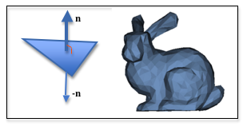
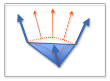
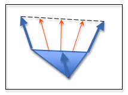
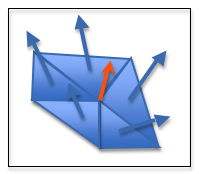
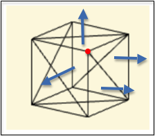
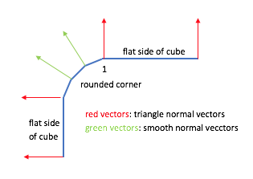

.. Copyright (C)  Wayne Brown
  Permission is granted to copy, distribute
  and/or modify this document under the terms of the GNU Free Documentation
  License, Version 1.3 or any later version published by the Free Software
  Foundation; with Invariant Sections being Forward, Prefaces, and
  Contributor List, no Front-Cover Texts, and no Back-Cover Texts.  A copy of
  the license is included in the section entitled "GNU Free Documentation
  License".

11.3 - Simulated Curved Surfaces
================================

WebGL only renders points, lines and triangles, but it would be really
nice if we could simulate smooth curved surfaces. A simple technique
known as `Phong shading`_ interpolates the normal vectors of a triangle
to give the appearance of a curved surface.
This lesson describes *Phong shading*.

Surface Normal Vectors
----------------------

  The normal vector of a triangle / flat shading

A triangle defines a surface that lies in a plane. There are two
vectors that are perpendicular to the triangle's plane. By convention, one of these
vectors defines the "front side" of the triangle, and the other vector defines
the "back side" of the triangle. These are referred to as the "front face" and
"back face" of the triangle. If the vector, :code:`n`, defines the
"front face", then :code:`-n` defines the "back face".

Given a specific triangle, it has exactly one "front face" normal vector.
Using the same normal vector for the diffuse color calculations of all triangle
fragments will produce the same diffuse color for the entire surface.
This is called "flat shading". The rendering of the bunny to the right
is an example of "flat shading".

  Intermediate normal vectors

To simulate a curved surface, instead of storing a normal vector for
each triangle, each vertex of a triangle stores a vector that is perpendicular
to the original curved surface of the real world object being modeled.
The diagram to the right illustrates the three vectors of a triangle.
These vectors are interpolated across the surface of the triangle and
used in the lighting calculations. Therefore, each fragment of a triangle
is potentially assigned a different color, which simulates a curved surface.

The term "normal vector" might be confusing because a vector's direction
may not be perpendicular to its associated triangle's plane.
However, it is perpendicular to the original object's surface at the location
of the vertex. Therefore, a "normal vector" is defined as a vector that
produces the desired lighting calculations for a location on a surface,
regardless of whether it is perpendicular to its associated triangle.

Interpolation was explained in chapter 8 and can easily be
performed using a simple parametric equations Given two *normal vectors*,
:code:`n1` and :code:`n2*`, intermediate vectors, :code:`n`, can be calculated
by varying a parametric parameter, :code:`t`, between 0.0 and 1.0:

.. Code-Block:: JavaScript

  n = (1-t)*n1 + t*n2  // 0.0 <= t <= 1.0

  Interpolated normal vectors

Since vectors have 3 components, :code:`<dx,dy,dz>`, this equation actually represents
three equations:

* n\ :sub:`dx` = (1-t)*n1\ :sub:`dx` + t*n2\ :sub:`dx`
* n\ :sub:`dy` = (1-t)*n1\ :sub:`dy` + t*n2\ :sub:`dy`
* n\ :sub:`dz` = (1-t)*n1\ :sub:`dz` + t*n2\ :sub:`dz`

You don't have to implement these equations; the WebGL graphics pipeline
automatically interpolates
vectors that are stored in :code:`varying` variables. But it
is important that you understand how the interpolation works because
the intermediate vectors will typically not have the same length as the
original two vectors. If an interpolated vector need to be unit length
then it must be normalized for each fragment calculation.

Calculating Smooth *Normal Vectors*
-----------------------------------

  Average normal vector

*Smooth shading* across adjacent triangles of a model is accomplished by setting
the *normal vector* of a vertex to an average of the triangle *normal vectors*
that use that vertex. For example, in the diagram to the right
a vertex is used
by five triangles, so the vertex's *normal vector* is set to an average of
the five triangle *normal vectors*. The average normal vector is calculated
by adding the vectors and dividing by
the number of vectors. This *averaged vector* may not be exactly perpendicular
to the original object's surface at the vertex's location, but it is
typically close enough. (Note: Even if the original five vectors were
normalized, the *averaged vector* probably does not have unit length and
needs to be normalized.)

  Duplicate normal vectors

Calculating *smooth normal vectors* becomes more complex if a model contains triangles
that share a vertex and lie in the same plane. Consider a simple cube
like the one shown in wireframe mode to the right. It is composed of 6 sides
that are defined by 12 triangles (two triangles
per side). In the diagram you can see that the vertex at the red dot
is part of 4 triangles, but just 3 cube faces. If you take the average
of the normal vectors of the 4 triangles that share the vertex, the normal
vector will be skewed towards the right side that has 2 triangles that use
the vertex.
Therefore, when you gather the
face normal vectors to calculate an average, you must test the face
normal vectors to make sure they are unique. If you find multiple normal
vectors that are identical, then you assume that they all define the same
surface plane and you only include one of them in your average calculation.

  Mixing Smooth and Flat Shading

To create an accurate rendering of some models, *flat shading* must be used
on some triangles while *smooth shading* must be used on other triangles.
Consider a simple cube with round edges. If *smooth normal vectors* are used
for every vertex in the model, the flat sides of the cube will have a curved appearance.
If *triangle normal vectors* are used for every vertex, the rounded corners will not
appear rounded, but rather faceted. The diagram to the right illustrates this
problem. Notice that for vertex 1, a *triangle normal vector* should be used
for rendering the triangle to its right to create a flat cube face, while a
*smooth normal vector* should be used for rendering the triangle on its left
to create a rounded surface for the cube's edge.

:code:`.OBJ` Data Files
.......................

The JavaScript class :code:`CreateModelsFromOBJ` in the file
:code:`obj_to_arrays.js` calculates a "smooth normal vector"
for each vertex of a model when "smooth shading" is enabled and a "triangle
normal vector" when "smooth shading" is disabled. In an :code:`.obj` data file,
a line containing :code:`s on` or
:code:`s 1` enables smooth shading, while a line containing :code:`s off` or
:code:`s 0` disables smooth shading. For example, in the :code:`obj` data below,
the four triangles represented
by lines 2-3 will be associated with "smooth normal vectors" while the three
triangles represented by lines 5-7 will be associated with "triangle normal vectors".
(Please note that :code:`CreateModelsFromOBJ` functions calculate normal vectors
only if there are no normal vectors in the data file. If the data file contains
normal vectors then those are used and enabling or disabling smooth shading
has no effect.)

.. Code-Block:: HTML
  :linenos:

  s on
  f 9//1 8//1 23//1 24//1
  f 2//2 1//2 16//2 17//2
  s off
  f 6//1 3//1 2//1
  f 5//1 3//1 6//1
  f 5//1 4//1 3//1
  ...

An Example WebGL Program
------------------------

The following WebGL program allows you to render a 3 different versions
of a cube that has rounded edges. One version uses all *triangle normal vectors*
and produces a "faceted" rendering. One version uses all *smooth normal vectors*
which produces a slight curved appearance for the flat sides. The last
version uses a combination of *triangle* and *smooth* normal vectors.

.. webgldemo:: W1
  :htmlprogram: _static/11_normal_vectors/normal_vectors.html
  :width: 400
  :height: 400

Please note the following about the above WebGL program:

* The smooth shaded triangles facing the camera look great, but you can
  see their triangle mesh nature when the triangles are in silhouette
  with the camera.

* When smooth normal vectors are used for all model faces there
  is no visual "seam" between the sides of the cube and the rounded edges.
  However, the sides of the cubes have a slight curved appearance to them.

* When the cube's sides are rendered using "triangle normals" there is
  a visible "seam" between the cube sides and the rounded edge. This
  is because the cube side is using a different normal vector than
  the rounded edge. To remove the visible "seam" the triangles that have
  a common edge between the cube side and the rounded edge need the vertices
  on the common edge to use flat shading normal vectors but the other vertices
  should use a smooth normal vector.

Glossary
--------

.. glossary::

  Phong shading
    Create a unique normal vector for each fragment that composes a triangle
    by interpolating the normal vectors defined at the triangle's vertices.

  triangle normal vector
    A vector that is perpendicular to the triangle's plane.

  smooth normal vector
    A vector that is perpendicular to the surface of an original, real-world object
    at a specific location.

Self Assessment
---------------

.. mchoice:: 11.3.1
  :random:

  Given a triangle, a vector that is 90 degrees to every point in the plane defined
  by the triangle is called a *normal vector*. How many *normal vectors* does a triangle
  have?

  - two

    + Correct. These corresponds to the two sides of a triangle (or the two sides of a plane).

  - one

    - Incorrect.

  - three

    - Incorrect.

  - infinite

    - Incorrect.

.. mchoice:: 11.3.2
  :random:

  "Flat shading" calculates the same diffuse color for every pixel that composes a triangle
  because ...

  - the diffuse lighting calculation uses the same *normal vector* for every fragment.

    + Correct.

  - diffuse lighting is not calculated for "flat shading".

    - Incorrect. Diffuse lighting calculations are required for "flat shading."

  - the color of the diffuse light is constant.

    - Incorrect.

  - every pixel of a triangle is assigned the color of the triangle.

    - Incorrect.

.. mchoice:: 11.3.3
  :random:

  The "*normal vector*" assigned to a vertex to implement "smooth shading"
  is typically calculated by ...

  - taking the average of the face *normal vectors* of every triangle that uses the vertex.

    + Correct.

  - using the *normal vector* of the largest triangle that uses the vertex.

    - Incorrect.

  - summing all of the *normal vectors* around it.

    - Incorrect. It sums the *normal vectors* and divides by how many were added together.

  - multiplying adjacent *normal vectors*.

    - Incorrect.

.. mchoice:: 11.3.4
  :random:

  How are triangles in an :code:`.obj` file "marked" for smooth shading?

  - A line before "face" descriptions that contains "s on".

    + Correct.

  - A "face" description contains the word "smooth" as its last token.

    - Incorrect.

  - Smooth shaded triangles can't be represented in an :code:`.obj` file.

    - Incorrect.

  - By default, all faces from an :code:`.obj` file are "smooth shaded".

    - Incorrect. The default is to use "flat shading" on triangle faces.

.. index:: Phong shading, triangle normal vector, smooth normal vector

.. _Phong shading: https://en.wikipedia.org/wiki/Phong_shading:

