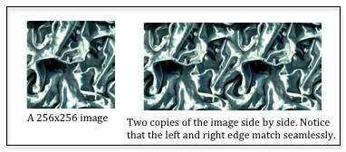
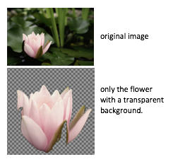
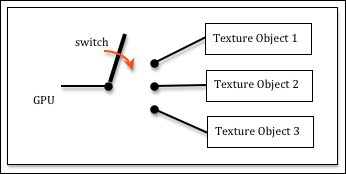

.. Copyright (C)  Wayne Brown
  Permission is granted to copy, distribute
  and/or modify this document under the terms of the GNU Free Documentation
  License, Version 1.3 or any later version published by the Free Software
  Foundation; with Invariant Sections being Forward, Prefaces, and
  Contributor List, no Front-Cover Texts, and no Back-Cover Texts.  A copy of
  the license is included in the section entitled "GNU Free Documentation
  License".

.. role:: raw-html(raw)
  :format: html

11.4 - Image Texture Mapping
::::::::::::::::::::::::::::

*Texture mapping* is a technique for specifying a unique color for every
fragment that composes a triangle. The colors come from a *mapping*.
As we discussed in `lesson 3.7`_, in mathematics, a *mapping* is a
function that converts a set of inputs into an output value.
There are two basic ways this can be done:

* Lookup the output value from a pre-defined list of values. This is called
  a 'table lookup'.
* Perform calculations on the inputs to produce the output value.

This lesson explains the first mapping technique: how a triangle location can be
*mapped* to a color value in a 2D image.

Hardware Overview
-----------------

*Texture mapping* is fundamental to creating realistic renderings and the
GPU's hardware contains *texture units* to support *texture mapping*. When you
hear the word *unit* in the context of computing, you should think *processing
unit*. For example, a CPU (Central Processing **Unit**) is designed for general
purpose computing; a GPU (Graphics Processing **Unit**) is designed for
graphics computing, and a *texture unit* (emphasis on **unit**) is designed
for texture map processing. WebGL compliant hardware must have at least eight
*texture units*; many GPU's have more than eight. You can query a
GPU to determine how many *texture units* it has with
the a call to :code:`gl.getParameter(gl.MAX_TEXTURE_IMAGE_UNITS)`.

A *texture unit* performs processing for *texture mapping* . A *texture object*
stores the data needed for *texture mapping*. Together, a *texture unit* and
a *texture object* can perform *texture mapping* in a *shader program*.
You can create as many
*texture objects* as your want, but the number of *texture units* in the
GPU determines how many texture maps you can use concurrently in a *shader
program*. This can be confusing, so let's summarize these points again.

* *texture unit*:

  * Performs the processing required for texture mapping.
  * WebGL compliant hardware will always have at least eight *texture units*.
  * The number of *texture units* determines how many texture maps you can use
    concurrently in a *shader program*.
  * Remember that WebGL programs execute on a client's hardware, not on a
    server's hardware. A JavaScript program could query the client's hardware
    using :code:`gl.getParameter()` to determine how many *texture units* are
    available and then use appropriate *shader programs* for the hardware.

* *texture object*:

  * Stores the data needed for texture mapping.
  * A *texture object* is stored in the GPU's memory.
  * A *texture object* is different from a *buffer object*. A *buffer object* stores
    attributes of a model and is always a 1D array of FLOATS. A *texture object*
    is also a buffer for data, but its structure is more complex because
    it stores the parameters that control how texture mapping is performed
    and the texture mapping image.
  * The size of a *texture object* is related to the size of the texture mapping
    image. You should make your texture mapping images as small as possible
    to conserve GPU memory.
  * The only limit on the number of *texture objects* you can create is the
    size of the GPU's memory.

Software Overview
-----------------

Texture mapping *maps* a location in a 2D image to a location on a 3D triangle.
The mapping inputs are called *texture coordinates*. As with
so many other aspects of graphics, texture coordinates are percentages. The
notation for texture coordinates uses :code:`(s,t)` to represent an image location.
The :code:`s` component is a percentage of an image's width,
while the :code:`t` component is a percentage of an image's height. Each model vertex is
assigned a *texture coordinate* and these coordinates are interpolated
across the surface of the triangle to specify a unique location in the image
for each triangle fragment.

Here are the basic steps to create *texture mapping*:

#. When building the model (e.g., in Blender):

   a) Select an appropriate image for the texture mapping.
   b) Assign an appropriate texture coordinate, :code:`(s,t)`, to each vertex of a triangle.
      :raw-html:`  `

#. JavaScript pre-processing for a canvas rendering:

   a) Download the texture map image from the server. (The
      :code:`SceneDownload()` function automatically downloads any texture maps
      defined in :code:`.mtl` (material) files associated with :code:`.OBJ` data.)
   b) Create a GPU *texture object* and fill it with the texture map image.
   c) Set the parameters that control how the texture map image is used.
   d) Get the location of a :code:`uniform Sample2D` variable from the *shader program*
      that will use the texture map.
      :raw-html:`  `

#. JavaScript setup each time a model is rendered using a texture map:

   a) Bind a *texture object* to a *texture unit*.
   b) Bind a *texture unit* to a :code:`uniform Sample2D` shader variable.
      :raw-html:`  `

#. *Shader program*

   a) In the *vertex shader*, create a :code:`varying` variable that will
      interpolate a vertex's *texture coordinates* across the surface of a triangle.
   b) In the *fragment shader*, use the *texture coordinates* to lookup a
      color from the texture map image.

As you can see, *texture mapping* requires modifications to every aspect of
CGI development. The following describes the details of each step.

1.a) Select an Appropriate Image
................................

Any digital image can be used as a texture map, but if the width and height of the
image is not a power of 2, there are restrictions on how the image
can be used. It is best to make the image have dimensions that
are a power of 2, which makes texture mapping more efficient and removes
any restrictions on its use. Therefore, each dimension of an image should be
1, 2, 4, 8, 16, 32, 64, 128, 256, 512, 1024, or 2048 pixels. Some devices
support higher resolutions, but you should make the image as small as possible
to save on downloads times and to save CPU and GPU memory. You should attempt
to make the image resolution approximately the same size as the objects to be
rendered in terms of the number of pixels that will be painted on a canvas.

Most image editors will allow you to change the resolution of an image, but
if you don't want the image to be distorted, you must consider the image's aspect
ratio -- i.e., its width in relationship to its height. Typically you should *crop*
an image to get the content you want and to make the aspect ratio be 1/1, 1/2,
1/4, 1/8, etc.. After you have the image's content and aspect ratio correct,
then change the image's resolution (in pixels) to a power of 2.

Some *texture map* images are designed to be *tiled*, which means that a single
image can be placed next to itself and you can't see where they join. Images
that have their right edge match up with their left edge (and top edge to
bottom edge) are non-trivial to design and create. Thankfully there are
many sites on the internet that give away free images that can be tiled.
Try doing a search for "free texture map images tiled". Here
are some sites that offer royalty free images for *texture mapping*:

* http://www.textures.com/
* http://www.3dxo.com/textures/tiles
* http://www.cadhatch.com/seamless-textures

The colors in a *texture map* image can be represented using RGB or RGBA
colors. If transparency is not an issue, use RGB values
to save memory.
The most common reason for using transparency is to represent a
non-rectangular picture, such as the example to the right. The area
displayed with a checkerboard pattern has an alpha value of 0.0 which
means 0% of those pixel's color will be used in a rendering.

The `GIMP`_ image editor can be used to create images that include transparency:

#. Open the original image in GIMP.
#. Add an alpha layer. (Layer --> Transparency --> Add alpha channel.)
#. Select the areas that should be transparent. (Perhaps using the "Fuzzy select tool".)
#. Clear the selection. (Edit --> Clear.)
#. Resize the image. (Select the area of the image you want; then Image --> Crop to selection.)
#. Rescale the image to dimensions that are a power of 2. (Image --> Scale Image...)
#. Export to a PNG file. (JPG images can't store alpha channels.)

1.b) Texture Coordinates
........................

.. figure:: figures/example_texture_coordinates.png
  :align: right
  :width: 382
  :height: 213

The *texture coordinates* assigned to each vertex of a model control the mapping
of image colors to a triangle face. A *texture coordinate* is two fractions that
represent a location in an image.
The first fraction, called :code:`s`, is the percentage from the left side of the
image. The second fraction, called :code:`t`, is the percentage from the bottom of the
image. The coordinate system for an image in WebGL has its origin in the
lower-left corner, with the :code:`+S` axis to the right, and the :code:`+T` axis going up.
There are several examples of texture coordinates in the diagram to the right.

The idea of *texture coordinates* is simple to understand, but the task of
assigning texture coordinates to individual vertices can be complex.
Details on how to do this using Blender will be explained in the next lesson.

2.a) Download *Texture Map* Images from the Server
..................................................

Given a *texture mapped* model defined in an :code:`.OBJ` data file,
the file name of the *texture map* image is stored
in the material properties assigned to a model (i.e., in its associated
:code:`.MTL` file). The *texture map* file name
is stored as a :code:`map_Kd` property of a material.
(Note that :code:`Kd` is the diffuse property of the material.)
When an :code:`.OBJ` data file is downloaded from a server, its contents
is interpreted and any material files that are referenced are downloaded.
When a :code:`.MTL` data file is downloaded from a server, it contents is
interpreted and any references to *texture map* image are downloaded from the server.
This work is done by a :code:`SceneDownload` object that is created
by a WebGL program. (For details, study the code in :code:`scene_download.js`.)

.. Admonition:: *Texture map* file names:

  When you apply a *texture map* to a model in Blender, if the image
  file is in the same folder as the :code:`.obj` file, the file name
  will not include a file path. However, if you grab an image from some
  arbitrary folder on your hard drive, blender will store the file name
  using a full path. The path to the file will not be valid when a server
  requests the image file. Therefore, **always** store a *texture map* image in the
  same folder as its associated model.

It should be noted that images come in a variety of data formats, such as
:code:`gif`, :code:`png`, and :code:`jpeg`. The web browser understands how
to read and interpret all of the standard image encodings. When you create
a JavaScript :code:`Image` object, and specify the image's :code:`src` (source),
the browser not only downloads the image but decodes it properly as well.
This is huge! WebGL does not have to worry about image decoding issues because
the browser does the decoding!

2.b) Create *Texture Objects* in the GPU
........................................

When a model is rendered the model data needs to be stored in the GPU's
memory so that it is directly accessible to a *shader program*. To use an
image as a table lookup for color values, it needs to be
accessible from the GPU's memory as well. A GPU *texture object* stores
an image and all of the related state variables needed to produce a
texture mapping. The number of possible *texture objects* is only limited by
the amount of memory in the GPU.

There are three basic steps to creating a *texture object*:

#. Create a new *texture object*
#. Set the parameters that control how the *texture object* is used.
#. Copy an image into the *texture object*

The following function creates a *texture object*. Please read and study
the comments before each command.

.. Code-Block:: JavaScript
  :linenos:
  :emphasize-lines: 11, 18, 21, 26, 29-30

  /**
   * Create and initialize a texture object
   * @param my_image {Image} A JavaScript Image object that contains the
   *                         texture map image.
   * @returns {WebGLTexture} A "texture object"
   * @private
   */
  function _createTexture(my_image) {

    // Create a new "texture object".
    let texture_object = gl.createTexture();

    // Make the "texture object" be the active texture object. Only the
    // active object can be modified or used. This also declares that the
    // texture object will hold a texture of type gl.TEXTURE_2D. The type
    // of the texture, gl.TEXTURE_2D, can't be changed after this
    // initialization.
    gl.bindTexture(gl.TEXTURE_2D, texture_object);

    // Set parameters of the texture object.
    gl.texParameteri(gl.TEXTURE_2D, gl.TEXTURE_MIN_FILTER, gl.LINEAR);

    // Tell gl to flip the orientation of the image on the Y axis. Most
    // images have their origin in the upper-left corner. WebGL expects
    // the origin of an image to be in the lower-left corner.
    gl.pixelStorei(gl.UNPACK_FLIP_Y_WEBGL, 1);

    // Store in the image in the GPU's texture object.
    gl.texImage2D(gl.TEXTURE_2D, 0, gl.RGB, gl.RGB, gl.UNSIGNED_BYTE,
                  my_image);

    return texture_object;
  }

The concept of "binding to an object" is not part of modern programming languages
and it deserves some detailed explanation. WebGL is a API (Application
Programmer Interface) to a hardware graphics engine. The programming makes more
sense if you think about the hardware. Imagine that a GPU has
many *texture objects* and you want the hardware to make one of them be its
"active" *texture object*. Conceptually the GPU has to be connected
to the *texture object*. In hardware, the way you connect things is by flipping
a switch. When you "bind an object" you are conceptually "flipping a switch"
to connect components in the hardware.

There are many details associated with each of the above :code:`gl` commands -- too many
details to cover in this overview. We will return to these commands in later
lessons to discuss the details.

2.c) *Texture Map* Parameters
.............................

The resolution of a texture map image is rarely the same as the resolution of
a rendered 3D triangle. For example, a texture map image might be 128 by 128 pixels and
a triangle using this texture map might cover 20 canvas pixels. This
is a large discrepancy. In addition, the opposite can happen. The triangle to be rendered
might cover 100,000 pixels in the rendered image. The implication is that the
texture map image must be enlarged or shrunk to match the size of the
3D triangle. WebGL uses the terms "magnification" and "minification" for these
ideas and you can control how they are performed.
Your choices are between rendering speed or rendering quality.
The option names are based on how the associated algorithm works and not the results:
:code:`gl.NEAREST` selects the closest pixel to a location and gives you speed,
while :code:`gl.LINEAR` calculates a weighted average of the four pixels that
surround a location, which produces a better color, but slows down rendering.
The following example code will produce the best quality graphics, but slower
rendering speeds.

.. Code-Block:: JavaScript

    gl.texParameteri(gl.TEXTURE_2D, gl.TEXTURE_MIN_FILTER, gl.LINEAR);
    gl.texParameteri(gl.TEXTURE_2D, gl.TEXTURE_MAG_FILTER, gl.LINEAR);

*Texture coordinates* are percentage values between 0.0 and 1.0. What should
WebGL do if a texture coordinate is outside this range? There are three options:

* :code:`gl.REPEAT`: This takes the percentage's fractional part as the texture
  coordinate. For example, a value of 2.75 would become 0.75. This has the
  effect of repeating the texture map over a large area and is called "tiling."
  One small *texture map image* can be re-used over a larger area.
* :code:`gl.CLAMP_TO_EDGE`: This clamps all values greater than 1.0 to 1.0 and
  all values less than 0.0 to 0.0. Therefore the colors at the image's borders
  are repeatedly used if the texture coordinates go outside the range 0.0
  to 1.0.
* :code:`gl.MIRRORED_REPEAT`: This inverts the fractional part of the coordinate.
  For example, 1.25 would be mapped to 0.75 because 1.0 - 0.25 = 0.75. The
  effect is to mirror the image about its edge. Since an edge is always
  equal to itself, this is another way to tile a *texture map* and have the
  seam between the tiles match up.

These parameters can be set differently for the :code:`s` and :code:`t` axes of a
*texture map* For example:

.. Code-Block:: JavaScript

    gl.texParameteri(gl.TEXTURE_2D, gl.TEXTURE_WRAP_S, gl.REPEAT);
    gl.texParameteri(gl.TEXTURE_2D, gl.TEXTURE_WRAP_T, gl.MIRRORED_REPEAT);

The final pre-processing step is to retrieve the location of the variable in
your *shader program* that will access the *texture map*. This will be
a variable of type :code:`uniform Sampler2D`. We typically add this location
to the shader program object, something like this:

.. Code-Block:: JavaScript

  program.u_Texture_unit = gl.getUniformLocation(program, "u_Texture_unit");

3. JavaScript Setup for Texture Mapping
.......................................

Your *shader program* will have a :code:`uniform Sampler2D` variable in its
*fragment shader*. This variable must indicate which *texture unit* to use
for texture mapping. But a *texture unit* needs data from a *texture object*.
So we bind a *texture object* to a *texture unit* and
then we set the :code:`uniform Sampler2D` variable to the *texture unit*.
An example is shown below.

.. Code-Block:: JavaScript

  // Make the "texture unit" 0 be the active texture unit.
  gl.activeTexture(gl.TEXTURE0);

  // Make the texture_object be the active texture. This binds the
  // texture_object to "texture unit" 0.
  gl.bindTexture(gl.TEXTURE_2D, texture_object);

  // Tell the shader program to use "texture unit" 0
  gl.uniform1i(program.u_Texture_unit, 0);

These three commands can be very confusing because they use different mechanisms
to specify *texture units*. In the JavaScript API, a *texture unit* is made active
use an enumerated type (ENUM) value: one of :code:`gl.TEXTURE0`, :code:`gl.TEXTURE1`,
:code:`gl.TEXTURE2`, etc. The enumerated values, :code:`gl.TEXTURE0`, :code:`gl.TEXTURE1`,
:code:`gl.TEXTURE2`, etc. are guaranteed to be sequential, so the j\ :sup:`th` *texture unit*
can be specified using the code :code:`gl.TEXTURE0 + j`.
However, in the GPU, a shader variable that specifies a
*texture unit* is just an integer, 0, 1, 2, etc.

4. *Shader Programs* that use Texture Mapping
.............................................

The *shader programs* that perform texture mapping are the easiest part of
*texture mapping*. The *vertex shader* simply copies a vertex's *texture coordinates*
into a :code:`varying` variable so they can be interpolated over the surface
of a triangle. Here is an example *vertex shader*.

.. Code-Block:: C
  :linenos:
  :emphasize-lines: 10, 13,18

  // Vertex Shader
  precision mediump int;
  precision mediump float;

  // Scene transformation
  uniform mat4 u_PVM_transform; // Projection, camera, model transform

  // Original model data
  attribute vec3 a_Vertex;
  attribute vec2 a_Texture_coordinate;

  // Data (to be interpolated) that is passed on to the fragment shader
  varying vec2 v_Texture_coordinate;

  void main() {

    // Pass the vertex's texture coordinate to the fragment shader.
    v_Texture_coordinate = a_Texture_coordinate;

    // Transform the location of the vertex for the graphics pipeline.
    gl_Position = u_PVM_transform * vec4(a_Vertex, 1.0);
  }

The *fragment shader* uses the *texture coordinates* for a fragment to lookup
a color in the *texture map* image. This is a common operation that is built into
the GPU. Simply call the :code:`texture2D` function,
specifying which *texture unit* to use and the *texture coordinates* (which is a
:code:`vec2`, two floating point values).

.. Code-Block:: C
  :linenos:
  :emphasize-lines: 12

  // Fragment shader program
  precision mediump int;
  precision mediump float;

  // The texture unit to use for the color lookup
  uniform sampler2D u_Texture_unit;

  // Data coming from the vertex shader
  varying vec2 v_Texture_coordinate;

  void main() {
    gl_FragColor = texture2D(u_Texture_unit, v_Texture_coordinate);
  }

An Example
----------

.. webgldemo:: W1
  :htmlprogram: _static/11_texture_map/texture_map.html
  :width: 300
  :height: 300

Please make the following obervations about the above WebGL program:

* The flower is squashed vertically in the 3D rendering. This
  is because the area on the 3D triangle has a different aspect ratio than
  the original image.

* The image for the texture mapping has a resolution of 512 by 512 pixels.
  The 3D triangle renderings cover perhaps an area of 70 by 70 pixels.
  This is an example of *minification* which shrinks the size of
  of a *texture map image* to match the size of a smaller 3D triangle.

Glossary
--------

.. glossary::

  texture mapping
    A process that maps locations on a 3D triangle to a color value.

  procedural texture mapping
    A process that maps locations on a 3D triangle to a color using
    calculations on the input parameters.

  image texture mapping
    A process that maps locations on a 3D triangle to a color value using a
    "table lookup" scheme which pulls colors from a 2D image.

  texture unit
    A special purpose processor inside a GPU that performs texture mapping.

  texture object
    A memory buffer in a GPU that stores the parameters that control a
    texture mapping process and stores a texture mapping image.

  tiled texture maps
    A texture map image that can be positioned next to itself, on any side,
    and the edge where the images meet is not discernible.

  texture coordinates
    A pair of floating point values, :code:`(s,t)`, that specify a location in a
    texture map image. Both values are percentages between 0.0 to 1.0, but
    values outside this range are used for tiled images.

  binding
    Create a connection between components of a GPU.

.. index:: texture mapping, procedural texture mapping, image texture mapping, texture unit, texture object, tiled texture maps, texture coordinates, binding

References
----------

The source of the example image for tiling is http://paulbourke.net/geometry/tiling/.
This site also contains a good tutorial on *texture coordinates*.

.. _GIMP: https://www.gimp.org/
.. _lesson 3.7: ../03_model_data/07_modeling_surfaces.html