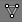
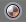
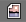
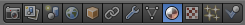
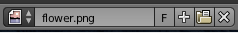
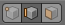
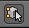
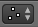
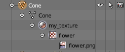
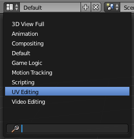

.. Copyright (C)  Wayne Brown
  Permission is granted to copy, distribute
  and/or modify this document under the terms of the GNU Free Documentation
  License, Version 1.3 or any later version published by the Free Software
  Foundation; with Invariant Sections being Forward, Prefaces, and
  Contributor List, no Front-Cover Texts, and no Back-Cover Texts.  A copy of
  the license is included in the section entitled "GNU Free Documentation
  License".

.. role:: raw-html(raw)
  :format: html

.. |model_icon| image:: figures/model_icon.png
  :align: middle

.. |viewport_shading| image:: figures/viewport_shading.png
  :align: top
  :scale: 50

11.5 - Texture Coordinates
::::::::::::::::::::::::::

The most challenging part of *texture mapping* is the assignment of
*texture coordinates* to the vertices of a model. This lesson explains
how to create *texture coordinates* using Blender.

A typical goal of *texture mapping* is to wrap an image around a triangular mesh
such that the image is not distorted and the seams between triangles are not noticeable.
This lesson assumes that you have one model and one image to wrap around it.

Before we start the details, note that Blender is an "object-oriented" system
that has a standardized way of organizing modeling data. A "model object" |model_icon| is
defined by "geometry objects" |geometry_icon|. A "geometry object" |geometry_icon|
has associated "material objects" |material_icon|.
If a "material object" |material_icon| uses a texture map, it contains a
"texture object" |texture_icon|. If the "texture object" |texture_icon| uses an image,
it contains an "image object" |image_icon|. You can clearly
see this hierarchy in the "Outliner" panel if you expand the object icons.
An example hierarchy is show to the right. When using
Blender you "attach" objects to other objects to create these hierarchical
relationships. And in many cases the object relationships are automatically
created based on the "active object" at the time you create some new object.

.. admonition:: Important Idea:

  The order that you perform Blender operations is critical because of the relationship
  that are created between Blender objects.

Texture Mapping :code:`Basic Primitives`
----------------------------------------

Blender has built-in texture mapping functionality for all of the basic
mesh primitives: cube, cone, cylinder, sphere, etc.. To wrap an image around
a :code:`basic primitive`, the step-by-step process is:

* Select a model. (Mouse right-click.)
* Enter "edit mode". (:code:`tab` key)
* Select all faces. (Hit the :code:`a` key until all faces are selected.)
* In the "properties panel" |properties_icon|, select the "Materials" icon |material_icon|.
* Create a new material and give it an appropriate name.
* "Assign" the material to the model's faces. (All the faces must be selected when
  you do this!)
* With the material still the "active material", select the texture properties icon |texture_icon|.
* Create a new texture and give it an appropriate name.
* In the "Type" drop-down box, select "Image or Movie".
* In the "Image" section, select "Open", which brings up a file browser. Select
  the image file to use for the texture mapping. The *texture map* image file
  must be in the same folder as the model. This allows Blender
  to save the file name without a file path.
* In the "Mapping" section:

  * For the "Coordinates:" drop-down menu select the "Generated" option.
    Blender will automatically generate the *texture coordinates*.
  * For the "Projection:" drop-down menu select the type of primitive you
    are texture mapping (e.g., flat, cube, tube, or sphere).

    * flat: The entire image is used for the each quad or triangle. If the aspect
      ratio of the image is different than the aspect ratio of the 3D surface,
      the image will be distorted.
    * cube: The entire image is used for each of the 6 sides of the cube.
    * tube: The entire image is wrapped around the model of a torus.
    * sphere: The entire image is wrapped around the model of a sphere.

  * Note that in the case of "flat" and "cube" generated *texture coordinates*,
    the image is reused for each "side", while the "tube" and "sphere"
    generated *texture coordinates* wrap around the entire model.

You can verify that a model has *texture coordinates*:

* by rendering it in Blender (:code:`F12` key),
* by exporting an OBJ file and looking for lines that start with :code:`vt` (vertex
  texture coordinates). (Make sure you exported the file with the "Include UV's"
  option enabled.)
* by enabling the "texture" or "material" mode for viewport shading. |viewport_shading|

The steps above are demonstrated in this `5 minute video`_.

UV Texture Mapping
------------------

.. admonition:: UV texture mapping

  OpenGL and WebGL describe the axes for texture mapping using the letters
  :code:`s` and :code:`t`, but other system and applications use the letters
  :code:`u` and :code:`v`. Whenever you see a reference to :code:`UV` in a
  graphics application it is always referring to *texture coordinates*.

To *texture map* a model that is **not** a basic primitive and/or to edit the
*texture coordinates* of any arbitrary model you must use the
"UV/Image Editor." The "big idea" behind UV editing is that you select edges
of a 3D model that can be "cut" to unfold the model onto a flat surface. The "unfolded model"
is laid down on top of the texture map image and arranged as desired. By translating,
rotating, and scaling the face vertices you can assign *texture coordinates* visually
for every vertex.

Initial Texture Map Creation
............................

The steps for performing "UV texture mapping" starts with the same steps as above:

* Select a model. (Mouse right-click.)
* Enter "edit mode". (:code:`tab` key)
* Select all of the model's faces. (Hit the :code:`a` key until all faces are selected.)
* In the "properties panel" |properties_icon|, select the "Materials" icon |material_icon|.
* Create a new material and give it an appropriate name.
* "Assign" the material to the model's faces. (Make sure all faces are selected.)
* With the material still the "active material", select the texture properties icon |texture_icon|.
* Create a new texture and give it an appropriate name.
* In the "Type" drop-down box, select "Image or Movie".
* In the "Image" section, select "Open" which brings up a file browser. Select your image.
* In the "Mapping" section, for the "Coordinates:" drop-down menu, select
  the "UV" option. This means you will be setting the *texture coordinates*
  using the "UV/Image Editor".

Blender Configuration
.....................

You now have *texture coordinates* assigned to every vertex, but probably not the
*texture coordinates* you really desire.
To facilitate the editing of *texture coordinates*, configure the Blender environment
so that you can see the "UV/Image Editor" and the "3D View" at the same time.
The easiest way to do this is to select the
"UV Editing" screen layout from the "Screen layout" drop-down menu at the top of
your Blender window. (To return to your original screen layout, select the "Default"
view from the same menu.)

If you select the texture mapped model in the 3D view and enter "edit mode" you should
see its texture map in the "UV/Image Editor". If you don't see the image, select it
from the "Browse image to be linked" pop-up menu |browse_image_to_linked|.

Several other configuration options are important:

* In the 3D View set your "Viewport shading" to "texture" mode |viewport_shading|
  to display the texture map on the model's faces.
* In the "UV/Image Editor" panel, enable the "Keep UV and
  edit mode mesh selection in sync" |in_sync| option. This allows you to select
  vertices, edges, or faces in either the "3D View" or the "UV/Image Editor"
  window and the corresponding element(s) will be selected in the other window.

Unfolding a 3D model
....................

To unfold a 3D model so that it can be laid flat over an image, follow these steps:

* In the "3D View" window, while in edit mode, change to "edge selection" mode. |edge_select_mode|
* Select the edges that you want to "cut" to unfold your model onto a flat surface.
  (Hold down the shift key for multiple selections.)
* Bring up the edge menu (CRTL-E) and select "Mark seams".
* Select all of the model faces. (Use the :code:`a` key.)
* With your cursor in the "3D View" window and **with all of the faces selected**,
  hit the "u" key to bring up the "UV Mapping" pop-up menu.
  Select the "Unwrap" command. This "cuts" the model faces at the seams you
  have chosen and lays the model's faces out over the texture map image. If you don't
  see the triangle outlines displayed in the "UV/Image Editor" something went wrong.
  The most likely problem is
  that the model can't be unfolded using the edges you selected for the seams.
  Note that some of the faces in the "UV/Image Editor" may be on top of each
  other. This happens when multiple faces use the same part of the texture map image.

If the model did not unfold as you wanted, restart the process
by selecting all of the model's edges, clear all of the edge seams (CRTL-E, "Clear seam"),
and select new edge seams.

Editing Texture Coordinates
...........................

Use the normal editing commands, such as "g" for grab, "s" for scale, "r"
for rotate, "b" for box select, etc., to change the location of the face vertices
over the  desired portion of the texture image. If you distort the shape of any of
the triangles (or quads), the resulting texture mapping will be distorted as
well.

The default behaviour is to keep the *texture coordinates* for a specific
vertex equivalent. When you change the location of a *texture coordinate* all of the faces
and edges that use that vertex change accordingly. You can "break" this connection
using the "disabled" option of the "Sticky Selection Mode" |sticky_selection_mode|.
The three options for "Sticky Selection Mode" |sticky_selection_mode| are:

* **Shared Vertex**: Selects *texture coordinates* that share a 3D vertex, even if they are in different UV locations.
* **Shared Location**: Selects *texture coordinates* that are in the same image location and share a 3D vertex.
* **Disabled**: Allows each face to own its own *texture coordinates*,
  allowing the face to be separated from other faces.

"UV/Image Editing" is demonstrated in this `7 minute video`_.

:code:`.obj` *Texture Mapping* Data
-----------------------------------

The data needed for *texture mapping* is exported to :code:`.obj` and :code:`.mtl` model files.
The example below shows the data for a cube. The *texture coordinates*
are on the lines that begin with :code:`vt` which stands for "vertex texture".
The values implicitly define an array
of texture coordinates that are indexed starting at one. When the faces
are defined later in the file each vertex has *geometry coordinates*, :code:`(x,y,z)`, from the
defined vertices, and a :code:`(s,t)` value from the defined *texture coordinates*.
The syntax :code:`5/2` defines a vertex what uses the 5\ :sup:`th` :code:`(x,y,z)` value
and the 2\ :sup:`nd` :code:`(s,t)` value. Notice that individual geometric and texture
coordinates are used for multiple vertices of multiple faces.

.. Code-Block:: C
  :emphasize-lines: 13-16

  # Blender v2.73 (sub 0) OBJ File: 'textured_cube_faces.blend'
  # www.blender.org
  mtllib textured_cube_faces.mtl
  o Cube
  v 1.000000 -1.000000 -1.000000
  v 1.000000 -1.000000 1.000000
  v -1.000000 -1.000000 1.000000
  v -1.000000 -1.000000 -1.000000
  v 1.000000 1.000000 -0.999999
  v 0.999999 1.000000 1.000001
  v -1.000000 1.000000 1.000000
  v -1.000000 1.000000 -1.000000
  vt 0.000000 0.000000
  vt 1.000000 0.000000
  vt 1.000000 1.000000
  vt 0.000000 1.000000
  usemtl Material
  s off
  f 1/1 2/2 3/3 4/4
  f 5/1 8/2 7/3 6/4
  f 1/1 5/2 6/3 2/4
  f 2/1 6/2 7/3 3/4
  f 3/1 7/2 8/3 4/4
  f 5/1 1/2 4/3 8/4

The "material definition" file, :code:`.mtl`, stores a filename for a texture map
in a :code:`map_Kd` property of a material. Here is an example MTL file:

.. Code-Block:: C
  :emphasize-lines: 13

  # Blender MTL File: 'textured_cube.blend'
  # Material Count: 1

  newmtl cube_material
  Ns 96.078431
  Ka 1.000000 1.000000 1.000000
  Kd 0.640000 0.640000 0.640000
  Ks 0.500000 0.500000 0.500000
  Ke 0.000000 0.000000 0.000000
  Ni 1.000000
  d 1.000000
  illum 2
  map_Kd texture1.png

Using Geometry for *Texture Coordinates*
----------------------------------------

A *texture coordinate* specifies a location from which a color can be
retrieved. It is possible to use the
geometry, i.e., the :code:`(x,y,z)` vertices of a model, as *texture coordinates*.
Consider the following scenarios:

* Define a model inside a unit cube in the range (0,0,0) to (1,1,1). (The
  model can always be scaled to whatever
  size you need for rendering purposes.) For every vertex, :code:`(x,y,z)`, use the
  :code:`(x,y)` value for the :code:`(s,t)` texture coordinates.
  (This does not work well if either the :code:`x` or :code:`y` values are constant.)

* Define a model inside a unit cube in the range (0,0,0) to (1,1,1). For
  every vertex, :code:`(x,y,z)`, use :code:`(x,y)`, :code:`(x,z)`, or :code:`(y,z)`
  for the :code:`(s,t)` texture coordinates depending on the direction of the
  vertex normal vector. For example, if the normal vector is
  pointing in the Z or -Z direction, use :code:`(x,y)`, if the normal vector is
  pointing in the X or -X direction, use :code:`(y,z)`, or if the normal vector
  is pointing in the Y or -Y direction, use :code:`(x,z)`. (Or
  differentiate and use :code:`(x,z)` for +Y and :code:`(z,x)` for -Y.)

* Define your model using whatever units are appropriate, but scale the
  vertices to the range (0.0, 1.0) in your *fragment shader* before using
  them for (s,t) coordinates. Depending on how you define your model you
  might have to pass the *fragment shader* the minimum and maximum limits
  on the model's geometry.

Summary
-------

We have only discussed a few of Blender's *texture coordinate* editing tools.
If you are interested in more advanced techniques, search for related video
tutorials on the web. The `Blender documentation for texture mapping`_ is a
good reference as well. Please note that Blender has three different
rendering algorithms (*Blender Render*, *Blender Game*, and *Cycles Render*) and
each algorithm uses different types of material properties. Therefore the
way you create and modify textures is different for the three different
rendering algorithms! The instructions above work with the default
*Blender Render* algorithm.

Glossary
--------

.. glossary::

  texture coordinate
    A location from which a color can be retrieved.

  image texture mapping
    A process that maps pixel locations in a 2D image to fragments that
    compose a 3D triangle.

  UV editing
    Visual tools that allow a texture designer to assign *texture coordinates* to
    model vertices.

Self Assessment
---------------

.. mchoice:: 11.5.1
  :random:

  In an :code:`.obj` file, which lines contain *texture coordinates*?

  - Any line starting with :code:`vt`.

    + Correct. :code:`vt` stands for "vertex texture."

  - Any line starting with :code:`f`.

    - Incorrect. This is a description of a "face".

  - Any line starting with :code:`v`.

    - Incorrect. This is a vertex.

  - Any line starting with :code:`s`.

    - Incorrect. This enables or disables "smooth shading."

To self-assess your understanding of *texture coordinates* in Blender,
create a model that is more than a simple geometric primitive and create
and manipulate *texture coordinates* for the model. Then export the model
into an :code:`.obj` file and verify that you understand the data.

.. index:: texture mapping, image texture mapping, UV editing

.. _Blender documentation for texture mapping: https://www.blender.org/manual/render/blender_render/textures/index.html
.. _5 minute video: https://www.youtube.com/watch?v=V3anjjy8_O0
.. _7 minute video: https://www.youtube.com/watch?v=O58gI-Rckgo