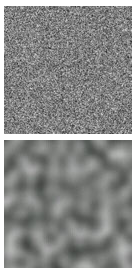

.. Copyright (C)  Wayne Brown
  Permission is granted to copy, distribute
  and/or modify this document under the terms of the GNU Free Documentation
  License, Version 1.3 or any later version published by the Free Software
  Foundation; with Invariant Sections being Forward, Prefaces, and
  Contributor List, no Front-Cover Texts, and no Back-Cover Texts.  A copy of
  the license is included in the section entitled "GNU Free Documentation
  License".

.. role:: raw-html(raw)
  :format: html

11.6 - Procedural Texture Mapping
:::::::::::::::::::::::::::::::::

.. admonition:: Review

  *Texture mapping* is a technique for specifying a unique color for each
  fragment that composes a triangle. The colors come from a *mapping*, which
  is a function that converts a set of input values into an output value. There are
  two basic ways this can be done:

  * Lookup the output value from a list of possible values. This is called
    a 'table lookup'. In computer graphics this is called *image based texture mapping*.
  * Perform calculations on a set of inputs to produce an output value. This
    is called *procedural texture mapping* due to the fact that the calculations
    are typically performed in a "procedure."

This lesson introduces the basic ideas behind *procedural
texture mapping*.

Overview
--------

*Image based* texture mapping and *procedural based* texture mapping
are both widely used. In fact, the two techniques
are often used together to create more realistic surfaces.

Advantages to *procedural texture mapping*:

* *Procedural texture mapping* requires much less memory because there is no
  image to download or store in RAM or in the GPU's memory.
* "Magnification" and "minification" are less of an issue. *Procedural
  texture mapping* typically calculates reasonable details at a wide range of scales.
* *Procedural texture maps* can generate a wide variety of patterns with
  small tweaks in their calculations. To get the same effect with *image
  based texture mapping* would require a separate image for each tweaked pattern.

Disadvantages to *procedural texture mapping*:

* *Procedural texture maps* are calculated at rendering time for each individual
  fragment. If the calculations are complex, rendering speeds become
  slower.
* The calculations required for *procedural texture mapping* can be complex and
  modifying the equations to achieve a specific affect can be difficult.
* *Procedural texture mapping* creates patterns. If a more structured design
  is needed, such as a road sign containing words, *image based texture mapping*
  is typically the better approach.

*Procedural texture mapping* converts input values into a color. The input
values can be anything related to a triangle's attributes, such as its location,
orientation, diffuse color, etc.. That being said, we typically don't want the surface
properties of a model to change because of it's location and/or orientation. For example,
the wood grain on a model should not change as a piece of wood is
moved in a scene; the wood grain should look the same from any position or angle.
Using *texture coordinates* as the inputs for calculating a *procedural
texture map* causes the generated pattern to be the same regardless of how
the model is transformed in a scene. If the geometry of a model
is used for *procedural texture mapping*, the geometry values should be used
before any scene transformations are applied to them.

*Procedural texture mapping* is performed by *fragment shader* programs.
There is no limit to the complexity of such programs, but added
complexity means slower rendering. If you need to render various models
with different *procedural texture maps*, it is more efficient to implement
a separate *shader program* for each rendering. The alternative is to
use an :code:`if statement` in a single *shader program* to select the
appropriate *procedural texture map* at rendering time, but this slows down
all rendering.

Software Overview
-----------------

The basic steps to create a *procedural texture map* are:

#. When building a model:

   a) If *texture coordinates* will be used, assign an appropriate :code:`(s,t)`
      value to every vertex of a model.
      :raw-html:`  `

#. JavaScript pre-processing for a canvas rendering, if *texture coordinates* will be used:

   a) Create a GPU *buffer object* and store the *texture coordinates* in the GPU.
   b) Get the location of an :code:`attribute` variable that will hold the
      *texture coordinates* in a *shader program*.
      :raw-html:`  `

#. JavaScript setup each time a model is rendered:

   a) Select the correct *shader program* with :code:`gl.useProgram()`.
   b) If *texture coordinates* will be used, attach an appropriate *buffer object*
      to the *texture coordinates* :code:`attribute` variable.
      :raw-html:`  `

#. *Shader program*:

   a) If *texture coordinates* will be used, in the *vertex shader*,
      create a :code:`varying` variable that will
      interpolate the *texture coordinates* across the surface of a triangle.
      (Or interpolate some other property of the model across the face.)
   b) In the *fragment shader*, use the *texture coordinates* (or some other
      interpolated value) to **calculate** a color.

*Texture coordinates* were explained in the previous two lessons.
The major discussion for this lesson is the calculations used
for a *procedural texture map*. Equations for three different patterns are explained:
gradients, checkerboards, and "Perlin Noise". Then we discuss how to
overlay these patterns at different scales to create more complex textures.
Please spend significant time experimenting with each of the example WebGL programs
so that you fully understand the concepts.

Texture Map Patterns
--------------------

Gradient Patterns
.................

A smooth transition from one color into another color is commonly called
a "gradient color". There are many variations on this simple idea. The following
WebGL program renders a simple cube where each side has *texture
coordinates* that range from 0.0 to 1.0 across each face. Study the
*fragment shader* and then modify it with each of the suggested gradient
functions below.

.. webglinteractive:: W1
  :htmlprogram: _static/11_gradient_texture/gradient_texture.html
  :editlist: _static/11_gradient_texture/gradient.frag, _static/11_gradient_texture/gradient.vert

Gradient Experiments
********************

The *fragment shader* above uses the :code:`s` component of
the *texture coordinates* as a percentage of the face's color. The face's
color is "hardcoded" as red in the *fragment shader* but the face's color
could have come from an attribute variable of the triangle. Note that the operation
:code:`red * s` is a component by component multiply because :code:`red`
is a vector and :code:`s` is a scalar (a single value). That is, the result
of :code:`red * s` is a new vector :code:`(red[0]*s, red[1]*s,
red[2]*s)`.

Experiment with the following code modifications. Hit the "Re-start"
button after each change to see the results. If you introduce errors
in the *fragment shader* program, error messages will be displayed in the
"Run Info" display area below the canvas window and in the JavaScript console
window. (Re-load the entire web page to get back to an error-free version.)

* Change the variable :code:`red` to a different color.
* Use the :code:`t` component of the *texture coordinates* to modify the color.
  Notice how the gradient switches directions across each face.
* Use the :code:`s` component of the *texture coordinates*, but reverse its direction.
  That is, use a percentage of :code:`(1.0 - s)`. Notice how the black part of
  each gradient switches sides on each face.
* Try a percentage of :code:`(s + t)`. This produces values between
  0.0 and 2.0. All values greater than 1.0 are automatically clamped to 1.0.
  Therefore, every location on the face
  where the (s+t) is greater then 1.0 will get the full color. This produces
  a solid red triangle on each side of the cube.
* Try a percentage of :code:`((s+t)/2.0)`. This scales the sum to
  always be between 0.0 and 1.0 and produces a nice gradient across the face.
* Try a percentage of :code:`((s+t)/3.0)`. This scales the sum to
  always be between 0.0 and (2/3) and produces a nice gradient across the face.
  However the color never saturates to full color.
* Try a percentage of :code:`(s * t)`. This produces percentages
  between 0.0 and 1.0, but the values are not linear.
* Try a percentage of :code:`sin(s)`. Remember that trig functions
  always use radians, so this is calculating the sine of angles between 0.0
  and 1.0 radian (57.2958 degrees). The color never becomes saturated because
  the percentages are between 0.0 and 0.84.
* Try a percentage of :code:`sin(s * PI/2.0)`. This calculates
  a percentage between 0.0 and 1.0 because the :code:`s` component is scaled to
  values between 0.0 and pi/2 (90 degrees). :code:`PI` is not a defined
  constant in the shader language, so you need to define it like this:
  :code:`float PI = 3.141592653589793;`
* Try a percentage of :code:`sin(s * 2.0*PI)`. This calculates
  percentages between 1.0 and -1.0 because it scales :code:`s` to be angles between
  0.0 and 360.0 degrees (2*PI). All values below 0.0 are clamped to 0.0, which
  produces the area that is solid black.
* Try percentages of :code:`abs(sin(s * 2.0*PI))`. This calculates
  percentages between 0.0 and 1.0 because of the :code:`abs()` function which
  takes the absolute value of its argument. Notice the nice two "color bands".
  What happens when :code:`2.0*PI` becomes :code:`3.0*PI`? What happens for :code:`n*PI`?
* Try percentages of :code:`(sin(s * 2.0*PI) * sin(t * 2.0*PI))`.
  This produces gradient circles. If you add the :code:`abs()` function you
  will get uniform circles. If you change the 2.0 factor to other values, you
  get that many circles. Try removing the 2.0 factor.

All of the above experiments calculate a percentage of a base color.
You can make a gradient vary between two different colors using a parametric
equation with the percentage as the parametric equation's :code:`t` value.
(Don't confuse the parametric :code:`t` with *texture coordinates* :code:`(s,t)` --
they are totally different parameters.)

.. Code-Block:: C

  vec3 red = vec3(1.0, 0.0, 0.0);
  vec3 blue = vec3(0.0, 0.0, 1.0);

  percent = abs(sin(s * 2.0*PI));
  return vec4( red * percent + blue * (1.0-percent), 1.0);

Please experiment with two color gradients.

You can "generalize" gradient texture maps by making the base colors
:code:`uniform` variables that can be set at render time. In addition,
some of the equation values could be :code:`uniform` variables.
For example, the equation :code:`abs(sin(s * n*PI))`
produces :code:`n` strips of color over a face.
The value :code:`n` could be a :code:`uniform` variable.

Checkerboard Patterns
.....................

The following WebGL program creates a checkerboard pattern. Study the *fragment
shader* program and notice that the function called :code:`checkerboard`
calculates whether a *texture coordinate* is part of a "white" or "black"
tile by determining whether the sum of the texture coordinates is either even
or odd. The function returns the color of the appropriate tile. The :code:`uniform u_Scale`
factor determines the number of tile rows in the checkerboard pattern by
scaling the *texture coordinates*. Experiment with this program.

.. webglinteractive:: W2
  :htmlprogram: _static/11_checkerboard_texture/checkerboard_texture.html
  :editlist: _static/11_checkerboard_texture/checkerboard.frag, _static/11_checkerboard_texture/checkerboard.vert

Perlin Noise Patterns (randomness with coherence)
.................................................

Another technique for creating a pattern for a procedural texture map is to use `randomness`_.
However, a purely random function is not useful in CGI because, well, the values
are random. Textures and patterns in nature have "coherence," which means that
color values in a pattern tend to be similar to their neighboring values.
An algorithm called `Perlin Noise`_ was developed by `Ken Perlin`_ which captures
the idea of randomness with the assumption that neighboring color values are
somehow related. You can compare the top image to the right, which is totally random,
with the image below it which was generated using "Perlin Noise".

Implementing a pattern that is random but has coherence can be done in a variety
of ways using array lookup tables, texture map images, and/or calculations. In
the ideal case the method would be computationally efficient and use the
least amount of memory. An overview of algorithms that calculate "Perlin noise"
can be found at https://en.wikipedia.org/wiki/Perlin_noise#Procedural_coherent_noise.
There are patent issues with some of the algorithms, so we will use the `OpenSimplex`_
noise algorithm found `here`_.

.. admonition:: Definitions of "random" and "noise"

  Computer graphics (and computer science in general) borrows terms from other disciplines
  but does not always keep the meanings of those terms consistent with their original
  meaning. "Randomness is the lack of pattern or predictability in events." [`1`_]
  "Noise" is randomness in a communication signal. For CGI applications, neither definition
  is totally correct. For randomness, "pseudo-random" numbers are actually pulled
  from a sequence of known values. To get a different sequence of "pseudo-random"
  values you start pulling values from a different part of the sequence. We call the
  starting value for the sequence the "seed" value.
  For CGI, we might want a "random pattern" on various objects in a scene, but we want
  the same "random pattern" every time we render the scene. Therefore we need to
  "seed" a "Perlin Noise" function with the same seed each time it renders. The
  "seed" values that give the same pattern for repeated renderings are typically
  the *texture coordinates* of a model. If a new "random pattern" is needed then
  the *texture coordinates* can be translated, scaled, or rotated to provide a
  different "seed".

Please study the *fragment shader* in the following WebGL program.
Skip over the OpenSimplex "noise" generator code in lines 1-97 and concentrate on
lines 99-109. Notice
that it uses a percentage value returned from the :code:`simplexNoise2()` function
to create shades of gray by using the percentage value for each color component,
i.e., :code:`(percent, percent, percent)`.

.. webglinteractive:: W3
  :htmlprogram: _static/11_noise/noise.html
  :editlist: _static/11_noise/noise.frag, _static/11_noise/noise.vert

"Perlin Noise" experiments
**************************

* Make the percentage change a color value. For example:

  .. Code-Block:: C

    vec3 color = vec3(1.0, 0.0, 0.0);
    gl_FragColor = vec4(color * percent, 1.0);

* Make the percentage vary between two different colors. For example:

  .. Code-Block:: C

    vec3 color1 = vec3(1.0, 0.0, 0.0);
    vec3 color2 = vec3(0.0, 1.0, 0.0);
    gl_FragColor = vec4(color1 * percent + color2 * (1.0-percent), 1.0);

.. admonition:: "OpenSimplex Noise" parameters

  There a four parameters that modify the "noise pattern" create by
  the :code:`simplexNoise2` function. The number of possible variations
  is basically infinite. When you find a pattern that meets your needs,
  the parameters would typically be hard-coded into a *fragment shader*.

Overlaid Patterns
-----------------

Complex patterns can be created by **combining**
the patterns we have discussed (gradients, checkerboards, and "Perlin Noise")
**at different scales**. This will make more sense by working though
some examples. Suppose we have the following three functions:

.. Code-Block:: C

  gradient(tex_coords, scale, color)
  checkerboard(tex_coords, scale, color)
  simplexNoise2(tex_coords, scale, color)

Let's assume each function returns a color value that can be combined
using a "weighted sum". If the scale factors for each pattern are varied, interesting
texture patterns can be created. For example, this takes an equal percentage of three
separate patterns:

.. Code-Block:: C

  float percent = 0.33 * gradient(tex_coords, 10.0, color1) +
                  0.33 * checkerboard(tex_coords, 4.0, color2) +
                  0.33 * simplexNoise2(tex_coords, 1.5, color3);

while the next example has a dominate "noise" pattern:

.. Code-Block:: C

  float percent = 0.20 * gradient(tex_coords, 10.0, color1) +
                  0.20 * checkerboard(tex_coords, 4.0, color2) +
                  0.60 * simplexNoise2(tex_coords, 1.5, color3);

In addition, the **same pattern** can be used at different scales, such as:

.. Code-Block:: C

  float percent = 0.33 * simplexNoise2(tex_coords, 10.0, color1) +
                  0.33 * simplexNoise2(tex_coords, 4.0,  color2) +
                  0.33 * simplexNoise2(tex_coords, 1.5,  color3);

The possibilities are endless.

Designing Overlay Patterns
..........................

Designing a pattern for a *texture map* using overlays is difficult.
A good design tool is indispensable. The following
WebGL program allows you to experiment with pattern overlays. The basic
algorithm looks like this, where the number of overlays, :code:`n`, and
the available patterns to use are arbitrary:

.. Code-Block:: C

  // Set the number of patterns to overlay
  const int n = 5;

  vec3 color = vec3(0.0, 0.0, 0.0);  // start with no color
  for (int j=0; j<n; j++) {
    color = color + amount[j] * pattern(tex_coords, scale[j], color[j]);
  }

.. webgldemo:: W4
  :htmlprogram: _static/11_overlay_design/overlay_design.html

Summary
-------

Three basic patterns were discussed for the calculation of a *texture map*.
In addition, the patterns were combined (i.e., overlaid) in interesting ways.
This lesson hopefully gave you a foundation on which to build,
but we only "scratched the surface" on what is possible (pun intended).

Glossary
--------

.. glossary::

  procedural texture mapping
    Calculate a color for a fragment based on some input values. The input values
    are often *texture coordinates*.

  image based texture mapping
    Get a color for a fragment from a 2D image based on *texture coordinates*, :code:`(s,t)`.

  gradient pattern
    In mathematics, a gradient is an increase or decrease in the magnitude of a property.
    In computer graphics, a gradient pattern increases or decreases the color values across the
    surface of a face.

  checkerboard pattern
    A series of alternating colored tiles arrange symmetrically on a 2D grid.

  "Perlin Noise"
    A pattern that is random but that also has coherence (neighboring fragments have
    similar colors.)

  overlaid patterns
    Given some patterns that can be created at various scales, combine multiple
    instances of the patterns at different scales to create a texture map.

Self Assessment
---------------

.. mchoice:: 11.6.1
  :random:

  A *procedural texture map* is performed by ...

  - calculations on input values to produce a percentage or color output value.

    + Correct.

  - calculations to create a color.

    - Not the best answer. Another choice is a better definition.

  - getting a color from a 2D image.

    - Incorrect. This is *image texture mapping*.

  - a procedure.

    - Not the best answer. Another choice is a better definition.

.. mchoice:: 11.6.2
  :random:

  Using the gradient WebGL program in this lesson, what pattern does the
  calculation :code:`abs(sin(s * 2.0*PI))` produce?

  - Two bands of gradient color on each face.

    + Correct.

  - A checkerboard pattern.

    - Incorrect.

  - A linear change in color from one side a cube face to another.

    - Incorrect.

  - A sine wave.

    - Incorrect.

.. mchoice:: 11.6.3
  :random:

  What is the difference between "Perlin Noise" and pure randomness?

  - "Perlin Noise" produces the same pattern for identical inputs; pure randomness
    would produce a different pattern every time.

    + Correct.

  - "Perlin Noise" produces a different pattern for identical inputs; pure randomness
    would produce the same pattern every time.

    - Incorrect.

  - "Perlin Noise" is strictly for computer graphics; randomness can be used for any application.

    - While true in one sense, there is a better answer amoung your choices.

  - "Perlin Noise" only works in shader programs; randomness can be used in any program.

    - Incorrect. "Perlin Noise" is an algorithm that can be implemented in any programming language
      for any purpose.

.. mchoice:: 11.6.4
  :random:

  Which of the following are true concerning "overlay patterns"? (Select all that apply.)

  - A pattern created by the combination of other patterns at various scales.

    + Correct.

  - Each pattern can use different colors.

    + Correct.

  - All of the patterns need to be of the same type. (E.g., all "Perlin Noise")

    - Incorrect.

  - The patterns should always be combined with equal percentages.

    - Incorrect.

For more study
--------------

http://www.upvector.com/?section=Tutorials&subsection=Intro%20to%20Procedural%20Textures

.. _Ashima Arts: https://github.com/ashima/webgl-noise
.. _Perlin noise: https://en.wikipedia.org/wiki/Perlin_noise
.. _Ken Perlin: https://en.wikipedia.org/wiki/Ken_Perlin
.. _randomness: https://en.wikipedia.org/wiki/Randomness
.. _1: https://en.wikipedia.org/wiki/Randomness.
.. _OpenSimplex: https://en.wikipedia.org/wiki/OpenSimplex_noise
.. _here: http://www.geeks3d.com/20110317/shader-library-simplex-noise-glsl-opengl/

.. index:: texture mapping, procedural texture mapping, image texture mapping, texture coordinates, gradient pattern, checkerboard pattern, "Perlin Noise", overlaid patterns,

