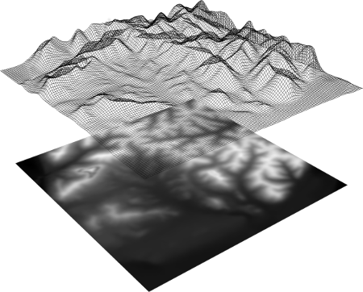
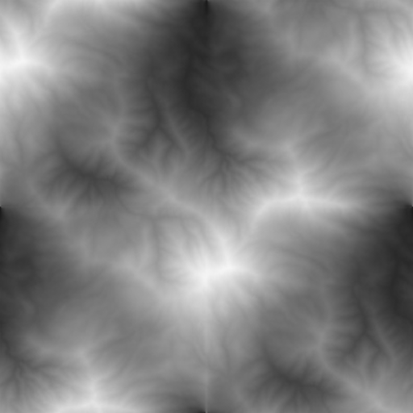
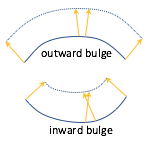
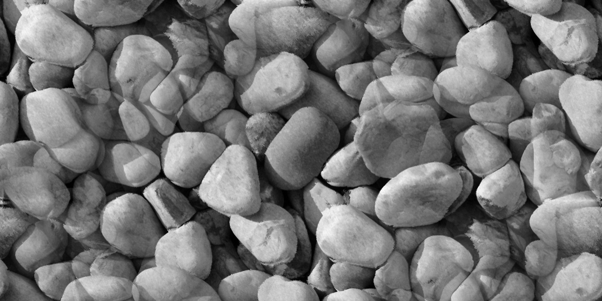
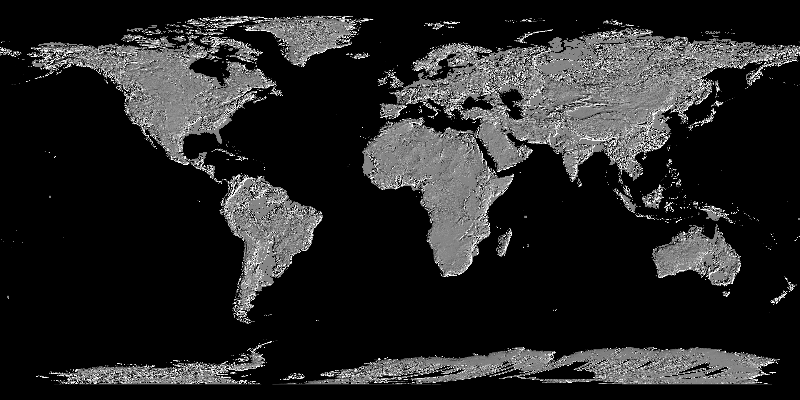

.. Copyright (C)  Wayne Brown
  Permission is granted to copy, distribute
  and/or modify this document under the terms of the GNU Free Documentation
  License, Version 1.3 or any later version published by the Free Software
  Foundation; with Invariant Sections being Forward, Prefaces, and
  Contributor List, no Front-Cover Texts, and no Back-Cover Texts.  A copy of
  the license is included in the section entitled "GNU Free Documentation
  License".

.. role:: raw-html(raw)
  :format: html

11.9 - Heightmaps / Displacement Maps
:::::::::::::::::::::::::::::::::::::

The previous lessons explained how to model the color of a surface using a "mapping".
"Image texture mapping" performs a "table lookup" to retrieve a surface color from
a 2D image; "procedural texture mapping" calculates a surface color based on input values.
The next several lessons explain how mappings can be used to model other properties
of a surface.

This lesson explains how to use a "mapping" to modify the geometry of a surface.

Heightmaps
----------

  :raw-html:``
  An example heightmap (`1`_)

A `heightmap`_ is a gray scale image that is used to vary the height of a
surface. Given a flat plane, the height of a surface that "floats" above
the plane is specified by the colors in the gray scale image. The image values,
which are intensities in the range :code:`[0.0, 1.0]`,
are considered percentages of a maximum height. The example to the
right shows a gray scale image (i.e., a *heightmap*) with a wireframe representation
of the surface it represents.

For a gray-scale image all pixel colors have an equal amount of red, green, and blue.
Therefore, any of the three component values can be used to represent a height value.
The typical image uses eight bits to represent each color value. Therefore, the
number of possible height values is limited to 256 (i.e., 2\ :sup:`8`).

The accuracy of a heightmap is dependent on the number of vertices used to define the
initial plane. The more subdivisions in the plane, the higher the resolution
of the rendered surface. Trade-offs are made to use the least amount of memory for
a desired accuracy and resolution.

A *heightmap* modifies the geometry of a model. Therefore, the work of a *heightmap*
is performed in a *vertex shader* (not a *fragment shader*).

Heightmap Example
.................

  :raw-html:``
  A heightmap (`3`_)

The image to the right is used as a heightmap in the following WebGL program.
The lighter areas represent high areas of the surface, while the darker
areas represent lower areas. Experiment with the resolution
of the plane model and study the *vertex shader*. The *vertex shader* changes
the geometry of the surface as follows:

* Get the color of the heightmap at a vertex location using its corresponding *texture coordinates*.
* Calculate the height of this vertex by using the color value, which is between 0.0
  and 1.0, as a percentage to scale the maximum height.
* Use the height as the :code:`y` component of the vertex.

The color of the surface is taken from the heightmap to simplify the example and
to emphasize the relationship between the heightmap image and the resulting surface.
Typically the color of the surface would come from a different texture map.

.. webglinteractive:: W1
  :htmlprogram: _static/11_heightmap/heightmap.html
  :editlist: _static/11_heightmap/heightmap.vert, _static/11_heightmap/heightmap.frag

Heightmap Preparation
.....................

Here is a brief list of the steps used to create the example WebGL program above.

In Blender:

#. Create a mesh plane.
#. Create *texture coordinates* for the plane. (At the bottom of the "tools menu" (:code:`t`), in the
   "Add plane" panel, check the ""Generate UV's" checkbox. This must be done
   immediately after creating the object and before any modifications of the model.)
#. Place the plane in "edit mode" (:code:`tab`)
#. Subdivide the plane to a desired resolution.
#. Assign a material to every face on the plane.
#. Create a texture map for the material and attach an appropriate gray-scale image.

In Gimp (image editor):

#. Create (or find) an appropriate image.
#. Crop the image to make its aspect ratio be 1, or 1/2, 1/4, 1/8, etc.
#. Re-size the image to have dimension that are a power of two: 2, 4, 8, 16, 32, 64, 128, 512, 1024, etc.
#. If *texture coordinates* outside the range :code:`[0.0,1.0]` will be used, make
   the image tileable using "Filters" --> "Map" --> "Make Seamless"

Displacement Maps
-----------------
A *heightmap* displaces vertices from a flat (planar) surface. A variation on heightmaps
is a `displacement map`_, which displaces vertices from a non-planar surface.
The direction of displacement follows a vertex's normal vector. To keep a surface contiguous
after displacement, "smooth normal vectors" must be used.
Assuming that a "smooth normal vector" has been normalized to unit length, the
vector is scaled by a gray-scale value from the displacement map and
added to a vertex's location. As with *heightmaps*, the accuracy of displacement
maps is dependent on the density of its original triangular mesh.

  :raw-html:``
  Displacement of vertices

*Displacement maps* work well for non-planar surfaces that "bulge outward,"
such as a sphere. However, for surfaces that curve "inward" the displacement
can cause vertices to invert their relative locations and flip the orientation
of triangles. An example is shown in the diagram to the right. Note that
an "outward bulge" stretches the area defined by the surface while an "inward
bulge" compresses the area. These distortions may be visually noticeable.

To allow for motion along a vector in the opposite direction of the normal vector,
the values from a *displacement map* can be converted to the range :code:`[-1.0,1.0]`
using the formula :code:`color*2.0 - 1.0`.

*Displacement maps* can also be used in *fragment shaders* to offset the
location of a fragment before lighting calculations are performed. This does
not change the fragment location in the final image, but it can change the
color assigned to the fragment and give the illusion of a rough surface.

Displacement Map Example
........................

  :raw-html:``
  rocks.png

The following WebGL program uses a displacement map on a curved surface using
the image to the right as the displacement map. Please experiment with the program.

Please study the *vertex shader* program which changes the geometry of the surface as follows:

* Get the color of the heightmap at a vertex location using its corresponding *texture coordinates*.
* Multiply the color times the maximum displacement to get the displacement for this vertex.
  (The color value is a percentage in the range :code:`[0.0,1.0]`.)
* Scale the vertex's normal vector by the displacement to get a "displacement vector".
* Add the displacement vector to the vertex's location.

.. webglinteractive:: W2
  :htmlprogram: _static/11_displacement_map/displacement_map.html
  :editlist:    _static/11_displacement_map/displacement_map.vert, _static/11_displacement_map/displacement_map.frag

Displacement Map Preparation
............................

Here is a brief list of the steps used to create the example WebGL program above.

In Blender:

#. Create a mesh plane.
#. Create *texture coordinates* for the plane. (At the bottom of the "tools menu" (:code:`t`), in the
     "Add plane" panel, check the ""Generate UV's" checkbox. This must be done
     immediately after creating the object and before any modifications of the model.)
#. Place the plane in "edit mode" (:code:`tab`)
#. Subdivide the plane to a desired resolution.
#. Add curvature to the mesh surface using "proportional editing."
#. Assign a material to every face on the plane.
#. Create a texture map for the material and attach an appropriate gray-scale image.

In Gimp (image editor):

#. Create (or find) an appropriate image.
#. Crop the image to make its aspect ratio be 1, or 1/2, 1/4, 1/8, etc.
#. Re-size the image to have dimension that are a power of two: 2, 4, 8, 16, 32, 64, 128, 512, 1024, etc.
#. Convert the image to greyscale.
#. If *texture coordinates* outside the range :code:`[0.0,1.0]` will be used, make
   the image tileable using "Filters" --> "Map" --> "Make Seamless"

A Fun Example
-------------

A displacement map can be used to create a realistic model of the earth
using publicly available data from NASA.
The image below is a greyscale image that represents a heightmap of the earth.

  :raw-html:``
  GDEM-10km-BW.png [`4`_]

The following WebGL program renders a sphere using the image above as a displacement map.
The image has been stretched at the top and bottom to compensate for compression
at the north and south poles. (Use the mouse wheel to zoom in for a closer look.)

.. webgldemo:: W3
  :htmlprogram: _static/11_earth/earth.html

Summary
-------

A *heightmap* is a special case of the more general *displacement map* concept.
Use the example *vertex shader* implemented for *displacement mapping* for any future
WebGL development.

The WebGL examples in this lesson were written to help you understand *displacement
mapping* -- not to create fantastic renderings. *Displacement mapping* is typically
combined with other surface property techniques to create life-like renderings.

A disadvantage to *heightmaps* is the need for a large number of vertices
in a model's triangular mesh, which increases memory requirements and slows rendering.

Glossary
--------

.. glossary::

  heightmap
    Use a value from a texture map as the "height" of a vertex.

  displacement map
    Use a value from a texture map to offset the location of a vertex
    along it's normal vector.

Self Assessment
---------------

.. mchoice:: 11.9.1
  :random:

  Where are *heightmaps* and *displacement maps* implemented?

  - *vertex shader*

    + Correct. They change the 3D geometric location of a vertex, which is put into the :code:`gl_Position` variable.

  - *fragment shader*

    - Incorrect.

  - both the *vertex shader* and the *fragment shader*

    - Incorrect.

  - JavaScript pre-processing code.

    - Incorrect.

.. mchoice:: 11.9.2
  :random:

  Which of the following modifications to a model's vertices would produce
  a traditional *heightmap*?

  - :code:`vec3 new_vertex = vec3(a_Vertex[0], height, a_Vertex[2]);`

    + Correct. The y-axis component is changed.

  - :code:`vec3 new_vertex = vec3(a_Vertex[0], a_Vertex[1], height);`

    - Incorrect. The z-axis component is not changed.

  - :code:`vec3 new_vertex = vec3(height, a_Vertex[1], a_Vertex[2]);`

    - Incorrect. The x-axis component is not changed.

  - :code:`vec3 new_vertex = a_Vertex + height;`

    - Incorrect. This changes all three components of a vertex.

.. mchoice:: 11.9.3
  :random:

  What conditions might cause a triangle to flip its orientation when
  a *displacement map* is used?

  - the underlying mesh caves inward.

    + Correct. When the vertices are projected to a new location their
      relative position to each other can cause the counter-clockwise
      ordering of the vertices to flip. This is only important if the
      vertex ordering is used in the *fragment shader*.

  - the underlying mesh bulges outward.

    - Incorrect.

  - the underlying mesh has too few vertices.

    - Incorrect.

  - the underlying mesh has too many vertices.

    - Incorrect.

.. mchoice:: 11.9.4
  :random:

  A *heightmap* and a *displacement map* can be implemented with the same
  *vertex shader* program if what is true?

  - The *normal vectors* of the underlying mesh always point in the
    direction of displacement.

    + Correct. For a flat plane, the *normal vectors* will be pointing straight up from the surface.

  - The underlying mesh is always planar.

    - Incorrect. *Displacement maps* are defined for any surface, planar or not.

  - The underlying mesh contains a sufficient number of vertices.

    - Incorrect. The number of vertices determines the fine-grain accuracy of the
      displacements, but not the code implementation.

  - The image used for the mapping is used for both height displacement and the surface's color.

    - Incorrect. The examples above used the same image for both displacement and color,
      but only for the purpose of simplifying the examples.

.. index:: heightmap, displacement map

.. _heightmap: https://en.wikipedia.org/wiki/Heightmap
.. _displacement map: https://en.wikipedia.org/wiki/Displacement_mapping
.. _1: https://www.ssucet.org/~jhudson/15/2802/heightmap/#slide-3
.. _2: http://www.nmaker.com.br/tools.html

.. _3: https://mapzen-assets.s3.amazonaws.com/images/tangram-heightmapper/diablo_crop.jpg
.. _4: https://asterweb.jpl.nasa.gov/images/GDEM-10km-BW.png

.. _rocks.png: https://www.textureking.com/content/img/stock/big/DSC_4436.JPG

