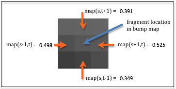
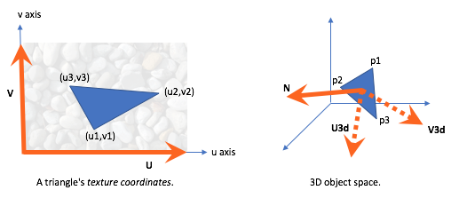
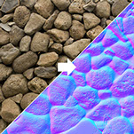

.. Copyright (C)  Wayne Brown
  Permission is granted to copy, distribute
  and/or modify this document under the terms of the GNU Free Documentation
  License, Version 1.3 or any later version published by the Free Software
  Foundation; with Invariant Sections being Forward, Prefaces, and
  Contributor List, no Front-Cover Texts, and no Back-Cover Texts.  A copy of
  the license is included in the section entitled "GNU Free Documentation
  License".

.. role:: raw-html(raw)
  :format: html

11.10 - Bump / Normal Maps
::::::::::::::::::::::::::

The previous chapter explained how to model light. Both the diffuse and
specular lighting calculations require a
*normal vector*. In lesson 11.3 we discussed two scenarios for defining
the *normal vectors*:

#. **Flat Shading** - one *normal vector* for a triangle. The diffuse
   color for a triangle is identical for all of its fragments.
#. **Smooth Shading** - each vertex has a separate *normal vector*. This
   vector is typically an average of the *normal vectors* from the adjacent
   triangles. Interpolating the vertex *normal vectors* across the surface
   produces a distinct *normal vector* for each fragment. However, the *normal vectors*
   change uniformly across the surface which causes the color to change
   uniformly across the surface.

Let's investigate a third option: a distinct *normal vector* for every
fragment of a triangle. *Texture mapping* allows the retrieval of a
unique color for each fragment. Could *texture mapping* techniques be used
to retrieve a unique normal vector for each fragment? YES! And there are
two standard techniques:

* A `bump map`_ uses information from a *texture map* to modify a
  **flat** or **smooth shaded** *normal vector*.
* A `normal map`_ uses a *texture map* to retrieve a distinct *normal vector*.

Changing the *normal vector* for each fragment changes the percentage of diffuse
and specular light that is reflected, thus allowing for the simulation of
surface variations on a triangle's face.

Bump Maps
---------

Bump maps can be image-based or procedural-based. In the case of images,
the image is assumed to be a greyscale image that contains a single intensity
value per pixel. In the case of procedural texture maps, a single percentage value
is calculated in the range :code:`[0.0,1.0]`.

The details to implement *bump mapping* are non-trivial, so let's start with
the big idea:

#. Each vertex of a triangle has a *normal vector*. The *vertex shader* puts
   the *normal vector* into a :code:`varying` variable and each fragment gets
   an interpolated *normal vector*.
   :raw-html:`  `

#. The *fragment shader* uses a *texture map* to get a :code:`<deltaX,deltaY>` offset
   to modify its *normal vector*. This "tweak" in the *normal vector* must
   be applied relative to the triangle's orientation. Therefore, each triangle
   must be able to calculate or retrieve a local coordinate system. The :code:`deltaX`
   offset must be applied in a direction that is "to the right" relative to the
   triangle's surface. Similarly, the :code:`deltaY` offset must be applied in a
   direction that is "upward" relative to the triangle's surface.
   :raw-html:`  `

#. The diffuse and specular lighting calculations are performed using the
   new *normal vector*.

There are two major tasks in step 2: produce a :code:`(deltaX,deltaY)` offset
from a *texture map* and use a triangle's *local coordinate system* to modify
a fragment's *normal vector*.

Getting the *Normal Vector* Offsets
...................................

For a *texture map* implemented using a "bump map image"
a :code:`(deltaX,deltaY)` offset can be calculated from the four
surrounding pixels of the fragment's location in the bump map image.
The amount of relative change around the image location can be calculated
using the difference between values in the horizontal and vertical directions.
(In mathematics this is called a "finite difference.") The diagram
to the right shows nine pixels in an enlarged area of an image where the difference
between the horizontal pixels is :code:`0.027`, i.e., (0.525 - 0.498), and the difference
between the vertical pixels is :code:`0.042`, i.e., (0.391 - 0.349). This gives a offset
to modify the surface *normal vector* that is proportional to the changes
in the bump map image. In the diagram's example the offset vector is :code:`<0.027, 0.042>`.

In a *fragment shader* the *normal vector* offsets can be calculated using the following
example code. To retrieve adjacent pixels, the amount of change in
the *texture coordinates* can be calculated by dividing the image dimensions into 1.0.
For example, if the image has a width of 512 pixels, 1.0/512.0, (i.e., 0.001953125) needs
to added to a :code:`u` *texture coordinate* to get to its adjacent pixel.

.. Code-Block:: C
  :linenos:

  // The dimensions of the bump map image: (width, height)
  uniform vec2 u_Image_size;

  //-------------------------------------------------------------------------
  // Given texture coordinates, calculate the "finite difference"
  // between neighboring pixels.
  vec2 get_bump_offsets(vec2 texture_coordinates) {
    float pixel_delta_u = 1.0 / u_Image_size[0];
    float pixel_delta_v = 1.0 / u_Image_size[1];

    vec2 up    = vec2(0.0,  pixel_delta_v);
    vec2 down  = vec2(0.0, -pixel_delta_v);
    vec2 left  = vec2(-pixel_delta_u, 0.0);
    vec2 right = vec2( pixel_delta_u, 0.0);

    vec4 right_color = texture2D(u_Texture_unit, texture_coordinates + right);
    vec4 left_color  = texture2D(u_Texture_unit, texture_coordinates + left);
    vec4 up_color    = texture2D(u_Texture_unit, texture_coordinates + up);
    vec4 down_color  = texture2D(u_Texture_unit, texture_coordinates + down);

    return vec2(right_color[0] - left_color[0], up_color[0] - down_color[0]);
  }

Modifying a Normal Vector
.........................

Just as a model has a local coordinate system, every triangle in a model has
its own local coordinate system. The *normal vector* of a triangle vertex
points away from the triangle's front face. Let's assume the *normal
vector* is equivalent to the Z axis of the triangle's local coordinate system, and
the equivalent X and Y axes lie in the plane defined by the triangle's surface.
We can solve for the vectors that represent the X and Y axes such that they
have an equivalent orientation to the axes of the *texture map*.

In the diagram below, the left diagram shows a triangle in "texture coordinate
space." Regardless of the actual dimensions of the texture map image,
the :code:`U` and the :code:`V` axes have unit length and the *texture coordinates*
:code:`(u1,v1)`, :code:`(u2,v2)`, and :code:`(u3,v3)` are percentages in the
range :code:`[0.0,1.0]`. The *normal vector* for the triangle is coming out of
the diagram towards you. In the right diagram is a 3D plot of the same triangle.
The vectors :code:`U3d` and :code:`V3d` can be calculated such that they lie
in the plane defined by the triangle and they are consistent with the
orientation of the *texture map*. Said another way, we want to calculate where
:code:`U` and :code:`V` would be in 3D space if the texture map was placed
on the surface of the 3D triangle.

.. admonition:: Vector Math

  All vectors are defined with reference to a coordinate system. For example,
  :code:`<3,4>` is a vector that changes 3 units along the X axis and 4 units
  along the Y axis. The vector can be represented as the sum of two vectors,
  :code:`3*<1,0> + 4*<0,1>`. The axis vectors, :code:`<1,0>` and :code:`<0,1>`,
  are the "basis" for the definition.
  Any vector can be represented by the sum of two scaled "basis" vectors.

In the "3D space" diagram above, the vectors :code:`<p3-p1>` and :code:`p2-p1`
can be represented using the vectors :code:`U3d` and :code:`V3d` as their "basis".
The "lengths" applied to the "basis" vectors comes from the corresponding
vectors in the "texture coordinates space". This provides the following two
equations:

.. Code-Block:: C
  :linenos:

  <p2-p1> = (u2-u1)*U3d + (v2-v1)*V3d
  <p3-p1> = (u3-u1)*U3d + (v3-v1)*V3d

These can be solved for the "basis" vectors, :code:`U3d` and :code:`V3d` to give:

.. Code-Block:: C
  :linenos:

  U3d = ((v3-v1)<p2-p1> - (v2-v1)<p3-p1>) / ((u2-u1)(v3-v1) - (v2-v1)(u3-u1))
  V3d = ((u3-u1)<p2-p1> - (u2-u1)<p3-p1>) / ((v2-v1)(u3-u1) - (u2-u1)(v3-v1))

These vectors have the correct directions to define a 3D local coordinate system but
their lengths are not one. Therefore the vectors need to be normalized:

.. Code-Block:: C
  :linenos:

  v_U3d = normalize(v_U3d);
  v_V3d = normalize(v_V3d);

Using these vectors, the offsets from the bump map image can be applied to
a *normal vector*. The "x offset" travels along the :code:`U3d` axis and the
"y offset" travels along the :code:`V3d` axis. The new normal vector
is calculated like this:

.. Code-Block:: C
  :linenos:

  new_normal = normal + x_offset * U3d + y_offset * V3d;

This :code:`new_normal` must be normalized because the lighting
calculations expect a *normal vector* of unit length.

In summary, the offsets retrieved from the bump map image are applied to the
*normal vector* relative to the triangle's *local
coordinate system*. To calculate the local coordinate system all of the
vertices of the triangle and all of the texture coordinates of the triangle
must be accessible. There are two scenarios:

* If a model's geometry and texture coordinates never change,
  pre-calculate the :code:`U3d` and :code:`V3d` vectors and store them
  in a GPU *buffer object* on a per vertex basis. This requires memory for
  6 extra floats per vertex.
* If a model's geometry or texture coordinates are modified during rendering,
  the :code:`U3d` and :code:`V3d` vectors must be calculated in the *vertex shader*
  or the *fragment shader* during rendering.
  This requires that extra GPU *buffer objects* be created
  to store the other two vertices and the other two texture coordinates for
  the current triangle vertex. This requires 10 extra floats per vertex.

.. admonition:: Caveat

  It should be noted that the vectors :code:`N`, :code:`U3d` and :code:`V3d` are
  typically not orthogonal and do not define a precise coordinate system (which
  requires that coordinate axes be 90 degrees apart). However, this is OK because
  we never use the three vectors to form an actual coordinate system.

An Example WebGL Program
........................

The following WebGL program stores two extra vertices and two extra texture coordinates
for each vertex and calculates a "local coordinate system" for each
triangle vertex in the *vertex shader*. The :code:`U3d` and :code:`V3d` vectors
are placed into :code:`varying` variables so they are available to the *fragment shader*.
Please experiment with the program and study the *shader program*. Please note
that all of the lighting calculations are performed in "camera space" and therefore
the :code:`U3d` and :code:`V3d` vectors must be converted to "camera space" as well
(lines 76-77 in th *vertex shader*).

Make sure you investigate the difference between using an image as the source for
surface colors vs. modifying the surface normals. You can change the WebGL program
rendering below under the "Model Properties" options.

.. webglinteractive:: W1
  :htmlprogram: _static/11_bump_map/bump_map.html
  :editlist: _static/11_bump_map/bump_map.vert, _static/11_bump_map/bump_map.frag

Using Gimp to Create Bump Maps
..............................

Gimp includes tools for creating bump maps. One such tool is the `emboss`_ tool
(Filters --> Distorts --> Emboss). The tool only works on color images.
The WebGL program above uses an example image from Gimp's documentation.
The original color image is shown below, along with the results of changing
the image size to a power of 2 and applying the embossing tool.

+------------------------------------------+------------------------------------------------+
| Original color image                     | "Embossed" image                               |
+==========================================+================================================+
| .. figure:: figures/taj_orig.jpg         | .. figure:: figures/distort-taj-emboss.png     |
|   :align: center                         |   :align: center                               |
+------------------------------------------+------------------------------------------------+

Do a web search for **"creating bump maps using Gimp"** to learn further techniques and
details on bump map creation.

Normal Maps
-----------

  :raw-html:``
  An image and its :raw-html:` ` associated normal map (`1`_)

A `normal map`_ is a variation on *bump maps*. The RGB values in a *normal map* image
are not used to modify a *normal vector* - **they are the normal vector!**
An RGB pixel value, :code:`(red,green,blue)`, is used as a :code:`<dx,dy,dz>`
*normal vector*. The normal map is defined in the X-Y plane with the +Z axis being
the general direction of the surface normal. Since the color :code:`(0,0,1)` is blue,
normal map images tend to be "blueish" in color, as in the example image to the right.

Normal vectors can point in any direction, but image color components are always
positive values in the range :code:`[0.0, 1.0]`. Therefore, *normal vectors* have to
be transformed before they can be stored in an image. Given a *normal vector* component
value in the range :code:`[-1.0, 1.0]`, it is scale by 1/2 and then offset by
1/2 to get it in the range :code:`[0.0, 1.0]` (e.g, :code:`component*0.5 + 0.5`). When
a color is extracted from the image, each component must be converted
back into a *normal vector* value by undoing the transformation, i.e.,
:code:`component*2.0 - 1.0`.

Transforming Normal Vectors into "Triangle Space"
.................................................

As with *bump maps*, *normal map* vectors must be transformed so they are relative
to the surface they are modeling. Using the equations developed above for *bump maps*,
the vectors :code:`U3d` and :code:`V3d`, along with a vertex's *normal vector* :code:`N`,
can be used to create a *local coordinate system* for that vertex. A *coordinate
system* is defined by 3 orthogonal vectors, so the three vectors must be made
orthogonal. This can be done by taking the cross-product of two of the vectors
to calculate the third vector. The order that you perform the cross-products
determines the exact orientation of the *coordinate system*. Here are two possible
scenarios:

* Assume the *normal vector* should be orthogonal to the triangle's surface:

  * The vectors :code:`U3d` and :code:`V3d` line on the triangle's surface,
    so :code:`cross(U3d, V3d)` calculates :code:`N`.
  * Since :code:`N` was calculated using a cross-product, it must be orthogonal
    to both :code:`U3d` and :code:`V3d`. Therefore, the only other operation
    required is to get :code:`U3d` and :code:`V3d` orthogonal. This can be done
    using either :code:`V3d = cross(N, U3d)` or :code:`U3d = cross(V3d, N)`.

* Assume the *normal vector* is for **smooth shading** and that it is not
  orthogonal to the triangle's surface:

  * :code:`N` should not be changed, so recalculate both :code:`U3d` and
    :code:`V3d` to make them orthogonal.
  * :code:`V3d = cross(N, U3d)`
  * :code:`U3d = cross(V3d, N)`

We now have a valid *coordinate system* defined by the vectors :code:`U3d`,
:code:`V3d`, and :code:`N`. In lesson 7.6 you learned that a transformation
matrix to position and orient a model in 3D space can be easily created from the
model's local coordinate system. The vectors that define the coordinate system
are the columns of the transformation matrix:

.. matrixeq:: Eq1

   [M2: ux,vx,nx,0;uy,vy,ny,0;uz,vz,nz,0;0,0,0,1]

Since we are transforming **vectors** which have direction but no location, the 4th
row and column are not needed. Therefore, the following matrix will transform
a vector defined in "global 3D space" into a triangle's *local coordinate space*:

.. matrixeq:: Eq2

   [M2: U3dx,V3dx,Nx;U3dy,V3dy,Ny;U3dz,V3dz,Nz]

In GLSL, a :code:`mat3` data type defines a 3-by-3 matrix defined in column-major
order. Therefore, a transformation matrix can be created easily with this statement:

.. Code-Block:: C

  v_Local_coordinate_system = mat3(U3d, V3d, N);

Normal Maps in a Fragment Shader
................................

The following *fragment shader* statements perform the required *normal map*
calculations. Notice that the vector is retrieved from the *normal map* image,
transformed into the orientation of the current 3D triangle, and then transformed
into camera space for lighting calculations.

.. Code-Block:: C
  :linenos:

  // Get the normal vector from the "normal map"
  normal = vec3(texture2D(u_Texture_unit, v_Texture_coordinate));

  // Transform the component values from [0.0,1.0] to [-1.0,+1.0]
  normal = normal * 2.0 - 1.0;

  // Transform the normal vector based on the triangle's
  // local coordinate system
  normal = v_Local_coordinate_system * normal;

  // Transform the normal vector into camera space for the
  // lighting calculations.
  normal = vec3(u_To_camera_space * vec4(normal, 0.0) );

  // Perform the lighting calculations.
  color = light_calculations(vec3(v_Color), normal,
                             u_Light_position, u_Light_color);

  // Add in the ambient light
  color = color + u_Ambient_intensities * vec3(v_Color);

A WebGL Normal Map Program
..........................

Please experiment with the following program and study the *shader* programs.

.. webglinteractive:: W2
  :htmlprogram: _static/11_normal_map/normal_map.html
  :editlist: _static/11_normal_map/normal_map.vert, _static/11_normal_map/normal_map.frag

.. figure:: figures/normal_map_example.png
  :align: right
  :width: 200
  :height: 200

  :raw-html:``
  An example normal map (`here`_)

Creating Normal Maps
....................

The *normal map* used in the WebGL program above is shown to the right. It
was created by Julian Herzog and is available from "creative commons" `here`_.

Special tools and processes are required to create *normal map* images. `Using Blender`_,
the workflow is:

#. Model a highly detailed ("hi-poly") model
#. Bake the Bump and/or Normal maps
#. Make a low-poly, less detailed model
#. Map the map to the low-poly model using a common coordinate system

To "bake" a *normal map* (or other 3D modeling data) simply means to save the
data to a file for later use.

Gimp can be used to create *normal maps* from images, but as of version 2.8.16
it requires the installation of special plug-ins.

More Advanced Techniques
------------------------

After mastering *bump maps* and *normal maps* you might investigate `parallax mapping`_
which is an enhancement that modifies the texture coordinates at a fragment
to provide greater realism and more illusion of depth.

Glossary
--------

.. glossary::

  mapping
    Given inputs, return an output.

  bump map
    Use a value from an image to shift the direction of a fragment's normal
    vector, which modifies the amount of light it reflects.

  normal map
    Use a RGB value from an image as the normal vector for a fragment.

Self Assessment
---------------

.. dragndrop:: 11.10.1
  :feedback: Please try again!
  :match_1: bump map ||| "Finite differences" in an image are used to modify a fragment's normal vector.
  :match_2: normal map ||| Colors from an image are used as a fragment's normal vector.
  :match_3: heightmap ||| Colors from an image are used as "height" values for vertices.
  :match_4: displacement map ||| Colors from an image are used as displacements along a vertex's normal vector.

  Match each type of surface property modeling with its correct definition.

.. mchoice:: 11.10.2
  :random:

  Where are *bump maps* and *normal maps* implemented?

  - both the *vertex shader* and the *fragment shader*

    + Correct. The *vertex shader* retrieves (or calculates) a *local coordinate system* for a triangle;
      The *fragment shader* retrieves (or calculates) a *normal vector* for a fragment.

  - *vertex shader*

    - Incorrect. (But part of the work is done in the *vertex shader*.)

  - *fragment shader*

    - Incorrect. (But part of the work is done in the *fragment shader*.)

  - JavaScript pre-processing code.

    - Incorrect.

.. mchoice:: 11.10.3
  :random:

  How do you retrieve an adjacent pixel in a *texture map image*?

  - add the fraction :code:`1.0/Image_size` to a *texture coordinate* value.

    + Correct.

  - add 0.01 to a *texture coordinate* value.

    - Incorrect.

  - add 1.0 to a *texture coordinate* value.

    - Incorrect.

  - using the color of the current pixel, add 1.0 to the color.

    - Incorrect.

.. mchoice:: 11.10.4
  :random:

  Which of the following are true? (Select all that apply.)

  - Creating a *bump map* image is easily done using tools in Gimp.

    + Correct.

  - Creating a *normal map* image is easily done using tools in Gimp.

    - Incorrect. Creating a *normal map* requires special tools or Gimp plug-ins.

  - Higher intensity pixels in a gray-scale *bump map* image represent taller bumps.

    + Correct.

  - A *normal map* image requires RGB color values, not gray-scale values.

    + Correct. The color values are the *normal vectors*.

.. index:: mapping, bump map, normal map

.. _bump map: https://en.wikipedia.org/wiki/Bump_mapping
.. _normal map: https://en.wikipedia.org/wiki/Normal_mapping
.. _parallax mapping: https://en.wikipedia.org/wiki/Parallax_mapping
.. _1: http://www.nmaker.com.br/tools.html

.. _GDEM-10km-BW.png: https://asterweb.jpl.nasa.gov/images/GDEM-10km-BW.png
.. _diablo_crop.jpg: https://mapzen-assets.s3.amazonaws.com/images/tangram-heightmapper/diablo_crop.jpg

.. _emboss: https://docs.gimp.org/en/plug-in-emboss.html

.. _here: https://commons.wikimedia.org/w/index.php?curid=25512930

.. _Using Blender: https://wiki.blender.org/index.php/Doc:2.4/Manual/Textures/Influence/Material/Bump_and_Normal

