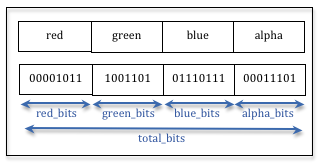

.. Copyright (C)  Wayne Brown
  Permission is granted to copy, distribute
  and/or modify this document under the terms of the GNU Free Documentation
  License, Version 1.3 or any later version published by the Free Software
  Foundation; with Invariant Sections being Forward, Prefaces, and
  Contributor List, no Front-Cover Texts, and no Back-Cover Texts.  A copy of
  the license is included in the section entitled "GNU Free Documentation
  License".

.. role:: raw-html(raw)
  :format: html

12.3 - Selecting Objects
::::::::::::::::::::::::

Interactive applications and games allow users to select objects from
a 3D rendered scene. There are two commonly used algorithms:

#. Cast a ray starting at the camera, :code:`(0,0,0)`, going into the scene
   through the location of the user mouse click. Then intersect the ray with
   every triangle in the scene and remember the closest one. The model
   associated with the selected triangle is the user selection.
   :raw-html:`  `

#. Render the scene twice. On the first rendering, use a unique color with
   no lighting calculations to render each object in the scene.
   Read the color of the pixel at the
   location of the user mouse click. The unique color identifies the
   selected object. Then immediately clear the *draw buffers* and re-render
   the scene normally. The user never sees the first rendering, only the second
   one.

The second algorithm is easier to implement and is explained in detail in this lesson.

A "Selection" Algorithm
-----------------------

The following assumptions are made about a scene:

* The scene is composed of multiple models which can be accessed from an array.
* A unique identifier for each model is its array index.

The scene is rendered twice. The *shader program* used for the first
rendering puts a unique identifier into every pixel rendered for each unique
model. Let's call this *shader program* :code:`selection_program`. The second
rendering creates the image seen by the user. Let's call its *shader program*
:code:`visible_program`. Here are the steps to the selection algorithm, assuming
that the user has clicked on the canvas location :code:`(mouse_x, mouse_y)`.

#. :code:`gl.useProgram(selection_program)`
#. Clear the *color buffer* and the *depth buffer*.
#. Render the scene.
#. Read the color of the pixel at location :code:`(mouse_x,mouse_y)` from the *color buffer*.
#. Use the color to identify the selected object.
#. :code:`gl.useProgram(visible_program)`
#. Clear the *color buffer* and the *depth buffer*.
#. Render the scene.
#. The contents of the *color buffer* becomes visible in the canvas window
   because the JavaScript code terminates its execution. (See the discussion
   on double-buffering in lesson 8.1.)

There are several technical issues to discuss before looking at a
complete implementation of this algorithm.

* How can values be retrieved from the *color buffer* after a rendering is finished?
* How can a unique identifier be converted into a color value suitable for use in a *fragment shader*?
* How can a color value retrieved from a *color buffer* be converted into a unique identifier?
* How can a model be rendered using two different *shader programs*?

Reading Pixels From the *Color Buffer*
......................................

After a rendering operation you can access the resulting *color buffer*
using the :code:`gl.readPixels()` function. This allows you to read a
rectangular section of the image into a 1D array of color component values.
WebGL 1.0 only supports one image format: 8 bits per component with 4 components per pixel (RGBA).
To retrieve a rectangular section of the *color buffer* that has dimensions
:code:`width` by :code:`height` starting
at the lower-left corner :code:`(x,y)`, you would use this command:

.. Code-Block:: JavaScript

  pixels = new Uint8Array(width*height*4); // RGBA values for each pixel
  gl.readPixels(x, y, width, height, gl.RGBA, gl.UNSIGNED_BYTE, pixels);

The pixel data is stored in row-major order in the 1D array.

The selection algorithm only needs the color of one pixel from the
*color buffer*. Therefore, the command is,

.. Code-Block:: JavaScript

  pixel_color = new Uint8Array(4); // A single RGBA value
  gl.readPixels(mouse_x, mouse_y, 1, 1, gl.RGBA, gl.UNSIGNED_BYTE, pixel_color);

However, the coordinate system for the canvas window and the *color buffer*
are not the same. The canvas window has its Y axis starting at the top-left
corner and going down the screen. The *color buffer*'s image coordinate
system has its Y axis
starting at the bottom-left corner and going up the image.
The value of :code:`mouse_y` can be converted to the *color buffer*'s
coordinate system by subtracting it from the buffer's height:

.. Code-Block:: JavaScript

  mouse_y = buffer_height - mouse_y;

Note that :code:`pixels` is an array of :code:`UNSIGNED_BYTE`\ s, not
floats. Each component is an 8-bit unsigned integer in the range 0 to 255.

Converting an Integer Identifier to a Color
...........................................

.. admonition:: Caveat

  From the previous discussion we know that a WebGL 1.0 *color buffer*
  always uses 32 bits (8 bits per component) to represent a color. However,
  this might not be true for future WebGL versions. The following
  discussion assumes that the number of bits per component value can vary.

Setting a color in the *color buffer* requires four floating point values
in the range :code:`[0.0, 1.0]` like this:

.. Code-Block:: GLSL

    gl_FragColor = vec4(red, green, blue, alpha);

The color component values are represented as floating point percentages to make
their values hardware independent. However, at the hardware level, the color
component values are stored as integers to a precision defined by the underlying
hardware. The number of bits used for individual component values in a *color buffer*
can be queried using these JavaScript calls:

.. Code-Block:: JavaScript

  red_bits   = gl.getParameter(gl.RED_BITS);
  green_bits = gl.getParameter(gl.GREEN_BITS);
  blue_bits  = gl.getParameter(gl.BLUE_BITS);
  alpha_bits = gl.getParameter(gl.ALPHA_BITS);
  total_bits = red_bits + green_bits + blue_bits + alpha_bits;

:raw-html:``

The diagram to the right shows a conceptual representation of a color value
in bit format. If an integer identifier is conceptualized in the same format
then the integer can be divided into four parts and each part converted
to a floating point percentage. Dividing the integer into four parts can be
efficiently performed using bit-wise *shift*, :code:`>>`, and *and*, :code:`&`
operations, as shown in the following code:

.. Code-Block:: JavaScript

  let red_max   = Math.pow(2,red_bits) - 1;
  let green_max = Math.pow(2,green_bits) - 1;
  let blue_max  = Math.pow(2,blue_bits) - 1;
  let alpha_max = Math.pow(2,alpha_bits) - 1;

  let red_shift   = green_bits + blue_bits + alpha_bits;
  let green_shift = blue_bits + alpha_bits;
  let blue_shift  = alpha_bits;

  /** ---------------------------------------------------------------------
   * Given an integer identifier, convert it to an RGBA color value.
   * @param id {number} an integer identifier
   * @returns {Float32Array} A array containing four floats.
   */
  function createColor(id) {
    var red, green, blue, alpha;

    red   = ((id >> red_shift)   & red_max)   / red_max;
    green = ((id >> green_shift) & green_max) / green_max;
    blue  = ((id >> blue_shift)  & blue_max)  / blue_max;
    alpha = ((id                 & alpha_max) / alpha_max;

    return new Float32Array([ red, green, blue, alpha ]);
  };

Converting a Color to an Integer Identifier
...........................................

When a color is retrieved from the *color buffer* using :code:`gl.readPixels()`
the value is an array of four integers. To convert the four integers
into a single integer identifier, the values are shifted and added like this:

.. Code-Block:: JavaScript

  let red_max   = Math.pow(2,red_bits) - 1;
  let green_max = Math.pow(2,green_bits) - 1;
  let blue_max  = Math.pow(2,blue_bits) - 1;
  let alpha_max = Math.pow(2,alpha_bits) - 1;

  let red_shift   = green_bits + blue_bits + alpha_bits;
  let green_shift = blue_bits + alpha_bits;
  let blue_shift  = alpha_bits;

  /** ---------------------------------------------------------------------
   * Given a RGBA color value from a color buffer, calculate and return
   * a single integer.
   * @param red   {number} component in the range [0,red_max  ]
   * @param green {number} component in the range [0,green_max]
   * @param blue  {number} component in the range [0,blue_max ]
   * @param alpha {number} component in the range [0,alpha_max]
   * @returns {number} An integer identifier.
   */
  function getID(red, green, blue, alpha) {
    // Shift each component to its bit position in the final integer
    return ( (red   << red_shift)
           + (green << green_shift)
           + (blue  << blue_shift)
           + alpha );
  };

A JavaScript Conversion Class
.............................

The two functions, :code:`createColor()` and :code:`getID()` can be combined
into a single JavaScript class to avoid recalculating the configuration
values each time they are needed. In addition, the continual creation of
new objects, such as creating a new color object for each call to :code:`createColor()`,
should be avoided to minimize garbage collection. Please study the
details of the following JavaScript class.

.. Code-Block:: JavaScript

  /** =======================================================================
   * @param gl {WebGLRenderingContext}
   * @constructor
   */
  window.ColorToID = function (gl) {

    let self = this;

    let red_bits   = gl.getParameter(gl.RED_BITS);
    let green_bits = gl.getParameter(gl.GREEN_BITS);
    let blue_bits  = gl.getParameter(gl.BLUE_BITS);
    let alpha_bits = gl.getParameter(gl.ALPHA_BITS);
    let total_bits = red_bits + green_bits + blue_bits + alpha_bits;

    let red_max   = Math.pow(2,red_bits) - 1;
    let green_max = Math.pow(2,green_bits) - 1;
    let blue_max  = Math.pow(2,blue_bits) - 1;
    let alpha_max = Math.pow(2,alpha_bits) - 1;

    let red_shift   = green_bits + blue_bits + alpha_bits;
    let green_shift = blue_bits + alpha_bits;
    let blue_shift  = alpha_bits;

    let color = new Float32Array(4);

    /** ---------------------------------------------------------------------
     * Given an integer identifier, convert it to an RGBA color value.
     * @param id {number} an integer identifier
     * @returns {Float32Array} A array containing four floats.
     */
    self.createColor = function (id) {

      color[0] = ((id >> red_shift)   & red_max)   / red_max;
      color[1] = ((id >> green_shift) & green_max) / green_max;
      color[2] = ((id >> blue_shift)  & blue_max)  / blue_max;
      color[3] = ( id                 & alpha_max) / alpha_max;

      return color;
    };

    /** ---------------------------------------------------------------------
     * Given a RGBA color value from a color buffer, calculate and return
     * a single integer.
     * @param red   {number} component in the range [0,red_max  ]
     * @param green {number} component in the range [0,green_max]
     * @param blue  {number} component in the range [0,blue_max ]
     * @param alpha {number} component in the range [0,alpha_max]
     * @returns {number} An integer identifier.
     */
    self.getID = function (red, green, blue, alpha) {
      // Shift each component to its bit position in the final integer
      return ( (red   << red_shift)
             + (green << green_shift)
             + (blue  << blue_shift)
             + alpha );
    };

  };

Rendering a Model with Different *Shader Programs*
..................................................

For the WebGL program below, the scene is created by rendering one model
of a cube at different positions, different scales, and different colors.
The cube model is defined by a single set of *vertex object buffers* that
are created by a call to :code:`ModelArraysGPU()`. That is:

.. Code-Block:: JavaScript

  gpuModel = new ModelArraysGPU(gl, models["cube2"], out);

Two separate *shader programs* are created using these statements:

.. Code-Block:: JavaScript

  select_program = download.createProgram(gl,
                     vshaders_dictionary["uniform_color"],
                     fshaders_dictionary["uniform_color"]);
  visible_program = download.createProgram(gl,
                      vshaders_dictionary["uniform_color_with_lighting"],
                      fshaders_dictionary["uniform_color_with_lighting"]);

The :code:`select_program` sets every fragment that composes a rendered model
to the same color. For selection, this is a color that represents a unique identifier.
The :code:`visible_program` performs lighting calculations when it
renders a model and therefore every fragment is potentially a different color.

Two separate classes use these different *shader programs* to render the
cube model. These are created with these calls:

.. Code-Block:: JavaScript

  select_cube = new RenderUniformColor(gl, select_program, gpuModel, download.out);
  cube = new RenderUniformColorWithLighting(gl, visible_program, gpuModel, download.out);

During rendering, the appropriate object is used to render a cube.
The rendering function's parameter, :code:`select_mode`, is used to pick the correct
rendering function. (Note that JavaScript allows for default parameter values.
Since the parameter :code:`select_mode` is set to :code:`false` in the function heading,
a call to :code:`render()` is equivalent to :code:`render(false)`).

.. admonition:: Error Warning

  GLSL variables of type :code:`uniform` can only be initialized for the
  active *shader program*. Calling any version of :code:`gl.uniform[1234]f[v]`
  for a variable that is not part of the active *shader program* will
  generate WebGL errors.

Experiments
-----------

Experiment with the following WebGL program and then modify the code as
described below. (Use **right** button mouse clicks to select a model.)

.. webglinteractive:: W1
  :htmlprogram: _static/12_select/select.html
  :editlist: _static/12_select/select_scene.js

Experiments:

* Study the :code:`select` function in lines 142-161. Note that it
  calls the :code:`render()` function twice.

* Don't render the scene twice on selection by commenting out lines 161.
  (Disable animation to keep the "selection rendering" visible on
  the canvas.) The "color" rendered for each cube was created from the cube's
  integer identifier (see line 126).

* Lines 157-158 display the color of a "clicked-on" pixel and
  the identifier value it represents. Try to select various cubes and note
  the output to the console window (or the "Run Info" window below the canvas).
  Note that a color of :code:`(249,249,249,255)`, which translates to an identifier of
  -101058049, is the color of the background and therefore no cube is
  selected. The background color should be a value that does not translate into
  a valid model identifier.

* Note that rendering the scene twice for selection has no effect on
  the frame rate of the animation. What happens if you increase the number of
  cubes's from 30 to 300 in line 54? How about 3000? How about 30000?
  (Looks kind of like a Borg spaceship from Star Trek -- don't you think!)

Glossary
--------

.. glossary::

  selection algorithm
    An algorithm for selecting one model (or geometric primitive) from a
    large collection of models using a user's mouse click.

  :code:`gl.readPixels()`
    A function in the WebGL API that allows a JavaScript program to access
    the output image of a rendering.

  bitwise shift operators: :code:`<<` and :code:`>>`
    JavaScript operators that shift the bits in a binary value left or right.
    For example, :code:`00101101 >> 2` results in :code:`00001011`.

  bitwise logical-and operator: :code:`&`
    A JavaScript operator that performs a logical "and" operation on a bit-by-bit basis.
    For example, :code:`01001101 & 15` results in :code:`00001101` because :code:`15` in
    binary is :code:`00001111`.

Self Assessment
---------------

.. mchoice:: 12.3.1
  :random:

  What WebGL command will retrieve values from a *color buffer*?

  - :code:`gl.readPixels()`

    + Correct.

  - :code:`gl.readColorBuffer()`

    - Incorrect. There is no such function.

  - :code:`gl.getPixelColor()`

    - Incorrect. There is no such function.

  - :code:`gl.atPixel()`

    - Incorrect. There is no such function.

.. mchoice:: 12.3.2
  :random:

  When a color is read from a WebGL *color buffer*, what type of data is returned?

  - four, unsigned bytes in the range 0 to 255.

    + Correct.

  - four, floating point values in the range 0.0 to 1.0.

    - Incorrect. This is how colors are specified in a *fragment shader*,
      but not how they are actually stored in the *color buffer*.

  - one unsigned integer in the range 0 to 2\ :sup:`32`\ -1

    - Incorrect.

  - Three floating point values, RGB, in the range 0.0 to "max_color".

    - Incorrect.

.. mchoice:: 12.3.3
  :random:

  The coordinate system used for a canvas is different from the coordinate system
  used for a *color buffer*. Which of the following is correct?

  - canvas: Y axis down, origin in upper-left corner :raw-html:` &nbsp;&nbsp;&nbsp;&nbsp;&nbsp;&nbsp;&nbsp;&nbsp;`
    color buffer: Y axis up, origin in lower-left corner

    + Correct.

  - canvas: Y axis up, origin in lower-left corner :raw-html:` &nbsp;&nbsp;&nbsp;&nbsp;&nbsp;&nbsp;&nbsp;&nbsp;`
    color buffer: Y axis down, origin in upper-left corner

    - Incorrect.

  - canvas: Y axis up, origin in center :raw-html:` &nbsp;&nbsp;&nbsp;&nbsp;&nbsp;&nbsp;&nbsp;&nbsp;`
    color buffer: Y axis up, origin in lower-left corner

    - Incorrect.

  - canvas: Y axis down, origin in center :raw-html:` &nbsp;&nbsp;&nbsp;&nbsp;&nbsp;&nbsp;&nbsp;&nbsp;`
    color buffer: Y axis up, origin in center

    - Incorrect.

.. mchoice:: 12.3.4
  :random:

  If :code:`a` has the value of 6, what is :code:`a << 2`. (Six in binary is :code:`110`.)

  - :code:`11000` (24)

    + Correct. It is a left shift by 2 bits.

  - :code:`00110` (6)

    - Incorrect.

  - :code:`1100` (12)

    - Incorrect.

  - :code:`11011` (27)

    - Incorrect.

.. mchoice:: 12.3.5
  :random:

  If :code:`a` has the value of 187, what is :code:`a >> 5`. (187 in binary is :code:`10111011`.)

  - :code:`101` (5)

    + Correct. It is a right shift by 5 bits.

  - :code:`11011` (27)

    - Incorrect.

  - :code:`10111` (23)

    - Incorrect.

  - :code:`1110` (14)

    - Incorrect.

.. mchoice:: 12.3.6
  :random:

  Why are two separate *shader programs* needed to accomplish a selection? (Select all that apply.)

  - The *shader program* that puts a unique identifier into the *color buffer* must not perform
    lighting calculations because the lighting calculations would change the ID.

    + Correct.

  - The *shader program* that creates the visible rendering should create a realistic scene.

    + Correct.

  - The *shader program* that puts a unique identifier into the *color buffer* must ignore the
    color properties of the model.

    + Correct.

  - The *shader program* that puts a unique identifier into the *color buffer* must deal
    with light attenuation.

    - Incorrect.

.. index:: selection algorithm, gl.readPixels, bitwise operators
