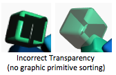

.. Copyright (C)  Wayne Brown
  Permission is granted to copy, distribute
  and/or modify this document under the terms of the GNU Free Documentation
  License, Version 1.3 or any later version published by the Free Software
  Foundation; with Invariant Sections being Forward, Prefaces, and
  Contributor List, no Front-Cover Texts, and no Back-Cover Texts.  A copy of
  the license is included in the section entitled "GNU Free Documentation
  License".

.. role:: raw-html(raw)
  :format: html

12.4 - Transparency
:::::::::::::::::::

The *z-buffer* algorithm for performing *hidden surface
removal* stores the color of the geometric primitive that is closest to the camera
in the rendering target's *color buffer*. This is the desired behavior when solid
objects block the view of other solid objects. However, it does not work for
transparent surfaces that allow light to partially pass through them.
This lesson explains the standard techniques used to rendering transparent surfaces.

Transparency in the Z-buffer Algorithm
--------------------------------------

If a surface allows light to pass through it, a viewer sees some of the light
reflected from the surface and some of the light reflected from the object that
is behind the surface. Therefore, transparency requires the combining of light from
two sources. Let's review the z-buffer algorithm -- which looks like this:

.. Code-Block:: C

  void renderPixel(x, y, z, color) {
    if (z < z_buffer[x][y]) {
      z_buffer[x][y]     = z;
      color_buffer[x][y] = color;
    }
  }

Notice that the algorithm contains two colors:
1) :code:`color_buffer[x][y]`, which is the color
already in the *color buffer*,  and 2) :code:`color`, which is the color
of the surface being rendered. If surfaces are rendered
in a "back-to-front" order, the graphics pipeline can combine the
colors using the amount of transparency of the foreground surface.
The z-buffer rendering algorithm changes to this:

.. Code-Block:: C
  :emphasize-lines: 4-5

  void renderPixel(x, y, z, color) {
    if (z < z_buffer[x][y]) {
      z_buffer[x][y] = z;
      color_buffer[x][y] = color * transparency_percent
                         + color_buffer[x][y] * (1.0 - transparency_percent);
    }
  }

The :code:`transparency_percent` is the alpha component of the surface's :code:`color`.
The "alpha" value represents the percentage of light that is reflected from the surface.
If alpha is 1.0, 100% of the light is reflected and the surface is "opaque". If the alpha
value is 0.75, the surface reflects 75% of the light that strikes it and allows
25% of the light to pass through. This "blending of colors" is called **alpha blending**
and the z-buffer rendering algorithm becomes:

.. Code-Block:: C
  :emphasize-lines: 4-5

  void renderPixel(x, y, z, color) {
    if (z < z_buffer[x][y]) {
      z_buffer[x][y] = z;
      color_buffer[x][y].rgb = color.rgb * color.a  // or color[3]
                             + color_buffer[x][y].rgb * (1.0 - color.a);
    }
  }

.. admonition:: *swizzle* notation

  In GLSL the components of a "vector" can be accessed using "dotted notation"
  where :code:`.r`, :code:`.g`, :code:`.b`, and :code:`.a`, are the
  red, green, blue, and alpha components of a color "vector". Using a variable declared
  of type :code:`vec4`, the notation :code:`.rgb` produces a :code:`vec3` containing
  the first three components of a 4-component vector. For details, refer to
  `lesson 13.2`_.

This command enables **alpha blending** in the graphics pipeline:

.. Code-Block:: JavaScript

  gl.enable(gl.BLEND)

WebGL uses the term :code:`source` (or :code:`src`) to refer to a surface that is being rendered,
while it uses the term :code:`destination` (or :code:`dst`) to refer to the *color buffer*. When
**alpha blending** is enabled, the calculation

.. Code-Block:: C

  color.rgb * color.a + color_buffer[x][y].rgb * (1.0 - color.a);

is written generically as

.. Code-Block:: C

  color.rgb * src_percent + color_buffer[x][y].rgb * dst_percent;

The values used for the percentages of the "source" and "destination" colors can
be set to a variety of options -- which we will explain in detail in the next lesson. For
transparency, the percentages need to be :code:`color.a` and :code:`1.0 - color.a`.
To specify these percentages, the :code:`gl.blendFunc()` command is called with
predefined ENUM constants used to specify the percentage values:

.. Code-Block:: JavaScript

  gl.blendFunc(gl.SRC_ALPHA, gl.ONE_MINUS_SRC_ALPHA);

Rendering a Scene That Contains Transparent Surfaces
----------------------------------------------------

Transparent surfaces are not visible if they are behind opaque objects.
Therefore, *hidden surface removal* is needed to render a scene correctly.
However, if there are multiple transparent surfaces in a scene, and they are
aligned behind each other in relationship to the camera's view, it is possible
for the color of a pixel to be determined by light that has traveled through many (or all) of them.
To calculate the correct final color we need to process the surfaces in order
from furthest from the camera to the closest to the camera. This requires
sorting the transparent surfaces before rendering them. If the models or
the camera is moving between renderings, the sorting must be done for each render.
Here are the major steps needed to render a scene that contains transparent surfaces.

#. Clear the *color buffer* and the *depth-buffer* - :code:`gl.clear(gl.COLOR_BUFFER_BIT | gl.DEPTH_BUFFER_BIT);`

#. Disable blending - :code:`gl.disable(gl.BLEND);`

#. Render all of the opaque models in the scene. (The order does not matter.)
   Blending should be disabled and updates to the *depth buffer* must be enabled.

#. Enable blending and set the blending percentages. :raw-html:` `
   :code:`gl.enable(gl.BLEND);` :raw-html:` `
   :code:`gl.blendFunc(gl.SRC_ALPHA, gl.ONE_MINUS_SRC_ALPHA);`

#. Sort the transparent models based on their distance from the camera.
   (Greatest to least distance.)

#. Keep the *z-buffer* algorithm active, but disable changes to the *zbuffer* array.
   (:code:`gl.depthMask(false)`)

#. Render each transparent model.

   a. Sort the graphic primitives in a model based on their distance from the camera.
      (Greatest to least distance.)

   b. Render the transparent model.

The sorting in steps 5 and 7a slows down rendering significantly. Careful analysis
of specific scenes might allow you to eliminate the sorting. For example, consider these
special scenarios:

* There is only one transparent model in a scene. The primitives in the model
  must be sorted, but you can simply render the transparent model last in the scene.

* There are multiple transparent models in a scene, but none
  of them overlap each other from the current camera view. Therefore,
  render the transparent models in any order after all of the opaque
  models have been rendered.

* If a model contains some opaque surfaces and some transparent
  surfaces, then the following situations might apply:

  * The transparent surfaces never face the camera. Therefore
    ignore the transparent surfaces.

  * The transparent surfaces face the camera but always have another
    opaque surface behind them that are part of the same model. Therefore
    sorting the graphic primitives of this model is sufficient; the sorting
    of all the transparent models can be ignored, assuming
    that models do not intersect in 3D space.

To summarize, rendering a complex scene that contains transparent surfaces may
not be possible in real-time. In some cases, knowledge of the scene can be
used to avoid or minimize sorting to regain real-time rendering.

Sorting for Transparency
------------------------

There are two types of sorts required for rendering transparency:

* sorting models relative to each other, and
* sorting graphic primitives (points, lines, and triangles) within a model.

The implementation details for each sorting task are very different.
However, in both cases the sorting needs to be as efficient as possible.
Using a Quicksort for these sorting tasks is a big mistake.
A Quicksort can have awful performance on data that is almost sorted.
Consider that if models in a scene are moving (or if the camera is moving),
the changes from one frame to the next in an animation are typically small.
Given a sorted list of models from a previous rendering, the sorted order
for a new frame is probably very similar. A model's position in the list
might shift a couple of locations. The best sorting algorithm for
"almost sorted" data is the `insertion sort`_ which has O(n) time
complexity for "almost sorted" data. We will use an "insertion sort"
for sorting  models and for sorting graphic primitives within a model.

Sorting Models
..............

.. admonition:: Look Ahead!

  The following discussion relates to the WebGL program below. It might be
  helpful to take a look at the program before studying this section.

Models that contain transparent surfaces must be sorted in reference to their
distance from the scene's camera. Model data must be converted from "model space"
into either "scene space" or "camera space." If "scene space" is used, then
the distance between a model and the camera must be calculated using the distance formula,
:code:`sqrt(dx^2 + dy^2 + dz^2)`. If "camera space" is used, the camera is
at the origin looking down the -Z axis and the z-component of a transformed
vertex can be used as the "distance to the camera." (It is not an exact distance,
but it works fine for most scenes.)

In the WebGL program below only one model of a cube is used to render the entire scene.
Each instance of the cube in the scene has a set of properties that determine its
size, location, color, and rotation. These properties include a :code:`z` value that
is calculated for a specific rendering and then used as the sort key for an
*insertion sort*.

The following two functions perform the sorting of the models. Please study these
functions.

.. Code-Block:: JavaScript
  :linenos:

  // ---------------------------------------------------------------------
  function _calculateDistanceFromCamera () {
    let position;

    for (let j = 0; j < number_transparent_cubes; j += 1) {
      position = transparent_cubes[j].position;

      // Create the needed transformation matrices.
      matrix.translate(translate_matrix,
                       position[0], position[1], position[2]);

      // Create a single transformation for all model and camera transforms.
      matrix.multiplySeries(camera_model_transform,
                            to_camera_space, translate_matrix);

      // Transform the center point of the cube into camera space.
      matrix.multiplyP4(result, camera_model_transform, position);

      // The z component represents the distance to the camera.
      transparent_cubes[j].z = result[2];  // z-component
    }
  }

  // ---------------------------------------------------------------------
  function _sortTransparentModels () {

    // Update the distance of each model from the camera.
    _calculateDistanceFromCamera();

    // Do an insertion sort on the list of cube properties.
    let k, temp;

    for (let j = 0; j < number_transparent_cubes; j += 1) {
      temp = transparent_cubes[j];
      k = j - 1;
      while (k >= 0 && transparent_cubes[k].z > temp.z) {
        transparent_cubes[k + 1] = transparent_cubes[k];
        k -= 1;
      }
      transparent_cubes[k + 1] = temp;
    }
  }

Sorting the Graphic Primitives of a Model
.........................................

Sorting the graphic primitives of a model is very inefficient for several
reasons: 1) the primitives must be converted into "camera space" using JavaScript
code (not the blazing fast GPU), 2) the sorting takes time, and 3) the rendering data in
the GPU's *object buffers* must be updated.

To minimize the amount of data copying during sorting, an "indexed sort" is
recommended. To perform an "indexed sort", an array that holds a triangle index and
a distance value is created. Sorting modifies this array of indexes without
actually moving the triangle vertices. The basic algorithm can be seen in the
function calls of the following function. The details can be studied in the
:code:`render_transparency.js` file below.

.. Code-Block:: JavaScript
  :linenos:

  function _sortTriangles (number_triangles, camera_space) {

    if (sort_indexes == null) _initializeSorting(number_triangles);

    _updateDistanceFromCamera(number_triangles, camera_space);

    _indexedInsertionSort(number_triangles);

    _reorderVerticesInBufferObjects(number_triangles);
  }

Experimentation
...............

Please experiment with the following WebGL program by disabling
the animation and rotating the models to study the transparency. Rotate
to a view that allows you to see through multiple transparent models with
an opaque model in the background. Is the rendering correct? Do you see
any models that are rendered incorrectly?

.. webglinteractive:: W1
  :htmlprogram: _static/12_transparency1/transparency1.html
  :editlist: _static/12_transparency1/transparency1_scene.js, _static/learn_webgl/render_transparency.js

Experiments on the :code:`transparency1_scene.js` code:

* Restart the program to get different combinations of random cubes.

* In lines 53 and 56 set the number of opaque cubes and the
  number of transparent cubes. Try several different number combinations.
  If a large number of transparent cubes are rendered, some of them will probably
  overlap. In such cases the rendering will change as the sorted order of the
  models change. Rotate the scene slowly and watch for the "flipping" of
  one transparent model in front of another one.

* In line 220, comment out the call to :code:`_sortTransparentModels()`.
  Notice that the transparent models still look transparent, but their
  physical location in 3D space becomes confusing. (After you are
  finished experimenting, remove the comments you added.)

* In line 213, comment out :code:`gl.enable(gl.BLEND);`. Notice
  that all transparency is now gone. Without color "blending" there is no
  transparency. (Enable blending before continuing.)

Experiments on the :code:`render_transparency.js` code:

* In line 304, comment out the call to :code:`_sortTriangles()`.
  Notice the incorrect rendering of some of the cubes, such as the examples
  to the right. The triangles are being rendered in the order they are
  defined in the *buffer object*. This causes some of the triangles that
  are closest to the camera to be rendered before surfaces that are
  further away. This causes the wrong colors to be blended together.

* In line 131, change the "greater than" sign in :code:`sort_indexes[k][1] > temp[1]`
  to a "less than" sign, as in :code:`sort_indexes[k][1] < temp[1]`.
  This sorts the vertices in the opposite direction and the
  triangles closest to the camera are rendered first. Notice that
  the resulting rendering is not accurate.

Transparency in Overlapping Models
----------------------------------

The algorithm presented above works well for transparent models that do
not intersect in 3D space. If models do intersect, it will typically not
render the models correctly. There are two extra requirements to correctly
render intersecting models:

* The models must have high resolution triangular meshes with as much detail
  as possible in the areas where the model's intersect.
* The triangular meshes of the intersecting models must be combined
  into a single mesh to allow the triangles to be rendered in a back-to-front
  order.

If transparent models are moving independently between frames, the models
must be re-combined and re-sorted on each rendering which typically
prevents real-time rendering.

Models with high resolution polygonal meshes are problematic to sort efficiently,
especially for the initial sorting which does not have an "almost sorted"
list as its starting point. For random data, a *selection sort*
has O(n\ :sup:`2`) time complexity which can cause a web page to
"hang" for several minutes (or longer) when rendering high resolution models. The following
example code solves the problem by performing a Quicksort for the initial
sorting and then uses an *insertion sort* for all future sorts. (JavaScript's
builtin sorting algorithm is a Quicksort.)

.. Code-Block:: JavaScript
  :linenos:

  /**----------------------------------------------------------------------
   * Compare two elements of the sort_indexes for a quicksort algorithm
   * @param a {array} one element of the sort_indexes array, [index, distance]
   * @param b {array} one element of the sort_indexes array, [index, distance]
   * @returns {number} result of comparision of a and b
   * @private
   */
  function _compare(a, b) {
    if (a[1] < b[1]) {
      return -1;
    } else if (a[1] > b[1]) {
      return 1;
    }
    return 0; // a must be equal to b
  }

  /**----------------------------------------------------------------------
   * Perform a Quicksort on the sort_indexes.
   * @private
   */
  function _quicksort(sort_indexes) {
    sort_indexes.sort(_compare);
  }

  /**----------------------------------------------------------------------
   * Sort the triangles of a model, back to front, based on their distance
   * from the camera.
   * @param number_triangles {number}
   * @param camera_space {Float32Array} The vertices transformation matrix.
   */
  function _sortTriangles (number_triangles, camera_space) {
    let first_sort = false;

    if (sort_indexes == null) {
      _initializeSorting(number_triangles);
      first_sort = true;
    }

    _updateDistanceFromCamera(number_triangles, camera_space);

    if (first_sort) {
      _quicksort(sort_indexes);
    } else {
      _indexedInsertionSort(number_triangles);
    }

    _reorderVerticesInBufferObjects(number_triangles);
  }

Experimentation
...............

The following WebGL program is rather complex. There are 18 different
scenarios for rendering the canvas (six models with three "rendering modes" each).
Please experiment with the program and attempt to identify where the
rendering are incorrect. (None of the 18 scenarios produces a totally
correct rendering!) After your experiments, please make sure you review the
conclusions listed below.

.. webgldemo:: W2
  :htmlprogram: _static/12_transparency2/transparency2.html

Inaccuracies in the renderings that you hopefully observed:

* The low resolution renderings look good until the scene is rotated. When
  the models' sort order changes, the closest cube "pops" in front.
  Such drastic change between two frames is very noticeable to a viewer.

* When rendering the cube three separate times, increasing the resolution
  of the triangular mesh does not help resolve the transparency.
  The sort order of the models
  determines which model is rendered last and the accurate of the intersection
  between the models is not resolvable.

* If the three low resolution cubes are combined into a single model and
  the triangles rendered in sorted order, the triangles are too large to
  differentiate the intersections of the models.

* The most accurate rendering is produced using the three high resolution cubes
  combined into a single model. However, there are still artifacts where
  the cubes intersect. These artifacts can be eliminated by creating
  an even higher resolution model, but the increased polygon count and the
  resulting slower sorting typically prevents real-time rendering.

Summary
-------

Rendering transparent surfaces can be achieved using a combination of
sorting and *alpha blending*. However, if transparent surfaces intersect
in 3D space they must be defined by high resolution triangular meshes and
the models must be combined into a single model to render the surfaces
accurately.

Glossary
--------

.. glossary::

  transparency
    A percentage of the light that strikes a surface passes through the surface and
    reflects off other surfaces.

  opaque
    All light that strikes a surface is reflected. Opaque means no transparency.

  insertion sort algorithm
    The fastest, general purpose algorithm for sorting data that is already close to being sorted.

  index sort
    A collection of data values is sorted without moving the data in memory. The sort order
    is described as an array of indexes into the array that holds the data.

  source color (src)
    A color value to be rendered for a surface.

  destination color (dst)
    A color value stored in the *color buffer* of the *draw buffer*.

  alpha blending
    The color of a pixel is calculated as a combination of two colors: the
    the destination color and the source color.

Self Assessment
---------------

.. mchoice:: 12.4.1
  :random:

  Transparency is accomplished by combining the color that is currently in the
  *color buffer* with a color from the surface that light passes through using this
  equation:

  .. Code-Block:: C

    color_buffer[x][y].rgb = color.rgb * color.a
                           + color_buffer[x][y].rgb * (1.0 - color.a);

  If :code:`color` is equal to :code:`(1.0, 0.0, 0.0, 0.6)` and the :code:`color_buffer[x][y]`
  is equal to :code:`(0.0, 1.0, 0.0, 1.0)`, what is the new value of
  the *color buffer*, i.e., :code:`color_buffer[x][y].rgb`?

  - (0.6, 0.4, 0.0)

    + Correct. :code:`(1.0*0.6, 0.0*0.6, 0.0*0.6) + (0.0*0.4, 1.0*0.4, 0.0*0.4)`

  - (0.4, 0.6, 0.0)

    - Incorrect.

  - (1.0, 1.0, 0.0)

    - Incorrect.

  - (0.5, 0.5, 0.5)

    - Incorrect.

.. mchoice:: 12.4.2
  :random:

  To render transparent surfaces correctly, all models in a scene must be sorted from
  back to front order relative to the camera, with the closest surfaces to the camera rendered last.

  - False.

    + Correct. **All** models do not have to be sorted. Only the models that contain transparent surfaces.

  - True.

    - Incorrect. **All** models do not have to be sorted. Only the models that contain transparent surfaces.

.. mchoice:: 12.4.3
  :random:

  To render transparent surfaces correctly, models must be sorted, but individual triangles
  that compose a model can be rendered in any order.

  - False.

    + Correct. Transparent surfaces must be drawn in a "back-to-front" order, especially individual
      triangles within a model.

  - True.

    - Incorrect. Transparent surfaces must be drawn in a "back-to-front" order, especially individual
      triangles within a model.

.. mchoice:: 12.4.4
  :random:

  What is the fastest algorithm for sorting data that is already almost sorted?

  - Insertion sort.

    + Correct.

  - Quicksort

    - Incorrect.

  - Mergesort

    - Incorrect.

  - Radix sort

    - Incorrect.

.. mchoice:: 12.4.5
  :random:

  If two separate models contain transparent surfaces and the models intersect in 3D space,
  what is required to render them accurately?

  - The models must be defined by high resolution triangular meshes and the models must be
    combined into a single model so that the triangles can be sorted and rendered back-to-front.

    + Correct.

  - The models must be defined using the minimal number of triangles and the models must be
    combined into a single model so that the triangles can be sorted and rendered back-to-front.

    - Incorrect. Using the minimal number of triangles means the triangles will intersect and
      can't be sorted in the proper order.

  - The models must be defined by high resolution triangular meshes and rendered separately,
    one at a time.

    - Incorrect.

  - The models must be defined by high resolution triangular meshes and the models must be
    combined into a single model so that the triangles can be sorted and rendered front-to-back.

    - Incorrect. The triangles must be rendered from back to front.

.. index:: transparency, opaque, insertion sort, index sort, destination color, source color, alpha blending

.. _lesson 13.2: ../13_shader_language/02_glsl_data_types.html#vector-components
.. _insertion sort: https://en.wikipedia.org/wiki/Insertion_sort