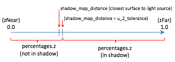

.. Copyright (C)  Wayne Brown
  Permission is granted to copy, distribute
  and/or modify this document under the terms of the GNU Free Documentation
  License, Version 1.3 or any later version published by the Free Software
  Foundation; with Invariant Sections being Forward, Prefaces, and
  Contributor List, no Front-Cover Texts, and no Back-Cover Texts.  A copy of
  the license is included in the section entitled "GNU Free Documentation
  License".

.. role:: raw-html(raw)
  :format: html

12.6 - Shadows
::::::::::::::

The lighting calculations discussed in chapter 10 assumed that all surfaces
in a scene received light from the scene's light sources. However,
some surfaces can potentially block light from hitting other
surfaces. If light is blocked, the portion of the surface that does not
receive direct light is in a `shadow`_. Humans rely heavily on shadows to
understand the 3D nature of objects in a scene. Without shadows a 3D scene
is much harder to comprehend. This lesson explains how to render shadows
using a "shadow map".

The "Shadow map" Algorithm
--------------------------

To render shadows, a *fragment shader* must be able to determine if
a fragment (pixel) receives direct light from the scene's
light sources. If the fragment receives no direct light, then the
pixel needs to be assigned only ambient light (or perhaps some low
percentage of diffuse light.) If the fragment receives direct light,
diffuse and specular light calculations can be performed to determine
the fragment's color.

.. tip:: If you need a refresher on modeling light, see lessons `10.2`_ and `10.4`_.

The "big idea" of the *shadow map* algorithm is to create a rendering of
a scene from the location of each light source and remember the distances
between the light source and it's closest surfaces. This is straightforward
because these distances are in the *depth buffer* at the conclusion of a rendering.
The distance values must be stored in
a *texture map* to allow a *fragment shader* to retrieve them.
(This algorithm uses the term *shadow map*
to describe such a *texture map* because the values in the *texture map*
are not colors, but rather distances.) When the scene is rendered
from the camera's location and orientation, the saved *shadow maps*
are used to determine if a pixel receives direct light from a light source.

This algorithm uses a significant amount of time and memory resources.
For example, if a scene has three light sources,

* time is required to render the three *shadow maps* and then
  render the final scene -- four scene renderings in all!
* memory is required to store three *frame buffers* (a *color* and *depth* buffer
  for each light source), besides the default *draw buffer* (which has a
  *color* and *depth* buffer).

A *shader program* that calculates shadows using *shadow maps* must
track the location of a surface in several different 3D "spaces". These
spaces are:

* **camera space**: The :code:`(x,y,z)` location of a surface assuming that
  the camera is at the origin looking down the -z axis. The required transformation matrix
  includes the model and camera transformations. This "space" is used for
  diffuse and specular lighting calculations.

* **normalized device coordinates**: The :code:`(x,y,z)` location of a surface
  mapped to a cube centered about the origin. This is the location used by
  the graphics pipeline for clipping and viewport mapping. The transformation
  matrix includes the model, camera, and projection transformations.

* **shadow map space**: The :code:`(x,y,z)` location of a surface related to a
  light source, assuming the light source is at the origin directed down the
  -z axis. The transformation matrix includes the model, "light as camera", and
  projection transformations. There is a distinct "shadow map space" for each
  light source. This "space" is used to determine if a fragment receives
  direct light from a light source.

Javascript code must prepare for a rendering by creating an appropriate transformation
matrix for each of these "spaces." Then a *vertex shader* transforms a surface's vertices into these distinct
spaces and puts the locations into :code:`varying` variables. Finally, a
*fragment shader* uses the *camera space* location to perform lighting calculations and the
*shadow map* space locations to determine if a fragment is in a shadow.

Detailed Steps of a "Shadow Map" Rendering
..........................................

#. For each light source in a scene:

   a. Set the *rendering target* to a programmer-created *frame buffer* composed
      of *texture objects*.

   b. Place a "camera" at the light source and render the scene. This places
      the z-value of the closest surface to the light into the *depth buffer*
      of the *frame buffer*. (This *depth buffer* is a *texture map*.)

#. Change the *rendering target* to the default *drawing buffer* and render the
   scene from the camera's location and orientation.

   a. The *vertex shader* calculates the location of a surface in relationship
      to each "light source" and the scene's camera. The locations are placed
      into :code:`varying` variables and interpolated across the surface.
      Therefore, a fragment knows its location relative to each light source
      and to the scene's camera.
   b. The *fragment shader* uses the *texture maps* (*shadow maps*) created
      by the "light source renderings"
      from step 1 to determine if a pixel is in full light or shadow.

To implement the details of this algorithm the following questions must be answered:

* How can the data from a scene rendering be saved to a *texture map* (i.e., *shadow map*)?
* How can a scene be rendered from the location and orientation of a light source?
* How can a *shadow map* be used to determine if a surface is in shadow?

Rendering a Scene to a *Texture Map*
....................................

.. tip:: This discussion uses a **WebGL extension** which were explained in `12.1`_.

The most straightforward method to render to a *texture map* requires the
use of the :code:`WEBGL_depth_texture` extension. This allows a *texture object*
to be used as the *depth buffer* of a *frame buffer*. (Remember, a *frame buffer*
is a programmer defined "rendering target" that contains a *color buffer*, a
*depth buffer*, and an optional *stencil buffer*.) The following code enables
the :code:`WEBGL_depth_texture` extension and does something reasonable if the
extension is not supported. (This extension is widely supported. See `here`_ for details.)

.. Code-Block:: JavaScript

  depth_texture_extension = gl.getExtension('WEBGL_depth_texture');
  if (!depth_texture_extension) {
    console.log('This WebGL program requires the use of the ' +
      'WEBGL_depth_texture extension. This extension is not supported ' +
      'by your browser, so this WEBGL program is terminating.');
    return;
  }

.. note::

  The variable :code:`depth_texture_extension`
  in this example code is not needed in the rest of the code. However,
  in some cases the object returned by a call to :code:`gl.getExtension()` is
  needed to access the functionality of the extension.

A programmer-defined *frame buffer* composed of *texture objects* is created
by the following steps:

#. Create a new *frame buffer* object: :code:`gl.createFramebuffer()`.

#. Create a *texture object* to store the *color buffer* values. The size
   of the *texture object* determines the resolution of the rendering. It's
   internal format is RGBA (red, green, blue, alpha), where each value is
   an unsigned byte, :code:`gl.UNSIGNED_BYTE`. (This is the only format
   WebGL 1.0 supports.) There are four steps to create such a *color buffer*:

   a) :code:`gl.createTexture()` creates a *texture object*.
   b) :code:`gl.bindTexture()` makes the *texture object* the "active object".
   c) :code:`gl.texImage2D()` creates the buffer that holds the *texture object*'s image data.
   d) :code:`gl.texParameteri()` is used to set a *texture object*'s properties.

#. Create a second *texture object* to store the *depth buffer* values.
   The size of this *texture object* must match the size of the *color buffer*.
   It's internal format is :code:`gl.DEPTH_COMPONENT` and each value will be a 32-bit integer,
   :code:`gl.UNSIGNED_INT`, which will represent a depth value in the range
   [0.0, +1.0]. The integer values are scaled such that 0.0 represents
   the *z-near* clipping plane, and 1.0 represents the *z-far* clipping plane.

#. Attach the first *texture object* to the "Color attachment" of the *frame buffer*.
   Attach the second *texture object* to the "Depth attachment" of the *frame buffer*.

   a) :code:`gl.bindFramebuffer()` makes a specific *frame buffer* the "active" *frame buffer*.
   b) :code:`gl.framebufferTexture2D()` attaches a *texture object* to a *frame buffer*.

#. Verify that the *frame buffer* object is valid using :code:`gl.checkFramebufferStatus()`.

The following function creates a *frame buffer*, where both the *color buffer* and
the *depth buffer* are 2D textures.

:raw-html:``

.. Code-Block:: JavaScript
  :linenos:

  /** ---------------------------------------------------------------------
   * Create a frame buffer for rendering into texture objects.
   * @param gl {WebGLRenderingContext}
   * @param width  {number} Rendering width in pixels.  (must be power of 2)
   * @param height {number} Rendering height in pixels. (must be power of 2)
   * @returns {WebGLFramebuffer} object
   */
  function _createFrameBufferObject(gl, width, height) {
    let frame_buffer, color_buffer, depth_buffer, status;

    // Step 1: Create a frame buffer object
    frame_buffer = gl.createFramebuffer();

    // Step 2: Create and initialize a texture buffer to hold the colors.
    color_buffer = gl.createTexture();
    gl.bindTexture(gl.TEXTURE_2D, color_buffer);
    gl.texImage2D(gl.TEXTURE_2D, 0, gl.RGBA, width, height, 0,
                  gl.RGBA, gl.UNSIGNED_BYTE, null);
    gl.texParameteri(gl.TEXTURE_2D, gl.TEXTURE_MIN_FILTER, gl.LINEAR);
    gl.texParameteri(gl.TEXTURE_2D, gl.TEXTURE_MAG_FILTER, gl.LINEAR);
    gl.texParameteri(gl.TEXTURE_2D, gl.TEXTURE_WRAP_S, gl.CLAMP_TO_EDGE);
    gl.texParameteri(gl.TEXTURE_2D, gl.TEXTURE_WRAP_T, gl.CLAMP_TO_EDGE);

    // Step 3: Create and initialize a texture buffer to hold the depth values.
    // Note: the WEBGL_depth_texture extension is required for this to work
    //       and for the gl.DEPTH_COMPONENT texture format to be supported.
    depth_buffer = gl.createTexture();
    gl.bindTexture(gl.TEXTURE_2D, depth_buffer);
    gl.texImage2D(gl.TEXTURE_2D, 0, gl.DEPTH_COMPONENT, width, height, 0,
                  gl.DEPTH_COMPONENT, gl.UNSIGNED_INT, null);
    gl.texParameteri(gl.TEXTURE_2D, gl.TEXTURE_MIN_FILTER, gl.LINEAR);
    gl.texParameteri(gl.TEXTURE_2D, gl.TEXTURE_MAG_FILTER, gl.LINEAR);
    gl.texParameteri(gl.TEXTURE_2D, gl.TEXTURE_WRAP_S, gl.CLAMP_TO_EDGE);
    gl.texParameteri(gl.TEXTURE_2D, gl.TEXTURE_WRAP_T, gl.CLAMP_TO_EDGE);

    // Step 4: Attach the color and depth buffers to the frame buffer.
    gl.bindFramebuffer(gl.FRAMEBUFFER, frame_buffer);
    gl.framebufferTexture2D(gl.FRAMEBUFFER, gl.COLOR_ATTACHMENT0, gl.TEXTURE_2D,
                            color_buffer, 0);
    gl.framebufferTexture2D(gl.FRAMEBUFFER, gl.DEPTH_ATTACHMENT, gl.TEXTURE_2D,
                            depth_buffer, 0);

    // Step 5: Verify that the frame buffer is valid.
    status = gl.checkFramebufferStatus(gl.FRAMEBUFFER);
    if (status !== gl.FRAMEBUFFER_COMPLETE) {
      console.log("The created frame buffer is invalid: " + status.toString());
      if (color_buffer) gl.deleteBuffer(color_buffer);
      if (depth_buffer) gl.deleteBuffer(depth_buffer);
      if (frame_buffer) gl.deleteBuffer(frame_buffer);
      frame_buffer = null;

      switch (status)  {
        case gl.FRAMEBUFFER_INCOMPLETE_ATTACHMENT: console.log("INCOMPLETE_ATTACHMENT");
                                                   break;
        case gl.FRAMEBUFFER_INCOMPLETE_MISSING_ATTACHMENT:
                                                   console.log("MISSING_ATTACHMENT");
                                                   break;
        case gl.FRAMEBUFFER_INCOMPLETE_DIMENSIONS: console.log("DIMENSIONS");
                                                   break;
        case gl.FRAMEBUFFER_UNSUPPORTED:           console.log("UNSUPPORTED");
                                                   break;
      }
    } else {
      // Put references to the buffers into the frame buffer object so they
      // can be referenced later.
      frame_buffer.color_buffer = color_buffer;
      frame_buffer.depth_buffer = depth_buffer;
      frame_buffer.width = width;
      frame_buffer.height = height;
    }

    // Unbind these objects, which makes the "draw buffer" the rendering target.
    gl.bindTexture(gl.TEXTURE_2D, null);
    gl.bindFramebuffer(gl.FRAMEBUFFER, null);

    return frame_buffer;
  }

This code to create a *frame buffer* requires the :code:`WEBGL_depth_texture`
extension. The function will fail if the extension is not enabled or if there
is insufficient memory for the buffers.

Please take special note of the parameters that control the texture maps.
It is important that the lookups into the *texture maps* interpolate between discrete values by
setting the minify and magnify filters to :code:`gl.LINEAR`. This makes the
lookups into the *texture maps* as accurate as possible. (You can experiment with
the WebGL program below and change the filters to :code:`gl.NEAREST`, but the results
will be very poor.) The "wrapping" parameters of the *texture maps* are also important.
There is no good choice for the *texture map* behaviour if a *texture coordinate*
is outside the *texture map*'s boundaries, but perhaps the least bad choice is to
repeat the values of the *shadow map* at its edges (:code:`gl.CLAMP_TO_EDGE`).

.. admonition:: WebGL 1.0 *framebuffer* limitations

  WebGL only recognizes three *framebuffer* configurations, which are:

  1. COLOR_ATTACHMENT0: texture (RGBA/UNSIGNED_BYTE) :raw-html:` `
  2. COLOR_ATTACHMENT0: texture (RGBA/UNSIGNED_BYTE) + :raw-html:` `
     DEPTH_ATTACHMENT :raw-html:`&nbsp;&nbsp;`: renderbuffer (DEPTH_COMPONENT16)
  3. COLOR_ATTACHMENT0: texture (RGBA/UNSIGNED_BYTE) + :raw-html:` `
     DEPTH_STENCIL_ATTACHMENT: renderbuffer (DEPTH_STENCIL/UNSIGNED_INT_24_8)

  The :code:`WEBGL_depth_texture` extension adds a 4th *framebuffer* configuration:

  4. COLOR_ATTACHMENT0: texture (RGBA/UNSIGNED_BYTE) + :raw-html:` `
     DEPTH_ATTACHMENT :raw-html:`&nbsp;&nbsp;`: texture (DEPTH_COMPONENT/gl.UNSIGNED_INT)

  In addition, :code:`gl.readPixels()` can only read data from the COLOR_ATTACHMENT0; it can't read
  data from the DEPTH_ATTACHMENT or the DEPTH_STENCIL_ATTACHMENT buffers.

Rendering from a Light Source
.............................

.. admonition:: Definitions:

  A "scene camera" defines the view a user sees of a scene. :raw-html:` `
  A "light source camera" defines a view of a scene from the location of a light source.

To determine which surfaces receive direct light in a scene, the scene is rendered
from the vantage point of a "light source camera." This is not a straightforward task
since a "point light source" shines light in all directions, while a "camera view"
has a single, specific direction and orientation. A "light source camera" must
be based on the direction and orientation of the "scene camera" so that the maximum
information about visible surfaces can be gathered.

To define a "light source camera" its location and
its orientation (i.e., its local coordinate system) must be set. The location is easy:
it is the 3D location of the light source. The orientation is a harder problem!
It turns out that the exact line-of-sight direction is not critical.
What is critical is that all of the models in the scene that
are visible from the "scene camera" are included in the rendering from the
"light source camera." Selecting a good line-of-sight and type of projection for
a "light source camera" determines the accuracy of the resulting *shadow map*.

Let's assume a camera is defined using the standard
parameters of a :code:`matrix.lookAt()` function, which are:

* The location of the camera; the :code:`eye` location.
* The location of a point in front of the camera along its line-of-sight; the
  :code:`center` location.
* A vector that points in the general direction of "up".

A simple method for defining a "light source camera" is:

* The :code:`eye` is the 3D location of the light source.
* The :code:`center` point of the "scene camera" is used as the
  :code:`center` of the "light source camera". (Caution: There are an infinite number
  of points that can define a "scene camera"'s line-of-sight,
  but a very restricted set of points that can define a good line-of-sight for
  both the "scene camera" and a "light source camera" at the same time.)
* The same *up vector* is used for both cameras. This keeps the orientation
  of the *shadow map* consistent with the "scene camera."

Concerning the projection:

* The projection for a "light source camera" can be either orthographic
  or perspective. An orthographic projection will have a fairly constant floating
  point error for all distances from the camera because the z component has a linear
  mapping. A perspective projection will have a variable floating point error
  because the z component has a non-linear mapping. (Distances closer to the
  camera will have smaller errors, while distances further from the camera will have
  larger errors.)
* The clipping volume defined by a projection should be large enough to include
  all visible surfaces in the scene.
* The clipping volume defined by a projection should be as small as possible
  to keep floating point roundoff errors to a minimum.

In summary, a critical part of calculating a good *shadow map* is setting up a
projection transformation that is just the right size for a particular view of
a scene. In addition, using an orthographic projection allows a single
error tolerance to be used for all distances from the camera.

Using a *Shadow Map* to Determine Shadows
.........................................

Lesson `10.1`_ explains the 3D "spaces" that can possibly be used for lighting calculations:
"model space", "scene space", "camera space" or "clipping space". All
WebGL programs in Chapter 10 used "camera space". However, "clipping space"
must be used for shadow calculations. Why? When a *shadow map* is created
by rendering a scene from the location of a light source, the *depth buffer* that
becomes the *shadow map* is the result of all operations of the graphics pipeline,
which includes clipping, the perspective divide calculation, and viewport mapping.
The data in a *shadow map* is in "clipping space" and must be treated as such.
A full understanding of the graphics pipeline is required to retrieve distance
values from a *shadow map*.

The *Vertex shader*
^^^^^^^^^^^^^^^^^^^

When a scene is rendered using a "scene camera," the *vertex shader* calculates
the location of a fragment in the following 3D "spaces":

#. For each light source: :raw-html:` `
   The (x,y,z) location of the surface in "light source camera" "clipping space".
   This location is used in a *fragment shader* to look up a "distance from the
   light source" from the light source's *shadow map*.

#. The (x,y,z) location of the surface in "camera space". This location is
   is used for lighting calculations.

#. The (x,y,z) location of the surface in "clipping space." This location
   is placed into the :code:`gl_Position` variable and used for clipping,
   perspective divide calculations, and viewport mapping.

The following is an example *vertex shader* that calculates these locations.

.. Code-BLock:: GLSL

  // Shadow map vertex shader
  // Scene transformations
  uniform mat4 u_Scene_transform;        // Projection, camera, model transform
  uniform mat4 u_Camera_model_transform; // Camera, model transform

  // Light model
  struct light_info {
    vec3  position;
    vec3  color;
    mat4  transform;  // The matrix transform used to create the light's shadow map.
    sampler2D texture_unit;  // Which texture unit holds the shadow map.
  };

  // An array of lights
  const int NUMBER_LIGHTS = 2;
  uniform  light_info  u_Lights[NUMBER_LIGHTS];

  // Original model data (in "model space")
  attribute vec3 a_Vertex;

  // Data (to be interpolated) that is passed on to the fragment shader
  varying vec4 v_Vertex_camera_space;
  varying vec4 v_Vertex_shadow_map[NUMBER_LIGHTS];

  void main() {

    // Where is the vertex for each shadow-map?
    for (int light=0; light < NUMBER_LIGHTS; j++) {
      v_Vertex_shadow_map[j] = u_Lights[j].transform * vec4(a_Vertex, 1.0);
    }

    // Where is the vertex in "camera space"?
    v_Vertex_camera_space = u_Camera_model_transform * vec4(a_Vertex, 1.0);

    // Where is the vertex in "clipping space"?
    gl_Position = u_Scene_transform * vec4(a_Vertex, 1.0);
  }

The *Fragment shader*
^^^^^^^^^^^^^^^^^^^^^

In the *fragment shader* each light source is processed to determine
if its light rays shine directly on a fragment. The function below receives
two arguments, :code:`vertex_relative_to_light`, which is the location of a
fragment relative to a light source, and :code:`shadow_map`, which is
the associated *shadow map*. It then returns :code:`true` if the fragment is
in a shadow of the light source, or :code:`false` if the fragment receives
direct light from the light source. Please study the following
steps carefully.

#. The value :code:`vertex_relative_to_light` is the location of a fragment
   in *clipping space* relative to a "light source rendering". This :code:`(x,y,z,w)`
   location is in *normalized device coordinates*, but the perspective
   division has not been performed. To put the location into
   the clipping volume, the perspective division must be performed. That
   is, each component must be divided by the homogeneous coordinate, :code:`w`.
   The location in the clipping volume becomes :code:`(x/w, y/w, z/w, 1)`.
   (The graphics pipeline did this automatically when the *shadow map* was rendered.)
   :raw-html:`  `

#. The :code:`(x/w, y/w, z/w, 1)` location is now in *normalized device coordinates*, which
   is a 2 unit wide cube centered at the origin. (Each component is in the range
   :code:`[-1.0,+1.0]`.) The :code:`(x/w, y/w)` components specify the location of
   the fragment in the *shadow map*, while the :code:`z/w` component gives the distance
   of the current surface to the light source. These values must be discussed separately.

   a) When the *shadow map* was rendered, the graphics pipeline performed a
      *viewport mapping* of :code:`(x,y)` from *normalized device coordinates* to a 2D image array.
      Specifically, the :code:`(x,y)` components were mapped
      from :code:`[-1.0,+1.0]` to :code:`[0,imageWidth]` and :code:`[0,imageHeight]`.
      However, the *fragment shader* that is performing shadow calculations
      needs to execute a "texture map lookup" which requires *texture coordinates*.
      Therefore, the :code:`(x,y)` components need to be mapped from :code:`[-1.0,+1.0]` to
      :code:`[0.0,+1.0]`. This is easily done using either :code:`(x,y)*0.5 + 0.5` or
      :code:`((x,y)+1.0) * 0.5`.

   b) WebGL treats the value retrieved from the *shadow map* as a color value.
      (Internally WebGL has stored the value as a :code:`gl.UNSIGNED_INT` in the range
      [0,2\ :sup:`n`] where :code:`n` is 32.
      However, when the GLSL :code:`texture2D()` function is called to perform a
      *texture map* lookup, it always returns a :code:`vec4`, RGBA, color value where
      each component is in the range :code:`[0.0,+1.0]`. Therefore, the :code:`z/w` component
      must be converted from *normalized device coordinates*, :code:`[-1.0,+1.0]`, to
      :code:`[0.0,+1.0]`.

These calculations are performed in the following *fragment shader* function.

.. Code-BLock:: GLSL

  // Shadow map fragment shader
  //-------------------------------------------------------------------------
  // Determine if this fragment is in a shadow based on a particular light source.
  // Returns true or false.
  bool in_shadow(vec3 vertex_relative_to_light, sampler2D shadow_map) {

    // Convert to "normalized device coordinates" (ndc) using perspective division.
    vec3 ndc = vertex_relative_to_light.xyz / vertex_relative_to_light.w;

    // Convert from range [-1.0,+1.0] to [0.0, +1.0].
    vec3 percentages = ndc * 0.5 + 0.5;

    // Get the shadow map's color value.
    vec4 shadow_map_color = texture2D(u_Sampler, percentages.xy);

    // The shadow_map contains only one depth value, but it was retrieved
    // as a vec4 that contains (d,0,0,1).
    float shadow_map_distance = shadow_map_color.r;  // red component

    // Is the z component of the vertex_relative_to_light greater than
    // the distance retrieved from the shadow map?
    // (Compensate for roundoff errors and lost precision.)
    return percentages.z > shadow_map_distance + u_Z_tolerance
  }

The following diagram shows the relationships between the values in the *fragment
shader*.

A WebGL *Shadow Map* Program
----------------------------

Please experiment with the following WebGL program that implements *shadow maps*.
The program will render correct shadows in some configurations and not
other. Please attempt to manipulate the scene to create incorrect shadows
and then discern why the errors are occurring.

.. webglinteractive:: W1
  :htmlprogram: _static/12_shadows/shadows.html
  :editlist: _static/12_shadows/shadows.vert, _static/12_shadows/shadows.frag
  :hidecode:
  :hideoutput:

Dealing with *Shadow Map* Errors
................................

Shadows will be rendered incorrectly by a *shadow map* algorithm for
the following reasons:

#. The *shadow map* does not include surfaces that are visible from the camera.

   If a *fragment shader* performs a :code:`texture2D` lookup from a
   *shadow map* and the location is outside the *texture map*,
   the location is outside the projection of the *shadow map*
   rendering. The *texture map* was initialized to use the edge values in such
   cases (i.e., :code:`gl.CLAMP_TO_EDGE`) but this will almost certainly be wrong.

   Configure the WebGL program above to have visible surfaces that are not
   included in the *shadow map*. (Use the :code:`center` point of the camera.)
   What happens to the shadows?

#. Low resolution of the *shadow maps*.

   Change the resolution of the *shadow maps* in the above WebGL program.
   What happens when the *shadow maps* are configured
   to be 64 by 64 pixels? Gradually increase the resolution and observe the results
   on the shadows. (You can also render the *shadow maps* into the right canvas.)

#. The z-value from the *shadow map* is not identical to the calculated z-value
   from the vantage point of the light source. This is due to three things:
   the mapping of the values to the *depth buffer*, floating point
   round-off errors and linear interpolation in a :code:`texture2D` lookup.
   To account for the difference in the values a "tolerance factor" can be added
   to the value retrieved from a *shadow map*. However, a single tolerance value
   may not produce accurate results for all possible scenes.

   If a *shadow map* is created using an *orthographic projection*, the z-values
   in the *depth buffer* have a linear mapping. Therefore, the same tolerance
   value should perform reasonably well for most depth values in a scene.

   If a *shadow map* is created using a *perspective projection*, the z-values
   in the *depth buffer* have a non-linear mapping. Therefore, the tolerance
   value must be adjusted based on the z-value retrieved from the *shadow map*.
   If the z-value is close to :code:`0.0`, the errors will be smaller than
   when the z-value is closer to :code:`1.0`. Lesson `9.4`_ discusses the
   details of a *perspective projection* and the important details are repeated
   here.

   When you render a *shadow map* using a perspective projection, the following
   values are stored in the :code:`gl_Position` output variable of the *vertex shader*.

   .. Code-Block:: C

     gl_Position[2] = c1 + (-z)*c2  // z component (distance from the camera)
     gl_Position[3] = -z;           // w component (the perspective divide)

   The :code:`c1` and :code:`c2` constants are defined by the distance between
   the z clipping planes:

   .. Code-Block:: C

     c1 = 2*near*far / (near-far);
     c2 = (far+near) / (far-near);

   The *depth buffer* has a specific number of bits allocated for storing the
   distance from the camera of each fragment. After the perspective divide,
   the :code:`z` values are in *normalized device coordinates*, which are floating
   point numbers between -1.0 and +1.0. To map these values to the *depth
   buffer*, the values are scaled by 0.5 and shifted by 0.5 to be between
   0.0 and +1.0 and then converted to unsigned integers. The exact math is:

   .. Code-Block:: C

     depth_buffer[x][y] = ((z * 0.5) + 0.5) * (2^bits_per_value - 1);

   .. figure:: figures/shadow_error.png
      :width: 333
      :height: 163
      :align: right

      Errors in shadow calculations.

   Since the difference between adjacent depth values is different for every
   pair of values, the potential error is different as well. The graph to the
   right shows the errors for
   various values of z, where the near clipping plan is -4 and the far clipping
   plane is -50. Simply put, the tolerance for error must increase based on the
   magnitude of the depth value.

Summary
-------

Rendering to a *framebuffer* that is defined using *texture maps* is a powerful
idea that can be used to produce many other computer graphics effects besides shadows.

*Shadow maps* are only one of several algorithms that can render shadows.
The Wikipedia article on `shadow maps`_ is a good
reference for investigating other algorithms that can implement shadows.

Glossary
--------

.. glossary::

  shadow
    The portion of a surface that does not receive direct light from a light source.

  shadow map
    A *texture map* used to determine if a fragment receives direct light or is in a shadow.

  WebGL extension
    Functionality added to a WebGL API (application programmer interface).

  frame buffer
    A group of buffers used for rendering. It must contain a *color buffer*.
    If hidden surface removal is enabled it must also contain a *depth duffer*.

  depth_texture_extension
    A WebGL extension that allows a *texture map* to be used as the *depth buffer*
    of a *frame buffer*. This extension also adds the option to create a
    *texture map* that contains 32-bit unsigned integers for each value of the map.

Self Assessment
---------------

.. mchoice:: 12.6.1
  :random:

  If light is blocked from hitting a surface, the surface should be colored using
  what type of lighting?

  - ambient light

    + Correct. Ambient light has no specific source. Therefore it can't be blocked.

  - diffuse light

    - Incorrect. Diffuse light must strike the surface and reflect off.

  - specular light

    - Incorrect. Specular light must strike the surface and reflect off.

  - attenuated light

    - Incorrect. The attenuation of light is the decrease in a light's intensity
      based on the distance between a light source and a surface.

.. mchoice:: 12.6.2
  :random:

  A *shadow map* contains what type of information?

  - the distance from a light source to the closest surface.

    + Correct.

  - a RGBA color of the closest surface to a light source.

    - Incorrect.

  - a boolean (true/false) value that indicates if a pixel is in a shadow.

    - Incorrect.

  - a floating point value in the range 0.0 to 1.0 that is a percentage of likelihood that
    a pixel is in a shadow.

    - Incorrect.

.. mchoice:: 12.6.3
  :random:

    A *shadow map* is technically a *texture map* because ... ? (Select all that apply.)

  - A :code:`texture2D` lookup on a *texture map* can be performed by a *fragment shader*
    to retrieve a specific value.

    + Correct.

  - A *texture map* is stored in the GPU's memory and a *fragment shader* has very fast
    access to it.

    + Correct.

  - A *texture map* can be the *depth buffer* of a *frame buffer*.

    + Correct.

  - *Texture maps* store 2D arrays of RGBA colors.

    - Incorrect.

.. dragndrop:: twelve_six_five
  :feedback: Please try again!
  :match_1: model space|||no calculations
  :match_2: camera space|||lighting
  :match_3: normalize device coordinates|||clipping, perspective division, and viewport mapping
  :match_4: light source space|||shadow map lookups

  Match each "3d space" with the calculations that are performed in that space.

.. mchoice:: 12.6.5
  :random:

  Setting up a "camera" to create a *shadow map* for a *point light source* is problematic
  because a camera has a line-of-sight, whereas a point light source shines light in all
  directions. This lesson suggests a strategy for creating a "light source camera".
  Using this strategy, which of the following are shared between a "scene camera"
  and a "light source camera". (Select all that apply.)

  - "Scene camera"'s center location.

    + Correct.

  - "Scene camera"'s up vector.

    + Correct.

  - "Scene camera"'s eye location.

    - Incorrect.

.. mchoice:: 12.6.6
  :random:

  Distance values retrieved from a *shadow map* must be used with a "tolerance" value
  to compensate for losses in precision. Which type of projection has a fairly consistent
  error over the entire range of distance values?

  - Orthographic

    + Correct. Because the mapping of z values to the *depth buffer* is linear.

  - Perspective

    - Incorrect. Because the mapping of z values to the *depth buffer* is non-linear.

.. index:: shadow, shadow map, WebGL extension, depth_texture_extension

.. _shadow: https://en.wikipedia.org/wiki/Shadow
.. _shadow maps: https://en.wikipedia.org/wiki/Shadow_mapping
.. _10.2: ../10_lights/02_lights_diffuse.html
.. _10.4: ../10_lights/04_lights_specular.html
.. _12.1: ./01_introduction.html#webgl-extensions
.. _here: https://webglstats.com/webgl/extension/WEBGL_depth_texture
.. _10.1: ../10_lights/01_lights_introduction.html#calculating-light-reflection
.. _9.4: ../09_projections/04_projections_perspective_math.html

.. Notes-to-self

  When two triangles that share an edge are rendered, the edge pixels get
  rendered twice. Because the edges are in the same 3D space and have
  almost identical z values, z-fighting
  will cause some pixels to be drawn from each triangle.

  I tried to create a shadow algorithm where each triangle stores a unique
  ID in the "shadow map" and then compares the contents of the shadow map
  with the ID of the triangle that is rendering. If the triangle ID matched
  the shadow map ID, then I know that that pixel has direct light. However,
  because the edge pixels are rendered twice, they always don't match the
  ID in the shadow map and therefor all edge pixels get rendered as if
  they were in shadow.
