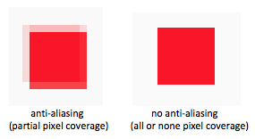
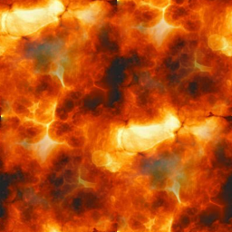

.. Copyright (C)  Wayne Brown
  Permission is granted to copy, distribute
  and/or modify this document under the terms of the GNU Free Documentation
  License, Version 1.3 or any later version published by the Free Software
  Foundation; with Invariant Sections being Forward, Prefaces, and
  Contributor List, no Front-Cover Texts, and no Back-Cover Texts.  A copy of
  the license is included in the section entitled "GNU Free Documentation
  License".

.. role:: raw-html(raw)
  :format: html

12.7 - Rendering Points
:::::::::::::::::::::::

In preparation for a discussion of "particle systems" in the next lesson,
this lesson explains how to render points using WebGL.

Points
------

A **point** is a single location in 3D space defined by a :code:`(x,y,z)`
value. By default, the rendering of a point sets the color of one pixel
in an image. The color of multiple pixels can be set by specifying the
:code:`gl_PointSize` property of a point in a *vertex shader*.
:code:`gl_PointSize` is the side length of a square centered at the point's
raster location. It is a floating point value in pixel units.
The exact definition from the OpenGl ES 2.0 specification is:

.. admonition:: gl_PointSize

  Point rasterization produces a fragment for each framebuffer pixel whose center
  lies **inside a square** centered at the point’s (xw, yw), with side length equal to
  the point size.

If the point (xw, yw) is not directly in the center of a pixel and the
value of :code:`gl_PointSize` is fractional, the area colored for a "point"
will be rectangular.

Anti-aliasing
.............

Anti-aliasing is a technique for minimizing the errors due to sampling a 3D
scene only at the center of each pixel location. With no anti-aliasing,
a pixel is either colored, or not colored, depending on whether the center
of the pixel is inside a primitive's boundaries. This produces
a jagged edge at the boundaries of a triangle, line, or point rendering.
When anti-aliasing is enabled, pixels receive a portion of the color of a primitive
based on a percentage of coverage of a pixel. The images below show a point
rendered with a :code:`gl_PointSize` of 8.0 and enlarged to view individual pixels.
With anti-aliasing disabled, a point rendered with a size of 8.0 will color exactly
64 pixels. With anti-aliasing enabled, the edges around the 64 pixels will potentially
have partial coloring.

WebGL enables anti-aliasing by default. To disable it, the :code:`antialias`
option must be set to :code:`false` when the WebGL context is initially created.
The commands look something like this:

.. Code-Block:: JavaScript

  canvas = document.getElementById(canvas_id);
  gl = canvas.getContext('webgl', {antialias : false} );

Anti-aliasing is rarely disabled. This discussion was primarily to help you
understand why the borders of a multi-pixel "point" are typically lighter shades
of the color assigned by a *fragment shader*.

Experiment with :code:`gl_PointSize`
....................................

The following WebGL program renders eight points at the corners of a cube.
Experiment with the program by varying the point size.

.. webglinteractive:: W1
  :htmlprogram: _static/12_points1/points1.html
  :editlist: _static/12_points1/points1_scene.js, _static/12_points1/uniform_point_size.vert, _static/12_points1/uniform_point_size.frag
  :hideoutput:

Experiments:

* Disable anti-aliasing when the gl context is created. (See lines 107-108
  in the :code:`points1_scene.js` file.) To see the difference between
  anti-aliasing and no anti-aliasing use any tool on your computer that allows
  the screen to be "zoomed in".

  * On a Mac: Enable "Zoom" in the "Accessibility" tools of the "System Preferences".
  * On a PC: Use the "Magnifier" tool.
    :raw-html:`  `

* Enable anti-aliasing and change the point size while in a "zoomed" state
  to investigate the pixels at the boundaries of a point rendering.
  :raw-html:` `

* Use the distance of a point from the camera to set its size. (Use the following
  code for the *vertex shader*.) Many variations on this idea are possible.

  .. Code-Block:: C

    // Transform the location of the vertex.
    gl_Position = u_Transform * vec4(a_Vertex, 1.0);

    // Set the size of a rendered point.
    gl_PointSize = u_Size - gl_Position.z;

  (Please note that the :code:`gl_Position.z` value is the clipping-space
  z-component from a perspective projection which is a non-linear
  value. An accurate distance from the camera can be calculated
  using a camera-space transformation.)

Non-square Points
-----------------

When points are rendered by a *vertex shader*, (and only for points),
the *vertex shader* passes an additional variable to the *fragment shader*,
:code:`gl_PointCoord`, which is 2-component vector that gives the location
of a fragment relative to it's "point" square. The components are in the range 0.0 to
1.0, where [0.0,0.0] is the upper-left corner of the square, [1.0, 1.0]
is the lower-right corner of the square, and [0.5,0.5] is the center of
the square.

A *fragment shader* can use the :code:`gl_PointCoord` values to determine
how to manipulate a specific pixel. For example, it is straightforward to render
a "point" as a circle instead of a square. The GLSL :code:`distance`
function can be used to calculate
the distance from a fragment's location, :code:`gl_PointCoord`, to the
center of the "point", :code:`(0.5,0.5)`. If the distance is greater than 0.5, the fragment
is not inside a circle centered at the point's location. Note that the GLSL statement,
:code:`discard`, in a *fragment shader* prevents the graphics pipeline
from performing any further processing of a fragment.

Experiment with size of the points in the following WebGL program
and study the *fragment shader*.

.. webglinteractive:: W2
  :htmlprogram: _static/12_points2/points2.html
  :editlist: _static/12_points2/uniform_point_size.vert, _static/12_points2/uniform_point.frag
  :hideoutput:

Experiments:

* In the *fragment shader*, change the greater-than sign in the distance test to a
  less-than sign. (I.e., :code:`if (distance(center, gl_PointCoord) < 0.5)`. :raw-html:` `
  Predict the results and then verify you predicted correctly.
  :raw-html:` `

* Change the *fragment shader* to the single line: :raw-html:` `
  :code:`gl_FragColor = vec4(gl_PointCoord, 0.0, 1.0);` :raw-html:` `
  Study the resulting output until is makes sense. (Note that the upper-left corner
  of each square is black, which means that :code:`gl_PointCoord` must be :code:`(0,0)`
  for the upper-left pixel.)
  :raw-html:` `

* Change the *fragment shader* to this logic: :raw-html:` `

  .. Code-Block:: C

    float d = distance(center, gl_PointCoord);
    if (mod(floor(d*4.0), 2.0) == 0.0) {
      discard;
    }
    gl_FragColor = u_Color;

  Try various scalar values other than :code:`4.0` and see what happens.
  :raw-html:`  `

* Change the *fragment shader* to this logic: :raw-html:` `

  .. Code-Block:: C

    float d = distance(center, gl_PointCoord);
    if (d >= 0.5) discard;
    float alpha = 1.0 - d*2.0; /* center has the largest alpha */
    gl_FragColor = vec4(u_Color.rgb, alpha);

  (Note that the alpha component of the fragment's color is changing
  from 1.0 at the center of the circle to 0.0 at the edges.)

* Change the *fragment shader* to this logic: :raw-html:` `

  .. Code-Block:: C

    float d = distance(center, gl_PointCoord);
    if (gl_PointCoord.t > 0.5 || d >= 0.5) discard;
    d = 1.0 - d*2.0;
    gl_FragColor = vec4(u_Color.rgb, d);

  (Note that the bottom half of the circle has been discarded.)

* Come up with your own experiments. Your goal is to understand
  how to use :code:`gl_PointCoord` to manipulate the shape and
  color of a "point" rendering.

Billboard (or Sprite)
---------------------

A `billboard`_ in computer graphics is a texture mapped quad
(four sided polygon) that always faces the camera, regardless of
its location and 3D orientation. A `sprite`_ is a 2D image that
can be rendered into a scene. The common practice in WebGL is
to render *billboards* and *sprites* as "points" with an appropriate
:code:`gl_PointSize` and *texture map* image. Practical uses of these
techniques are presented in the lesson on "particle systems."

To *texture map* a "point" there are two basic scenarios:

#. The entire *texture map* image is mapped to the point's square.
   The implementation is straightforward --
   use :code:`gl_PointCoord` as the *texture coordinates* for a :code:`texture2D` lookup.
   :raw-html:`  `

#. A point has an associated *texture coordinate* that defines a location
   in a *texture map image* for the center pixel of a point rendering.
   Adjacent pixels of the *texture map image* are used to color adjacent
   pixels in the point's square. This requires the calculation of fractional
   offsets within a *texture map image* to get to adjacent pixels and
   the conversion of :code:`gl_PointCoord` into pixel offsets.

The following two WebGL programs use this tileable image, |texture_image|, as a *texture map*.

1) Map Entire Image to a "Point"
................................

.. webglinteractive:: W3
  :htmlprogram: _static/12_points3/points3.html
  :editlist: _static/12_points3/uniform_point_size.vert, _static/12_points3/uniform_point_texture.frag
  :hideoutput:

If you look closely, the *texture map image* is flipped on the
vertical axis. Why? Because the :code:`gl_PointCoord` values
use the upper-left corner for (0,0), while *texture coordinates*
have their origin in the bottom-left of an image. The orientation
of the texture map can be flipped by inverting the :code:`.t`
component like this:

.. Code-Block:: C

  vec2 coords = vec2(gl_PointCoord.s, 1.0 - gl_PointCoord.t);
  gl_FragColor = texture2D(u_Texture_unit, coords);

Modify the *fragment shader* above to verify that this flips the
*texture map* image to its original orientation.

2) Map Adjacent Pixels to a "Point"
...................................

*Texture coordinates* are fractional percentages in the range 0.0 to 1.0.
The fraction required to increment from one pixel to an adjacent pixel
in a *texture map* image is based on the image's dimensions.
These increments can be calculated once and passed to a *fragment shader*:

.. Code-Block:: JavaScript

  texture_delta = [ (1.0 / (texture_map_image.width - 1.0)),
                    (1.0 / (texture_map_image.height - 1.0))];
  gl.uniform2fv(program.u_Texture_delta, texture_delta);

(This technique was previously described in `Lesson 11.10`_ on bump maps.)

To use the :code:`gl_PointCoord` values to determine the relative
position of a fragment compared to the center pixel of the point's square,
a fractional percentage is required, but based on the dimensions
of the point's square. A point rendering is always square, so a single
fractional percentage is needed: :code:`1.0/(point_size-1.0)`.
Therefore, take :code:`gl_PointCoord` and move it to the center of the
square, divide it by the fractional percentage, and convert to an integer.
This provides a relative integer offset from the center pixel. The
correct adjacent pixel can now be retrieved from the *texture map*.

Please experiment with the following WebGL program and study the *fragment shader*.
Notice that when the size of a point increases, extra pixels from the *texture
map* are used to fill the new area. This is different from the previous
WebGL program where the entire *texture map* was used for the point's square.

.. webglinteractive:: W4
  :htmlprogram: _static/12_points4/points4.html
  :editlist: _static/12_points4/uniform_point_size2.vert, _static/12_points4/uniform_point_texture2.frag
  :hideoutput:

Summary
-------

The previous two WebGL programs demonstrate *billboards* and *sprites* but
not how they are typically used in practice. Rarely are *billboards* and *sprites*
rendered as pure squares. By manipulating the alpha color value of individual
pixels, a point's square can become transparent in specific locations to
render any shape desirable. Please try to
combine some of the techniques described in the "Non-square Points" section
with the *billboards* programs to investigate what is possible.

Glossary
--------

.. glossary::

  point
    A single location in 3D space.

  gl_PointSize
    A predefined output variable of a *vertex shader* when rendering points.
    It is the side length of a square, in pixels, that is centered about
    the location of a 3D point.

  gl_PointCoord
    A 2D vector where each component is a percentage value between 0.0 and 1.0.
    It gives the relative location of a fragment compared to the square that
    composes the entire point rendering. :code:`[0,0]` is the upper-left corner.

  billboard
    A rendering of a *texture map* onto a quad surface that is always facing the camera.

  sprite
    The rendering of a 2D image into a 3D scene, where the image is always directly
    facing the camera.

.. index:: point rendering, gl_PointSize, gl_PointCoord, discard, billboard, sprite

.. _particle system: https://en.wikipedia.org/wiki/Particle_system
.. _Anti-aliasing: https://en.wikipedia.org/wiki/Spatial_anti-aliasing
.. _billboard: http://www.opengl-tutorial.org/intermediate-tutorials/billboards-particles/billboards/
.. _sprite: https://en.wikipedia.org/wiki/Sprite_(computer_graphics)
.. _Lesson 11.10: ../11_surface_properties/10_bump_maps.html#getting-the-normal-vector-offsets