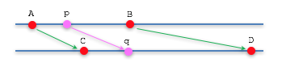

..  Copyright (C)  Wayne Brown
  Permission is granted to copy, distribute
  and/or modify this document under the terms of the GNU Free Documentation
  License, Version 1.3 or any later version published by the Free Software
  Foundation; with Invariant Sections being Forward, Prefaces, and
  Contributor List, no Front-Cover Texts, and no Back-Cover Texts.  A copy of
  the license is included in the section entitled "GNU Free Documentation
  License".

.. role:: raw-html(raw)
  :format: html

Mapping Values in a Range
:::::::::::::::::::::::::

In mathematics, a *mapping* is a function that converts a set of inputs
into an output value. A common operation in computer graphics is
*mapping* a value from one range of values into a different range of values.

Linear Mapping
--------------

Given a range of values between A and B, we want to map them into a
different range of values between C and D. In addition, we want the
relative distance between any two points in each range to remain constant. Or,
said another way, we want points to be equally distributed in both ranges.
The image below illustrates the two ranges. A mapping that maintains a
constant ratio between points is a *linear mapping*.

A *linear* mapping requires two operations:
a scaling operation to make the ranges the same size, and an offset
operation to make the ranges align. You can think about solving this problem
in various ways. Let's walk through three different solutions and show that in
each case you get the same answer. To make the discussion clear, let's
exactly define our problem.

Given a value p in the range A to B, calculate a point q in the range C to D
that is in the same relative location.

* Solution 1:

  * Since scaling is always relative to the origin, and we need to scale
    the range from A to B to make it the same size as the range C to D, let's shift the range
    A to B to the origin. We can do this by subtracting A from p. :code:`p-A`
  * Scale p by the ratio of the range sizes, (D-C)/(B-A). :code:`(p-A)*(D-C)/(B-A)`
  * Now shift this value to the start of the "C to D" range by adding C. Therefore,
    our equation is :code:`q = (p-A)*(D-C)/(B-A) + C`
    :raw-html:` ` :raw-html:` `

* Solution 2:

  * Because the relationship between the points p and q must maintain relative
    distances, the ratio of their distances must be equal to the ratio of the
    range sizes. Therefore, :code:`(p-A)/(q-C) = (B-A)/(D-C)`
  * Solving this equation for :code:`q`, results in  :code:`q = (p-A)*(D-C)/(B-A) + C`
    :raw-html:` ` :raw-html:` `

* Solution 3:

  * Using a parametric equation for the range from A to B, there is a value
    for :code:`t` that calculates :code:`p`. That is, :code:`p = (1-t)*A + t*B`.
    Solving for :code:`t` gives :code:`t=(p-A)/(B-A)`.
  * Since :code:`t` is a percentage of the distance between A and B, this
    percentage must be the same for the location of :code:`q` between C and B.
    Therefore, we use this value for :code:`t` in a parametric equation for
    the range between C and D. The equation :code:`q = (1-t)*C + t*D` becomes
    :code:`q = (1-(p-A)/(B-A))*C + (p-A)/(B-A)*D`. Simplifying this equation
    gives :code:`q = (p-A)*(D-C)/(B-A) + C`.
    :raw-html:` ` :raw-html:` `

If you rearrange the terms in the solution for :code:`q`, you end up with a
scale factor and an offset. Specially,

.. code:: JavaScript

  scale = (D-C)/(B-A)
  offset = -A*(D-C)/(B-A) + C    or offset = -A*scale + C
  q = p*scale + offset

Let's work a specific example. We want to take the values between 12 and 22
and map them into a range from 6 to 7. The ratio between these two ranges
is (7-6)/(22-12) = 1/10. The offset is -12*(1/10) + 6 = 4.8. The linear
mapping formula becomes :code:`q = p*(1/10) + 4.8`. If the formula is applied to
all of the whole numbers in the range 12 to 22, you get equally spaced values
in the range 6 to 7, as shown below.

.. csv-table:: Linear Mapping

  12,	13,	14,	15,	16,	17,	18,	19,	20,	21,	22
  6.0, 6.1,	6.2,	6.3,	6.4,	6.5,	6.6,	6.7,	6.8,	6.9,	7

Glossary
--------

.. glossary::

  mapping
    a function that converts a set of inputs into an output value.

  linear mapping
    a function that converts a location in one range of values into
    a proportionally equivalent location in a different range.

.. index:: mapping, linear mapping

