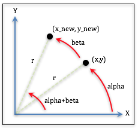

..  Copyright (C)  Wayne Brown
  Permission is granted to copy, distribute
  and/or modify this document under the terms of the GNU Free Documentation
  License, Version 1.3 or any later version published by the Free Software
  Foundation; with Invariant Sections being Forward, Prefaces, and
  Contributor List, no Front-Cover Texts, and no Back-Cover Texts.  A copy of
  the license is included in the section entitled "GNU Free Documentation
  License".

Rotation Equations
::::::::::::::::::

To rotate a point, :code:`(x,y)` about the origin :code:`beta` degrees to
a new location, :code:`(x_new,y_new)`, the point is moved as shown in
the following diagram.

  Rotate :code:`(x,y)` *beta* degrees to :code:`(x_new,y_new)`

From basic trigonometry, we know the following facts:

.. Code-block:: C

   x = cos(alpha) * r              Eq1
   y = sin(alpha) * r              Eq2

   x_new = cos(alpha+beta) * r     Eq3
   y_new = sin(alpha+beta) * r     Eq4

Using the "angle addition" formulas from trigonometry,

.. Code-block:: C

   sin(alpha+beta) = sin(alpha)*cos(beta) + sin(beta)*cos(alpha)
   cos(alpha+beta) = cos(alpha)*cos(beta) - sin(beta)*sin(alpha)

we can re-write equations 3 and 4 like this:

.. Code-block:: C

   x_new = cos(alpha+beta) * r = [cos(alpha)*cos(beta) - sin(beta)*sin(alpha)] * r
   y_new = sin(alpha+beta) * r = [sin(alpha)*cos(beta) + sin(beta)*cos(alpha)] * r

Multiplying :code:`r` times each term and re-arranging gives us this:

.. Code-block:: C

   x_new = cos(alpha)*r *cos(beta) - sin(beta) * sin(alpha)*r
   y_new = sin(alpha)*r *cos(beta) + sin(beta) * cos(alpha)*r

Now, substituting equations 1 and 2 into these equations gives:

.. Code-block:: C

   x_new = x * cos(beta) - sin(beta) * y
   y_new = y * cos(beta) + sin(beta) * x

Writing this in matrix format gives:

.. matrixeq:: Eq5

   [M3: x_new;y_new] = [M1: cos(beta), -sin(beta); sin(beta), cos(beta)] * [M2: x;y]

This is a rotation about the Z axis. The z component of a 3D vertex is not
affected by this rotation, so we can write the rotation in terms of a 3D transformation
matrix like this:

.. matrixeq:: Eq6

   [M3: x_new;y_new;z; 1] = [M1: cos(beta), -sin(beta), 0, 0; sin(beta), cos(beta), 0, 0; 0,0,1,0; 0,0,0,1] * [M2: x;y;z;1]

Using similar logic, rotations about the X and Y axes can be easily formulated.

